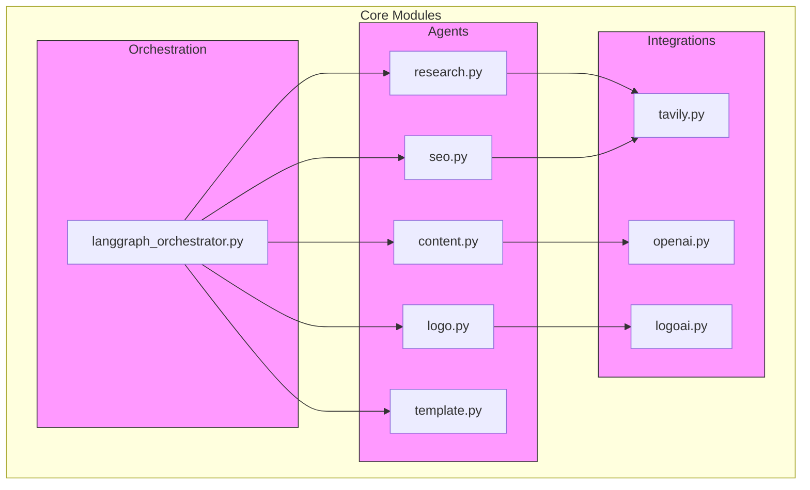
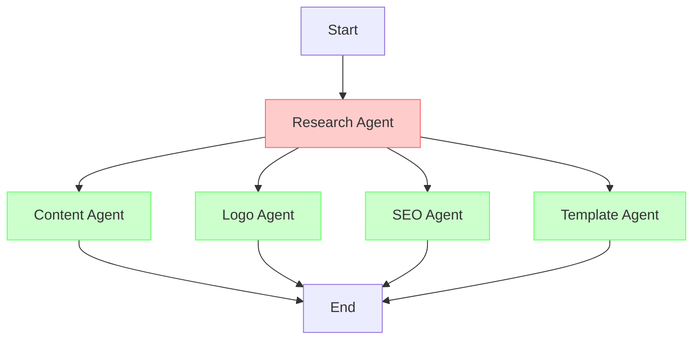
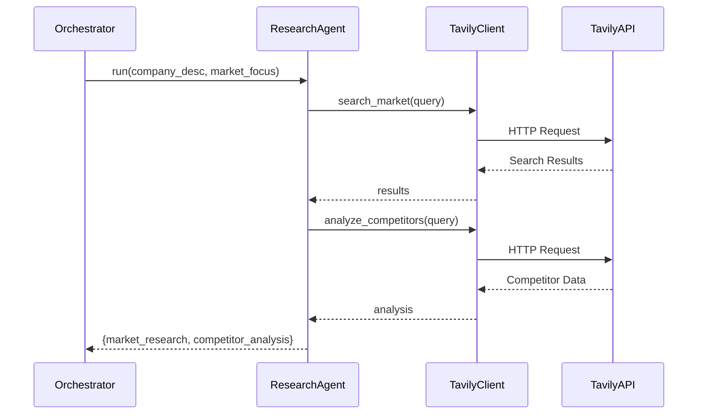
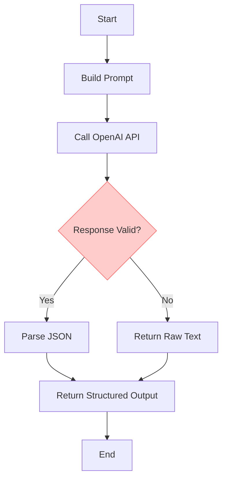
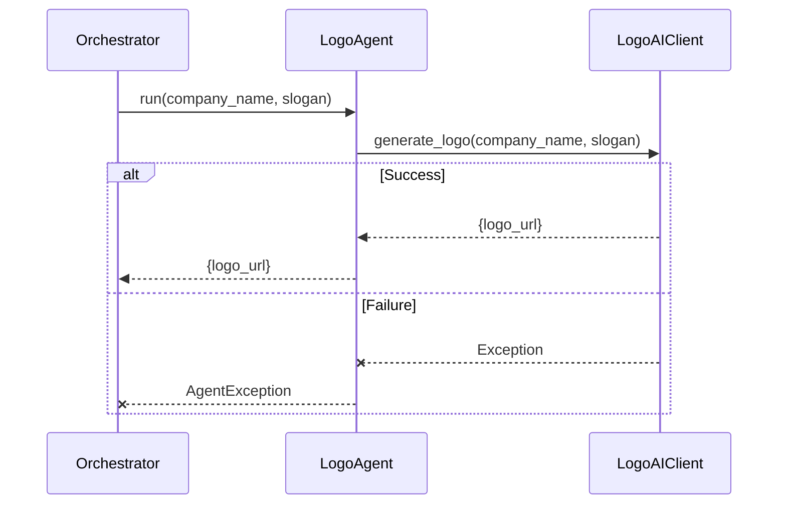
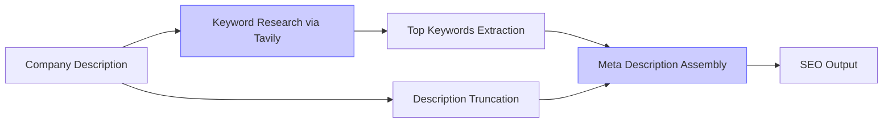
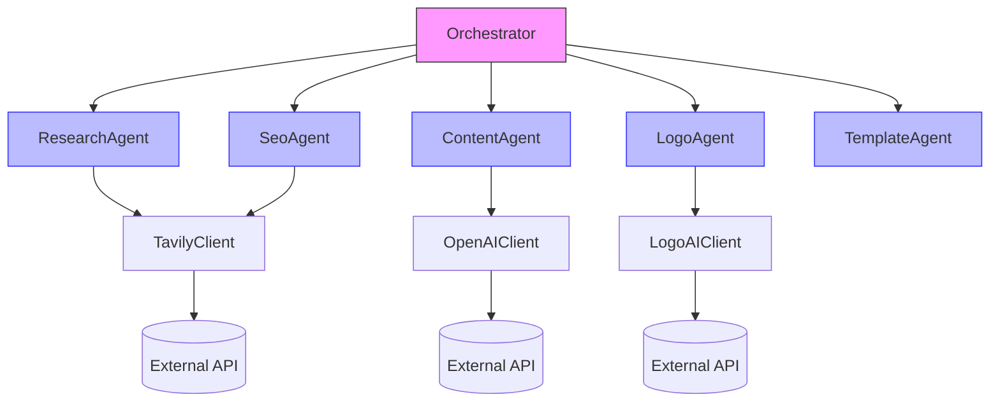

# AI Agent Architecture

<cite>
**Referenced Files in This Document**   
- [langgraph_orchestrator.py](file://app/core/orchestration/langgraph_orchestrator.py)
- [research.py](file://app/core/agents/research.py)
- [content.py](file://app/core/agents/content.py)
- [logo.py](file://app/core/agents/logo.py)
- [seo.py](file://app/core/agents/seo.py)
- [template.py](file://app/core/agents/template.py)
- [tavily.py](file://app/core/integrations/tavily.py)
- [openai.py](file://app/core/integrations/openai.py)
- [logoai.py](file://app/core/integrations/logoai.py)
</cite>

## Table of Contents
1. [Introduction](#introduction)
2. [Project Structure](#project-structure)
3. [Core Components](#core-components)
4. [Architecture Overview](#architecture-overview)
5. [Detailed Component Analysis](#detailed-component-analysis)
6. [Dependency Analysis](#dependency-analysis)
7. [Performance Considerations](#performance-considerations)
8. [Troubleshooting Guide](#troubleshooting-guide)
9. [Conclusion](#conclusion)

## Introduction
The AI Agent Architecture document provides a comprehensive overview of the agent-based system implemented in the Genesis platform. This system leverages specialized agents to automate key aspects of business development, including market research, content generation, logo creation, SEO optimization, and template selection. The architecture is orchestrated using LangGraph, enabling parallel execution and stateful coordination between agents. Each agent operates as an independent module with well-defined input/output contracts, interacting with external APIs such as Tavily for research, OpenAI for content generation, and a mock LogoAI service for visual identity creation. The system is designed for extensibility, allowing new agent types to be integrated seamlessly into the workflow.

## Project Structure
The project follows a modular structure organized by functional domains. Core agent logic resides in `app/core/agents`, while integration clients are located in `app/core/integrations`. Orchestration is handled by `langgraph_orchestrator.py`, which coordinates agent execution based on a defined state machine. The overall structure supports separation of concerns, testability, and scalability.



**Diagram sources**
- [langgraph_orchestrator.py](file://app/core/orchestration/langgraph_orchestrator.py#L24-L107)
- [research.py](file://app/core/agents/research.py#L6-L57)
- [content.py](file://app/core/agents/content.py#L6-L83)
- [seo.py](file://app/core/agents/seo.py#L6-L55)
- [logo.py](file://app/core/agents/logo.py#L6-L43)
- [template.py](file://app/core/agents/template.py#L6-L59)

**Section sources**
- [langgraph_orchestrator.py](file://app/core/orchestration/langgraph_orchestrator.py#L0-L107)
- [research.py](file://app/core/agents/research.py#L0-L57)

## Core Components
The system consists of five specialized agents: ResearchAgent, ContentAgent, LogoAgent, SeoAgent, and TemplateAgent. These agents are coordinated by the LangGraphOrchestrator, which manages execution flow and state propagation. Each agent is responsible for a specific domain task and communicates through a shared state object (AgentState). External integrations are abstracted via client classes that handle API interactions with Tavily, OpenAI, and LogoAI services. Error handling is standardized using custom exceptions (AgentException, IntegrationException), ensuring consistent failure reporting across components.

**Section sources**
- [research.py](file://app/core/agents/research.py#L6-L57)
- [content.py](file://app/core/agents/content.py#L6-L83)
- [logo.py](file://app/core/agents/logo.py#L6-L43)
- [seo.py](file://app/core/agents/seo.py#L6-L55)
- [template.py](file://app/core/agents/template.py#L6-L59)
- [langgraph_orchestrator.py](file://app/core/orchestration/langgraph_orchestrator.py#L24-L107)

## Architecture Overview
The AI agent system follows a decentralized orchestration pattern where a central orchestrator coordinates specialized agents through a directed graph. The LangGraphOrchestrator initializes all agents and defines their execution sequence using a state machine. Execution begins with the ResearchAgent, whose output is then used by four parallel agents: ContentAgent, LogoAgent, SeoAgent, and TemplateAgent. All agents write their results into a shared AgentState dictionary, which accumulates data throughout the workflow. This design enables both sequential dependency resolution and parallel processing for improved performance.



**Diagram sources**
- [langgraph_orchestrator.py](file://app/core/orchestration/langgraph_orchestrator.py#L30-L50)

## Detailed Component Analysis

### Research Agent Analysis
The ResearchAgent performs market analysis and competitor research using the Tavily API. It takes a company description and market focus as input and returns structured research data. The agent makes two distinct API calls: one for general market research and another for competitor analysis. Results are aggregated into a single dictionary containing both datasets.



**Diagram sources**
- [research.py](file://app/core/agents/research.py#L15-L57)
- [tavily.py](file://app/core/integrations/tavily.py#L7-L43)

**Section sources**
- [research.py](file://app/core/agents/research.py#L6-L57)
- [tavily.py](file://app/core/integrations/tavily.py#L7-L43)

### Content Agent Analysis
The ContentAgent generates website content using OpenAI's GPT-4o model. It constructs a detailed prompt incorporating business brief information and market research data. The prompt engineering strategy includes role specification ("expert in African startup copywriting"), structured input formatting, and explicit output instructions requiring JSON formatting. The agent handles potential JSON parsing failures by returning raw text as fallback.



**Diagram sources**
- [content.py](file://app/core/agents/content.py#L20-L83)
- [openai.py](file://app/core/integrations/openai.py#L7-L44)

**Section sources**
- [content.py](file://app/core/agents/content.py#L6-L83)
- [openai.py](file://app/core/integrations/openai.py#L7-L44)

### Logo Agent Analysis
The LogoAgent interfaces with an external logo generation service (LogoAI) to create visual identities. It accepts a company name and optional slogan, then delegates logo generation to the LogoAIClient. In the current implementation, the client returns a deterministic URL based on the company name, simulating logo generation without actual image creation.



**Diagram sources**
- [logo.py](file://app/core/agents/logo.py#L15-L43)
- [logoai.py](file://app/core/integrations/logoai.py#L5-L31)

**Section sources**
- [logo.py](file://app/core/agents/logo.py#L6-L43)
- [logoai.py](file://app/core/integrations/logoai.py#L5-L31)

### SEO Agent Analysis
The SeoAgent generates SEO metadata including keywords and meta descriptions. It uses the Tavily API to research relevant keywords for the target market, then combines this data with the company description to create a concise meta description. The agent demonstrates hybrid processing by combining external API data with internal logic for content generation.



**Diagram sources**
- [seo.py](file://app/core/agents/seo.py#L15-L55)
- [tavily.py](file://app/core/integrations/tavily.py#L7-L43)

**Section sources**
- [seo.py](file://app/core/agents/seo.py#L6-L55)
- [tavily.py](file://app/core/integrations/tavily.py#L7-L43)

### Template Agent Analysis
The TemplateAgent selects an appropriate website template based on business type. It uses a rule-based matching system that maps keywords in the business type to predefined templates. The current implementation includes four templates: Modern Business, Creative Portfolio, Sleek E-commerce, and Service Booking Pro. The selection logic is extensible and can be enhanced with machine learning models in future versions.

```mermaid
flowchart TD
A[Business Type] --> B{Contains "e-commerce"?}
B --> |Yes| C[Select E-commerce Template]
B --> |No| D{Contains "portfolio"?}
D --> |Yes| E[Select Portfolio Template]
D --> |No| F{Contains "service"?}
F --> |Yes| G[Select Service Template]
F --> |No| H[Select Default Business Template]
C --> I[Return Template]
E --> I
G --> I
H --> I
style B fill:#ffcccc,stroke:#f66
style D fill:#ffcccc,stroke:#f66
style F fill:#ffcccc,stroke:#f66
```

**Diagram sources**
- [template.py](file://app/core/agents/template.py#L25-L59)

**Section sources**
- [template.py](file://app/core/agents/template.py#L6-L59)

## Dependency Analysis
The agent system exhibits a clear dependency hierarchy with the orchestrator at the top level depending on all agents, and agents depending on integration clients. There are no circular dependencies, and each component maintains loose coupling through well-defined interfaces. The use of async/await throughout ensures non-blocking I/O operations during external API calls.



**Diagram sources**
- [langgraph_orchestrator.py](file://app/core/orchestration/langgraph_orchestrator.py#L24-L107)
- [research.py](file://app/core/agents/research.py#L6-L57)
- [content.py](file://app/core/agents/content.py#L6-L83)
- [logo.py](file://app/core/agents/logo.py#L6-L43)
- [seo.py](file://app/core/agents/seo.py#L6-L55)
- [template.py](file://app/core/agents/template.py#L6-L59)
- [tavily.py](file://app/core/integrations/tavily.py#L7-L43)
- [openai.py](file://app/core/integrations/openai.py#L7-L44)
- [logoai.py](file://app/core/integrations/logoai.py#L5-L31)

**Section sources**
- [langgraph_orchestrator.py](file://app/core/orchestration/langgraph_orchestrator.py#L24-L107)
- [tavily.py](file://app/core/integrations/tavily.py#L7-L43)
- [openai.py](file://app/core/integrations/openai.py#L7-L44)
- [logoai.py](file://app/core/integrations/logoai.py#L5-L31)

## Performance Considerations
The architecture is designed for parallel execution of independent agents after the initial research phase, minimizing total execution time. All external API calls are asynchronous, preventing blocking operations. The system includes built-in error handling with fallback mechanisms (e.g., empty results on Tavily API failure). However, performance could be improved by implementing caching for repeated queries and adding retry mechanisms with exponential backoff for transient API failures. The current implementation lacks rate limiting controls, which may lead to API throttling under heavy load.

## Troubleshooting Guide
Common issues include missing API keys, network connectivity problems, and invalid responses from external services. The system logs detailed information at each execution step, facilitating debugging. Key error patterns include:
- **IntegrationException**: Raised when API keys are missing or external services are unreachable
- **AgentException**: Thrown when agent-specific processing fails
- Empty results from TavilyClient due to API failures (returns empty list as fallback)
- JSON parsing errors in ContentAgent when LLM output is malformed

Monitoring should focus on API response times, error rates, and successful completion of the orchestration workflow.

**Section sources**
- [utils/exceptions.py](file://app/utils/exceptions.py)
- [tavily.py](file://app/core/integrations/tavily.py#L7-L43)
- [openai.py](file://app/core/integrations/openai.py#L7-L44)
- [content.py](file://app/core/agents/content.py#L50-L83)

## Conclusion
The AI agent system presents a robust, modular architecture for automating business development tasks. By leveraging specialized agents coordinated through a stateful orchestrator, the system achieves both flexibility and reliability. The clear separation of concerns, standardized error handling, and asynchronous design make it suitable for production use. Future enhancements could include dynamic agent discovery, adaptive retry policies, and machine learning-based template selection to further improve system intelligence and resilience.