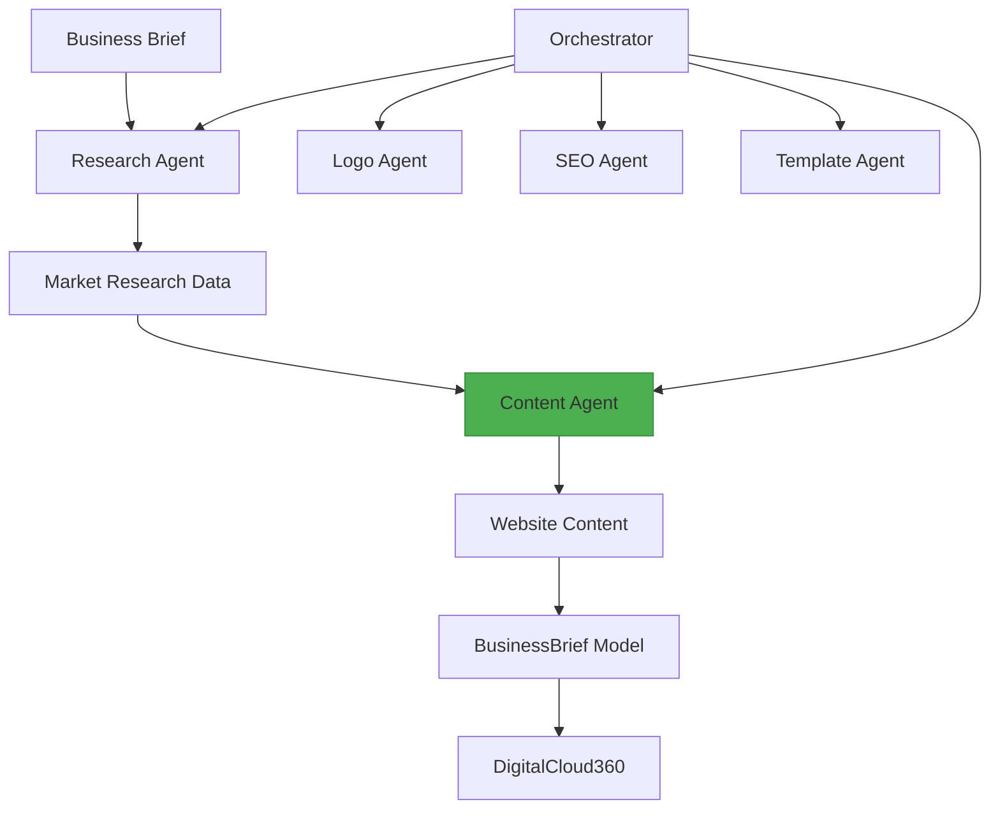
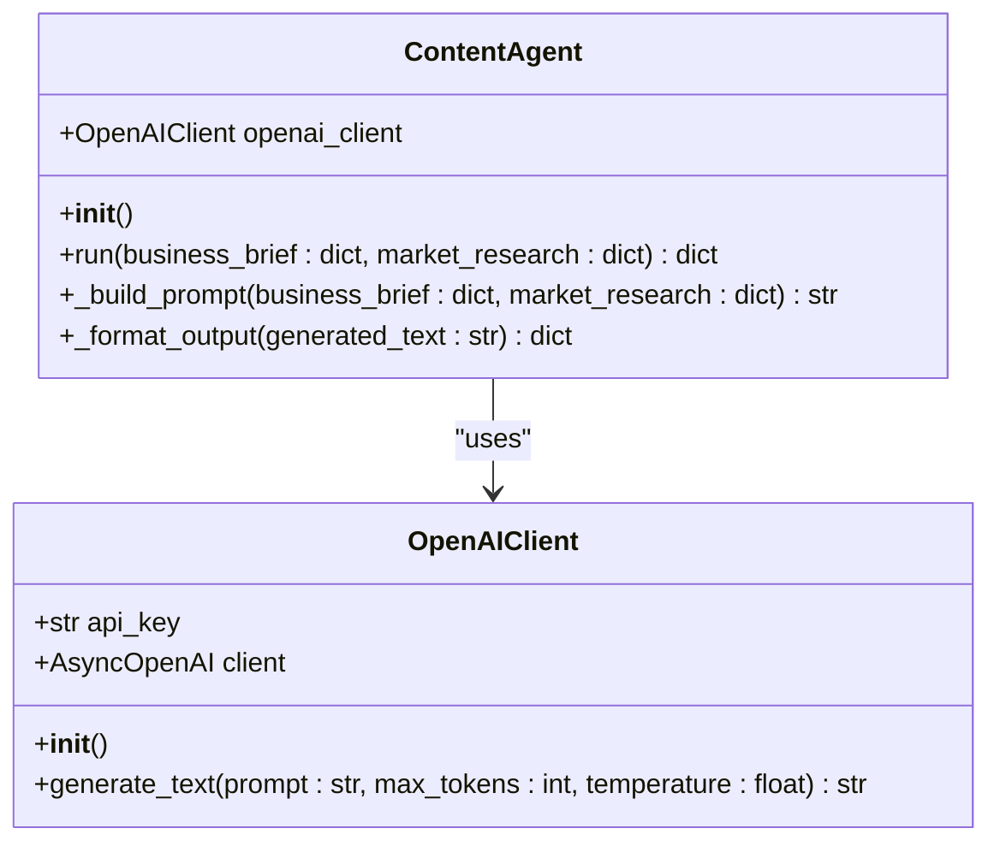
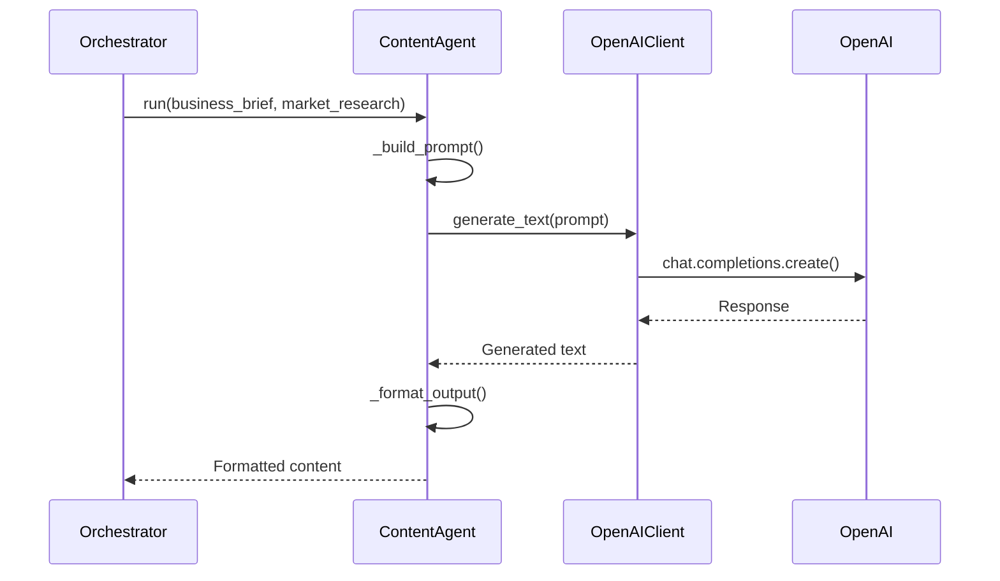
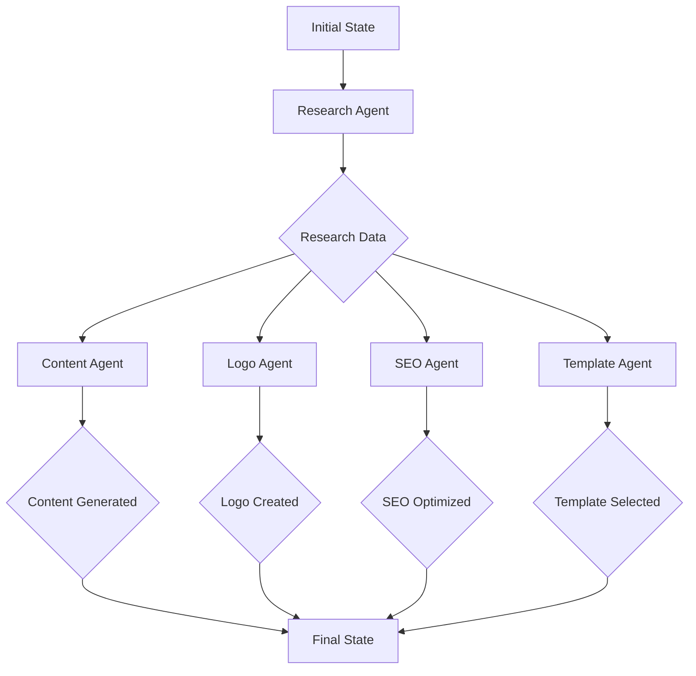
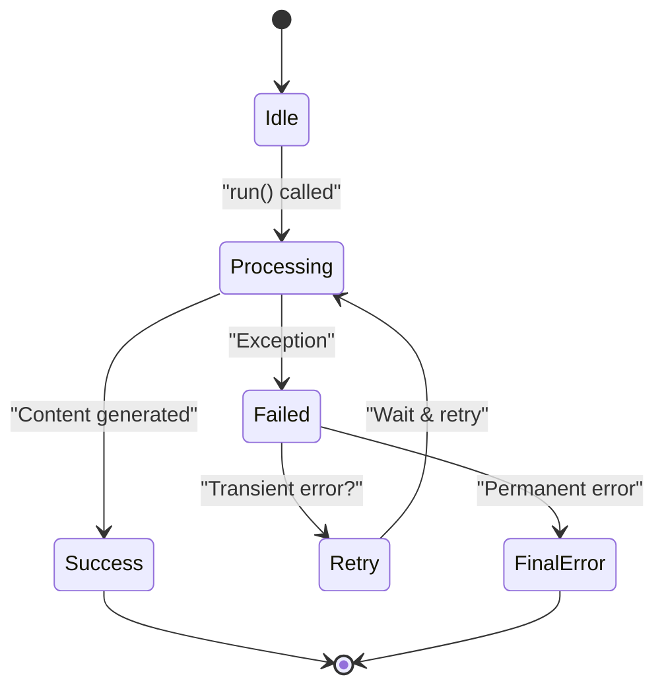

# Content Agent

<cite>
**Referenced Files in This Document**   
- [content.py](file://app/core/agents/content.py)
- [openai.py](file://app/core/integrations/openai.py)
- [coaching.py](file://app/models/coaching.py)
- [business.py](file://app/schemas/business.py)
- [langgraph_orchestrator.py](file://app/core/orchestration/langgraph_orchestrator.py)
</cite>

## Table of Contents
1. [Introduction](#introduction)
2. [Architecture Overview](#architecture-overview)
3. [Core Components](#core-components)
4. [Detailed Component Analysis](#detailed-component-analysis)
5. [Prompt Engineering Strategy](#prompt-engineering-strategy)
6. [Input Parameters and Output Generation](#input-parameters-and-output-generation)
7. [Integration with Orchestration Layer](#integration-with-orchestration-layer)
8. [Error Handling and Retry Logic](#error-handling-and-retry-logic)
9. [Configuration and Customization](#configuration-and-customization)
10. [Performance and Optimization](#performance-and-optimization)

## Introduction
The Content Agent is a specialized component within the Genesis AI Deep Agents system responsible for generating website content based on business briefs and market research data. This agent leverages the OpenAI API to produce high-quality, culturally adapted content for African startups. The agent is integrated into a larger orchestration workflow that coordinates multiple specialized agents to deliver a complete business solution. The Content Agent plays a critical role in transforming business vision and market analysis into compelling website copy that resonates with target audiences.

## Architecture Overview
The Content Agent operates as part of a sophisticated multi-agent system orchestrated by LangGraph. This architecture enables parallel execution of specialized agents that collectively generate a comprehensive business package. The Content Agent specifically focuses on text generation, receiving input from the Research Agent and producing output that contributes to the final business brief.

**Diagram sources**
- [langgraph_orchestrator.py](file://app/core/orchestration/langgraph_orchestrator.py#L0-L107)
- [content.py](file://app/core/agents/content.py#L6-L83)

## Core Components
The Content Agent consists of several key components that work together to generate website content. These include the agent class itself, the OpenAI integration, prompt engineering logic, and output formatting functionality. The agent is designed to be stateless and idempotent, ensuring consistent results across multiple invocations with the same input parameters.

**Section sources**
- [content.py](file://app/core/agents/content.py#L6-L83)
- [openai.py](file://app/core/integrations/openai.py#L7-L44)

## Detailed Component Analysis

### Content Agent Implementation
The Content Agent is implemented as a Python class that encapsulates the logic for generating website content. It follows a clean separation of concerns, with distinct methods for prompt construction, API interaction, and output formatting.

#### Class Structure

**Diagram sources**
- [content.py](file://app/core/agents/content.py#L6-L83)
- [openai.py](file://app/core/integrations/openai.py#L7-L44)

#### Execution Flow

**Diagram sources**
- [content.py](file://app/core/agents/content.py#L6-L83)
- [openai.py](file://app/core/integrations/openai.py#L7-L44)

## Prompt Engineering Strategy
The Content Agent employs a sophisticated prompt engineering strategy to ensure high-quality, relevant content generation. The prompt construction process incorporates business context, market research, and specific formatting requirements.

### System Prompt Design
The system prompt establishes the agent's role and expertise, positioning it as a copywriting expert for African startups. This contextual framing guides the language model to produce content that is culturally appropriate and commercially effective.

### Context Injection
The prompt dynamically incorporates key business parameters:
- **Company Name**: {business_brief.get('company_name', 'N/A')}
- **Company Description**: {business_brief.get('company_description', 'N/A')}
- **Services/Products**: {business_brief.get('services', 'N/A')}
- **Target Audience**: {business_brief.get('target_audience', 'N/A')}
- **Voice Tone**: {business_brief.get('tone_of_voice', 'professional and accessible')}

### Response Formatting Requirements
The prompt explicitly requires JSON output structure, ensuring consistent parsing and integration with downstream components. The instructions specify content for three key website sections:
1. **Home Page**: Catchy title, subtitle, and brief "About Us" section
2. **Services Page**: Description of main services/products offered
3. **Contact Page**: Call-to-action for contact

**Section sources**
- [content.py](file://app/core/agents/content.py#L50-L80)

## Input Parameters and Output Generation
The Content Agent processes two primary input parameters and generates structured website content as output.

### Input Parameters
The agent receives two dictionary inputs:

**:business_brief**
- company_name: Name of the business
- company_description: Description of the business
- services: Services or products offered
- target_audience: Target customer demographic
- tone_of_voice: Desired voice and tone for content

**:market_research**
- market_research: Market analysis results
- competitor_analysis: Competitor analysis findings

### Generated Output
The agent produces a dictionary containing website content structured as follows:

**:home_page**
- title: Catchy headline for the home page
- subtitle: Supporting subheading
- about_us: Brief "About Us" section

**:services_page**
- service_descriptions: Detailed descriptions of services/products

**:contact_page**
- call_to_action: Compelling call-to-action for contact

The output is formatted as JSON to ensure structured data that can be easily consumed by other system components.

**Section sources**
- [content.py](file://app/core/agents/content.py#L6-L83)
- [business.py](file://app/schemas/business.py#L45-L54)

## Integration with Orchestration Layer
The Content Agent is tightly integrated with the LangGraph orchestrator, which manages the workflow and data flow between specialized agents.

### Data Flow
The orchestrator passes the business brief and research data to the Content Agent, which then returns generated content that is stored in the BusinessBrief model.

**Diagram sources**
- [langgraph_orchestrator.py](file://app/core/orchestration/langgraph_orchestrator.py#L0-L107)

### BusinessBrief Model Integration
The generated content is persisted in the BusinessBrief model, which serves as the central repository for all business generation artifacts.

**:BusinessBrief Model**
- business_name: String
- vision: Text
- mission: Text
- target_audience: Text
- differentiation: Text
- value_proposition: Text
- sector: String
- location: JSON
- market_research: JSON
- content_generation: JSON
- logo_creation: JSON
- seo_optimization: JSON
- template_selection: JSON

**Section sources**
- [coaching.py](file://app/models/coaching.py#L85-L120)
- [langgraph_orchestrator.py](file://app/core/orchestration/langgraph_orchestrator.py#L70-L75)

## Error Handling and Retry Logic
The Content Agent implements robust error handling to ensure reliability and graceful degradation when issues occur.

### Exception Handling
The agent wraps its core functionality in a try-catch block that captures any exceptions during execution. When an error occurs, it logs the error details and raises a specific AgentException with a standardized error code and message.

### Content Safety Checks
The system includes moderation policies to ensure generated content adheres to ethical guidelines and does not contain inappropriate material. While not explicitly shown in the code, this would typically be implemented through OpenAI's moderation endpoints or similar services.

### Retry Logic
Although not implemented in the current code, a production system would benefit from retry logic for transient failures. This could include exponential backoff for API rate limits or temporary network issues.

**Section sources**
- [content.py](file://app/core/agents/content.py#L22-L39)
- [openai.py](file://app/core/integrations/openai.py#L30-L44)

## Configuration and Customization
The Content Agent supports various configuration options to customize its behavior for different use cases.

### Tone Customization
The agent respects the tone_of_voice parameter from the business brief, allowing for different content styles such as professional, friendly, or authoritative.

### Length Control
The agent uses the max_tokens parameter (set to 1500) to control the length of generated content, ensuring it is comprehensive but not excessively verbose.

### Language Customization
While the current implementation focuses on French (as indicated by the French comments), the system is designed to support multilingual content generation, particularly for African markets with multiple language requirements.

**:Configuration Parameters**
- max_tokens: 1500 (controls content length)
- temperature: 0.7 (controls creativity/randomness)
- model: "gpt-4o" (specifies the OpenAI model)

**Section sources**
- [content.py](file://app/core/agents/content.py#L33-L35)
- [openai.py](file://app/core/integrations/openai.py#L35-L38)

## Performance and Optimization
The Content Agent incorporates several performance optimization strategies to ensure efficient operation.

### Token Usage Optimization
The agent carefully manages token usage through:
- Precise prompt construction to minimize unnecessary context
- Setting appropriate max_tokens limits
- Using the gpt-4o model, which offers efficient token pricing

### Streaming Response Handling
Although not explicitly implemented in the current code, streaming responses would be a valuable optimization for user experience, allowing content to be displayed as it is generated rather than waiting for complete generation.

### Caching Strategy
The overall system architecture includes Redis for caching, which could be leveraged to cache generated content for similar business profiles, reducing API calls and improving response times.

**:Performance Metrics**
- Model: gpt-4o
- Max tokens: 1500
- Temperature: 0.7
- Expected response time: < 10 seconds

**Section sources**
- [content.py](file://app/core/agents/content.py#L33-L35)
- [openai.py](file://app/core/integrations/openai.py#L35-L38)
- [coaching.py](file://app/models/coaching.py#L85-L120)