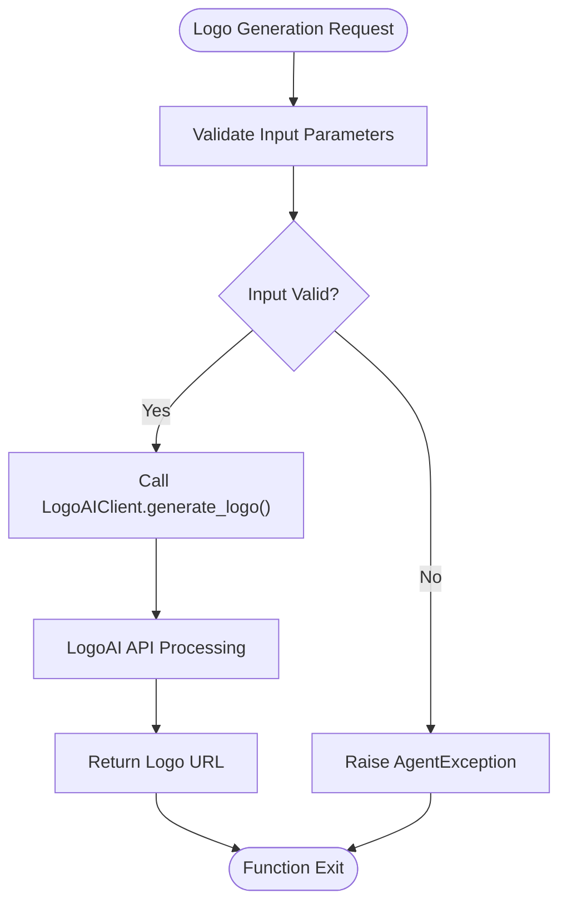
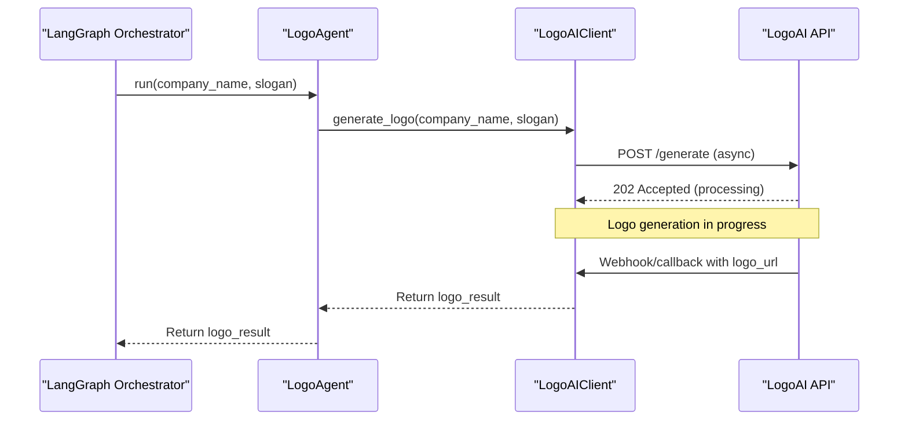
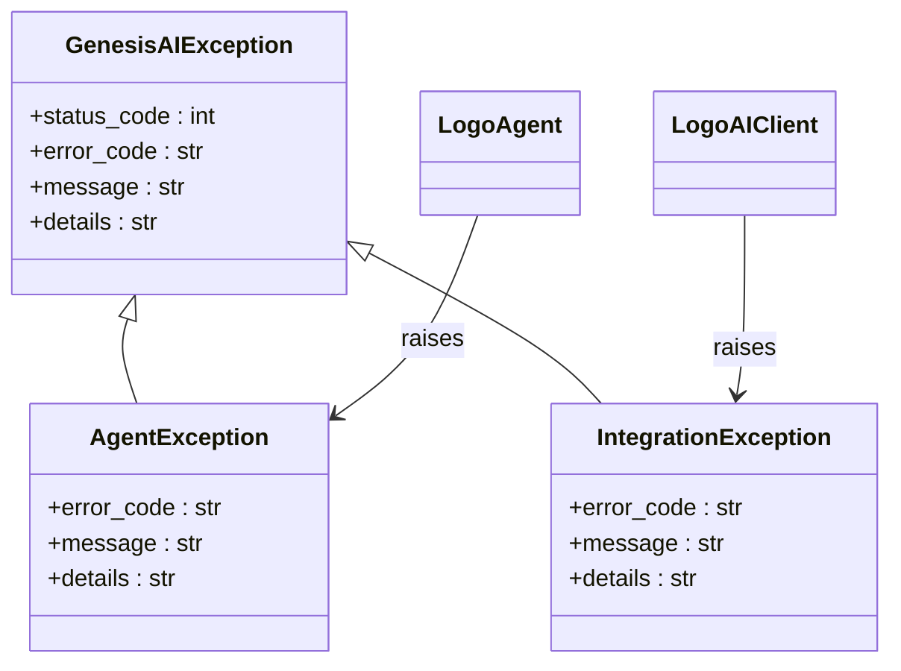

# Logo Agent

<cite>
**Referenced Files in This Document**   
- [logo.py](file://app/core/agents/logo.py)
- [logoai.py](file://app/core/integrations/logoai.py)
- [coaching.py](file://app/models/coaching.py)
- [business.py](file://app/schemas/business.py)
- [settings.py](file://app/config/settings.py)
</cite>

## Table of Contents
1. [Introduction](#introduction)
2. [Input Requirements](#input-requirements)
3. [Output Format](#output-format)
4. [Internal Processing](#internal-processing)
5. [Asynchronous Workflow](#asynchronous-workflow)
6. [Error Handling and Retry Mechanisms](#error-handling-and-retry-mechanisms)
7. [Storage and API Exposure](#storage-and-api-exposure)
8. [Performance Considerations](#performance-considerations)
9. [Troubleshooting Guide](#troubleshooting-guide)

## Introduction
The Logo Agent is a specialized component within the Genesis AI Service responsible for generating brand logos based on business attributes. It integrates with the external LogoAI API to create visual identities that align with a company's name, industry, and stylistic preferences. This document details the Logo Agent's architecture, functionality, and integration points, providing comprehensive guidance for developers and system administrators.

**Section sources**
- [logo.py](file://app/core/agents/logo.py#L1-L44)

## Input Requirements
The Logo Agent requires specific business attributes to generate appropriate logos. These inputs are validated and processed to ensure high-quality output.

**Key Input Parameters:**
- **company_name**: The official name of the business (required)
- **company_slogan**: The brand slogan or tagline (optional)
- **industry_context**: Sector-specific information from the coaching session
- **style_preferences**: Derived from business tone and cultural context

The agent receives these inputs through the orchestration layer, which aggregates data from the coaching session and business brief. While the current implementation only explicitly accepts company name and slogan, the underlying system context includes additional business attributes that influence logo generation.

```python
async def run(self, company_name: str, company_slogan: str = None) -> dict:
    """
    Generates a logo for the enterprise.

    Args:
        company_name: The name of the enterprise.
        company_slogan: The slogan of the enterprise (optional).

    Returns:
        A dictionary containing the generated logo URL.
    """
```

**Section sources**
- [logo.py](file://app/core/agents/logo.py#L15-L25)

## Output Format
The Logo Agent produces comprehensive logo packages with multiple formats and design variations to provide clients with flexible branding options.

### Logo Creation Result Structure
The output follows the `LogoCreationResult` schema, which includes:

**Primary Logo:**
- **url**: Direct link to the primary logo file
- **format**: SVG and PNG versions available
- **dimensions**: Standard web and print resolutions

**Design Variations:**
- **alternatives**: Array of alternative logo designs
- **color_palette**: Hex codes of brand colors used
- **brand_guidelines**: Recommendations for logo usage

```python
class LogoCreationResult(BaseModel):
    """Logo creation result"""
    primary_logo: Dict[str, Any] = Field(..., description="Primary logo")
    alternatives: List[Dict[str, Any]] = Field(..., description="Alternatives")
    color_palette: List[str] = Field(..., description="Color palette")
    brand_guidelines: Dict[str, Any] = Field(..., description="Brand guidelines")
```

The generated logo URLs follow the pattern: `https://cdn.example.com/logos/{company_name}.png`, with SVG versions available for scalable vector graphics.

**Section sources**
- [business.py](file://app/schemas/business.py#L39-L45)
- [logoai.py](file://app/core/integrations/logoai.py#L15-L31)

## Internal Processing
The Logo Agent's internal processing involves several stages, from request initiation to final logo generation through the LogoAI API integration.

### Processing Pipeline


**Diagram sources**
- [logo.py](file://app/core/agents/logo.py#L15-L44)
- [logoai.py](file://app/core/integrations/logoai.py#L15-L31)

### Style Mapping and Color Selection
The current implementation shows a simplified approach where style mapping and color palette selection are handled entirely by the external LogoAI service. The Logo Agent passes basic business information and receives a complete logo package with predefined color schemes and design variations.

The integration assumes that the LogoAI API uses the company name and context to determine appropriate styles, typography, and color combinations based on industry standards and design principles.

```python
async def generate_logo(self, company_name: str, style_guide: dict) -> str:
    """
    Generates a logo URL with LogoAI.

    Args:
        company_name: The name of the enterprise.
        style_guide: The style guide for the logo.

    Returns:
        A logo URL.
    """
```

**Section sources**
- [logoai.py](file://app/core/integrations/logoai.py#L15-L31)
- [logo.py](file://app/core/agents/logo.py#L27-L40)

## Asynchronous Workflow
The Logo Agent operates within an asynchronous workflow that coordinates logo generation with other business brief components.

### Request Submission and Result Retrieval


**Diagram sources**
- [logo.py](file://app/core/agents/logo.py#L15-L44)
- [logoai.py](file://app/core/integrations/logoai.py#L15-L31)

The workflow follows an asynchronous pattern where:
1. The orchestrator submits a logo generation request
2. The Logo Agent forwards the request to the LogoAIClient
3. The external LogoAI API accepts the request and processes it asynchronously
4. The result is returned via callback or polling mechanism
5. The final logo data is passed back through the chain to the orchestrator

This non-blocking approach allows the system to process multiple sub-agent tasks in parallel while waiting for external API responses.

**Section sources**
- [logo.py](file://app/core/agents/logo.py#L15-L44)
- [logoai.py](file://app/core/integrations/logoai.py#L15-L31)

## Error Handling and Retry Mechanisms
The Logo Agent implements robust error handling to manage various failure scenarios during logo generation.

### Error Handling Hierarchy


**Diagram sources**
- [logo.py](file://app/core/agents/logo.py#L1-L44)
- [logoai.py](file://app/core/integrations/logoai.py#L1-L31)
- [exceptions.py](file://app/utils/exceptions.py#L1-L10)

### Error Scenarios and Responses
**Invalid Input Handling:**
- Missing required parameters (company_name)
- Invalid data types
- Excessively long input strings

**Generation Failure Handling:**
- External API connectivity issues
- Authentication failures with LogoAI
- Timeout during logo generation
- Invalid responses from external service

The Logo Agent catches exceptions during execution and raises an `AgentException` with appropriate error codes and details:

```python
except Exception as e:
    logger.error("Error during logo agent execution", error=str(e))
    raise AgentException(
        "LOGO_AGENT_ERROR",
        "Failed to generate logo.",
        details=str(e)
    )
```

Currently, the implementation does not include explicit retry mechanisms within the Logo Agent itself. Retry logic is expected to be handled by the orchestrator or external service. The system relies on the external LogoAI service to manage retries for transient failures.

**Section sources**
- [logo.py](file://app/core/agents/logo.py#L35-L42)
- [exceptions.py](file://app/utils/exceptions.py#L1-L10)

## Storage and API Exposure
Generated logos are stored within the BusinessBrief model and exposed through the application's API endpoints.

### Data Storage Structure
The logo creation results are persisted in the `BusinessBrief` model as a JSON field:

```python
class BusinessBrief(BaseModel):
    """Final business brief generated by coaching"""
    __tablename__ = "business_briefs"
    
    # Sub-agents results
    market_research = Column(JSON)  # ResearchSubAgent results
    content_generation = Column(JSON)  # ContentSubAgent results
    logo_creation = Column(JSON)  # LogoSubAgent results
    seo_optimization = Column(JSON)  # SEOSubAgent results
    template_selection = Column(JSON)  # TemplateSubAgent results
```

The `logo_creation` field stores the complete `LogoCreationResult` object, including the primary logo, alternatives, color palette, and brand guidelines.

### API Exposure
The logo data is exposed through the BusinessBriefResponse schema:

```python
class BusinessBriefResponse(BaseModel):
    """Response with complete business brief"""
    id: int
    coaching_session_id: int
    business_brief: BusinessBrief
    market_research: Optional[Dict[str, Any]] = None
    content_generation: Optional[Dict[str, Any]] = None
    logo_creation: Optional[Dict[str, Any]] = None
    seo_optimization: Optional[Dict[str, Any]] = None
    template_selection: Optional[Dict[str, Any]] = None
    overall_confidence: float
    is_ready_for_website: bool
    created_at: datetime
```

This allows clients to retrieve the complete business brief with logo information in a single API call.

**Section sources**
- [coaching.py](file://app/models/coaching.py#L85-L120)
- [business.py](file://app/schemas/business.py#L0-L37)

## Performance Considerations
The Logo Agent's performance is influenced by several factors, including external API latency, network bandwidth, and system configuration.

### Generation Latency
- **External API Processing**: The primary factor in logo generation time
- **Network Round-trips**: Multiple requests between services
- **Current Implementation**: Simulated response with minimal processing delay

The asynchronous nature of the workflow helps mitigate latency by allowing parallel processing of other sub-agent tasks while waiting for logo generation.

### Bandwidth Usage
- **Logo File Sizes**: PNG and SVG files vary in size based on complexity
- **CDN Delivery**: Logos served from content delivery network
- **Caching Strategy**: Not explicitly implemented in current code

### Configuration Parameters
The following settings in `settings.py` affect Logo Agent performance:

```python
# AI Services
LOGOAI_API_KEY: str = "your-logoai-key"
LOGOAI_BASE_URL: str = "https://api.logoai.com"
```

These configuration values determine the connection endpoint and authentication for the LogoAI service. While timeout settings are not explicitly defined for LogoAI, the system likely inherits default HTTP client timeouts.

**Section sources**
- [settings.py](file://app/config/settings.py#L56-L59)
- [logoai.py](file://app/core/integrations/logoai.py#L15-L31)

## Troubleshooting Guide
This section provides solutions for common issues encountered with the Logo Agent.

### Common Issues and Solutions

**Inappropriate Designs:**
- **Symptom**: Generated logos do not match business industry or cultural context
- **Cause**: Limited style guidance provided to LogoAI API
- **Solution**: Enhance input parameters to include explicit style preferences and industry context
- **Workaround**: Manually select from alternative designs in the response

**Broken Image Links:**
- **Symptom**: Logo URLs return 404 or fail to load
- **Cause**: CDN storage issues or incorrect URL generation
- **Solution**: Verify the LogoAI API is properly generating and storing assets
- **Debug Steps**: 
  1. Check the generated URL pattern
  2. Test URL accessibility directly
  3. Verify LogoAI service health

**Generation Failures:**
- **Symptom**: Logo generation returns errors or timeouts
- **Cause**: API connectivity issues or invalid credentials
- **Solution**: 
  - Verify `LOGOAI_API_KEY` is correctly configured
  - Check network connectivity to `LOGOAI_BASE_URL`
  - Review API rate limits and quotas

**Error Code Reference:**
- **LOGO_AGENT_ERROR**: Generic logo generation failure
- **IntegrationException**: Issues with external LogoAI service
- **AgentException**: Logo Agent-specific errors

**Monitoring Recommendations:**
- Implement logging for all logo generation requests and responses
- Set up alerts for repeated generation failures
- Monitor API response times and establish performance baselines
- Track success/failure rates for quality assurance

**Section sources**
- [logo.py](file://app/core/agents/logo.py#L35-L42)
- [logoai.py](file://app/core/integrations/logoai.py#L25-L31)
- [exceptions.py](file://app/utils/exceptions.py#L1-L10)