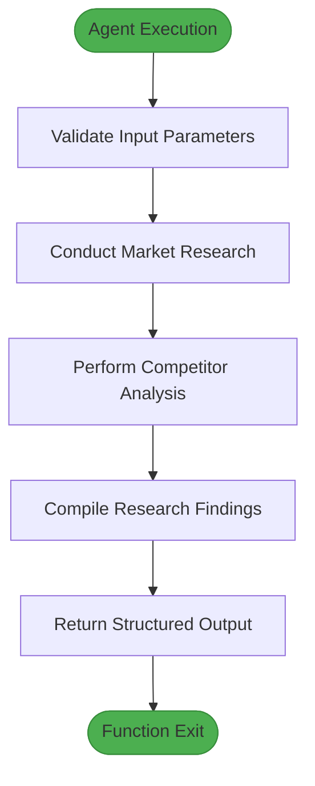
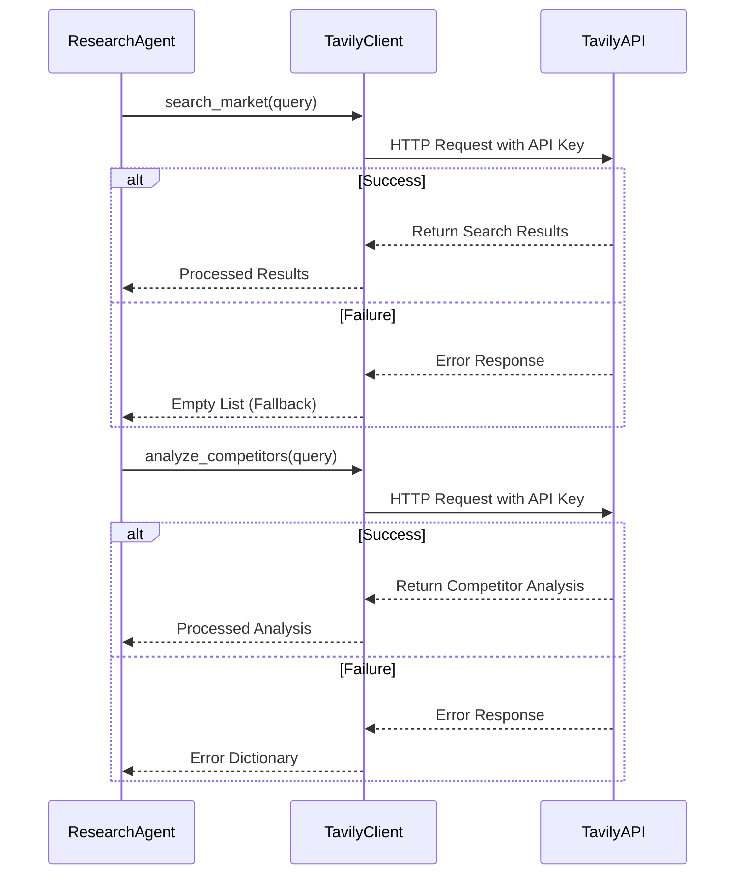
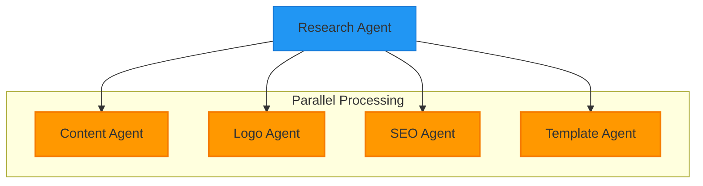
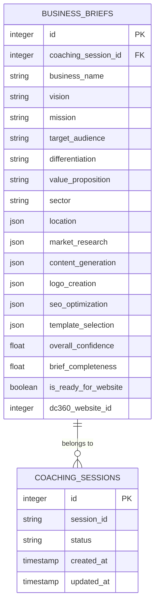

# Research Agent

<cite>
**Referenced Files in This Document**   
- [research.py](file://app/core/agents/research.py#L1-L57)
- [tavily.py](file://app/core/integrations/tavily.py#L1-L43)
- [langgraph_orchestrator.py](file://app/core/orchestration/langgraph_orchestrator.py#L1-L107)
- [business.py](file://app/models/business.py#L1-L72)
- [business.py](file://app/schemas/business.py#L1-L83)
- [redis_fs.py](file://app/core/integrations/redis_fs.py#L1-L59)
- [redis.py](file://app/config/redis.py#L1-L15)
</cite>

## Table of Contents
1. [Introduction](#introduction)
2. [Input Schema and Parameters](#input-schema-and-parameters)
3. [Output Structure](#output-structure)
4. [Internal Logic and Processing Flow](#internal-logic-and-processing-flow)
5. [Tavily API Integration](#tavily-api-integration)
6. [Integration with LangGraph Orchestrator](#integration-with-langgraph-orchestrator)
7. [Data Storage and BusinessBrief Model](#data-storage-and-businessbrief-model)
8. [Performance Considerations](#performance-considerations)
9. [Error Handling and Troubleshooting](#error-handling-and-troubleshooting)

## Introduction
The Research Agent is a specialized component within the Genesis AI Deep Agents Service designed to perform market research and competitor analysis for African entrepreneurs. It leverages the Tavily API to gather real-time market intelligence and integrates with the LangGraph orchestrator to coordinate with other sub-agents in the business creation workflow. This document provides a comprehensive analysis of the Research Agent's implementation, functionality, and integration points.

## Input Schema and Parameters
The Research Agent accepts two primary input parameters for its market research functionality:

- **company_description**: A textual description of the client's business concept or existing enterprise
- **market_focus**: The target market specification (e.g., "e-commerce de mode au Sénégal")

These inputs are derived from the `BusinessBrief` Pydantic model defined in the business schema, which includes comprehensive business context such as business name, vision, mission, target audience, differentiation, value proposition, sector, and location. The input schema ensures that the Research Agent receives sufficient contextual information to conduct targeted market research.

**Section sources**
- [research.py](file://app/core/agents/research.py#L1-L57)
- [business.py](file://app/schemas/business.py#L1-L83)

## Output Structure
The Research Agent returns a structured dictionary containing two main components:

```python
{
    "market_research": market_research,
    "competitor_analysis": competitor_analysis
}
```

The output structure is designed to be consumed by downstream agents and stored in the database. The `market_research` field contains results from general market analysis, while the `competitor_analysis` field contains insights about competing businesses in the specified market. These results are eventually stored in the `BusinessBrief` model under the `market_research` JSON column, which preserves the hierarchical structure of the research findings.

**Section sources**
- [research.py](file://app/core/agents/research.py#L1-L57)
- [business.py](file://app/models/coaching.py#L85-L120)

## Internal Logic and Processing Flow
The Research Agent follows a sequential processing logic to conduct comprehensive market research:



**Diagram sources**
- [research.py](file://app/core/agents/research.py#L1-L57)

The agent first conducts general market research by constructing a query that combines the market focus with a geographical context (Africa). It then performs competitor analysis by identifying key players in the specified market segment. Both operations are executed asynchronously to optimize performance, and the results are compiled into a unified response structure.

**Section sources**
- [research.py](file://app/core/agents/research.py#L1-L57)

## Tavily API Integration
The Research Agent interacts with the Tavily API through a dedicated integration client that handles API requests, authentication, and error management.



**Diagram sources**
- [tavily.py](file://app/core/integrations/tavily.py#L1-L43)
- [research.py](file://app/core/agents/research.py#L1-L57)

The `TavilyClient` class initializes with the API key from environment variables and provides two main methods:
- `search_market()`: Conducts market research with advanced search depth
- `analyze_competitors()`: Performs competitor analysis

The integration includes robust error handling that returns fallback values (empty lists or error dictionaries) when API calls fail, ensuring the agent workflow continues even if research data is incomplete.

**Section sources**
- [tavily.py](file://app/core/integrations/tavily.py#L1-L43)
- [research.py](file://app/core/agents/research.py#L1-L57)

### API Request/Response Example
**Request Payload:**
```json
{
  "query": "Analyse du marché pour e-commerce de mode au Sénégal in Africa",
  "search_depth": "advanced"
}
```

**Successful Response:**
```json
{
  "results": [
    {
      "title": "Senegal Fashion E-commerce Market Growth",
      "url": "https://example.com/senegal-fashion-market",
      "content": "The fashion e-commerce market in Senegal has grown by 25% annually..."
    }
  ]
}
```

**Failed Request Handling:**
When the Tavily API call fails, the client returns a fallback response:
- `search_market()` returns an empty list `[]`
- `analyze_competitors()` returns `{"error": "Failed to analyze competitors."}`

This graceful degradation ensures that the overall agent workflow is not disrupted by temporary API issues.

## Integration with LangGraph Orchestrator
The Research Agent is integrated into the larger business creation workflow through the LangGraph orchestrator, which coordinates multiple specialized agents.



**Diagram sources**
- [langgraph_orchestrator.py](file://app/core/orchestration/langgraph_orchestrator.py#L1-L107)

The orchestrator follows a directed acyclic graph (DAG) pattern where the Research Agent serves as the entry point. After the Research Agent completes its task, the workflow branches into four parallel processes:
- Content generation
- Logo creation
- SEO optimization
- Template selection

This architecture ensures that market research is conducted first, providing essential context for all subsequent agents. The orchestrator passes the research findings to downstream agents through the shared state object.

**Section sources**
- [langgraph_orchestrator.py](file://app/core/orchestration/langgraph_orchestrator.py#L1-L107)

## Data Storage and BusinessBrief Model
Research findings are stored in the `BusinessBrief` database model, which preserves the structured output from the Research Agent.



**Diagram sources**
- [business.py](file://app/models/coaching.py#L85-L120)

The `market_research` field in the `BusinessBrief` table is defined as a JSON column, allowing flexible storage of the hierarchical research data. This NoSQL-like approach within a relational database provides the flexibility needed to accommodate varying research result structures without requiring schema changes.

Additionally, research findings are temporarily stored in Redis through the Redis Virtual File System, which provides fast access during the agent orchestration process. The Redis storage has a default TTL (time-to-live) of 7200 seconds (2 hours), ensuring that session data is automatically cleaned up after completion.

**Section sources**
- [business.py](file://app/models/coaching.py#L85-L120)
- [redis_fs.py](file://app/core/integrations/redis_fs.py#L1-L59)

## Performance Considerations
The Research Agent implementation incorporates several performance optimization strategies:

### Caching Strategy
The system uses Redis as a virtual file system to cache session data, including research findings. The `RedisVirtualFileSystem` class provides methods to write and read session data with configurable TTL values. This caching layer reduces database load and improves response times for subsequent requests within the same session.

### Asynchronous Processing
All research operations are implemented asynchronously using Python's async/await pattern. This allows the agent to perform non-blocking API calls to Tavily, improving overall throughput and responsiveness.

### Connection Management
The Redis connection is managed through a dedicated client that performs health checks and handles connection errors gracefully. The system validates external API connections (including Tavily) at startup to ensure service availability.

### Timeout Settings
While explicit timeout settings for the Tavily API calls are not visible in the provided code, the underlying Tavily SDK likely implements default timeouts. The system's reliance on asynchronous operations and the fallback mechanisms in the Tavily client suggest that timeout handling is managed at the SDK level, with the application layer focusing on error recovery rather than timeout configuration.

**Section sources**
- [redis.py](file://app/config/redis.py#L1-L15)
- [redis_fs.py](file://app/core/integrations/redis_fs.py#L1-L59)
- [tavily.py](file://app/core/integrations/tavily.py#L1-L43)

## Error Handling and Troubleshooting
The Research Agent implements comprehensive error handling at multiple levels:

### API Authentication Failures
The `TavilyClient` constructor validates the presence of the `TAVILY_API_KEY` environment variable. If the key is missing, it raises a `ValueError` during initialization, preventing the service from starting with invalid configuration.

```python
if not settings.TAVILY_API_KEY:
    raise ValueError("TAVILY_API_KEY is not set in the environment variables.")
```

**Troubleshooting:** Ensure that the `TAVILY_API_KEY` is properly set in the environment variables or configuration file.

### Failed API Queries
The Tavily integration includes try-except blocks around all API calls. When a query fails, the client returns a fallback value:
- `search_market()` returns an empty list `[]`
- `analyze_competitors()` returns an error dictionary

This graceful degradation prevents a single API failure from disrupting the entire business creation workflow.

**Troubleshooting:** Check network connectivity, verify the Tavily API status, and ensure the API key has sufficient quota.

### Rate Limit Handling
While explicit rate limit handling code is not visible, the fallback mechanisms suggest that rate limit errors are treated as general exceptions. The system continues processing with incomplete data rather than failing completely.

**Troubleshooting:** Monitor API usage metrics, implement request throttling if needed, and consider caching frequent queries to reduce API calls.

### Incomplete Results
The system is designed to handle incomplete results through its fallback mechanisms. Even if some research data is missing, the workflow continues, and downstream agents adapt to the available information.

**Troubleshooting:** Check the application logs for error messages, verify the quality of input parameters, and ensure the market focus is specific enough to yield relevant results.

### General Troubleshooting Guide
1. **Verify API Key Configuration**: Ensure `TAVILY_API_KEY` is set in environment variables
2. **Check Network Connectivity**: Confirm the service can reach the Tavily API endpoint
3. **Monitor Rate Limits**: Track API usage to avoid exceeding quotas
4. **Review Input Quality**: Ensure company description and market focus are clear and specific
5. **Examine Logs**: Check application logs for detailed error messages and warnings
6. **Test Redis Connection**: Verify Redis is accessible and functioning properly

**Section sources**
- [tavily.py](file://app/core/integrations/tavily.py#L1-L43)
- [research.py](file://app/core/agents/research.py#L1-L57)
- [redis.py](file://app/config/redis.py#L1-L15)
- [redis_fs.py](file://app/core/integrations/redis_fs.py#L1-L59)