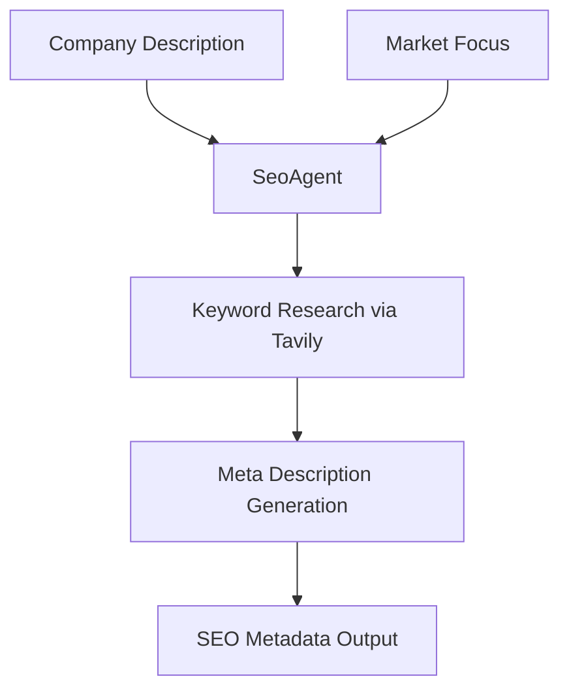
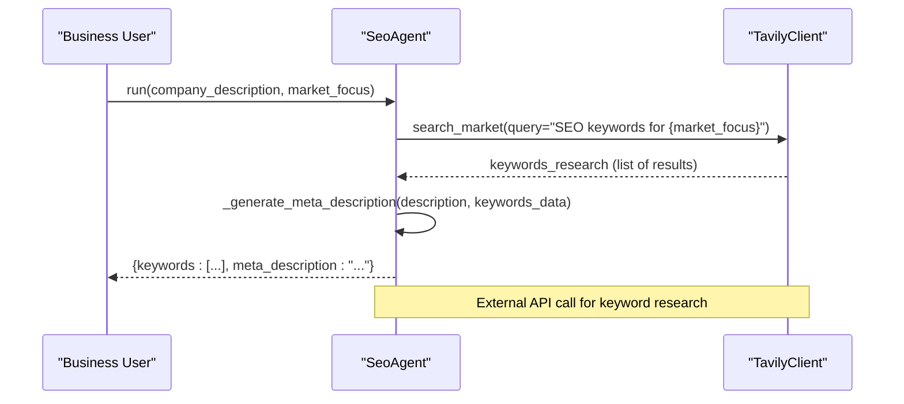
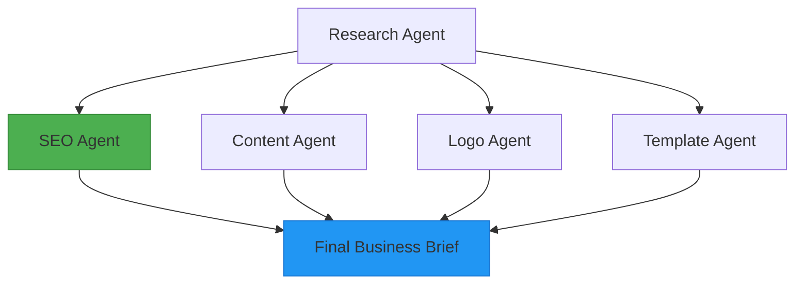

# SEO Agent

<cite>
**Referenced Files in This Document**   
- [seo.py](file://app/core/agents/seo.py#L6-L55)
- [tavily.py](file://app/core/integrations/tavily.py#L15-L43)
- [business.py](file://app/models/business.py#L54)
- [business.py](file://app/schemas/business.py#L63-L82)
- [langgraph_orchestrator.py](file://app/core/orchestration/langgraph_orchestrator.py#L50-L60)
- [content.py](file://app/core/agents/content.py#L30-L35)
- [openai.py](file://app/core/integrations/openai.py#L25-L44)
</cite>

## Table of Contents
1. [Introduction](#introduction)
2. [Core Functionality](#core-functionality)
3. [Keyword and Meta Description Generation](#keyword-and-meta-description-generation)
4. [Integration with External SEO Tools](#integration-with-external-seo-tools)
5. [Output Structure and SEO Recommendations](#output-structure-and-seo-recommendations)
6. [Workflow Integration and Data Storage](#workflow-integration-and-data-storage)
7. [Regional and Multilingual SEO Support](#regional-and-multilingual-seo-support)
8. [Fallback Strategies and Error Handling](#fallback-strategies-and-error-handling)
9. [Example Output and Best Practices](#example-output-and-best-practices)

## Introduction
The SEO Agent is a specialized component within the Genesis AI Service responsible for generating search engine optimization (SEO) metadata, including keywords and meta descriptions, to enhance the online visibility of client websites. It operates as part of a multi-agent orchestration system, receiving business context and market focus data to produce targeted SEO recommendations. The agent leverages external APIs for market research and integrates seamlessly with the broader website generation workflow, storing results in structured formats for downstream use.

**Section sources**
- [seo.py](file://app/core/agents/seo.py#L6-L10)

## Core Functionality
The SEO Agent analyzes business domain data and target audience information to identify high-value keywords and generate compelling meta descriptions. It is initialized with a TavilyClient instance, enabling it to perform market-specific searches. The agent's primary function, `run`, takes a company description and market focus as inputs and returns a dictionary containing keywords and a meta description. This process supports the creation of optimized website content aligned with the client's business goals and regional market characteristics.



**Diagram sources**
- [seo.py](file://app/core/agents/seo.py#L15-L55)

**Section sources**
- [seo.py](file://app/core/agents/seo.py#L15-L55)

## Keyword and Meta Description Generation
The SEO Agent generates keywords by querying the Tavily API with a search term constructed from the market focus. The meta description is created using a simple templating approach that truncates the company description and appends the top three keywords. While currently using a deterministic method, the implementation is designed to be extended with LLM-based generation for more sophisticated content creation.

**Keyword Research Process:**
- Constructs query: "SEO keywords for {market_focus}"
- Uses TavilyClient to search with "advanced" depth
- Extracts keywords from search results

**Meta Description Logic:**
- Truncates company description to 120 characters
- Appends top three keywords from research
- Formats as: "{description}... | Keywords: {keywords}"



**Diagram sources**
- [seo.py](file://app/core/agents/seo.py#L25-L55)
- [tavily.py](file://app/core/integrations/tavily.py#L15-L43)

**Section sources**
- [seo.py](file://app/core/agents/seo.py#L25-L55)

## Integration with External SEO Tools
The SEO Agent integrates with the Tavily API through the TavilyClient integration layer. This connection enables real-time market research and keyword discovery, with a focus on African markets as specified in the search parameters. The integration includes error handling and fallback mechanisms to ensure robustness when external services are unavailable.

**Integration Details:**
- API: Tavily Search API
- Search depth: Advanced
- Location parameter: Africa (hardcoded)
- Authentication: TAVILY_API_KEY from environment variables

**Section sources**
- [tavily.py](file://app/core/integrations/tavily.py#L15-L43)

## Output Structure and SEO Recommendations
The SEO Agent returns a dictionary with two primary fields: `keywords` and `meta_description`. These outputs are designed to be integrated into website templates and content generation processes. While the current implementation does not include explicit keyword density recommendations or structured data markup, the output structure is compatible with such enhancements.

**Output Schema:**
```json
{
  "keywords": ["keyword1", "keyword2", "keyword3"],
  "meta_description": "Company description... | Keywords: keyword1, keyword2, keyword3"
}
```

The agent's output is consumed by downstream components, particularly the Content Agent, which uses SEO metadata to inform website content generation, ensuring consistency between metadata and on-page content.

**Section sources**
- [seo.py](file://app/core/agents/seo.py#L45-L55)
- [content.py](file://app/core/agents/content.py#L30-L35)

## Workflow Integration and Data Storage
The SEO Agent is integrated into the overall workflow through the LangGraphOrchestrator, which coordinates multiple specialized agents in a parallel execution pattern. After the Research Agent completes its analysis, the SEO Agent runs concurrently with other agents (Content, Logo, Template) to generate SEO metadata. The results are stored in the BusinessContext model within the `seo_metadata` JSON field.

**Orchestration Flow:**
1. Research Agent executes first
2. SEO Agent runs in parallel with other sub-agents
3. Results are compiled into the final business brief
4. SEO metadata is stored in database



**Diagram sources**
- [langgraph_orchestrator.py](file://app/core/orchestration/langgraph_orchestrator.py#L25-L60)

**Section sources**
- [langgraph_orchestrator.py](file://app/core/orchestration/langgraph_orchestrator.py#L50-L60)
- [business.py](file://app/models/business.py#L54)

## Regional and Multilingual SEO Support
The SEO Agent supports regional SEO optimization through its integration with Tavily, which is configured to focus on African markets. The system architecture includes provisions for multilingual support, as evidenced by the `languages_generated` field in the ContentGenerationResult schema. While the SEO Agent itself does not currently generate multilingual metadata, it operates within a framework designed to support language-specific SEO strategies.

**Regional SEO Features:**
- Market-specific keyword research
- Africa-focused search parameter
- Local SEO strategy field in output schema

**Multilingual Support Indicators:**
- `languages_generated` field in ContentGenerationResult
- Potential for language-specific keyword research
- Framework for regional keyword variations

**Section sources**
- [tavily.py](file://app/core/integrations/tavily.py#L25-L35)
- [business.py](file://app/schemas/business.py#L63-L82)

## Fallback Strategies and Error Handling
The SEO Agent implements robust error handling to maintain system reliability when external services fail. The TavilyClient integration includes a fallback mechanism that returns an empty list of results if the API call fails, preventing cascading failures in the orchestration workflow. The SEO Agent itself raises a custom AgentException when execution fails, providing structured error information for monitoring and debugging.

**Error Handling Mechanisms:**
- TavilyClient returns empty list on API failure
- SeoAgent catches exceptions and raises AgentException
- Structured error logging with context
- Graceful degradation of functionality

**Section sources**
- [tavily.py](file://app/core/integrations/tavily.py#L35-L43)
- [seo.py](file://app/core/agents/seo.py#L40-L55)

## Example Output and Best Practices
The following example demonstrates typical output from the SEO Agent:

```json
{
  "keywords": ["digital marketing", "social media", "content creation"],
  "meta_description": "African digital marketing agency specializing in social media... | Keywords: digital marketing, social media, content creation"
}
```

**Best Practices for SEO Implementation:**
- Ensure keyword relevance to business domain
- Maintain meta descriptions under 160 characters
- Include primary keywords naturally in descriptions
- Align SEO metadata with overall content strategy
- Regularly update keywords based on market trends

**Common Pitfalls to Avoid:**
- Keyword stuffing in meta descriptions
- Using irrelevant or overly competitive keywords
- Neglecting regional search behavior differences
- Failing to update metadata as business evolves
- Ignoring mobile search optimization

**Section sources**
- [seo.py](file://app/core/agents/seo.py#L45-L55)
- [business.py](file://app/schemas/business.py#L63-L82)