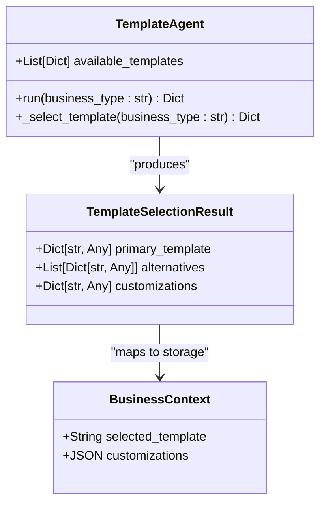
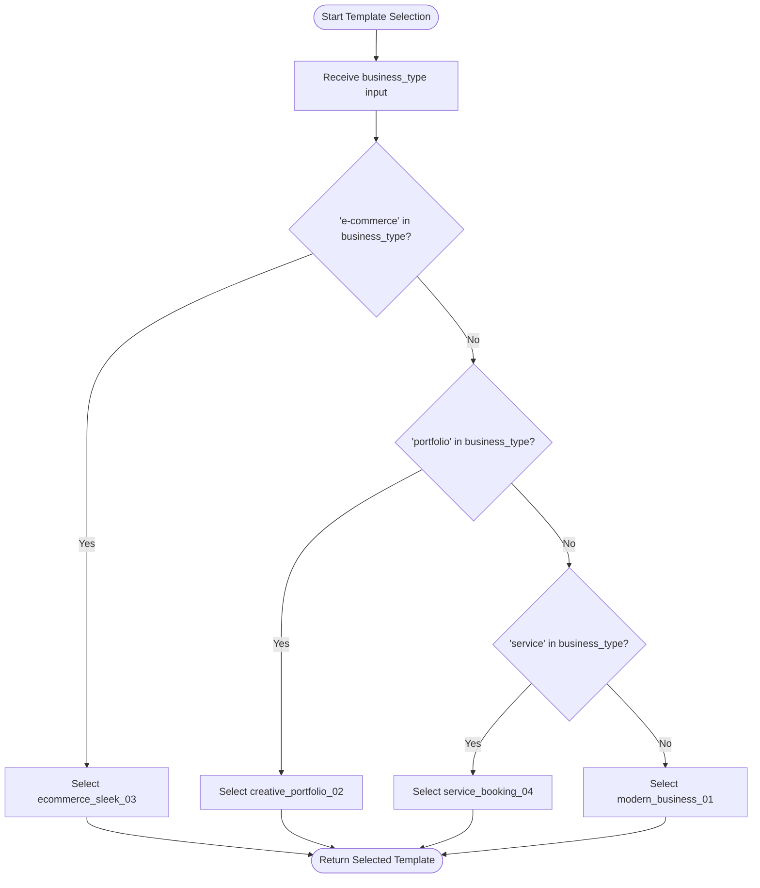
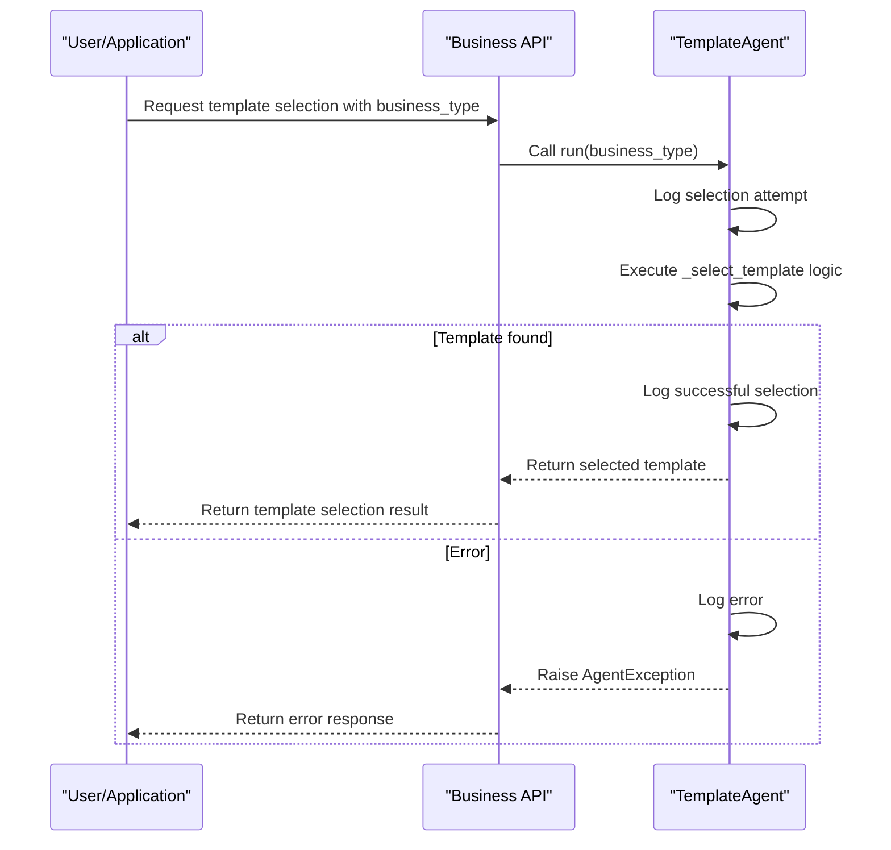
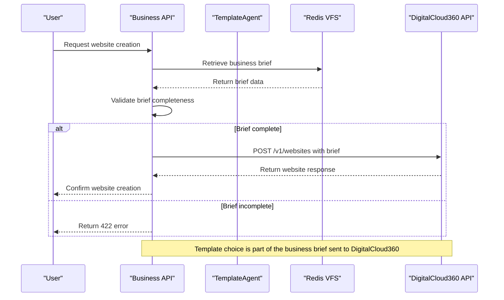

# Template Agent

<cite>
**Referenced Files in This Document**   
- [template.py](file://app/core/agents/template.py)
- [digitalcloud360.py](file://app/core/integrations/digitalcloud360.py)
- [business.py](file://app/api/v1/business.py)
- [schemas/business.py](file://app/schemas/business.py)
- [models/business.py](file://app/models/business.py)
</cite>

## Table of Contents
1. [Introduction](#introduction)
2. [Template Catalog Structure and Metadata Schema](#template-catalog-structure-and-metadata-schema)
3. [Template Matching Algorithm](#template-matching-algorithm)
4. [Decision-Making Process and Confidence Scoring](#decision-making-process-and-confidence-scoring)
5. [Fallback Mechanisms](#fallback-mechanisms)
6. [Integration with DigitalCloud360 Publishing System](#integration-with-digitalcloud360-publishing-system)
7. [Template Customization Options](#template-customization-options)
8. [Extensibility for New Template Categories](#extensibility-for-new-template-categories)
9. [Conclusion](#conclusion)

## Introduction
The Template Agent is a specialized component within the Genesis AI Service responsible for selecting appropriate website templates based on business type, industry, and user preferences. It operates as part of a larger orchestration system that generates comprehensive business briefs and ultimately creates websites through integration with the DigitalCloud360 platform. The agent analyzes input parameters such as business type to match against a catalog of available templates using a rule-based selection algorithm. This document provides a detailed analysis of the Template Agent's functionality, architecture, and integration points, explaining how it contributes to the automated website creation workflow.

**Section sources**
- [template.py](file://app/core/agents/template.py#L6-L59)

## Template Catalog Structure and Metadata Schema
The Template Agent maintains an internal catalog of available website templates defined within its initialization method. The catalog consists of four predefined templates, each with a unique identifier and descriptive name that indicates its intended use case:

- **modern_business_01**: "Modern Business" - General business template
- **creative_portfolio_02**: "Creative Portfolio" - Designed for portfolio展示
- **ecommerce_sleek_03**: "Sleek E-commerce" - Optimized for e-commerce businesses
- **service_booking_04**: "Service Booking Pro" - Tailored for service-based businesses with booking functionality

The metadata schema for template selection is defined in the `TemplateSelectionResult` Pydantic model, which structures the output of the template selection process. This schema includes three key components:
- **primary_template**: Object containing the selected template information
- **alternatives**: Array of alternative template options
- **customizations**: Dictionary of recommended customizations

Additionally, the `BusinessContext` database model stores the selected template as a string identifier in the `selected_template` column, along with any customizations stored as JSON in the `customizations` column. This persistence layer ensures that template choices are maintained throughout the website creation lifecycle.

**Diagram sources**
- [schemas/business.py](file://app/schemas/business.py#L70-L74)
- [models/business.py](file://app/models/business.py#L55-L56)
- [template.py](file://app/core/agents/template.py#L6-L59)

**Section sources**
- [template.py](file://app/core/agents/template.py#L12-L19)
- [schemas/business.py](file://app/schemas/business.py#L70-L74)
- [models/business.py](file://app/models/business.py#L55-L56)

## Template Matching Algorithm
The Template Agent implements a simple rule-based matching algorithm in the `_select_template` method to determine the most appropriate website template based on the provided business type. The algorithm follows a sequential conditional logic approach:

1. **E-commerce Detection**: If the business type string contains "e-commerce" (case-insensitive), the agent selects the "Sleek E-commerce" template (ID: ecommerce_sleek_03)
2. **Portfolio Detection**: If the business type contains "portfolio", the "Creative Portfolio" template (ID: creative_portfolio_02) is chosen
3. **Service Detection**: If the business type contains "service", the "Service Booking Pro" template (ID: service_booking_04) is selected
4. **Default Fallback**: For any other business type, the generic "Modern Business" template (ID: modern_business_01) is used

The matching process is implemented through simple string containment checks rather than more sophisticated natural language processing or machine learning techniques. The algorithm currently operates on exact substring matching without considering synonyms, related terms, or contextual meaning beyond the literal presence of keywords in the business type parameter.

The `run` method serves as the entry point for the template selection process, handling error logging and exception management while delegating the core matching logic to the `_select_template` helper method. This separation of concerns allows for clean error handling while maintaining focused business logic.

**Diagram sources**
- [template.py](file://app/core/agents/template.py#L45-L59)

**Section sources**
- [template.py](file://app/core/agents/template.py#L45-L59)

## Decision-Making Process and Confidence Scoring
The current implementation of the Template Agent does not include explicit confidence scoring for template recommendations. The decision-making process is deterministic and rule-based, with no probabilistic assessment of match quality or confidence levels. Each business type input results in exactly one template selection based on the first matching condition in the conditional chain.

When a template is selected, the agent logs the selection event with the business type and resulting template information, but it does not calculate or store any confidence metrics. The absence of confidence scoring means that all recommendations are treated equally, regardless of how well the business type matches the template criteria or whether multiple templates might be equally suitable.

The agent's decision process follows a strict priority order where e-commerce templates take precedence over portfolio templates, which in turn take precedence over service templates, with the generic business template serving as the default. This fixed priority system does not allow for nuanced decision-making when a business type might match multiple categories (e.g., a service-based business that also sells products).

Future enhancements could introduce confidence scoring by:
- Implementing keyword weighting systems
- Adding synonym recognition and semantic analysis
- Incorporating business size, target audience, or other contextual factors
- Using machine learning models trained on successful template-business pairings

**Diagram sources**
- [template.py](file://app/core/agents/template.py#L25-L59)
- [business.py](file://app/api/v1/business.py#L226-L258)

**Section sources**
- [template.py](file://app/core/agents/template.py#L25-L59)

## Fallback Mechanisms
The Template Agent implements a simple fallback mechanism to ensure that a template is always selected, even when no specific business type matches are found. The fallback strategy operates as follows:

1. **Primary Matching**: The agent attempts to match the business type against e-commerce, portfolio, and service categories in sequence
2. **Default Template**: When none of the specific conditions are met, the agent automatically selects the "Modern Business" template as a generic fallback option

This approach guarantees that the template selection process never fails due to an unrecognized business type. The fallback mechanism is implemented through the final unconditional return statement in the `_select_template` method, which returns the first template in the available templates list (index 0).

The agent does not provide alternative template suggestions or allow for user selection among multiple options in the current implementation. Instead, it makes a definitive choice using the fallback template when no better match is identified. This ensures continuity in the website creation workflow, preventing the process from stalling due to template selection issues.

Error handling is implemented at the `run` method level, where any exceptions during template selection are caught and re-raised as `AgentException` with appropriate error codes and messages. This prevents unhandled exceptions from propagating up the call stack while still allowing higher-level components to respond to template selection failures.

**Section sources**
- [template.py](file://app/core/agents/template.py#L59)

## Integration with DigitalCloud360 Publishing System
The Template Agent integrates with the DigitalCloud360 publishing system through a multi-step process that connects template selection to actual website generation. The integration workflow is orchestrated through the business API endpoints and involves the following sequence:

1. **Template Selection**: The Template Agent selects an appropriate template based on business type
2. **Brief Assembly**: The selected template information is stored in the business brief along with other generated assets
3. **Website Creation Request**: When a user requests website creation, the system retrieves the complete business brief from storage
4. **API Integration**: The business brief is sent to the DigitalCloud360 API via the `create_website` method of the `DigitalCloud360APIClient`

The `DigitalCloud360APIClient` class handles the HTTP communication with the external publishing platform, sending the entire business brief as JSON payload to the `/v1/websites` endpoint. This payload includes the selected template information, which DigitalCloud360 uses to determine the initial website structure and design.

The integration includes error handling with retry logic for the health check method, though the website creation method itself does not implement retries. If the DigitalCloud360 API call fails, the error is logged with detailed information including status code and response text, then re-raised to be handled by upstream components.

The business brief validation ensures that template selection is complete before website creation proceeds. The API endpoint checks that the brief contains results for all required sub-agents, including template selection, before initiating the website creation process.

**Diagram sources**
- [digitalcloud360.py](file://app/core/integrations/digitalcloud360.py#L60-L82)
- [business.py](file://app/api/v1/business.py#L226-L258)

**Section sources**
- [digitalcloud360.py](file://app/core/integrations/digitalcloud360.py#L60-L82)
- [business.py](file://app/api/v1/business.py#L226-L258)

## Template Customization Options
The Template Agent supports post-selection customization through the `customizations` field in the template selection result schema. While the current implementation does not populate this field with specific customization options, the architecture is designed to accommodate recommendations for template modifications after selection.

The `TemplateSelectionResult` schema defines the `customizations` property as a dictionary of arbitrary key-value pairs (`Dict[str, Any]`), allowing for flexible specification of various customization parameters such as:
- Color scheme adjustments
- Layout modifications
- Feature toggles
- Content section configurations
- Navigation structure changes

These customizations are stored in the `BusinessContext` model as a JSON column, enabling persistence of user preferences or system-generated recommendations. The DigitalCloud360 platform can use this information to apply specific modifications to the base template during website generation.

Although the current `_select_template` implementation does not generate any customizations, the framework is in place to extend the algorithm to include context-aware recommendations based on other aspects of the business brief, such as brand colors from logo creation or content structure from content generation.

The separation between template selection and customization allows for a two-phase approach where the most appropriate template is first identified, followed by targeted modifications to better align with the business's specific needs and branding.

**Section sources**
- [schemas/business.py](file://app/schemas/business.py#L73)
- [models/business.py](file://app/models/business.py#L56)

## Extensibility for New Template Categories
The Template Agent architecture allows for extensibility in adding new template categories and updating matching rules, though the current implementation has limitations that would require modification for seamless expansion.

**Adding New Template Categories**: New templates can be added by extending the `available_templates` list in the `__init__` method. Each new template requires a unique ID and descriptive name. However, the current implementation would also require updates to the `_select_template` method to include matching logic for the new category, creating a tight coupling between template registration and matching rules.

**Updating Matching Rules**: The matching rules are hardcoded in the `_select_template` method, making rule updates require code changes and redeployment. The comment in the code acknowledges this limitation, noting "Dans une version avancée, on utiliserait un modèle de matching ou des règles plus complexes" (In an advanced version, we would use a matching model or more complex rules).

Potential improvements for better extensibility include:
- Externalizing template definitions and matching rules to configuration files or databases
- Implementing a rules engine that can be updated without code changes
- Using machine learning models that can be retrained with new data
- Creating a plugin system for template categories

The agent's current design follows a monolithic pattern where template definitions and matching logic are co-located, which simplifies development but reduces flexibility. Future iterations could decouple these concerns to enable dynamic template management and adaptive matching strategies.

**Section sources**
- [template.py](file://app/core/agents/template.py#L12-L19)

## Conclusion
The Template Agent serves as a critical component in the automated website creation pipeline, responsible for matching business types to appropriate website templates. Its current implementation provides a functional but relatively simple rule-based selection mechanism that ensures every business receives a suitable template, with a default fallback option guaranteeing availability.

While the agent successfully fulfills its primary function, there are clear opportunities for enhancement, particularly in the areas of confidence scoring, sophisticated matching algorithms, and dynamic extensibility. The integration with DigitalCloud360 is well-structured, passing complete business briefs that include template choices to the publishing system.

The architectural foundation supports customization and scalability, with well-defined schemas and separation of concerns between selection logic and external integrations. Future development could focus on replacing the hardcoded rules with a more flexible rules engine, incorporating confidence metrics, and enabling dynamic template registration without code changes.

Overall, the Template Agent represents a pragmatic solution that balances immediate functionality with a foundation that can support more sophisticated capabilities as the system evolves.