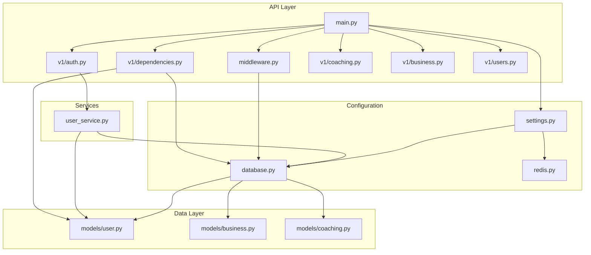
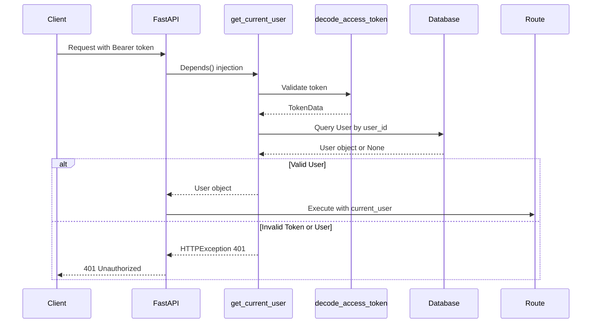
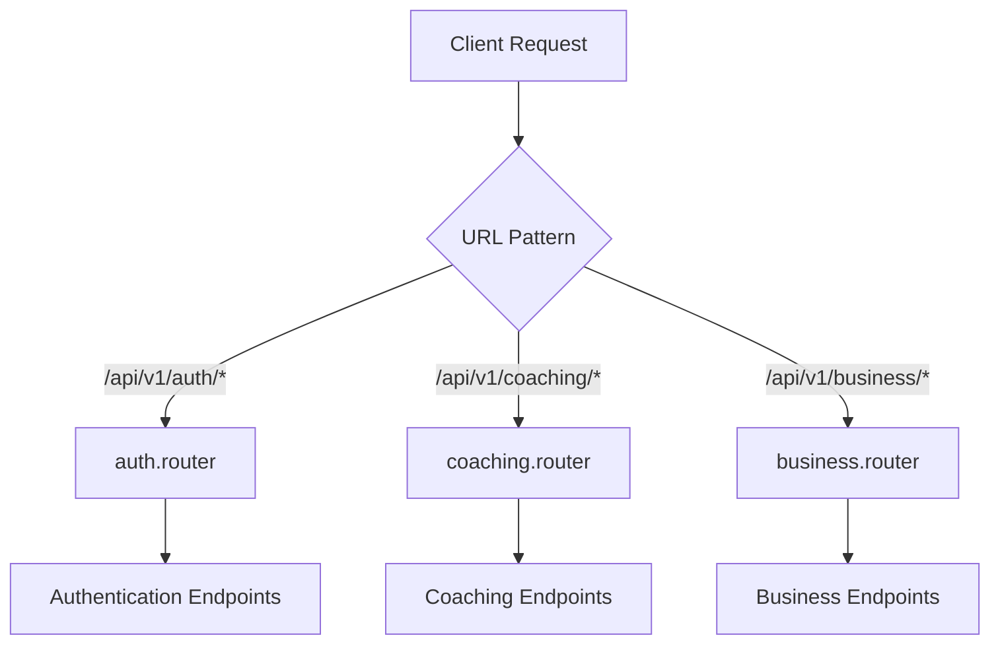

# API Middleware and Infrastructure

<cite>
**Referenced Files in This Document**   
- [app/main.py](file://app/main.py#L1-L185)
- [app/api/middleware.py](file://app/api/middleware.py#L1-L73)
- [app/api/v1/dependencies.py](file://app/api/v1/dependencies.py#L1-L51)
- [app/config/database.py](file://app/config/database.py#L1-L44)
- [app/schemas/responses.py](file://app/schemas/responses.py#L1-L37)
- [app/utils/exceptions.py](file://app/utils/exceptions.py)
- [app/services/user_service.py](file://app/services/user_service.py#L1-L32)
</cite>

## Table of Contents
1. [Introduction](#introduction)
2. [Project Structure](#project-structure)
3. [Core Middleware Components](#core-middleware-components)
4. [Authentication and Dependency Injection](#authentication-and-dependency-injection)
5. [Database Session Management](#database-session-management)
6. [Error Handling and Response Formatting](#error-handling-and-response-formatting)
7. [API Versioning and Router Integration](#api-versioning-and-router-integration)
8. [CORS and Request Logging Configuration](#cors-and-request-logging-configuration)
9. [Guidance for Extending Middleware and Securing Endpoints](#guidance-for-extending-middleware-and-securing-endpoints)

## Introduction
This document provides a comprehensive overview of the API infrastructure components within the Genesis AI Deep Agents Service. It details the middleware architecture, authentication mechanisms, dependency injection patterns, error handling, and API configuration. The system is built on FastAPI and leverages modern Python practices for scalable, maintainable, and secure API development. This guide is designed to assist developers in understanding, maintaining, and extending the current infrastructure.

## Project Structure
The project follows a modular, feature-based organization with clear separation of concerns. Key directories include:
- **app/api**: Contains versioned API endpoints and shared middleware
- **app/config**: Configuration and database setup
- **app/core**: Core business logic, agents, and integrations
- **app/models**: SQLAlchemy ORM models
- **app/schemas**: Pydantic models for request/response validation
- **app/services**: Business service implementations
- **app/utils**: Utilities including logging and exception handling

The API is versioned under `app/api/v1`, with dependencies and routers organized per feature domain (auth, coaching, business, users).



**Diagram sources**
- [app/main.py](file://app/main.py#L1-L185)
- [app/api/middleware.py](file://app/api/middleware.py#L1-L73)
- [app/config/database.py](file://app/config/database.py#L1-L44)
- [app/models/user.py](file://app/models/user.py)
- [app/services/user_service.py](file://app/services/user_service.py#L1-L32)

**Section sources**
- [app/main.py](file://app/main.py#L1-L185)
- [app/api/middleware.py](file://app/api/middleware.py#L1-L73)

## Core Middleware Components

### LoggingMiddleware
The `LoggingMiddleware` provides structured logging of HTTP requests and responses using `structlog`. It captures key information including:
- Request method and URL
- Client IP address
- Response status code
- Request duration

This enables comprehensive monitoring and debugging capabilities.

```python
class LoggingMiddleware(BaseHTTPMiddleware):
    async def dispatch(self, request: Request, call_next):
        start_time = time.time()
        logger.info(
            "Request started",
            method=request.method,
            url=str(request.url),
            client_ip=request.client.host if request.client else None
        )
        response = await call_next(request)
        duration = time.time() - start_time
        logger.info(
            "Request completed",
            method=request.method,
            url=str(request.url),
            status_code=response.status_code,
            duration_seconds=duration
        )
        return response
```

### PrometheusMiddleware
The `PrometheusMiddleware` collects metrics for monitoring and observability using the Prometheus client library. It tracks:
- Total request count by method, endpoint, and status
- Request duration by method and endpoint

These metrics are exposed for scraping by a Prometheus server.

```python
class PrometheusMiddleware(BaseHTTPMiddleware):
    async def dispatch(self, request: Request, call_next):
        start_time = time.time()
        endpoint = request.url.path
        method = request.method
        response = await call_next(request)
        duration = time.time() - start_time
        REQUEST_COUNT.labels(method=method, endpoint=endpoint, status=response.status_code).inc()
        REQUEST_DURATION.labels(method=method, endpoint=endpoint).observe(duration)
        return response
```

**Section sources**
- [app/api/middleware.py](file://app/api/middleware.py#L1-L73)

## Authentication and Dependency Injection

### get_current_user Dependency
The `get_current_user` function is a FastAPI dependency that handles token validation and user retrieval. It:
1. Extracts the JWT token via OAuth2PasswordBearer
2. Decodes and validates the token using `decode_access_token`
3. Retrieves the user from the database by user_id
4. Raises 401 Unauthorized if validation fails

```python
async def get_current_user(token: str = Depends(oauth2_scheme), db: Session = Depends(get_db)):
    token_data = decode_access_token(token)
    if not token_data or token_data.user_id is None:
        raise HTTPException(
            status_code=status.HTTP_401_UNAUTHORIZED,
            detail="Invalid authentication credentials",
            headers={"WWW-Authenticate": "Bearer"},
        )
    user = await db.get(User, token_data.user_id)
    if user is None:
        raise HTTPException(
            status_code=status.HTTP_401_UNAUTHORIZED,
            detail="User not found",
            headers={"WWW-Authenticate": "Bearer"},
        )
    return user
```

### Integration with FastAPI Depends()
All protected endpoints use FastAPI's dependency injection system by including `Depends(get_current_user)` in their function signatures. This automatically:
- Extracts and validates the Authorization header
- Parses the JWT token
- Injects the current User object into the route handler
- Returns 401 if authentication fails



**Diagram sources**
- [app/api/v1/dependencies.py](file://app/api/v1/dependencies.py#L16-L31)
- [app/core/security.py](file://app/core/security.py)
- [app/config/database.py](file://app/config/database.py#L36-L42)

**Section sources**
- [app/api/v1/dependencies.py](file://app/api/v1/dependencies.py#L1-L51)
- [app/services/user_service.py](file://app/services/user_service.py#L1-L32)

## Database Session Management

### get_db Dependency Function
The `get_db` function provides a database session dependency for FastAPI routes. It uses a context manager pattern to:
- Create an async database session
- Yield the session to the route handler
- Ensure proper cleanup by closing the session

```python
async def get_db():
    """Dependency to get database session"""
    async with AsyncSessionLocal() as session:
        try:
            yield session
        finally:
            await session.close()
```

This function is imported from `app.config.database` and used with FastAPI's `Depends()` in route definitions to inject database sessions.

### Database Configuration
The database is configured using SQLAlchemy's async engine with connection pooling and health checks. The configuration is driven by environment variables through the settings system.

```python
engine = create_async_engine(
    settings.DATABASE_URL,
    echo=settings.DEBUG,
    pool_pre_ping=True,
    pool_recycle=300
)
```

**Section sources**
- [app/config/database.py](file://app/config/database.py#L1-L44)

## Error Handling and Response Formatting

### Global Exception Handlers
The application implements two global exception handlers:

1. **GenesisAIException Handler**: For custom application exceptions
2. **General Exception Handler**: For uncaught exceptions

```python
@app.exception_handler(GenesisAIException)
async def genesis_ai_exception_handler(request: Request, exc: GenesisAIException):
    return JSONResponse(
        status_code=exc.status_code,
        content={
            "error": exc.error_code,
            "message": exc.message,
            "details": exc.details,
            "timestamp": time.time()
        }
    )
```

### Response Models
The `responses.py` file defines standardized response schemas:

```python
class ErrorResponse(BaseModel):
    """Generic error response"""
    error: str = Field(..., description="Error code")
    message: str = Field(..., description="Error message")
    details: Optional[Dict[str, Any]] = Field(None, description="Error details")
    timestamp: float = Field(..., description="Error timestamp")
```

These models ensure consistent JSON response structure across the API.

**Section sources**
- [app/main.py](file://app/main.py#L69-L112)
- [app/schemas/responses.py](file://app/schemas/responses.py#L1-L37)
- [app/utils/exceptions.py](file://app/utils/exceptions.py)

## API Versioning and Router Integration

### Versioned API Structure
The API follows a versioned structure with all v1 endpoints located in `app/api/v1/`. The version prefix is configured via `settings.API_V1_STR`.

### Router Inclusion
The main application includes routers with versioned prefixes:

```python
app.include_router(
    auth.router, 
    prefix=f"{settings.API_V1_STR}/auth", 
    tags=["Authentication"]
)
```

This pattern is repeated for coaching and business endpoints, creating clean, organized URL structures:
- `/api/v1/auth/token`
- `/api/v1/coaching/session`
- `/api/v1/business/brief`



**Diagram sources**
- [app/main.py](file://app/main.py#L150-L180)
- [app/api/v1/__init__.py](file://app/api/v1/__init__.py)

**Section sources**
- [app/main.py](file://app/main.py#L150-L180)

## CORS and Request Logging Configuration

### CORS Middleware
The application configures CORS to allow cross-origin requests from specified origins:

```python
app.add_middleware(
    CORSMiddleware,
    allow_origins=settings.CORS_ORIGINS,
    allow_credentials=True,
    allow_methods=["GET", "POST", "PUT", "DELETE"],
    allow_headers=["*"],
)
```

This configuration:
- Allows credentials (cookies, authorization headers)
- Permits common HTTP methods
- Accepts all headers
- Uses environment-specific origins from settings

### Request Logging
Structured logging is implemented using `structlog` with the `LoggingMiddleware`. Logs include structured fields for:
- Method
- URL
- Status code
- Duration
- Client IP

This enables easy parsing and analysis in logging systems like ELK or Datadog.

**Section sources**
- [app/main.py](file://app/main.py#L110-L130)

## Guidance for Extending Middleware and Securing Endpoints

### Adding New Middleware
To add custom middleware:
1. Create a new class extending `BaseHTTPMiddleware`
2. Implement the `dispatch` method
3. Register it in `main.py` using `app.add_middleware()`

```python
class CustomMiddleware(BaseHTTPMiddleware):
    async def dispatch(self, request, call_next):
        # Pre-processing
        response = await call_next(request)
        # Post-processing
        return response
```

### Securing Endpoints with Custom Dependencies
Create reusable security dependencies by defining functions that raise HTTPException when conditions are not met:

```python
def require_active_user(current_user: User = Depends(get_current_user)):
    if not current_user.is_active:
        raise HTTPException(
            status_code=403, 
            detail="User account is not active"
        )
    return current_user
```

Then use in routes:
```python
@app.get("/premium")
def premium_endpoint(user: User = Depends(require_active_user)):
    return {"content": "Premium features"}
```

**Section sources**
- [app/api/middleware.py](file://app/api/middleware.py#L1-L73)
- [app/main.py](file://app/main.py#L1-L185)
- [app/api/v1/dependencies.py](file://app/api/v1/dependencies.py#L1-L51)