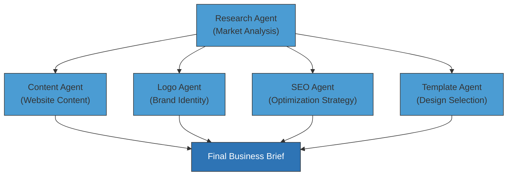
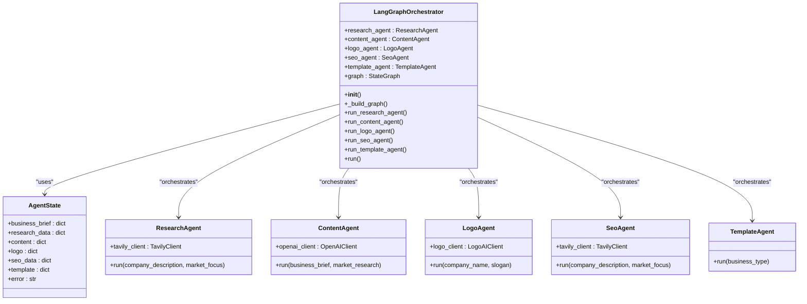
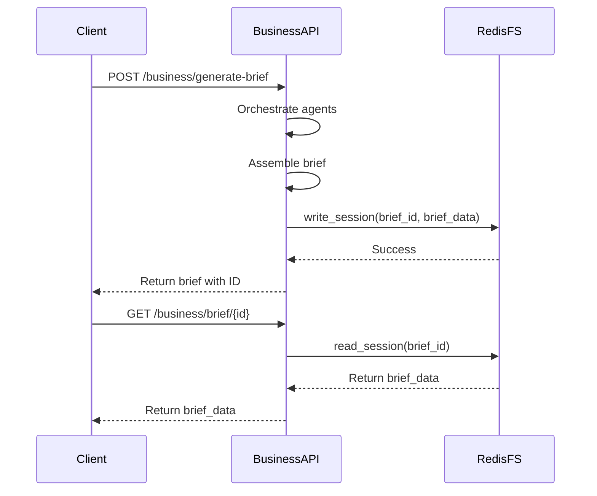
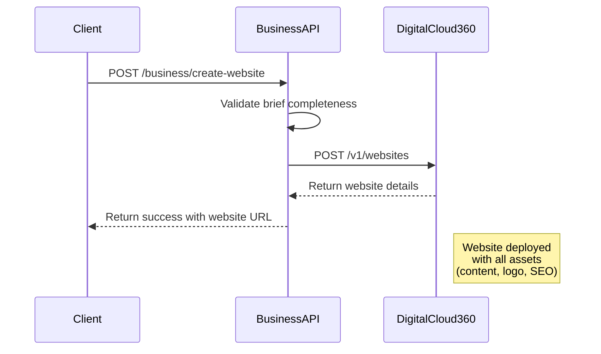

# Business Operations API

<cite>
**Referenced Files in This Document**   
- [business.py](file://app/api/v1/business.py)
- [business.py](file://app/models/business.py)
- [business.py](file://app/schemas/business.py)
- [langgraph_orchestrator.py](file://app/core/orchestration/langgraph_orchestrator.py)
- [redis_fs.py](file://app/core/integrations/redis_fs.py)
- [digitalcloud360.py](file://app/core/integrations/digitalcloud360.py)
- [responses.py](file://app/schemas/responses.py)
</cite>

## Table of Contents
1. [Introduction](#introduction)
2. [API Endpoints Overview](#api-endpoints-overview)
3. [Business Brief Generation Process](#business-brief-generation-process)
4. [Request and Response Schemas](#request-and-response-schemas)
5. [Agent Orchestration Architecture](#agent-orchestration-architecture)
6. [Data Storage and Retrieval](#data-storage-and-retrieval)
7. [Website Creation Integration](#website-creation-integration)
8. [Error Handling](#error-handling)
9. [Usage Examples](#usage-examples)

## Introduction
The Business Operations API provides a comprehensive suite of endpoints for generating business briefs using a multi-agent AI system and creating websites based on those briefs. The system leverages specialized AI agents for research, content generation, logo creation, SEO optimization, and template selection, orchestrated through a LangGraph-based workflow. Business briefs are stored in a Redis-based virtual file system, enabling persistent access and regeneration of specific sections. The API integrates with DigitalCloud360 to deploy fully functional websites from generated business briefs, creating an end-to-end solution for business creation and digital presence establishment.

## API Endpoints Overview
The Business Operations API provides several endpoints for managing business briefs and website creation:

- **POST /business/generate-brief**: Generates a comprehensive business brief using multiple AI agents
- **GET /business/brief/{id}**: Retrieves an existing business brief by ID
- **POST /business/regenerate-section**: Regenerates specific sections of an existing business brief
- **POST /business/create-website**: Creates a website on DigitalCloud360 from a business brief

These endpoints support a complete workflow from business concept to deployed website, with asynchronous processing capabilities for long-running operations.

**Section sources**
- [business.py](file://app/api/v1/business.py#L15-L270)

## Business Brief Generation Process
The business brief generation process leverages a multi-agent AI system orchestrated through LangGraph. When a client requests brief generation, the system initiates a coordinated workflow involving five specialized agents that work in parallel after an initial research phase.

The process begins with the Research Agent gathering market data, competitor analysis, and industry insights based on the business description and market focus provided in the request. This foundational research then informs the work of four parallel agents:

1. **Content Agent**: Generates website content including homepage, about, services, and contact pages based on the business brief and market research
2. **Logo Agent**: Creates a primary logo and alternative designs using the company name and slogan
3. **SEO Agent**: Develops a comprehensive SEO strategy including primary and secondary keywords, local SEO tactics, and optimized meta tags
4. **Template Agent**: Selects an appropriate website template based on the business type and provides customization recommendations

The orchestration follows a directed acyclic graph (DAG) pattern where the research phase serves as the entry point, and the four generation agents operate in parallel, all dependent on the research output but otherwise independent of each other. This parallel processing significantly reduces the overall processing time compared to a sequential approach.



**Diagram sources**
- [langgraph_orchestrator.py](file://app/core/orchestration/langgraph_orchestrator.py#L24-L107)

**Section sources**
- [langgraph_orchestrator.py](file://app/core/orchestration/langgraph_orchestrator.py#L24-L107)
- [business.py](file://app/api/v1/business.py#L15-L50)

## Request and Response Schemas
The API uses Pydantic models to define structured request and response formats, ensuring type safety and clear documentation.

### Request Schema
The `BusinessBriefRequest` model defines the structure for brief generation requests:

**BusinessBriefRequest**
- `coaching_session_id`: int - The ID of the coaching session associated with this brief
- `business_brief`: BusinessBrief - The core business information

**BusinessBrief**
- `business_name`: string - The name of the business
- `vision`: string - The entrepreneur's vision
- `mission`: string - The business mission
- `target_audience`: string - Description of the target customer
- `differentiation`: string - Business differentiation factors
- `value_proposition`: string - Value proposition
- `sector`: string - Industry sector
- `location`: object - Geographic location with city and country

### Response Schema
The `BusinessBriefResponse` model provides a comprehensive structure for the generated brief:

**BusinessBriefResponse**
- `id`: int - Database ID of the brief
- `coaching_session_id`: int - Associated coaching session ID
- `business_brief`: BusinessBrief - Original business information
- `market_research`: object - Market analysis results
- `content_generation`: object - Generated website content
- `logo_creation`: object - Logo design assets
- `seo_optimization`: object - SEO strategy and metadata
- `template_selection`: object - Selected website template
- `overall_confidence`: float - Quality score (0.0-1.0)
- `is_ready_for_website`: boolean - Flag indicating if brief is complete
- `created_at`: datetime - Timestamp of creation

The API also provides a `SubAgentResultsResponse` model for retrieving detailed results from individual agents, allowing clients to access granular information from each specialized agent.

**Section sources**
- [business.py](file://app/schemas/business.py#L17-L83)

## Agent Orchestration Architecture
The agent orchestration system is built on LangGraph, providing a robust framework for coordinating multiple AI agents in a reliable workflow. The architecture follows a state-based pattern where each agent contributes to a shared state object that accumulates results throughout the execution process.

The `LangGraphOrchestrator` class initializes instances of all five specialized agents (Research, Content, Logo, SEO, and Template) and constructs a directed graph that defines their execution order. The graph is built using `StateGraph` from LangGraph, with each agent represented as a node in the workflow.

The execution flow is designed for efficiency and reliability:
1. The workflow starts with the Research Agent as the entry point
2. Upon completion of research, four parallel branches are initiated for content, logo, SEO, and template generation
3. All branches converge to a common endpoint, completing the workflow
4. The final state contains results from all agents, forming the complete business brief

Each agent implementation follows a consistent pattern with error handling and logging. The agents integrate with external services:
- Research and SEO agents use Tavily API for market intelligence
- Logo agent uses LogoAI API for logo generation
- Content agent uses OpenAI for text generation
- Template agent uses internal logic for template selection



**Diagram sources**
- [langgraph_orchestrator.py](file://app/core/orchestration/langgraph_orchestrator.py#L15-L107)
- [research.py](file://app/core/agents/research.py#L14-L57)
- [content.py](file://app/core/agents/content.py#L14-L46)
- [logo.py](file://app/core/agents/logo.py#L14-L43)
- [seo.py](file://app/core/agents/seo.py#L14-L50)
- [template.py](file://app/core/agents/template.py#L20-L47)

**Section sources**
- [langgraph_orchestrator.py](file://app/core/orchestration/langgraph_orchestrator.py#L15-L107)

## Data Storage and Retrieval
Business briefs are stored and retrieved using a Redis-based virtual file system that provides persistent storage with automatic expiration. The `RedisVirtualFileSystem` class implements a simple key-value storage pattern where each brief is stored with a unique session ID.

The system uses Redis as a backend with the following key pattern: `session:{session_id}`. Each brief is stored as a JSON-serialized object with a default TTL (Time To Live) of 7200 seconds (2 hours), after which it will be automatically removed from the cache.

The storage system provides three primary operations:
- `write_session()`: Stores a brief with a specified session ID and optional TTL
- `read_session()`: Retrieves a brief by session ID, returning null if not found
- `list_user_sessions()`: Lists all sessions for a specific user (implementation simplified)

This storage approach enables several important features:
- Persistent access to generated briefs
- Support for brief regeneration and updates
- Efficient retrieval for website creation
- Automatic cleanup of stale data

The use of Redis provides low-latency access to brief data, which is critical for the responsive user experience, especially when retrieving large briefs with multiple agent results.



**Diagram sources**
- [redis_fs.py](file://app/core/integrations/redis_fs.py#L8-L59)
- [business.py](file://app/api/v1/business.py#L15-L270)

**Section sources**
- [redis_fs.py](file://app/core/integrations/redis_fs.py#L8-L59)

## Website Creation Integration
The API integrates with DigitalCloud360 to deploy websites directly from generated business briefs. The `DigitalCloud360APIClient` handles the service-to-service communication with robust error handling and retry logic.

The website creation process involves:
1. Validating that the brief contains all required components (content, logo, SEO, template)
2. Sending the complete brief data to the DigitalCloud360 API
3. Handling the response and returning the website URL to the client

The client implementation includes important reliability features:
- Configurable timeout (default: 30 seconds)
- Exponential backoff retry logic (default: 3 attempts)
- Comprehensive error logging with response details
- Health check endpoint for monitoring connectivity

The integration uses a secure authentication mechanism with a service secret passed in the `X-Service-Secret` header, ensuring that only authorized services can create websites through the API.



**Diagram sources**
- [digitalcloud360.py](file://app/core/integrations/digitalcloud360.py#L8-L82)
- [business.py](file://app/api/v1/business.py#L220-L270)

**Section sources**
- [digitalcloud360.py](file://app/core/integrations/digitalcloud360.py#L8-L82)

## Error Handling
The API implements comprehensive error handling to provide clear feedback for various failure scenarios:

**400 Bad Request**: Returned when the request body is malformed or missing required fields, such as when the `regenerate_sections` list is empty in a regeneration request.

**404 Not Found**: Returned when attempting to retrieve or modify a brief with a non-existent ID. This status is also used when the initial business brief data cannot be found during regeneration.

**422 Unprocessable Entity**: Returned when a brief is incomplete and cannot be used for website creation. This occurs when essential components like content, logo, SEO, or template are missing from the brief.

**500 Internal Server Error**: Returned for unexpected errors during processing, including:
- Agent execution failures
- Redis storage errors
- External API integration issues
- Orchestration workflow errors

Each error response follows the `ErrorResponse` schema defined in `responses.py`, providing a consistent structure with error code, message, details, and timestamp. The system logs detailed error information for debugging while returning user-friendly messages to clients.

**Section sources**
- [business.py](file://app/api/v1/business.py#L15-L270)
- [responses.py](file://app/schemas/responses.py#L20-L36)

## Usage Examples
The following examples demonstrate the complete workflow for generating a business brief and creating a website.

### JSON Example: Full Business Brief Structure
```json
{
  "brief_id": "brief_123e4567-e89b-12d3-a456-426614174000",
  "user_id": 42,
  "session_id": "session_87654321",
  "results": {
    "business_brief": {
      "business_name": "SahelTech Solutions",
      "vision": "To bridge the digital divide in West Africa",
      "mission": "Provide affordable technology solutions for SMEs",
      "target_audience": "Small and medium enterprises in Senegal",
      "differentiation": "Localized solutions with cultural understanding",
      "value_proposition": "Technology solutions that understand African markets",
      "sector": "Technology",
      "location": {
        "city": "Dakar",
        "country": "Senegal"
      }
    },
    "market_research": {
      "market_size": {
        "total_addressable": "500M",
        "growth_rate": "15%"
      },
      "competitors": [
        {
          "name": "AfriTech",
          "strengths": ["Established brand", "Wide reach"],
          "weaknesses": ["High prices", "Limited localization"]
        }
      ],
      "opportunities": [
        "Growing mobile penetration",
        "Government digital initiatives"
      ],
      "pricing": {
        "average_competitor_price": "$50/month",
        "recommended_price": "$35/month"
      },
      "cultural_insights": [
        "Preference for mobile-first solutions",
        "Importance of local language support"
      ]
    },
    "content_generation": {
      "homepage": {
        "headline": "Empowering African Businesses",
        "subheadline": "Affordable technology solutions for growth",
        "main_content": "SahelTech provides..."
      },
      "about": {
        "story": "Founded in 2025 to address...",
        "team": ["Alioune Diop - CEO", "Fatoumata Keita - CTO"]
      },
      "services": {
        "web_development": "Custom websites optimized for African markets",
        "digital_marketing": "Targeted campaigns for local audiences"
      },
      "contact": {
        "email": "info@saheltech.sn",
        "phone": "+221 77 123 4567",
        "address": "Avenue Cheikh Anta Diop, Dakar"
      },
      "seo_metadata": {
        "title": "SahelTech - Technology Solutions for African SMEs",
        "description": "Affordable web and digital marketing services for businesses in Senegal and West Africa"
      },
      "languages_generated": ["fr", "en"]
    },
    "logo_creation": {
      "primary_logo": {
        "url": "https://cdn.digitalcloud360.com/logos/primary.png",
        "format": "PNG",
        "dimensions": "500x300"
      },
      "alternatives": [
        {
          "url": "https://cdn.digitalcloud360.com/logos/alt1.png",
          "concept": "Abstract representation of connectivity"
        }
      ],
      "color_palette": ["#0066CC", "#FF6600", "#000000", "#FFFFFF"],
      "brand_guidelines": {
        "typography": "Use Open Sans for digital, Georgia for print",
        "logo_usage": "Always maintain 20px clear space around logo"
      }
    },
    "seo_optimization": {
      "primary_keywords": ["technology solutions Senegal", "SME digital transformation"],
      "secondary_keywords": ["affordable web development", "digital marketing Africa"],
      "local_seo_strategy": {
        "google_business": "Create and verify listing",
        "local_directories": ["Senegal Business Registry", "West Africa Tech Hub"]
      },
      "meta_tags": {
        "title": "SahelTech - Technology Solutions for African SMEs",
        "description": "Affordable web and digital marketing services for businesses in Senegal and West Africa",
        "keywords": "technology, Senegal, SME, digital transformation"
      }
    },
    "template_selection": {
      "primary_template": {
        "id": "business-corporate-v3",
        "name": "Professional Corporate",
        "preview_url": "https://templates.digitalcloud360.com/business-corporate-v3/preview"
      },
      "alternatives": [
        {
          "id": "startup-modern-v2",
          "name": "Modern Startup",
          "reason": "More vibrant design for younger audience"
        }
      ],
      "customizations": {
        "color_scheme": "Use primary brand colors",
        "font_pairing": "Open Sans for body, Montserrat for headings",
        "layout_adjustments": "Increase whitespace for mobile readability"
      }
    }
  },
  "overall_confidence": 0.92,
  "is_ready_for_website": true,
  "created_at": "2025-01-15T10:30:00Z",
  "updated_at": "2025-01-15T10:30:00Z"
}
```

### cURL Example: End-to-End Flow
```bash
# Step 1: Generate a business brief
curl -X POST "http://localhost:8000/business/generate-brief" \
  -H "Authorization: Bearer YOUR_TOKEN" \
  -H "Content-Type: application/json" \
  -d '{
    "coaching_session_id": 123,
    "business_brief": {
      "business_name": "SahelTech Solutions",
      "vision": "To bridge the digital divide in West Africa",
      "mission": "Provide affordable technology solutions for SMEs",
      "target_audience": "Small and medium enterprises in Senegal",
      "differentiation": "Localized solutions with cultural understanding",
      "value_proposition": "Technology solutions that understand African markets",
      "sector": "Technology",
      "location": {
        "city": "Dakar",
        "country": "Senegal"
      }
    }
  }'

# Response contains brief_id, e.g., "brief_123e4567-e89b-12d3-a456-426614174000"

# Step 2: Retrieve the generated brief
curl -X GET "http://localhost:8000/business/brief/brief_123e4567-e89b-12d3-a456-426614174000" \
  -H "Authorization: Bearer YOUR_TOKEN"

# Step 3: Regenerate the logo section if needed
curl -X POST "http://localhost:8000/business/brief/brief_123e4567-e89b-12d3-a456-426614174000/regenerate" \
  -H "Authorization: Bearer YOUR_TOKEN" \
  -H "Content-Type: application/json" \
  -d '{
    "regenerate_sections": ["logo"]
  }'

# Step 4: Create a website from the brief
curl -X POST "http://localhost:8000/business/create-website" \
  -H "Authorization: Bearer YOUR_TOKEN" \
  -H "Content-Type: application/json" \
  -d '{
    "brief_id": "brief_123e4567-e89b-12d3-a456-426614174000"
  }'
```

**Section sources**
- [business.py](file://app/api/v1/business.py#L15-L270)
- [business.py](file://app/schemas/business.py#L17-L83)