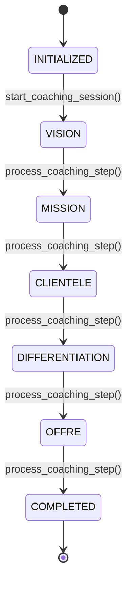
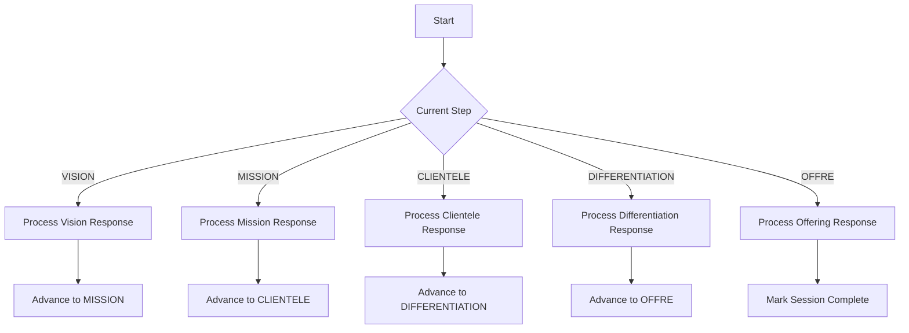
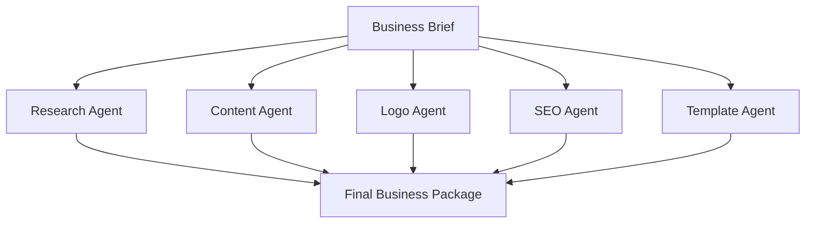
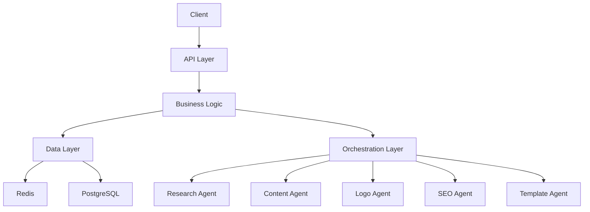
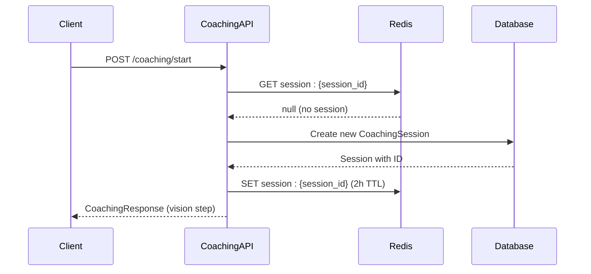
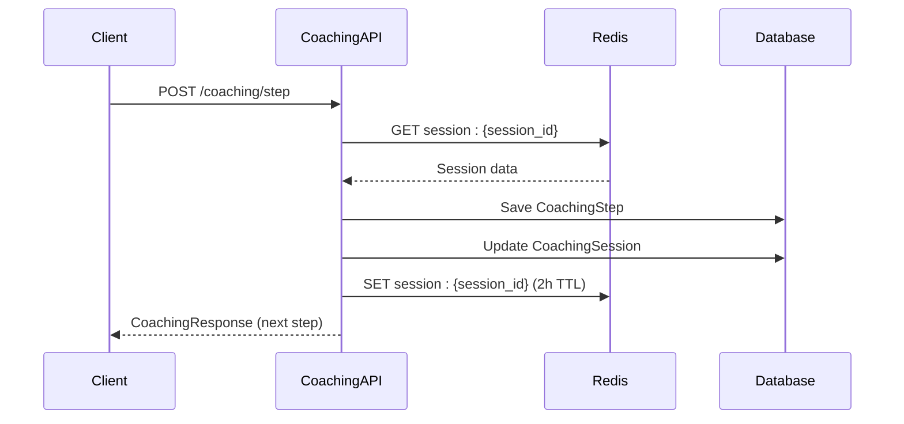

# Coaching Workflow API

<cite>
**Referenced Files in This Document**   
- [coaching.py](file://app/api/v1/coaching.py#L1-L328)
- [coaching.py](file://app/schemas/coaching.py#L1-L64)
- [coaching.py](file://app/models/coaching.py#L1-L122)
- [langgraph_orchestrator.py](file://app/core/orchestration/langgraph_orchestrator.py#L1-L108)
- [main.py](file://app/main.py#L1-L183)
- [test_coaching.py](file://tests/test_api/test_coaching.py#L1-L83)
</cite>

## Table of Contents
1. [Introduction](#introduction)
2. [Coaching Session Management](#coaching-session-management)
3. [Coaching Step Validation](#coaching-step-validation)
4. [Request and Response Structures](#request-and-response-structures)
5. [AI-Powered Guidance Integration](#ai-powered-guidance-integration)
6. [Error Handling](#error-handling)
7. [Session Persistence and Timeout](#session-persistence-and-timeout)
8. [API Usage Examples](#api-usage-examples)
9. [Architecture Overview](#architecture-overview)
10. [Sequence Diagrams](#sequence-diagrams)

## Introduction
The Coaching Workflow API provides a structured, stateful coaching experience for entrepreneurs building their businesses. The API manages coaching sessions through a series of well-defined steps, guiding users from vision definition to business completion. Each coaching session is stateful, maintaining progress across requests and providing AI-powered guidance at each step. The workflow is designed to collect essential business components including vision, mission, target audience, differentiation, and offering.

**Section sources**
- [coaching.py](file://app/api/v1/coaching.py#L1-L10)

## Coaching Session Management
The coaching workflow manages sessions through three primary endpoints: POST /coaching/start, POST /coaching/step, and POST /coaching/complete. Sessions are identified by a unique session_id and are associated with a specific user. When starting a new session, if no session_id is provided, a new UUID is generated. Existing sessions can be resumed by providing the session_id. Sessions maintain their state in both Redis (for fast access) and PostgreSQL (for persistence). The session state includes the current step, status, user ID, and session ID.



**Diagram sources**
- [coaching.py](file://app/api/v1/coaching.py#L15-L328)
- [coaching.py](file://app/models/coaching.py#L27-L56)

**Section sources**
- [coaching.py](file://app/api/v1/coaching.py#L15-L328)
- [coaching.py](file://app/models/coaching.py#L27-L56)

## Coaching Step Validation
The coaching workflow validates steps through a sequential progression mechanism. The valid coaching steps are defined in the CoachingStepEnum: vision, mission, clientele, differentiation, and offre. Each step must be completed in sequence, and the system validates the current step before processing user input. The validation ensures that users cannot skip steps or submit responses out of order. When a step is successfully processed, the session state advances to the next step, and the progress tracking is updated accordingly.



**Diagram sources**
- [coaching.py](file://app/api/v1/coaching.py#L150-L328)
- [coaching.py](file://app/schemas/coaching.py#L1-L36)

**Section sources**
- [coaching.py](file://app/api/v1/coaching.py#L150-L328)
- [coaching.py](file://app/schemas/coaching.py#L1-L36)

## Request and Response Structures
The coaching endpoints use well-defined request and response models. The POST /coaching/start endpoint accepts a CoachingRequest with an optional session_id. The POST /coaching/step endpoint requires a CoachingStepRequest with session_id and user_response. All coaching endpoints return a CoachingResponse containing session_id, current_step, coach_message, examples, next_questions, progress, and is_step_complete status. The response includes contextual guidance and examples specific to the current step.

### Coaching Request Models
```json
{
  "session_id": "string (optional)"
}
```

### Coaching Step Request Model
```json
{
  "session_id": "string (required)",
  "user_response": "string (required)"
}
```

### Coaching Response Model
```json
{
  "session_id": "string",
  "current_step": "string",
  "coach_message": "string",
  "examples": ["string"],
  "next_questions": ["string"],
  "progress": {
    "vision": false,
    "mission": false,
    "clientele": false,
    "differentiation": false,
    "offre": false
  },
  "confidence_score": 0,
  "is_step_complete": false
}
```

**Section sources**
- [coaching.py](file://app/schemas/coaching.py#L1-L64)
- [coaching.py](file://app/api/v1/coaching.py#L15-L328)

## AI-Powered Guidance Integration
The coaching workflow integrates with the LangGraphOrchestrator for AI-powered guidance. After the coaching session is complete, the collected business information is used to generate a comprehensive business brief. The LangGraphOrchestrator coordinates multiple specialized agents including ResearchAgent, ContentAgent, LogoAgent, SeoAgent, and TemplateAgent. These agents work in parallel to enrich the business brief with market research, content suggestions, logo concepts, SEO optimization, and template recommendations, providing a holistic startup foundation.



**Diagram sources**
- [langgraph_orchestrator.py](file://app/core/orchestration/langgraph_orchestrator.py#L1-L108)
- [coaching.py](file://app/models/coaching.py#L85-L122)

**Section sources**
- [langgraph_orchestrator.py](file://app/core/orchestration/langgraph_orchestrator.py#L1-L108)

## Error Handling
The coaching API implements comprehensive error handling for various scenarios. Invalid step sequences return 400 Bad Request. Unauthorized access to sessions returns 401 Unauthorized or 403 Forbidden. Missing or expired sessions return 404 Not Found. The error responses follow a consistent format with error codes, messages, and timestamps. The system validates session ownership, ensuring users can only access their own coaching sessions.

### Error Response Structure
```json
{
  "error": "ERROR_CODE",
  "message": "Descriptive error message",
  "timestamp": 1234567890.123
}
```

### Common Error Scenarios
- **400 Bad Request**: Invalid request body or malformed JSON
- **401 Unauthorized**: Missing or invalid authentication token
- **403 Forbidden**: User attempting to access another user's session
- **404 Not Found**: Session does not exist or has expired
- **500 Internal Server Error**: Unexpected server error

**Section sources**
- [coaching.py](file://app/api/v1/coaching.py#L15-L328)
- [main.py](file://app/main.py#L110-L159)
- [test_coaching.py](file://tests/test_api/test_coaching.py#L66-L78)

## Session Persistence and Timeout
Coaching sessions are persisted in both Redis and PostgreSQL databases. Redis serves as the primary session store with a 2-hour TTL (7200 seconds), providing fast access to session state. PostgreSQL serves as the persistent backup, storing session data for long-term retrieval. When a session is accessed, the system first checks Redis, and if not found, falls back to the database. This dual-storage approach ensures session continuity while maintaining performance. Sessions are automatically expired after 2 hours of inactivity.

**Section sources**
- [coaching.py](file://app/api/v1/coaching.py#L40-L50)
- [coaching.py](file://app/models/coaching.py#L27-L56)

## API Usage Examples
The following examples demonstrate the complete coaching workflow using curl commands.

### Start a New Coaching Session
```bash
curl -X POST "http://localhost:8000/api/v1/coaching/start" \
  -H "Authorization: Bearer <token>" \
  -H "Content-Type: application/json" \
  -d "{}"
```

### Submit Vision Step Response
```bash
curl -X POST "http://localhost:8000/api/v1/coaching/step" \
  -H "Authorization: Bearer <token>" \
  -H "Content-Type: application/json" \
  -d '{
    "session_id": "abc123",
    "user_response": "My vision is to create the best restaurant in Dakar"
  }'
```

### Submit Mission Step Response
```bash
curl -X POST "http://localhost:8000/api/v1/coaching/step" \
  -H "Authorization: Bearer <token>" \
  -H "Content-Type: application/json" \
  -d '{
    "session_id": "abc123",
    "user_response": "Our mission is to serve authentic local cuisine"
  }'
```

**Section sources**
- [coaching.py](file://app/api/v1/coaching.py#L15-L328)
- [test_coaching.py](file://tests/test_api/test_coaching.py#L41-L66)

## Architecture Overview
The coaching workflow follows a layered architecture with clear separation of concerns. The API layer handles HTTP requests and responses. The business logic layer manages coaching state and progression. The data layer persists session information in both Redis and PostgreSQL. The orchestration layer integrates with AI agents to provide enriched guidance. The system uses FastAPI for the web framework, SQLAlchemy for database operations, and LangGraph for agent orchestration.



**Diagram sources**
- [coaching.py](file://app/api/v1/coaching.py#L1-L328)
- [langgraph_orchestrator.py](file://app/core/orchestration/langgraph_orchestrator.py#L1-L108)
- [main.py](file://app/main.py#L1-L183)

**Section sources**
- [coaching.py](file://app/api/v1/coaching.py#L1-L328)
- [langgraph_orchestrator.py](file://app/core/orchestration/langgraph_orchestrator.py#L1-L108)

## Sequence Diagrams

### Coaching Session Start Sequence


**Diagram sources**
- [coaching.py](file://app/api/v1/coaching.py#L15-L80)

### Coaching Step Processing Sequence


**Diagram sources**
- [coaching.py](file://app/api/v1/coaching.py#L150-L328)