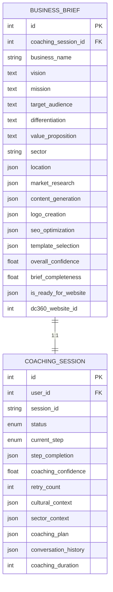
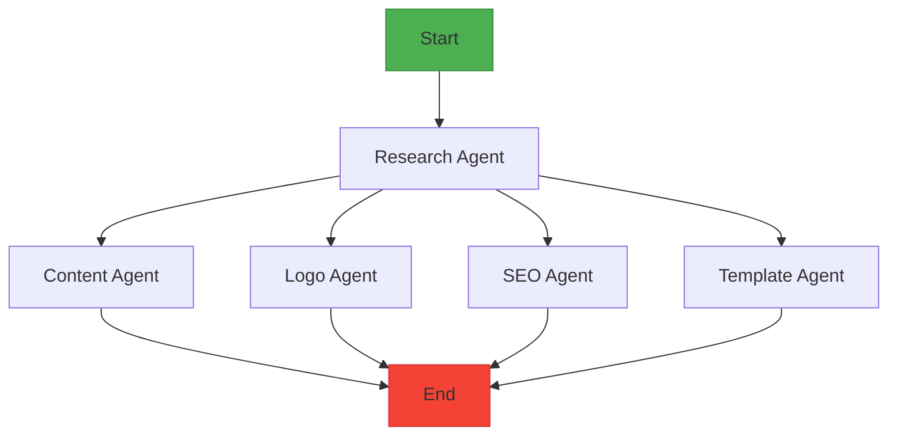
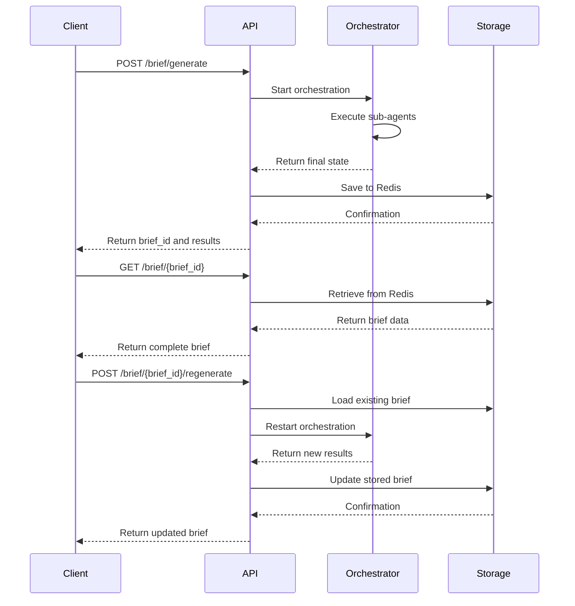
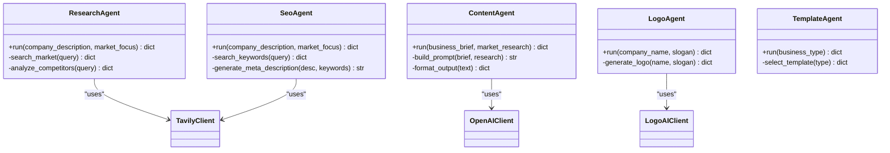

# Business Brief Data Model

<cite>
**Referenced Files in This Document**   
- [coaching.py](file://app/models/coaching.py#L85-L120)
- [business.py](file://app/schemas/business.py#L6-L15)
- [business.py](file://app/api/v1/business.py#L33-L270)
- [langgraph_orchestrator.py](file://app/core/orchestration/langgraph_orchestrator.py#L0-L107)
- [research.py](file://app/core/agents/research.py#L0-L57)
- [content.py](file://app/core/agents/content.py#L0-L83)
- [logo.py](file://app/core/agents/logo.py#L0-L43)
- [seo.py](file://app/core/agents/seo.py#L0-L55)
- [template.py](file://app/core/agents/template.py#L0-L59)
- [redis_fs.py](file://app/core/integrations/redis_fs.py)
</cite>

## Table of Contents
1. [Introduction](#introduction)
2. [Data Model Structure](#data-model-structure)
3. [Field Definitions and Constraints](#field-definitions-and-constraints)
4. [Relationships with Other Models](#relationships-with-other-models)
5. [Orchestration and Partial Results](#orchestration-and-partial-results)
6. [Regeneration of Specific Sections](#regeneration-of-specific-sections)
7. [Database and Storage Strategy](#database-and-storage-strategy)
8. [API Serialization and Response Patterns](#api-serialization-and-response-patterns)
9. [Sub-Agent Integration and Generated Assets](#sub-agent-integration-and-generated-assets)

## Introduction
The BusinessBrief entity represents a comprehensive business plan generated through an AI coaching process. It captures key business components such as vision, mission, target audience, value proposition, and market analysis. The model is central to the Genesis AI Service, serving as the output of a multi-agent orchestration system that generates digital assets including content, logo, SEO metadata, and website templates. This document provides a detailed analysis of the BusinessBrief data model, its relationships, constraints, and operational patterns.

**Section sources**
- [coaching.py](file://app/models/coaching.py#L85-L120)

## Data Model Structure
The BusinessBrief entity is implemented as a SQLAlchemy model with comprehensive fields capturing business strategy and generated digital assets. It follows a structured approach to store both core business information and results from specialized AI sub-agents.



**Diagram sources**
- [coaching.py](file://app/models/coaching.py#L85-L120)

**Section sources**
- [coaching.py](file://app/models/coaching.py#L85-L120)

## Field Definitions and Constraints
The BusinessBrief model contains comprehensive fields with specific data types, constraints, and validation rules implemented through both SQLAlchemy and Pydantic schemas.

### Core Business Fields
| Field | Data Type | Constraints | Description |
|------|---------|-----------|-------------|
| **business_name** | String | NOT NULL | Official name of the business |
| **vision** | Text | NOT NULL | Entrepreneur's long-term vision |
| **mission** | Text | NOT NULL | Business mission statement |
| **target_audience** | Text | NOT NULL | Description of target customer segment |
| **differentiation** | Text | NOT NULL | Unique value differentiating the business |
| **value_proposition** | Text | NOT NULL | Core value offered to customers |
| **sector** | String | NOT NULL | Industry or business sector |
| **location** | JSON | NULL | Geographic location with city and country |

### Sub-Agent Results Fields
| Field | Data Type | Constraints | Description |
|------|---------|-----------|-------------|
| **market_research** | JSON | NULL | Results from ResearchSubAgent |
| **content_generation** | JSON | NULL | Results from ContentSubAgent |
| **logo_creation** | JSON | NULL | Results from LogoSubAgent |
| **seo_optimization** | JSON | NULL | Results from SEOSubAgent |
| **template_selection** | JSON | NULL | Results from TemplateSubAgent |

### Quality and Status Metrics
| Field | Data Type | Constraints | Description |
|------|---------|-----------|-------------|
| **overall_confidence** | Float | DEFAULT 0.0 | Confidence score of the generated brief |
| **brief_completeness** | Float | DEFAULT 0.0 | Percentage completeness of the brief |
| **is_ready_for_website** | JSON | DEFAULT False | Boolean indicating website readiness |
| **dc360_website_id** | Integer | NULL | ID of website created in DigitalCloud360 |

The Pydantic schema enforces validation rules and provides clear field descriptions for API consumers:

```python
class BusinessBrief(BaseModel):
    business_name: str = Field(..., description="Nom business")
    vision: str = Field(..., description="Vision entrepreneur")
    mission: str = Field(..., description="Mission business")
    target_audience: str = Field(..., description="Clientèle cible")
    differentiation: str = Field(..., description="Différenciation")
    value_proposition: str = Field(..., description="Proposition valeur")
    sector: str = Field(..., description="Secteur activité")
    location: Dict[str, str] = Field(..., description="Localisation")
```

**Section sources**
- [coaching.py](file://app/models/coaching.py#L85-L120)
- [business.py](file://app/schemas/business.py#L6-L15)

## Relationships with Other Models
The BusinessBrief entity maintains a direct relationship with the CoachingSession model, forming the foundation of the coaching workflow.

### CoachingSession Relationship
The BusinessBrief has a one-to-one relationship with CoachingSession, established through a foreign key constraint:

```python
# In BusinessBrief model
coaching_session_id = Column(Integer, ForeignKey("coaching_sessions.id"), nullable=False)
coaching_session = relationship("CoachingSession", back_populates="business_brief")
```

```python
# In CoachingSession model
business_brief = relationship("BusinessBrief", back_populates="coaching_session", uselist=False)
```

This relationship enables:
- Traceability from brief to coaching session
- Access to coaching context and conversation history
- Progress tracking through the coaching workflow
- User identification through the coaching session's user relationship

The relationship is designed as a 1:1 mapping, ensuring each coaching session produces exactly one business brief.

**Section sources**
- [coaching.py](file://app/models/coaching.py#L85-L120)

## Orchestration and Partial Results
The BusinessBrief model supports long-running brief generation through an orchestration system that stores partial results during processing.

### Orchestration Workflow
The LangGraphOrchestrator coordinates multiple sub-agents in a parallel execution pattern:



**Diagram sources**
- [langgraph_orchestrator.py](file://app/core/orchestration/langgraph_orchestrator.py#L0-L107)

### State Management
The orchestration system uses a stateful approach to track progress:

```python
class AgentState(TypedDict):
    business_brief: dict
    research_data: dict
    content: dict
    logo: dict
    seo_data: dict
    template: dict
    error: str = None
```

During execution, partial results are stored in the BusinessBrief's JSON fields:
- **market_research**: Populated by ResearchAgent
- **content_generation**: Populated by ContentAgent  
- **logo_creation**: Populated by LogoAgent
- **seo_optimization**: Populated by SeoAgent
- **template_selection**: Populated by TemplateAgent

The `overall_confidence` and `brief_completeness` fields provide quantitative metrics for progress tracking.

**Section sources**
- [langgraph_orchestrator.py](file://app/core/orchestration/langgraph_orchestrator.py#L0-L107)

## Regeneration of Specific Sections
The system supports regeneration of specific brief sections without affecting other components, enabling iterative refinement.

### Regeneration Process
When a user requests regeneration of specific sections:

1. The existing brief is retrieved from Redis storage
2. The orchestration process is restarted with original input data
3. All sub-agents execute, generating fresh results
4. The entire results object is replaced with new output

```python
@router.post("/brief/{brief_id}/regenerate", response_model=BusinessBriefResponse)
async def regenerate_business_brief(
    brief_id: str,
    request: dict,
    current_user: dict = Depends(get_current_user),
    orchestrator: LangGraphOrchestrator = Depends(get_orchestrator),
    redis_fs: RedisVirtualFileSystem = Depends(get_redis_vfs)
):
    # 1. Load existing brief
    existing_brief = await redis_fs.read_session(current_user.id, brief_id)
    
    # 2. Prepare data for regeneration
    regeneration_data = existing_brief.get("results", {}).get("business_brief_request", {})
    
    # 3. Execute orchestrator
    final_state = await orchestrator.run(regeneration_data)
    
    # 4. Update brief with new results
    existing_brief["results"] = final_state
    existing_brief["updated_at"] = datetime.utcnow().isoformat()
    
    # 5. Save updated brief
    await redis_fs.write_session(current_user.id, brief_id, existing_brief)
```

This approach ensures consistency across related components while allowing users to refine specific aspects of their business brief.

**Section sources**
- [business.py](file://app/api/v1/business.py#L136-L194)

## Database and Storage Strategy
The BusinessBrief entity employs a hybrid storage strategy combining relational database storage with Redis-based session persistence.

### Relational Database Schema
The core BusinessBrief model is stored in PostgreSQL with the following schema:

```sql
CREATE TABLE business_briefs (
    id SERIAL PRIMARY KEY,
    coaching_session_id INTEGER NOT NULL REFERENCES coaching_sessions(id),
    business_name VARCHAR NOT NULL,
    vision TEXT NOT NULL,
    mission TEXT NOT NULL,
    target_audience TEXT NOT NULL,
    differentiation TEXT NOT NULL,
    value_proposition TEXT NOT NULL,
    sector VARCHAR NOT NULL,
    location JSON,
    market_research JSON,
    content_generation JSON,
    logo_creation JSON,
    seo_optimization JSON,
    template_selection JSON,
    overall_confidence FLOAT DEFAULT 0.0,
    brief_completeness FLOAT DEFAULT 0.0,
    is_ready_for_website JSON DEFAULT 'false',
    dc360_website_id INTEGER,
    created_at TIMESTAMP DEFAULT NOW(),
    updated_at TIMESTAMP DEFAULT NOW()
);
```

### Redis Virtual File System
For performance and scalability, complete briefs are stored in Redis using a virtual file system:

```python
# Storage format in Redis
{
    "brief_id": "brief_12345",
    "user_id": 1,
    "session_id": "session_67890",
    "results": {
        "business_brief": { /* core business data */ },
        "research_data": { /* market research results */ },
        "content": { /* generated content */ },
        "logo": { /* logo creation results */ },
        "seo_data": { /* SEO optimization results */ },
        "template": { /* template selection results */ }
    },
    "created_at": "2024-01-15T10:30:00Z",
    "updated_at": "2024-01-15T10:30:00Z"
}
```

This hybrid approach provides:
- ACID compliance for core relationships via PostgreSQL
- High-performance access to complete briefs via Redis
- Scalable storage for large JSON payloads
- Session-based access control

**Section sources**
- [coaching.py](file://app/models/coaching.py#L85-L120)
- [business.py](file://app/api/v1/business.py#L33-L72)
- [redis_fs.py](file://app/core/integrations/redis_fs.py)

## API Serialization and Response Patterns
The BusinessBrief model is exposed through API endpoints with specialized response schemas that optimize data presentation.

### Response Schema Structure
The BusinessBriefResponse schema provides a comprehensive view of the brief:

```python
class BusinessBriefResponse(BaseModel):
    id: int
    coaching_session_id: int
    business_brief: BusinessBrief
    market_research: Optional[Dict[str, Any]] = None
    content_generation: Optional[Dict[str, Any]] = None
    logo_creation: Optional[Dict[str, Any]] = None
    seo_optimization: Optional[Dict[str, Any]] = None
    template_selection: Optional[Dict[str, Any]] = None
    overall_confidence: float
    is_ready_for_website: bool
    created_at: datetime
    
    class Config:
        from_attributes = True
```

### API Endpoints
The system exposes the following endpoints for BusinessBrief management:



**Diagram sources**
- [business.py](file://app/api/v1/business.py#L33-L270)

**Section sources**
- [business.py](file://app/api/v1/business.py#L33-L270)
- [business.py](file://app/schemas/business.py#L17-L35)

## Sub-Agent Integration and Generated Assets
The BusinessBrief model integrates results from specialized AI sub-agents that generate specific digital assets.

### Sub-Agent Architecture
Five specialized agents contribute to the BusinessBrief:



**Diagram sources**
- [research.py](file://app/core/agents/research.py#L0-L57)
- [content.py](file://app/core/agents/content.py#L0-L83)
- [logo.py](file://app/core/agents/logo.py#L0-L43)
- [seo.py](file://app/core/agents/seo.py#L0-L55)
- [template.py](file://app/core/agents/template.py#L0-L59)

### Agent-Specific Output
Each sub-agent populates specific fields in the BusinessBrief:

#### Research Agent
Generates market analysis and competitor insights:
```json
{
  "market_research": {
    "market_size": {"value": "1.2B", "unit": "USD", "region": "West Africa"},
    "competitors": [
      {"name": "Competitor A", "strengths": ["Brand recognition", "Distribution network"], "weaknesses": ["Limited digital presence"]}
    ],
    "opportunities": ["Growing middle class", "Increased internet penetration"],
    "pricing": {"average": 49.99, "range": [29.99, 99.99]},
    "cultural_insights": ["Preference for locally-made products", "Importance of community recommendations"]
  }
}
```

#### Content Agent
Generates website content in multiple languages:
```json
{
  "content_generation": {
    "homepage": {"title": "Welcome", "subtitle": "Innovative African Fashion", "body": "Discover our collection..."},
    "about": {"title": "About Us", "body": "We are passionate about..."},
    "services": {"title": "Our Services", "items": ["E-commerce platform", "Custom designs"]},
    "contact": {"title": "Contact Us", "cta": "Get in touch today"},
    "seo_metadata": {"title": "AfroChic - African Fashion", "description": "Premium African fashion brand"},
    "languages_generated": ["fr", "en", "pt"]
  }
}
```

#### Logo Agent
Creates visual identity assets:
```json
{
  "logo_creation": {
    "primary_logo": {"url": "https://cdn.example.com/logo.png", "format": "PNG", "colors": ["#FF6B35", "#2E294E"]},
    "alternatives": [
      {"url": "https://cdn.example.com/logo_v2.png", "concept": "Minimalist"},
      {"url": "https://cdn.example.com/logo_v3.png", "concept": "Traditional motifs"}
    ],
    "color_palette": ["#FF6B35", "#2E294E", "#F1C40F", "#ECF0F1"],
    "brand_guidelines": {"font": "Montserrat", "usage_rules": "Always use on light background"}
  }
}
```

#### SEO Agent
Optimizes for search engines:
```json
{
  "seo_optimization": {
    "primary_keywords": ["african fashion", "sustainable clothing", "afrochic"],
    "secondary_keywords": ["eco-friendly textiles", "ethical production", "cultural heritage"],
    "local_seo_strategy": {"target_cities": ["Dakar", "Abidjan", "Lagos"], "local_directories": ["Yellow Pages Africa"]},
    "meta_tags": {
      "title": "AfroChic | Sustainable African Fashion",
      "description": "Discover premium sustainable African fashion with AfroChic.",
      "keywords": "african fashion, sustainable clothing, afrochic"
    }
  }
}
```

#### Template Agent
Selects appropriate website templates:
```json
{
  "template_selection": {
    "primary_template": {"id": "ecommerce_sleek_03", "name": "Sleek E-commerce", "preview_url": "https://preview.example.com/template3"},
    "alternatives": [
      {"id": "modern_business_01", "name": "Modern Business", "reason": "More corporate style"},
      {"id": "creative_portfolio_02", "name": "Creative Portfolio", "reason": "Better for showcasing designs"}
    ],
    "customizations": {"color_scheme": "custom", "font_pairing": "custom", "layout_modifications": ["larger product images"]}
  }
}
```

This comprehensive integration of specialized agents enables the creation of a rich, multi-faceted business brief that addresses both strategic and operational aspects of business development.

**Section sources**
- [research.py](file://app/core/agents/research.py#L0-L57)
- [content.py](file://app/core/agents/content.py#L0-L83)
- [logo.py](file://app/core/agents/logo.py#L0-L43)
- [seo.py](file://app/core/agents/seo.py#L0-L55)
- [template.py](file://app/core/agents/template.py#L0-L59)
- [langgraph_orchestrator.py](file://app/core/orchestration/langgraph_orchestrator.py#L0-L107)