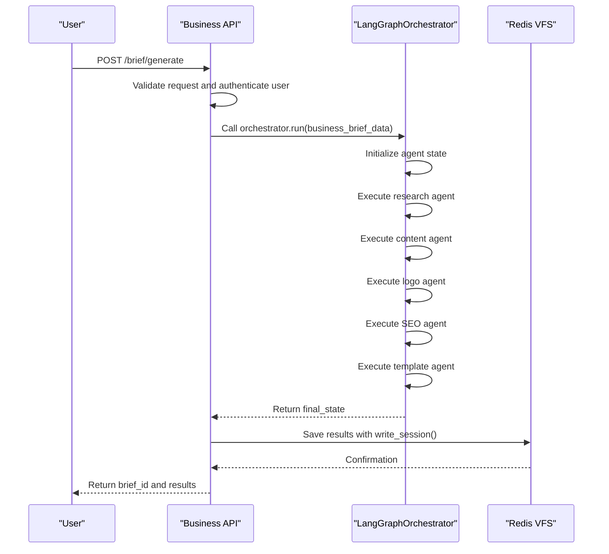
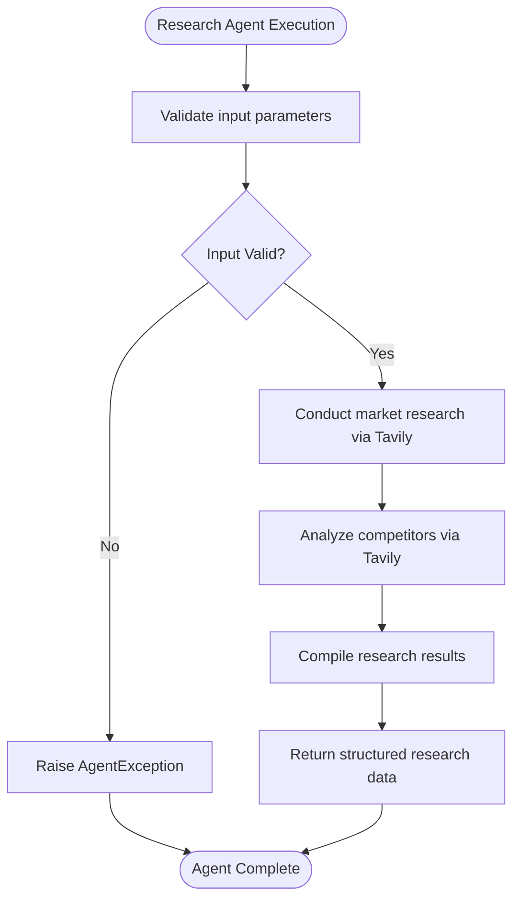
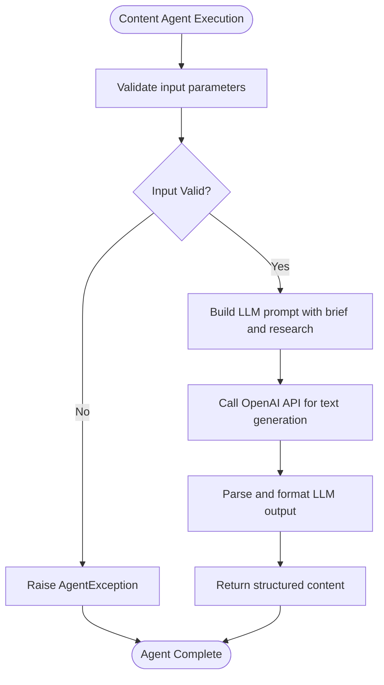
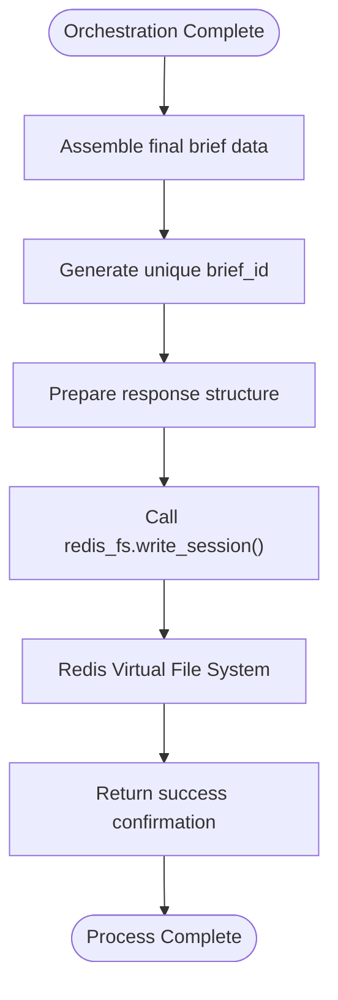

# Business Brief Generation

<cite>
**Referenced Files in This Document**   
- [business.py](file://app/api/v1/business.py#L1-L271)
- [langgraph_orchestrator.py](file://app/core/orchestration/langgraph_orchestrator.py#L1-L108)
- [research.py](file://app/core/agents/research.py#L1-L58)
- [content.py](file://app/core/agents/content.py#L1-L84)
- [redis_fs.py](file://app/core/integrations/redis_fs.py)
</cite>

## Table of Contents
1. [Business Brief Generation Process](#business-brief-generation-process)
2. [API Endpoint and Orchestration Interaction](#api-endpoint-and-orchestration-interaction)
3. [Agent Roles in Brief Generation](#agent-roles-in-brief-generation)
4. [Result Compilation and Storage](#result-compilation-and-storage)
5. [Error Handling and Recovery](#error-handling-and-recovery)
6. [Performance and Caching Strategies](#performance-and-caching-strategies)

## Business Brief Generation Process

The business brief generation process transforms user inputs from the coaching workflow into a comprehensive business brief through a multi-agent orchestration system. The process begins when a user completes a coaching session, providing key information about their business vision, target audience, market focus, and other parameters. This data is then used to generate a detailed business brief that includes market research, content generation, logo creation, SEO optimization, and template selection.

The system follows a structured workflow:
1. User inputs are collected through the coaching workflow
2. The business brief generation endpoint is triggered
3. The LangGraphOrchestrator coordinates multiple specialized agents
4. Each agent generates its component of the brief
5. Results are compiled and stored
6. The complete brief is made available for retrieval or website creation

This process enables entrepreneurs to transform their business ideas into fully developed digital presences with minimal manual effort.

## API Endpoint and Orchestration Interaction

The business brief generation process is initiated through the API endpoint at `/api/v1/business/brief/generate`. This endpoint serves as the entry point for transforming coaching workflow data into a comprehensive business brief.



**Diagram sources**
- [business.py](file://app/api/v1/business.py#L1-L271)
- [langgraph_orchestrator.py](file://app/core/orchestration/langgraph_orchestrator.py#L1-L108)

**Section sources**
- [business.py](file://app/api/v1/business.py#L1-L271)
- [langgraph_orchestrator.py](file://app/core/orchestration/langgraph_orchestrator.py#L1-L108)

The interaction between the Business API endpoint and the LangGraphOrchestrator follows these steps:

1. **Input Preparation**: When a POST request is made to `/api/v1/business/brief/generate`, the API endpoint receives a `BusinessBriefRequest` containing the coaching session ID and business brief data. The request is authenticated using the `get_current_user` dependency.

2. **Orchestration Initiation**: The endpoint calls the `run` method of the `LangGraphOrchestrator` with the business brief data. This method initializes the orchestration process by creating an initial state containing the business brief.

3. **Result Aggregation**: After the orchestrator completes its execution, the API endpoint assembles the final response, generates a unique brief ID, and saves the complete results to the Redis Virtual File System using `write_session()`.

4. **Response Delivery**: The endpoint returns the complete business brief data, including the brief ID, user ID, session ID, and all generated results from the sub-agents.

The API also provides endpoints for retrieving existing briefs (`GET /brief/{brief_id}`), accessing sub-agent results (`GET /brief/{brief_id}/results`), regenerating specific sections (`POST /brief/{brief_id}/regenerate`), and creating websites from briefs (`POST /website/create`).

## Agent Roles in Brief Generation

The business brief generation process employs a multi-agent system where each specialized agent is responsible for generating a specific component of the brief. The LangGraphOrchestrator coordinates these agents to ensure a comprehensive and cohesive output.

### ResearchAgent

The ResearchAgent is responsible for conducting market research and competitor analysis. It uses the Tavily API to gather information about the target market and competitive landscape.



**Diagram sources**
- [research.py](file://app/core/agents/research.py#L1-L58)

**Section sources**
- [research.py](file://app/core/agents/research.py#L1-L58)

The ResearchAgent takes two primary inputs: `company_description` and `market_focus`. It performs two main tasks:
- General market research by querying "Analysis of the market for {market_focus} in Africa"
- Competitor analysis by identifying main competitors for the specified market focus

The agent returns a dictionary containing both market research findings and competitor analysis results, which are then used by other agents in the process.

### ContentAgent

The ContentAgent generates textual content for the business website based on the business brief and market research results.



**Diagram sources**
- [content.py](file://app/core/agents/content.py#L1-L84)

**Section sources**
- [content.py](file://app/core/agents/content.py#L1-L84)

The ContentAgent workflow includes:
1. Building a detailed prompt that incorporates the business name, description, services, target audience, tone of voice, market research, and competitor analysis
2. Generating text using the OpenAI API with specific parameters (1500 max tokens, 0.7 temperature)
3. Formatting the output into a structured dictionary, attempting to parse JSON output from the LLM

The agent is designed to create content for key website pages including the homepage, services page, and contact page.

### Other Sub-Agents

While the codebase shows implementations for ResearchAgent and ContentAgent, the LangGraphOrchestrator references three additional agents:

- **LogoAgent**: Responsible for creating a visual identity and logo for the business
- **SeoAgent**: Handles search engine optimization aspects including keyword research and metadata
- **TemplateAgent**: Selects an appropriate website template based on the business type

These agents follow a similar pattern to the ResearchAgent and ContentAgent, each specializing in their respective domain and contributing to the comprehensive business brief.

## Result Compilation and Storage

The system compiles and stores business brief results through a coordinated process between the API endpoint and the Redis Virtual File System.

When the business brief generation is complete, the API endpoint assembles the final response with the following structure:
- **brief_id**: A unique identifier generated using UUID
- **user_id**: The authenticated user's ID
- **session_id**: The coaching session ID from the input
- **results**: The complete output from the LangGraphOrchestrator

The results are stored using the RedisVirtualFileSystem's `write_session` method, which persists the brief data with a key pattern of `{user_id}:{brief_id}`. This storage approach enables efficient retrieval and management of business briefs.

The storage process follows this flow:



**Diagram sources**
- [business.py](file://app/api/v1/business.py#L1-L271)
- [redis_fs.py](file://app/core/integrations/redis_fs.py)

**Section sources**
- [business.py](file://app/api/v1/business.py#L1-L271)

Users can retrieve their stored briefs using the `GET /brief/{brief_id}` endpoint, which calls `redis_fs.read_session()` to fetch the data. The system also provides a dedicated endpoint `GET /brief/{brief_id}/results` to access only the sub-agent results without metadata.

## Error Handling and Recovery

The business brief generation system implements comprehensive error handling at multiple levels to ensure reliability and provide meaningful feedback when issues occur.

### Orchestration-Level Error Handling

The LangGraphOrchestrator implements try-except blocks around its core `run` method:

```python
async def run(self, business_brief: dict):
    """Exécute le graphe d'orchestration."""
    logger.info("Starting LangGraph orchestration...", initial_brief=business_brief)
    try:
        initial_state = {"business_brief": business_brief}
        final_state = await self.graph.ainvoke(initial_state)
        logger.info("LangGraph orchestration completed successfully.")
        return final_state
    except Exception as e:
        logger.error("Error during LangGraph orchestration", error=str(e))
        raise OrchestratorException(
            "ORCHESTRATION_ERROR",
            "Failed to execute the agentic workflow.",
            details=str(e)
        )
```

When an error occurs during orchestration, the system:
1. Logs the error with detailed context
2. Raises a custom `OrchestratorException` with a standardized error code, message, and details
3. Propagates the error to the API endpoint

### API-Level Error Handling

The API endpoint further handles errors by converting them to appropriate HTTP responses:

```python
except Exception as e:
    logger.error("Failed to generate business brief", error=str(e))
    raise HTTPException(
        status_code=status.HTTP_500_INTERNAL_SERVER_ERROR,
        detail=f"Failed to generate business brief: {str(e)}"
    )
```

The system implements specific error handling for different scenarios:
- **Brief not found**: Returns 404 Not Found when attempting to retrieve a non-existent brief
- **Invalid regeneration request**: Returns 400 Bad Request if the regenerate sections list is empty
- **Incomplete brief for website creation**: Returns 422 Unprocessable Entity if required components are missing

### Partial Result Recovery

The system supports partial regeneration of brief sections through the `regenerate_business_brief` endpoint. When a user requests regeneration of specific sections:

1. The system loads the existing brief from Redis
2. It extracts the initial business brief data needed for regeneration
3. It runs the full orchestration process with the original data
4. It updates the existing brief with the new results
5. It saves the updated brief back to Redis

This approach allows users to refine specific aspects of their business brief without losing work on other sections. However, the current implementation does not selectively regenerate only the requested sections but rather re-runs the complete orchestration, which could be optimized in future versions.

## Performance and Caching Strategies

The business brief generation system employs several strategies to manage performance, particularly important for long-running processes that involve multiple external API calls.

### Result Caching

The primary caching mechanism is the Redis Virtual File System, which serves as a persistent storage layer for generated business briefs. This approach provides several performance benefits:

- **Avoids redundant processing**: Once a brief is generated, it can be retrieved instantly without re-executing the orchestration process
- **Supports partial regeneration**: Users can modify specific sections while preserving previously generated content
- **Enables progress tracking**: The system can check the status of brief generation and resume if needed

The caching strategy follows these principles:
- All generated briefs are automatically cached upon completion
- Cache keys are structured as `{user_id}:{brief_id}` for efficient retrieval
- Cached results include all sub-agent outputs and metadata
- Cache persistence ensures results are available across application restarts

### Progress Tracking

While the current implementation does not include explicit progress tracking during the orchestration process, the system provides indirect progress indicators through:

1. **Status endpoints**: The coaching session model includes a `SessionStatusEnum` with states like "SUB_AGENTS_RUNNING" and "BRIEF_READY"
2. **Result availability**: Users can attempt to retrieve their brief, with a 404 response indicating the process is still running
3. **Logging**: Comprehensive logging at each stage of the process provides operational visibility

### Performance Considerations

The system architecture incorporates several performance optimizations:

- **Parallel execution**: The LangGraphOrchestrator executes the content, logo, SEO, and template agents in parallel after the research agent completes, reducing overall processing time
- **Asynchronous operations**: All agent operations and API calls are implemented asynchronously to maximize resource utilization
- **External API integration**: The system integrates with specialized external services (Tavily for research, OpenAI for content) rather than implementing these capabilities internally

The current implementation could be enhanced with additional performance features such as:
- Real-time progress updates via WebSockets or server-sent events
- Timeouts and cancellation support for long-running processes
- Rate limiting and queuing for high-volume scenarios
- More granular caching that allows retrieval of individual agent results without loading the complete brief

These strategies ensure that the business brief generation process is both efficient and resilient, providing users with timely access to their generated content while maintaining system stability.