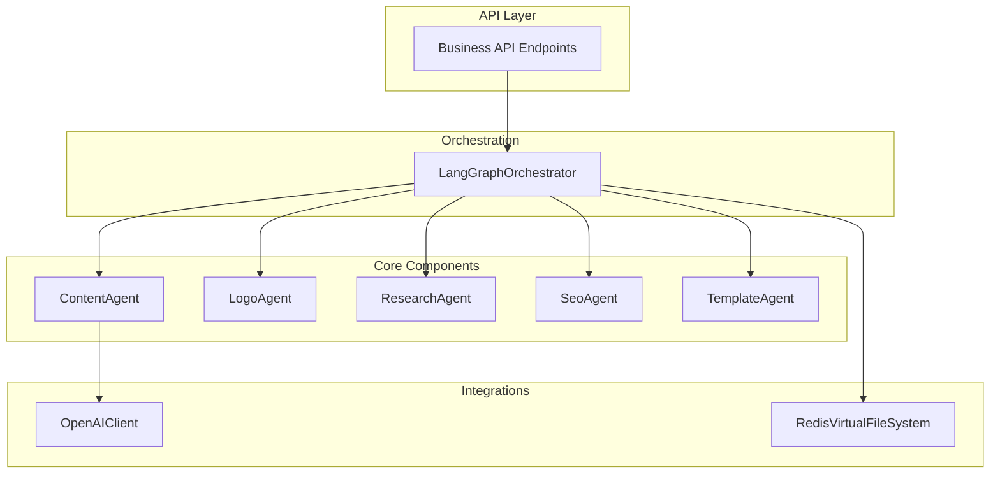
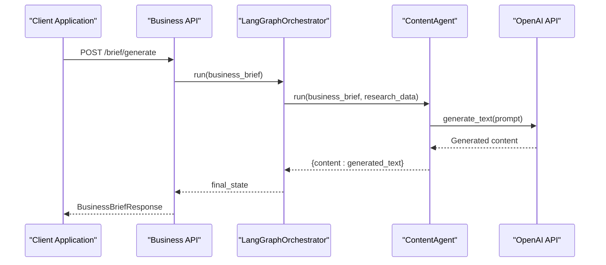
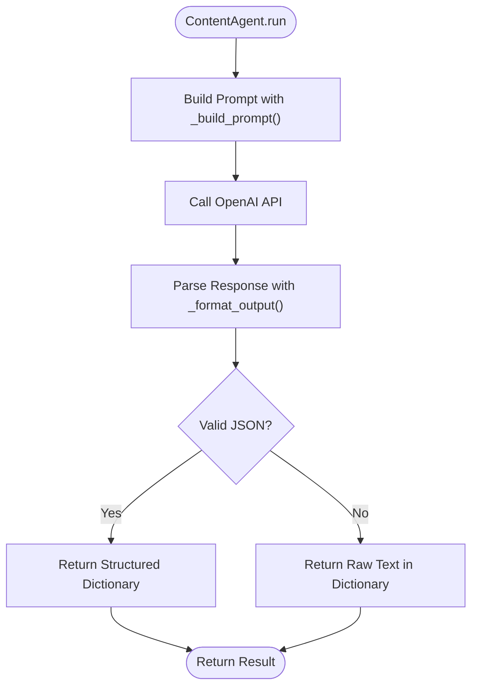
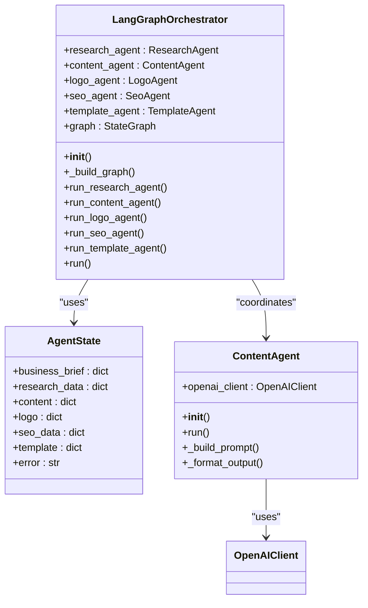
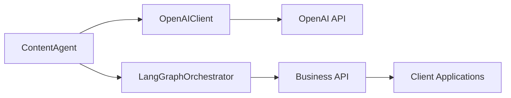

# Content Agent

<cite>
**Referenced Files in This Document**   
- [content.py](file://app/core/agents/content.py)
- [langgraph_orchestrator.py](file://app/core/orchestration/langgraph_orchestrator.py)
- [openai.py](file://app/core/integrations/openai.py)
- [business.py](file://app/api/v1/business.py)
- [business.py](file://app/schemas/business.py)
</cite>

## Table of Contents
1. [Introduction](#introduction)
2. [Project Structure](#project-structure)
3. [Core Components](#core-components)
4. [Architecture Overview](#architecture-overview)
5. [Detailed Component Analysis](#detailed-component-analysis)
6. [Dependency Analysis](#dependency-analysis)
7. [Performance Considerations](#performance-considerations)
8. [Troubleshooting Guide](#troubleshooting-guide)
9. [Conclusion](#conclusion)

## Introduction
The Content Agent is a specialized component within the Genesis AI Service responsible for generating tailored website content for African startups. It leverages the OpenAI API to produce business descriptions, value propositions, and service offerings based on coaching session data and market research results. The agent operates as part of a larger orchestration system that coordinates multiple specialized agents to create a comprehensive business brief. This document provides a detailed analysis of the Content Agent's implementation, its integration with the LangGraphOrchestrator, prompt engineering techniques, and how generated content is mapped to business models and exposed through API endpoints.

## Project Structure
The project follows a modular structure with clear separation of concerns. The core functionality is organized into distinct directories:
- **app/core/agents**: Contains specialized agents including the ContentAgent
- **app/core/orchestration**: Houses the LangGraphOrchestrator that coordinates agent workflows
- **app/core/integrations**: Includes integration clients like OpenAIClient
- **app/api/v1**: Contains API endpoints for business operations
- **app/schemas**: Defines Pydantic models for data validation and serialization

The Content Agent is located at `app/core/agents/content.py` and is designed to work within this ecosystem, receiving input from coaching sessions and research data to generate compelling website content.



**Diagram sources**
- [content.py](file://app/core/agents/content.py)
- [langgraph_orchestrator.py](file://app/core/orchestration/langgraph_orchestrator.py)
- [openai.py](file://app/core/integrations/openai.py)
- [business.py](file://app/api/v1/business.py)

**Section sources**
- [content.py](file://app/core/agents/content.py)
- [langgraph_orchestrator.py](file://app/core/orchestration/langgraph_orchestrator.py)

## Core Components
The Content Agent system consists of several interconnected components that work together to generate business content. The primary components include the ContentAgent class, the LangGraphOrchestrator, the OpenAIClient, and the business API endpoints. These components form a pipeline where coaching session data is transformed into structured website content through AI-powered generation.

The ContentAgent receives business brief information and market research data, constructs a detailed prompt for the language model, and processes the generated output into a structured format. It operates as one of several specialized agents coordinated by the LangGraphOrchestrator, which manages the overall workflow and state transitions between different content generation tasks.

**Section sources**
- [content.py](file://app/core/agents/content.py#L1-L83)
- [langgraph_orchestrator.py](file://app/core/orchestration/langgraph_orchestrator.py#L1-L107)

## Architecture Overview
The Content Agent operates within a sophisticated architecture that leverages LangGraph for workflow orchestration and OpenAI for content generation. The system follows a multi-agent pattern where specialized agents handle different aspects of business brief creation, with the Content Agent focusing specifically on textual content generation.

The architecture features a clear separation between orchestration logic, agent implementation, and external integrations. The LangGraphOrchestrator manages the execution flow, coordinating parallel execution of research, content, logo, SEO, and template agents. Each agent specializes in a particular domain, with the Content Agent responsible for generating compelling website copy based on business parameters and market insights.



**Diagram sources**
- [content.py](file://app/core/agents/content.py#L1-L83)
- [langgraph_orchestrator.py](file://app/core/orchestration/langgraph_orchestrator.py#L1-L107)
- [openai.py](file://app/core/integrations/openai.py#L1-L44)
- [business.py](file://app/api/v1/business.py#L1-L199)

## Detailed Component Analysis

### Content Agent Implementation
The ContentAgent class is responsible for generating website content by leveraging the OpenAI API. It takes a business brief and market research data as input, constructs a comprehensive prompt, and processes the AI-generated response into a structured format.

The agent's primary method, `run()`, orchestrates the content generation process by first building a detailed prompt using the `_build_prompt()` method, then calling the OpenAI client to generate text, and finally formatting the output using `_format_output()`. The process includes comprehensive error handling to ensure robust operation even when the AI service encounters issues.



**Diagram sources**
- [content.py](file://app/core/agents/content.py#L1-L83)

**Section sources**
- [content.py](file://app/core/agents/content.py#L1-L83)

### Prompt Engineering Techniques
The ContentAgent employs sophisticated prompt engineering to ensure high-quality, relevant content generation. The `_build_prompt()` method constructs a detailed instruction set for the language model, providing context about the business, target audience, and specific content requirements.

The prompt structure includes:
- Role definition: "You are an expert copywriter for African startups"
- Business context: Company name, description, services, target audience, and voice tone
- Market intelligence: Research findings and competitor analysis
- Specific instructions: Clear requirements for homepage, services, and contact page content
- Output format: Explicit request to structure the response in JSON

This approach ensures that the generated content is not only relevant but also properly structured for downstream processing. The prompt design follows best practices in AI content generation by providing sufficient context while maintaining clear boundaries for the expected output.

**Section sources**
- [content.py](file://app/core/agents/content.py#L50-L78)

### Response Parsing and Validation
The ContentAgent includes a `_format_output()` method that handles the parsing and validation of the AI-generated text. This method attempts to parse the response as JSON, which is the expected format based on the prompt instructions. If JSON parsing fails, it gracefully falls back to returning the raw text within a dictionary structure.

The response parsing process demonstrates a practical approach to handling the inherent unpredictability of AI-generated content. By implementing robust error handling and fallback mechanisms, the agent ensures that the system remains operational even when the AI service returns malformed output. This resilience is critical for maintaining system reliability in production environments.

```python
def _format_output(self, generated_text: str) -> dict:
    """Formate la sortie texte en un dictionnaire structuré."""
    import json
    try:
        return json.loads(generated_text)
    except json.JSONDecodeError:
        logger.warning("Failed to parse LLM output as JSON. Returning raw text.")
        return {"raw_text": generated_text}
```

**Section sources**
- [content.py](file://app/core/agents/content.py#L80-L83)

### LangGraphOrchestrator Integration
The ContentAgent integrates with the LangGraphOrchestrator, which manages the overall workflow for business brief generation. The orchestrator coordinates multiple specialized agents that run in parallel, with the ContentAgent being one of the key components.

The integration is defined in the orchestrator's `_build_graph()` method, which establishes the execution flow and state management. The ContentAgent is invoked after the ResearchAgent completes its work, ensuring that market research data is available for content generation. The orchestrator passes the business brief and research data to the ContentAgent and captures its output in the shared state.



**Diagram sources**
- [langgraph_orchestrator.py](file://app/core/orchestration/langgraph_orchestrator.py#L1-L107)
- [content.py](file://app/core/agents/content.py#L1-L83)

**Section sources**
- [langgraph_orchestrator.py](file://app/core/orchestration/langgraph_orchestrator.py#L1-L107)

### Token Usage and Cost Management
The ContentAgent and its OpenAI integration include several mechanisms for token usage optimization and cost management. The `generate_text()` method in the OpenAIClient class accepts parameters for `max_tokens` and `temperature`, allowing for fine-tuned control over the generation process.

By setting a maximum token limit of 1500, the system prevents excessively long responses that could increase costs without providing proportional value. The temperature parameter is set to 0.7, striking a balance between creativity and consistency in the generated content.

The system also implements proper error handling for API failures, which helps prevent repeated failed attempts that could unnecessarily consume API credits. The structured prompt design further contributes to cost efficiency by reducing the need for multiple API calls to refine the output.

**Section sources**
- [openai.py](file://app/core/integrations/openai.py#L25-L44)

### Fallback Strategies for Failed Generations
The ContentAgent implements robust fallback strategies to handle failed content generations. When an exception occurs during the content generation process, the agent raises a specific `AgentException` with detailed error information, allowing higher-level components to handle the failure appropriately.

The response parsing logic includes a fallback mechanism where, if the AI-generated text cannot be parsed as JSON, the raw text is returned within a dictionary structure. This ensures that even when the output format is not as expected, some usable content is still available rather than failing completely.

The LangGraphOrchestrator provides an additional layer of fault tolerance by isolating agent failures and potentially allowing other agents to continue their work even if the ContentAgent encounters issues.

**Section sources**
- [content.py](file://app/core/agents/content.py#L25-L45)

## Dependency Analysis
The ContentAgent has a well-defined dependency structure that follows the principle of separation of concerns. Its primary dependencies include:

- **OpenAIClient**: For interacting with the OpenAI API to generate content
- **LangGraphOrchestrator**: For coordination within the multi-agent workflow
- **Business API endpoints**: For exposing generated content to external systems
- **Pydantic models**: For data validation and serialization

The dependency graph shows a clean architecture where the ContentAgent depends on integration services and is consumed by orchestration and API layers. This structure enables independent development and testing of components while maintaining a cohesive system.



**Diagram sources**
- [content.py](file://app/core/agents/content.py)
- [openai.py](file://app/core/integrations/openai.py)
- [langgraph_orchestrator.py](file://app/core/orchestration/langgraph_orchestrator.py)
- [business.py](file://app/api/v1/business.py)

**Section sources**
- [content.py](file://app/core/agents/content.py)
- [openai.py](file://app/core/integrations/openai.py)

## Performance Considerations
The ContentAgent system has been designed with performance and efficiency in mind. The asynchronous implementation allows for non-blocking API calls to OpenAI, enabling the system to handle multiple requests concurrently. The use of Redis as a virtual file system for storing generated briefs provides fast data retrieval and persistence.

The parallel execution model implemented by the LangGraphOrchestrator optimizes workflow efficiency by running independent agents simultaneously rather than sequentially. This reduces the overall processing time for generating a complete business brief.

Token usage is carefully managed through the `max_tokens` parameter, preventing excessively long responses that could impact both performance and cost. The prompt engineering approach aims to produce high-quality results on the first attempt, minimizing the need for iterative refinement that would increase latency and expenses.

## Troubleshooting Guide
When troubleshooting issues with the ContentAgent, consider the following common scenarios:

1. **OpenAI API failures**: Verify that the `OPENAI_API_KEY` environment variable is correctly configured. Check the service status of OpenAI and review the error details in the logs.

2. **Malformed JSON responses**: If the AI-generated content consistently fails to parse as JSON, review the prompt structure to ensure it clearly instructs the model to return JSON-formatted output.

3. **Incomplete content generation**: Ensure that the business brief and market research data contain all required fields. Missing information can lead to incomplete or irrelevant content.

4. **Orchestration failures**: Check that all required agents are properly initialized and that the state transitions in the LangGraphOrchestrator are functioning correctly.

5. **Performance issues**: Monitor token usage and response times. Consider adjusting the `max_tokens` and `temperature` parameters to optimize for your specific use case.

**Section sources**
- [content.py](file://app/core/agents/content.py)
- [openai.py](file://app/core/integrations/openai.py)
- [langgraph_orchestrator.py](file://app/core/orchestration/langgraph_orchestrator.py)

## Conclusion
The ContentAgent represents a sophisticated implementation of AI-powered content generation within a multi-agent orchestration framework. By leveraging the OpenAI API and integrating with the LangGraphOrchestrator, it transforms business briefs and market research into compelling website content tailored to African startups.

The system demonstrates best practices in AI application development, including structured prompt engineering, robust error handling, efficient resource management, and clean architectural separation. The integration with the broader ecosystem through well-defined APIs and data models ensures that generated content is readily available for website creation and other business processes.

Future enhancements could include support for multilingual content generation, more sophisticated content validation, and adaptive prompt engineering based on content quality feedback.