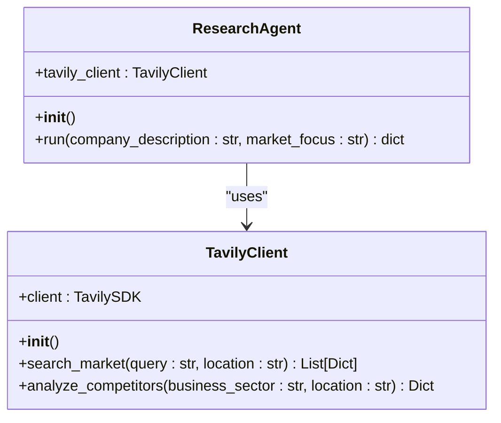
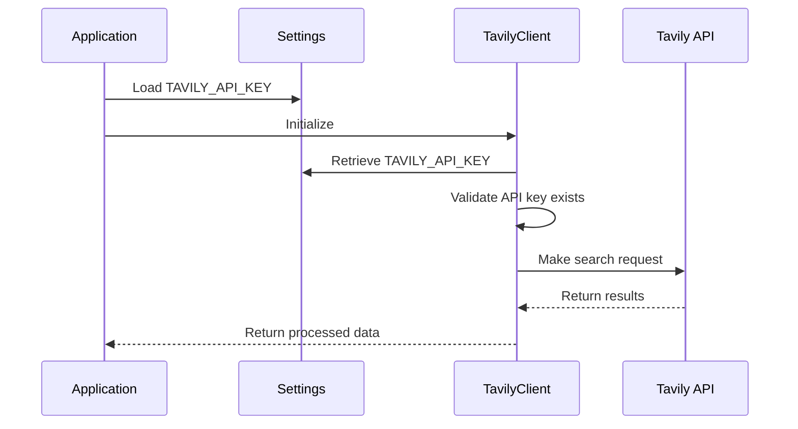
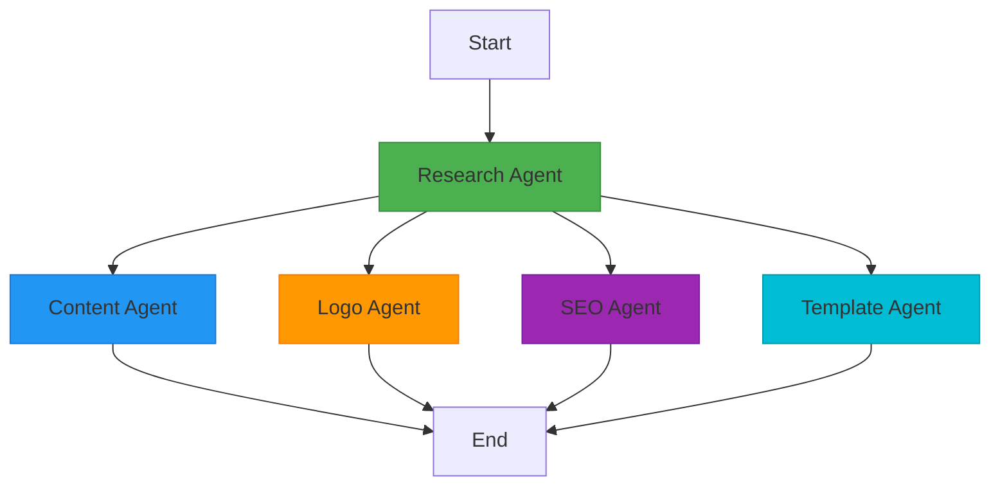
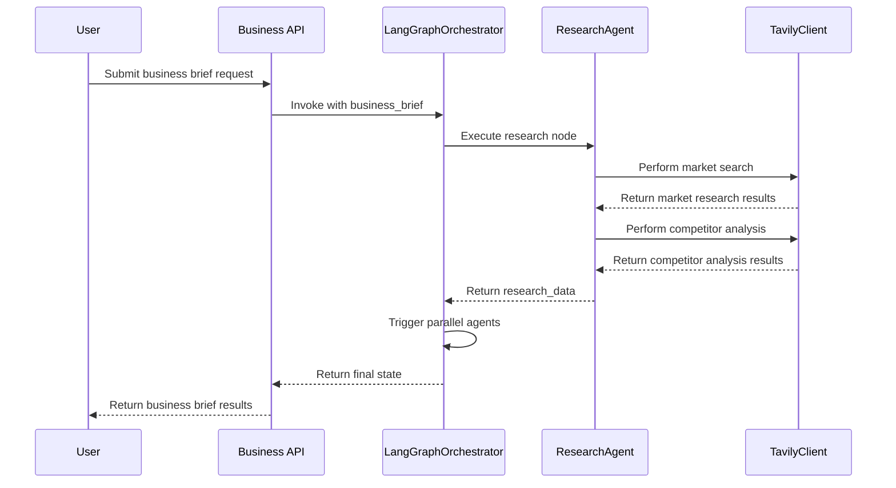
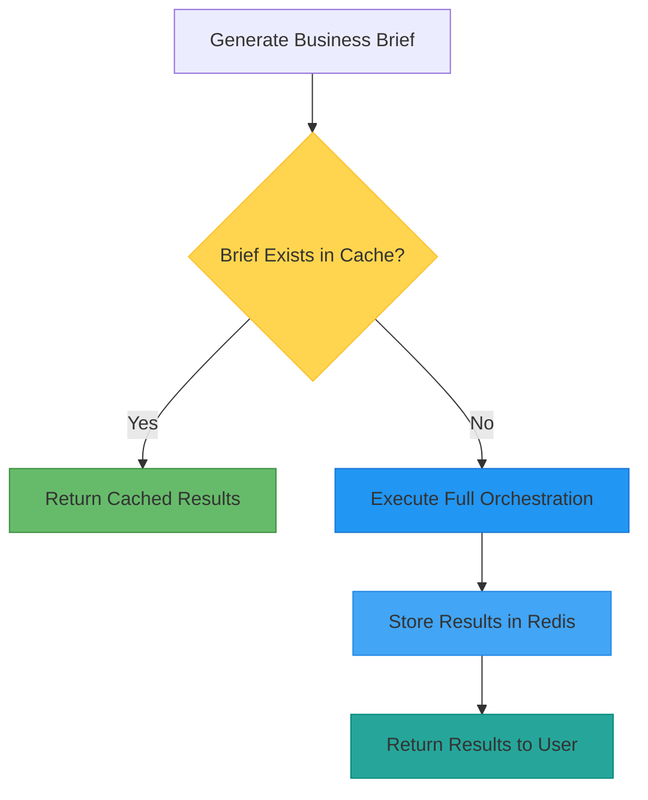

# Research Agent

<cite>
**Referenced Files in This Document**   
- [research.py](file://app/core/agents/research.py)
- [tavily.py](file://app/core/integrations/tavily.py)
- [langgraph_orchestrator.py](file://app/core/orchestration/langgraph_orchestrator.py)
- [business.py](file://app/models/business.py)
- [business.py](file://app/api/v1/business.py)
- [redis_fs.py](file://app/core/integrations/redis_fs.py)
- [settings.py](file://app/config/settings.py)
</cite>

## Table of Contents
1. [Introduction](#introduction)
2. [Research Agent Overview](#research-agent-overview)
3. [Tavily API Integration](#tavily-api-integration)
4. [LangGraph Orchestration Workflow](#langgraph-orchestration-workflow)
5. [Query Construction and Data Extraction](#query-construction-and-data-extraction)
6. [Error Handling and Resilience](#error-handling-and-resilience)
7. [Caching Strategy and Performance Optimization](#caching-strategy-and-performance-optimization)
8. [Business Brief Integration](#business-brief-integration)
9. [Conclusion](#conclusion)

## Introduction
The Research Agent is a core component of the Genesis AI service, responsible for conducting market research and competitor analysis to support business brief generation. This document provides a comprehensive analysis of its implementation, integration with the Tavily API, orchestration within the LangGraph workflow, and contribution to the overall business intelligence pipeline. The agent plays a critical role in transforming user inputs into actionable market insights that inform subsequent stages of business development.

## Research Agent Overview

The Research Agent is implemented as a specialized class designed to gather market intelligence and competitive landscape data. It operates as part of a multi-agent system orchestrated by LangGraph, receiving input parameters and returning structured research findings.



**Diagram sources**
- [research.py](file://app/core/agents/research.py#L1-L57)
- [tavily.py](file://app/core/integrations/tavily.py#L1-L43)

**Section sources**
- [research.py](file://app/core/agents/research.py#L1-L57)

## Tavily API Integration

The Research Agent integrates with the Tavily API through a dedicated client wrapper that handles authentication, request formatting, and response processing. The integration is configured via environment variables and provides specialized methods for market research and competitor analysis.

### API Client Implementation

The TavilyClient class serves as a wrapper around the official Tavily SDK, adding domain-specific functionality and error handling for African market research.

```python
class TavilyClient:
    """Client Tavily pour recherche marché africain"""
    
    def __init__(self):
        if not settings.TAVILY_API_KEY:
            raise ValueError("TAVILY_API_KEY is not set in the environment variables.")
        self.client = TavilySDK(api_key=settings.TAVILY_API_KEY)
    
    async def search_market(self, query: str, location: str = "Africa") -> List[Dict[str, Any]]:
        """Recherche marché avec spécialisation Afrique"""
        try:
            search_query = f"{query} in {location}"
            logger.info("Performing market search with Tavily", query=search_query)
            response = await self.client.search(query=search_query, search_depth="advanced")
            logger.info("Successfully performed market search", query=search_query)
            return response['results']
        except Exception as e:
            logger.error("Tavily market search failed", query=query, location=location, error=str(e))
            return []
```

The client validates the presence of the TAVILY_API_KEY during initialization and constructs search queries with a default focus on African markets. It uses the "advanced" search depth parameter to obtain comprehensive results.

**Section sources**
- [tavily.py](file://app/core/integrations/tavily.py#L1-L43)

### Environment Configuration

The Tavily API integration relies on configuration settings defined in the application's settings module:

```python
class Settings(BaseSettings):
    # AI Services
    OPENAI_API_KEY: str = "your-openai-key"
    ANTHROPIC_API_KEY: str = "your-anthropic-key"
    TAVILY_API_KEY: str = "your-tavily-key"
    LOGOAI_API_KEY: str = "your-logoai-key"
    
    # External Services URLs
    LOGOAI_BASE_URL: str = "https://api.logoai.com"
    TAVILY_BASE_URL: str = "https://api.tavily.com"
```

During application startup, the system validates external API connections, including the Tavily service, to ensure availability before processing requests.



**Diagram sources**
- [tavily.py](file://app/core/integrations/tavily.py#L1-L43)
- [settings.py](file://app/config/settings.py#L1-L90)

## LangGraph Orchestration Workflow

The Research Agent operates within a LangGraph-powered orchestration framework that coordinates multiple specialized agents in a defined workflow. This architecture enables parallel processing of different aspects of business brief generation.

### Workflow Architecture



**Diagram sources**
- [langgraph_orchestrator.py](file://app/core/orchestration/langgraph_orchestrator.py#L1-L107)

### State Management

The orchestration system uses a typed dictionary to manage state across the workflow:

```python
class AgentState(TypedDict):
    business_brief: dict
    research_data: dict
    content: dict
    logo: dict
    seo_data: dict
    template: dict
    error: str = None
```

The Research Agent is the first node in the execution graph, setting the foundation for subsequent agents that depend on its findings.

### Execution Flow



**Diagram sources**
- [langgraph_orchestrator.py](file://app/core/orchestration/langgraph_orchestrator.py#L1-L107)
- [research.py](file://app/core/agents/research.py#L1-L57)

**Section sources**
- [langgraph_orchestrator.py](file://app/core/orchestration/langgraph_orchestrator.py#L1-L107)

## Query Construction and Data Extraction

The Research Agent employs a systematic approach to constructing search queries and extracting relevant information from API responses.

### Query Generation Logic

The agent generates two primary types of queries based on user input:

1. **Market Research Query**: Combines the market focus with a geographical context
2. **Competitor Analysis Query**: Focuses on identifying competitors in the specified sector

```python
# Market research query construction
market_research = await self.tavily_client.search_market(
    query=f"Analyse du marché pour {market_focus} en Afrique",
    topic="market_analysis"
)

# Competitor analysis query construction  
competitor_analysis = await self.tavily_client.analyze_competitors(
    query=f"Concurrents principaux pour {market_focus}",
    company_description=company_description
)
```

### Data Structure and Response Format

The Research Agent returns a standardized dictionary structure containing both market research and competitor analysis results:

```python
return {
    "market_research": market_research,
    "competitor_analysis": competitor_analysis
}
```

This structured output enables downstream agents to easily access and utilize the research findings in their respective tasks.

**Section sources**
- [research.py](file://app/core/agents/research.py#L1-L57)

## Error Handling and Resilience

The system implements comprehensive error handling at multiple levels to ensure reliability and graceful degradation when external services encounter issues.

### API Failure Handling

The Tavily client implements defensive programming practices to handle API failures:

```python
async def search_market(self, query: str, location: str = "Africa") -> List[Dict[str, Any]]:
    try:
        search_query = f"{query} in {location}"
        response = await self.client.search(query=search_query, search_depth="advanced")
        return response['results']
    except Exception as e:
        logger.error("Tavily market search failed", query=query, location=location, error=str(e))
        return []  # Fallback to empty list
```

Instead of propagating exceptions, the client returns empty data structures, allowing the workflow to continue with partial information rather than failing completely.

### System-Wide Exception Handling

The application implements global exception handlers to catch and log unexpected errors:

```python
@app.exception_handler(Exception)
async def general_exception_handler(request: Request, exc: Exception):
    logger.error(
        "Unexpected Exception",
        error_type=exc.__class__.__name__,
        error_message=str(exc),
        request_path=request.url.path,
        request_method=request.method
    )
    return JSONResponse(
        status_code=500,
        content={
            "error": "INTERNAL_SERVER_ERROR",
            "message": "An unexpected error occurred",
            "timestamp": time.time()
        }
    )
```

This ensures that all errors are properly logged and users receive meaningful error responses.

**Section sources**
- [tavily.py](file://app/core/integrations/tavily.py#L1-L43)
- [main.py](file://app/main.py#L1-L159)

## Caching Strategy and Performance Optimization

The system employs a Redis-based caching strategy to improve performance and reduce costs associated with external API calls.

### Redis Virtual File System

The RedisVirtualFileSystem class provides persistent storage for business brief sessions:

```python
class RedisVirtualFileSystem:
    """Virtual File System Redis pour sessions coaching persistantes"""
    
    def __init__(self):
        self.redis = redis.from_url(settings.REDIS_URL)
    
    async def write_session(self, session_id: str, data: Dict[str, Any], ttl: int = 7200) -> bool:
        try:
            await self.redis.set(f"session:{session_id}", json.dumps(data), ex=ttl)
            return True
        except Exception as e:
            logger.error("Failed to write session to Redis", session_id=session_id, error=str(e))
            return False
    
    async def read_session(self, session_id: str) -> Optional[Dict[str, Any]]:
        try:
            session_data = await self.redis.get(f"session:{session_id}")
            if session_data:
                return json.loads(session_data)
            return None
        except Exception as e:
            logger.error("Failed to read session from Redis", session_id=session_id, error=str(e))
            return None
```

### Caching Implementation

The caching strategy is implemented at the API level:

```python
@router.post("/brief/generate", response_model=BusinessBriefResponse)
async def generate_business_brief(
    request: BusinessBriefRequest,
    current_user: dict = Depends(get_current_user),
    orchestrator: LangGraphOrchestrator = Depends(get_orchestrator),
    redis_fs: RedisVirtualFileSystem = Depends(get_redis_vfs)
):
    try:
        # 1. Run the orchestration
        business_brief_data = request.dict()
        final_state = await orchestrator.run(business_brief_data)

        # 2. Assemble the final brief
        brief_id = f"brief_{uuid.uuid4()}"
        response_data = {
            "brief_id": brief_id,
            "user_id": current_user.id,
            "session_id": request.session_id,
            "results": final_state
        }

        # 3. Save to Redis Virtual File System
        await redis_fs.write_session(current_user.id, brief_id, response_data)
        
        logger.info("Business brief generated and saved successfully", brief_id=brief_id)
        return response_data
    except Exception as e:
        logger.error("Failed to generate business brief", error=str(e))
        raise HTTPException(
            status_code=status.HTTP_500_INTERNAL_SERVER_ERROR,
            detail=f"Failed to generate business brief: {str(e)}"
        )
```

The system stores complete business brief results with a default TTL of 7200 seconds (2 hours), allowing for efficient retrieval of previously generated content.



**Diagram sources**
- [redis_fs.py](file://app/core/integrations/redis_fs.py#L1-L59)
- [business.py](file://app/api/v1/business.py#L1-L72)

**Section sources**
- [redis_fs.py](file://app/core/integrations/redis_fs.py#L1-L59)
- [business.py](file://app/api/v1/business.py#L1-L72)

## Business Brief Integration

The Research Agent's findings are integrated into the broader business brief structure, contributing to both the immediate output and long-term business context storage.

### Schema Integration

The research results are incorporated into the BusinessBriefResponse schema:

```python
class BusinessBriefResponse(BaseModel):
    """Response with complete business brief"""
    id: int
    coaching_session_id: int
    business_brief: BusinessBrief
    market_research: Optional[Dict[str, Any]] = None
    content_generation: Optional[Dict[str, Any]] = None
    logo_creation: Optional[Dict[str, Any]] = None
    seo_optimization: Optional[Dict[str, Any]] = None
    template_selection: Optional[Dict[str, Any]] = None
    overall_confidence: float
    is_ready_for_website: bool
    created_at: datetime
```

### Database Storage

Research findings are persisted in the database through the BusinessContext model:

```python
class BusinessContext(BaseModel):
    """Extended business context and metadata"""
    __tablename__ = "business_contexts"
    
    # Market analysis results
    market_size = Column(JSON)
    competitors = Column(JSON)
    opportunities = Column(JSON)
    pricing_insights = Column(JSON)
```

This ensures that research data is available for future reference and analysis, supporting the long-term development of the business.

**Section sources**
- [business.py](file://app/models/business.py#L1-L72)
- [business.py](file://app/schemas/business.py#L1-L83)

## Conclusion

The Research Agent is a critical component of the Genesis AI service, providing essential market intelligence that informs the entire business brief generation process. By integrating with the Tavily API, the agent delivers comprehensive market research and competitor analysis that serves as the foundation for subsequent agents in the LangGraph orchestration workflow.

Key strengths of the implementation include:
- **Robust API integration** with proper error handling and fallback mechanisms
- **Efficient orchestration** through LangGraph, enabling parallel processing
- **Performance optimization** via Redis-based caching that reduces API costs
- **Structured data output** that facilitates integration with downstream components
- **Comprehensive error handling** at multiple levels of the application stack

The agent's design reflects a thoughtful balance between obtaining comprehensive market intelligence and maintaining system reliability, even when external services experience issues. Its integration with the caching system ensures optimal performance while preserving the ability to deliver fresh research when needed.

This architecture enables entrepreneurs to receive timely, data-driven insights that inform their business decisions, particularly in the African market context for which the system is specialized.