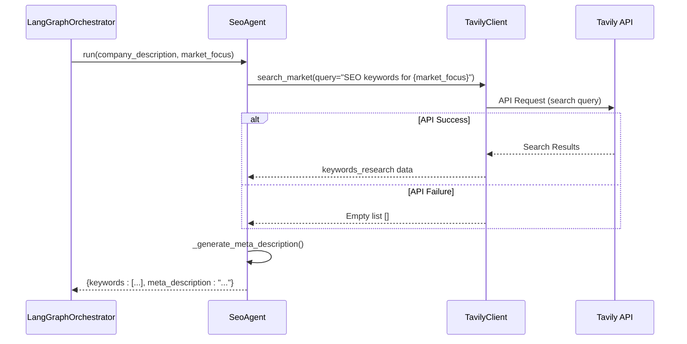
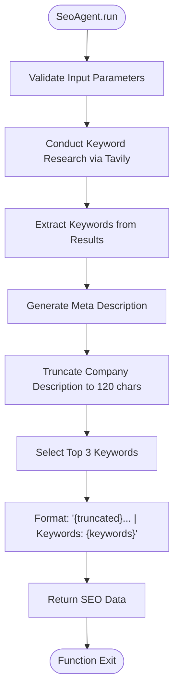
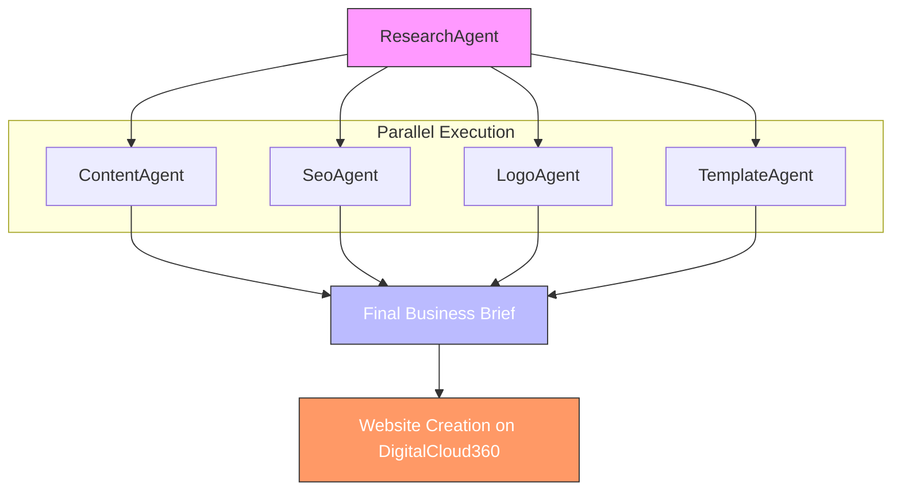

# SEO Agent

<cite>
**Referenced Files in This Document**   
- [seo.py](file://app/core/agents/seo.py)
- [tavily.py](file://app/core/integrations/tavily.py)
- [content.py](file://app/core/agents/content.py)
- [langgraph_orchestrator.py](file://app/core/orchestration/langgraph_orchestrator.py)
- [settings.py](file://app/config/settings.py)
- [business.py](file://app/schemas/business.py)
- [coaching.py](file://app/models/coaching.py)
</cite>

## Table of Contents
1. [Introduction](#introduction)
2. [Keyword Research Process](#keyword-research-process)
3. [Meta Description and Content Generation](#meta-description-and-content-generation)
4. [Integration with ContentAgent and Website Structure](#integration-with-contentagent-and-website-structure)
5. [Configuration and Performance Considerations](#configuration-and-performance-considerations)

## Introduction
The SeoAgent is a specialized component within the Genesis AI platform responsible for optimizing business brief content for search engines. It operates as part of a multi-agent orchestration system that transforms coaching session outputs into fully SEO-optimized digital assets. The agent leverages external market research data and internal business context to generate keywords, meta descriptions, and other SEO elements that enhance online visibility. This documentation details the agent's architecture, workflow, integration points, and operational parameters.

**Section sources**
- [seo.py](file://app/core/agents/seo.py#L1-L10)
- [langgraph_orchestrator.py](file://app/core/orchestration/langgraph_orchestrator.py#L1-L20)

## Keyword Research Process
The SeoAgent performs keyword research by leveraging the TavilyClient integration to conduct targeted market searches based on the business's market focus. The process begins when the agent receives a company description and market focus parameter from the orchestration system. It then constructs a search query in the format "SEO keywords for {market_focus}" and executes an advanced search through the Tavily API with a geographic focus on Africa.

The keyword research workflow follows these steps:
1. Receive company description and market focus from the business brief
2. Construct a targeted search query for SEO keywords
3. Execute market search via Tavily API with advanced search depth
4. Process and extract relevant keywords from search results
5. Return structured keyword data for downstream use

This approach ensures that keyword recommendations are contextually relevant to both the specific business domain and the African market landscape. The agent is designed to handle API failures gracefully by returning empty results rather than propagating errors, ensuring the overall orchestration workflow can continue.

**Diagram sources**
- [seo.py](file://app/core/agents/seo.py#L15-L35)
- [tavily.py](file://app/core/integrations/tavily.py#L15-L30)

**Section sources**
- [seo.py](file://app/core/agents/seo.py#L15-L35)
- [tavily.py](file://app/core/integrations/tavily.py#L15-L30)

## Meta Description and Content Generation
The SeoAgent generates meta descriptions through a deterministic algorithm that combines the company description with the top keywords identified during research. The `_generate_meta_description` method truncates the company description to 120 characters and appends the top three keywords, creating a concise meta description in the format: "{description}... | Keywords: {top_keywords}".

While the current implementation uses a rule-based approach, the code contains comments indicating potential future enhancement to use Large Language Models (LLMs) for more sophisticated meta description generation. The output includes both a list of keywords and the generated meta description, which are stored as part of the SEO optimization results in the business brief.

The meta description serves as a critical SEO element that influences click-through rates from search engine results pages. By incorporating primary keywords and providing a clear, concise summary of the business, these descriptions help improve both search engine ranking and user engagement.

**Diagram sources**
- [seo.py](file://app/core/agents/seo.py#L37-L55)
- [tavily.py](file://app/core/integrations/tavily.py#L15-L30)

**Section sources**
- [seo.py](file://app/core/agents/seo.py#L37-L55)

## Integration with ContentAgent and Website Structure
The SeoAgent operates in parallel with other specialized agents within the LangGraphOrchestrator framework, including the ContentAgent. While the agents execute independently, their outputs are combined to create a cohesive website structure. The SEO data generated by the SeoAgent directly influences the website's metadata and can inform content creation strategies.

The orchestration workflow begins with the ResearchAgent, after which four agents—including SeoAgent and ContentAgent—execute in parallel. Each agent processes the same business brief but produces different outputs:
- SeoAgent generates keywords and meta descriptions
- ContentAgent creates website copy using OpenAI
- LogoAgent designs visual identity
- TemplateAgent selects appropriate website layouts

These outputs are stored in the business brief's JSON structure under the `seo_optimization` field, where they remain available for subsequent processes, including website creation on the DigitalCloud360 platform. The parallel execution model ensures that SEO optimization does not create bottlenecks in the content generation pipeline.

**Diagram sources**
- [langgraph_orchestrator.py](file://app/core/orchestration/langgraph_orchestrator.py#L25-L50)
- [business.py](file://app/schemas/business.py#L50-L60)

**Section sources**
- [langgraph_orchestrator.py](file://app/core/orchestration/langgraph_orchestrator.py#L25-L50)
- [content.py](file://app/core/agents/content.py#L15-L25)
- [coaching.py](file://app/models/coaching.py#L85-L120)

## Configuration and Performance Considerations
The SeoAgent's operation depends on external API services, primarily Tavily for market research. Configuration is managed through environment variables defined in the settings.py file, with the `TAVILY_API_KEY` being essential for authentication. The agent will fail to initialize if this key is not properly configured, raising a ValueError during instantiation.

Performance implications are minimized through the agent's asynchronous design and parallel execution within the orchestration framework. Since the SeoAgent runs concurrently with other agents rather than sequentially, its API call latency does not directly impact the overall processing time. However, network latency and Tavily API response times can affect the completion time of the SEO optimization task.

The current implementation balances readability with search optimization by using a simple, transparent algorithm for meta description generation. This approach prioritizes reliability and predictability over sophisticated language generation, avoiding the computational overhead and potential inconsistencies of LLM-based generation. Future enhancements could introduce configurable SEO parameters, such as keyword density targets or meta description length preferences, allowing users to balance optimization goals with content quality.

**Section sources**
- [settings.py](file://app/config/settings.py#L37-L88)
- [tavily.py](file://app/core/integrations/tavily.py#L10-L15)
- [seo.py](file://app/core/agents/seo.py#L10-L15)