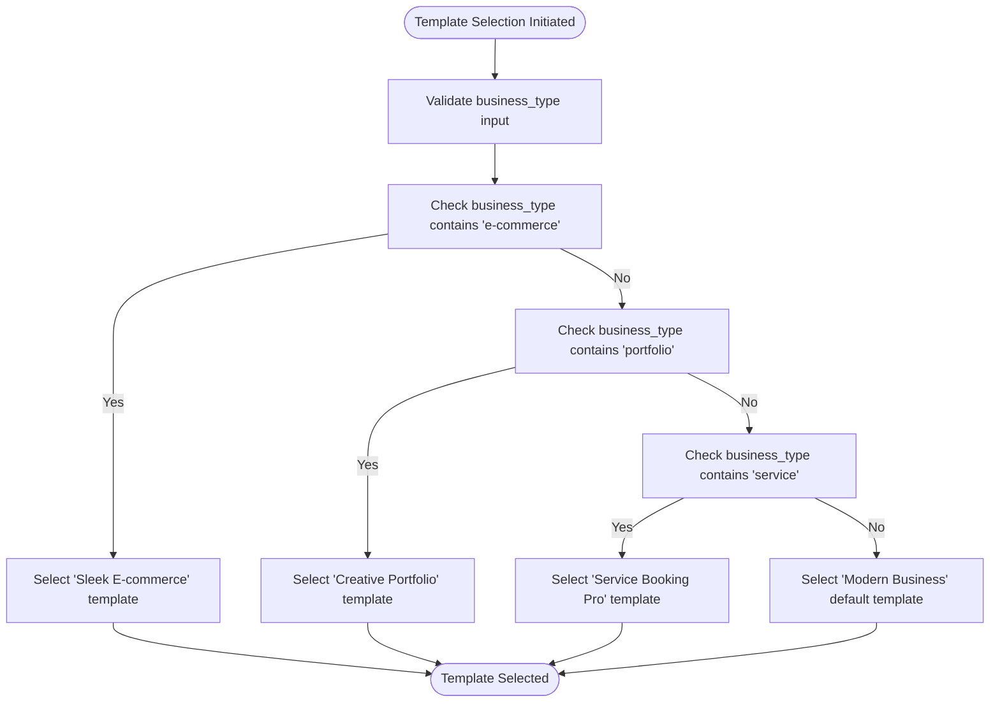
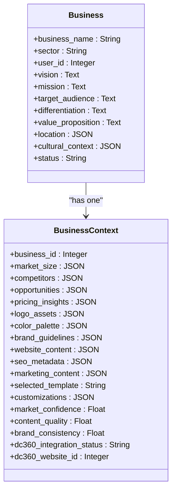
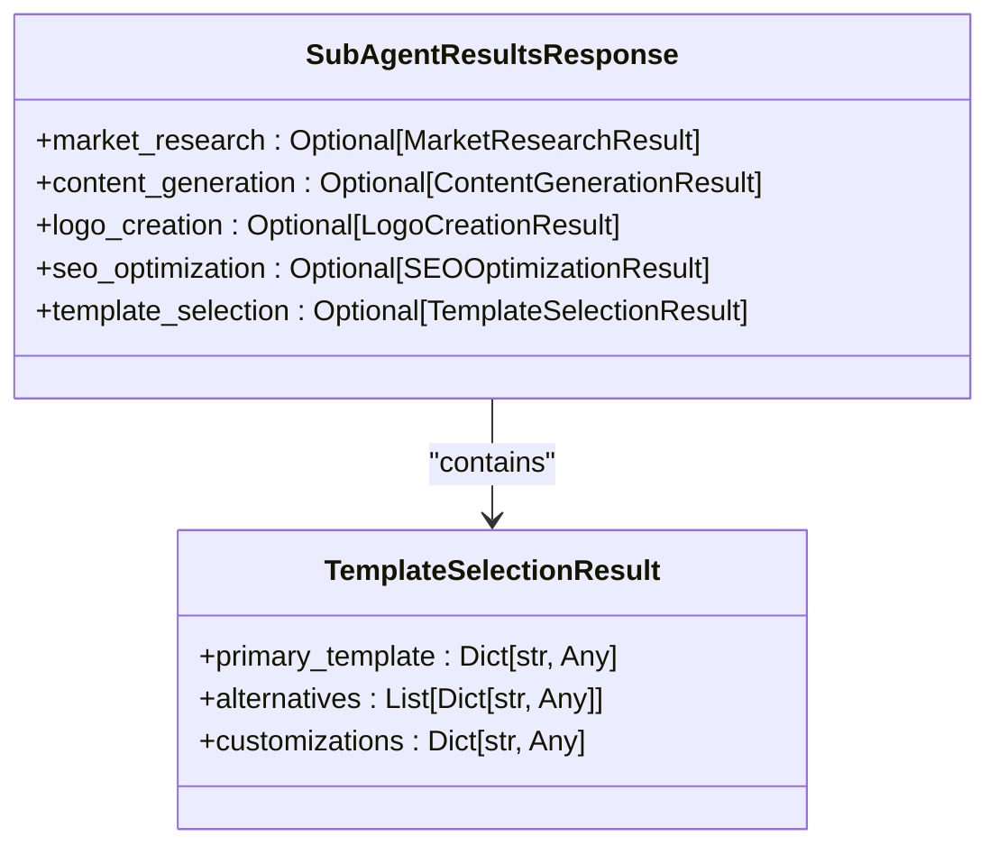
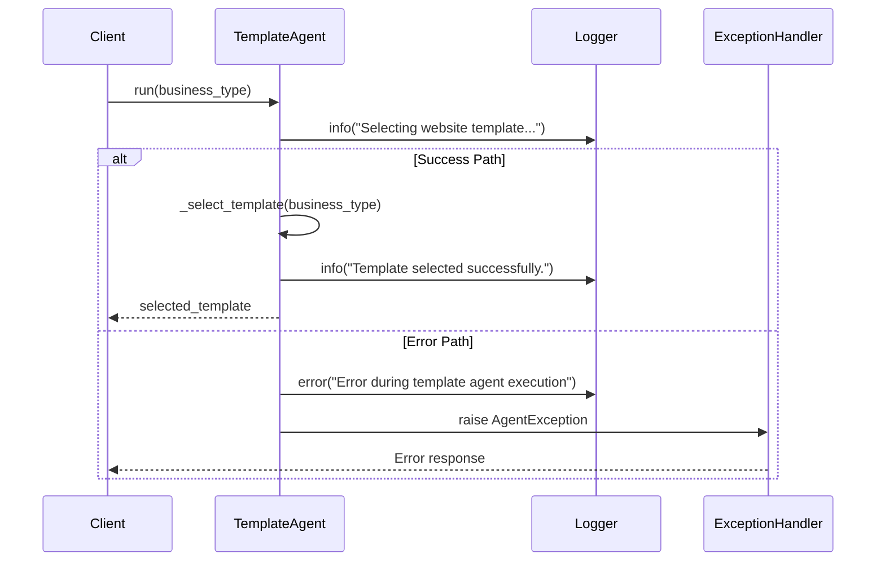
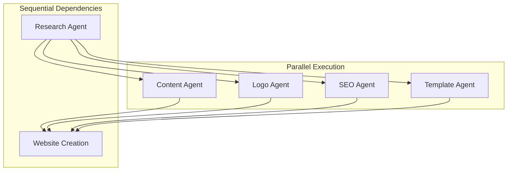

# Template Agent

<cite>
**Referenced Files in This Document**   
- [template.py](file://app/core/agents/template.py)
- [business.py](file://app/models/business.py)
- [business.py](file://app/api/v1/business.py)
- [langgraph_orchestrator.py](file://app/core/orchestration/langgraph_orchestrator.py)
- [business.py](file://app/schemas/business.py)
</cite>

## Table of Contents
1. [Introduction](#introduction)
2. [Template Selection Logic](#template-selection-logic)
3. [Integration with BusinessBrief Model](#integration-with-businessbrief-model)
4. [Template Metadata Structure](#template-metadata-structure)
5. [Extensibility of Template System](#extensibility-of-template-system)
6. [Error Handling and Fallback Strategies](#error-handling-and-fallback-strategies)
7. [Workflow Integration](#workflow-integration)

## Introduction
The Template Agent is a specialized component within the Genesis AI Service responsible for selecting appropriate website templates based on business type, industry, and user preferences gathered during the coaching process. This document provides a comprehensive analysis of the agent's decision logic, integration with the BusinessBrief model, template metadata structure, extensibility mechanisms, error handling, and workflow integration. The agent operates as part of a larger orchestration system that coordinates multiple sub-agents to generate a complete business brief for website creation.

## Template Selection Logic

The Template Agent implements a rule-based decision logic to match business characteristics with template categories. The selection process is driven by the business type parameter passed to the agent's `run` method.



**Diagram sources**
- [template.py](file://app/core/agents/template.py#L45-L59)

**Section sources**
- [template.py](file://app/core/agents/template.py#L6-L59)

The agent maintains a predefined list of available templates in its constructor:

```python
self.available_templates = [
    {"id": "modern_business_01", "name": "Modern Business"},
    {"id": "creative_portfolio_02", "name": "Creative Portfolio"},
    {"id": "ecommerce_sleek_03", "name": "Sleek E-commerce"},
    {"id": "service_booking_04", "name": "Service Booking Pro"}
]
```

The selection logic is implemented in the `_select_template` method, which uses simple string matching to determine the appropriate template. The matching is case-insensitive and based on substrings within the business type. The current implementation supports three specific categories: e-commerce, portfolio, and service-based businesses, with a generic business template serving as the default fallback.

## Integration with BusinessBrief Model

The Template Agent's selections are stored in the database through the BusinessContext model, which extends the core Business entity with additional metadata and generated assets.



**Diagram sources**
- [business.py](file://app/models/business.py#L1-L72)

**Section sources**
- [business.py](file://app/models/business.py#L1-L72)

The selected template is stored in the `selected_template` field of the BusinessContext model as a string, specifically the template ID (e.g., "modern_business_01"). This field is defined as a nullable String column in the database schema. The template selection becomes part of the comprehensive business context that includes market research, generated assets, content, SEO metadata, and quality scores.

During the website creation workflow, the system validates that the business brief contains template information before proceeding with website generation, ensuring that template selection is a required step in the process.

## Template Metadata Structure

The template selection results are structured according to the TemplateSelectionResult schema, which defines the expected format for template-related data in the system.



**Diagram sources**
- [business.py](file://app/schemas/business.py#L70-L74)
- [business.py](file://app/schemas/business.py#L80-L83)

**Section sources**
- [business.py](file://app/schemas/business.py#L70-L83)

The TemplateSelectionResult model includes three key components:
- **primary_template**: A dictionary containing information about the selected template
- **alternatives**: A list of dictionaries representing alternative templates that could be suitable
- **customizations**: A dictionary containing recommended customizations for the selected template

Although the current Template Agent implementation only returns the primary template, the schema supports a richer response structure that could be leveraged in future enhancements. The template selection is integrated into the broader SubAgentResultsResponse, which aggregates results from all sub-agents (research, content, logo, SEO, and template) into a comprehensive business brief.

## Extensibility of Template System

The current template system has a straightforward extensibility model, though it requires code modifications to add new templates. The system is designed with potential for future enhancement to support dynamic template loading.

To add new templates, developers would need to:
1. Add new template entries to the `available_templates` list in the TemplateAgent constructor
2. Update the `_select_template` method to include logic for the new business types
3. Ensure the template IDs are unique and follow the naming convention

The system currently stores only the template ID in the database (in the `selected_template` field), which suggests that template metadata (name, description, features, etc.) would need to be retrieved from a template registry or database when needed for website creation.

Future extensibility could include:
- Loading templates from a database or external service instead of hardcoding them
- Implementing a more sophisticated matching algorithm using machine learning or rule-based systems
- Supporting template categories and subcategories for more granular selection
- Adding template preview information and screenshots
- Implementing template versioning

The database schema already supports storing template customizations in the `customizations` JSON field, allowing for flexibility in how templates are adapted to specific business needs without requiring changes to the core template system.

## Error Handling and Fallback Strategies

The Template Agent implements comprehensive error handling to ensure reliability and provide meaningful feedback when issues occur.



**Diagram sources**
- [template.py](file://app/core/agents/template.py#L25-L59)

**Section sources**
- [template.py](file://app/core/agents/template.py#L25-L59)

The agent employs a try-catch block in its `run` method to catch any exceptions that occur during template selection. When an error occurs, it:
1. Logs the error with detailed information
2. Raises a standardized AgentException with a specific error code ("TEMPLATE_AGENT_ERROR")
3. Provides a user-friendly error message and includes the original exception details

The system implements a robust fallback strategy for template selection:
- The default template ("Modern Business") is returned when no matching business type is found
- This ensures that the system always returns a valid template rather than failing when no exact match is available
- The fallback is implemented in the `_select_template` method as the final return statement

The website creation endpoint also implements validation to ensure that template selection has occurred before attempting to create a website, providing an additional layer of error prevention:

```python
if not results or not all(k in results for k in ["content", "logo", "seo", "template"]):
    raise HTTPException(
        status_code=status.HTTP_422_UNPROCESSABLE_ENTITY,
        detail="The business brief is incomplete and cannot be used to create a website."
    )
```

This validation ensures that missing template information is caught early in the process, preventing downstream failures during website creation.

## Workflow Integration

The Template Agent is integrated into the overall business brief generation workflow through the LangGraphOrchestrator, which coordinates the execution of multiple sub-agents in a defined sequence.



**Diagram sources**
- [langgraph_orchestrator.py](file://app/core/orchestration/langgraph_orchestrator.py#L25-L50)

**Section sources**
- [langgraph_orchestrator.py](file://app/core/orchestration/langgraph_orchestrator.py#L1-L108)
- [business.py](file://app/api/v1/business.py#L199-L270)

The orchestration workflow follows these steps:
1. The Research Agent executes first as the entry point
2. Once research is complete, four agents (Content, Logo, SEO, and Template) execute in parallel
3. All agents receive the business brief as input and produce their respective outputs
4. The final state contains results from all agents, including the selected template

The Template Agent receives the business brief from the orchestration state and specifically uses the `business_type` field to make its selection:

```python
async def run_template_agent(self, state: AgentState) -> AgentState:
    logger.info("Executing Template Agent")
    brief = state['business_brief']
    result = await self.template_agent.run(brief['business_type'])
    return {"template": result}
```

The selected template is then stored in the orchestration state under the "template" key and becomes part of the final business brief. This brief is saved to the Redis Virtual File System and can be retrieved later for website creation.

When a user requests website creation, the system retrieves the complete business brief from Redis, validates that it contains all necessary components (including the template selection), and then forwards the brief to the DigitalCloud360 API to create the actual website. This integration ensures that the template selection made by the Template Agent directly influences the final website that is created for the business.