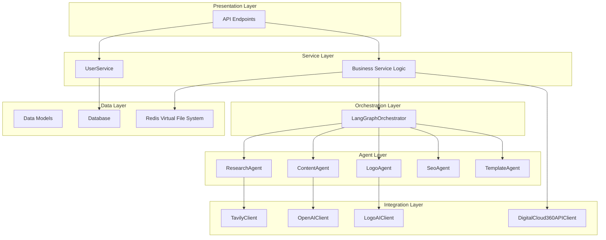
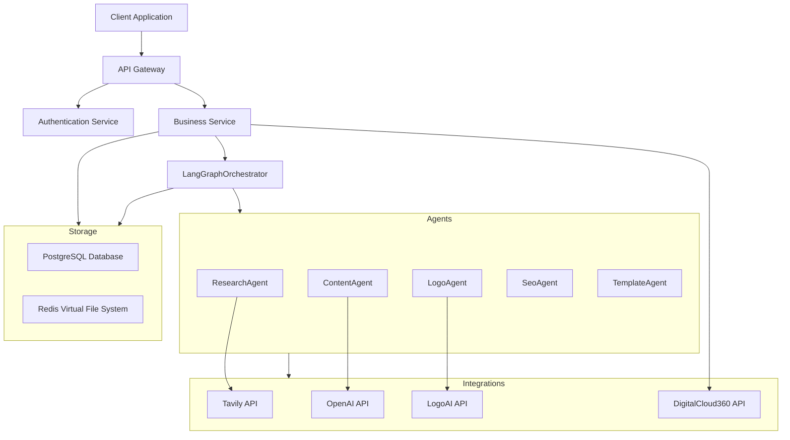
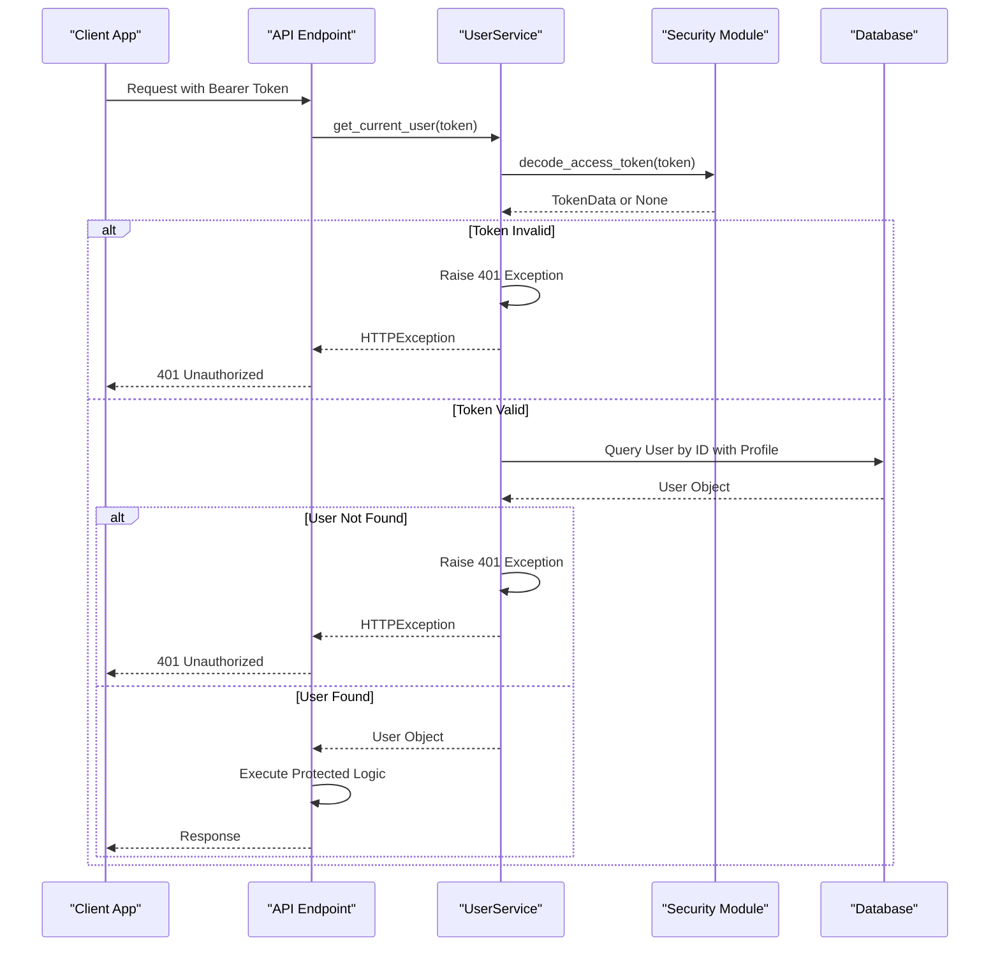
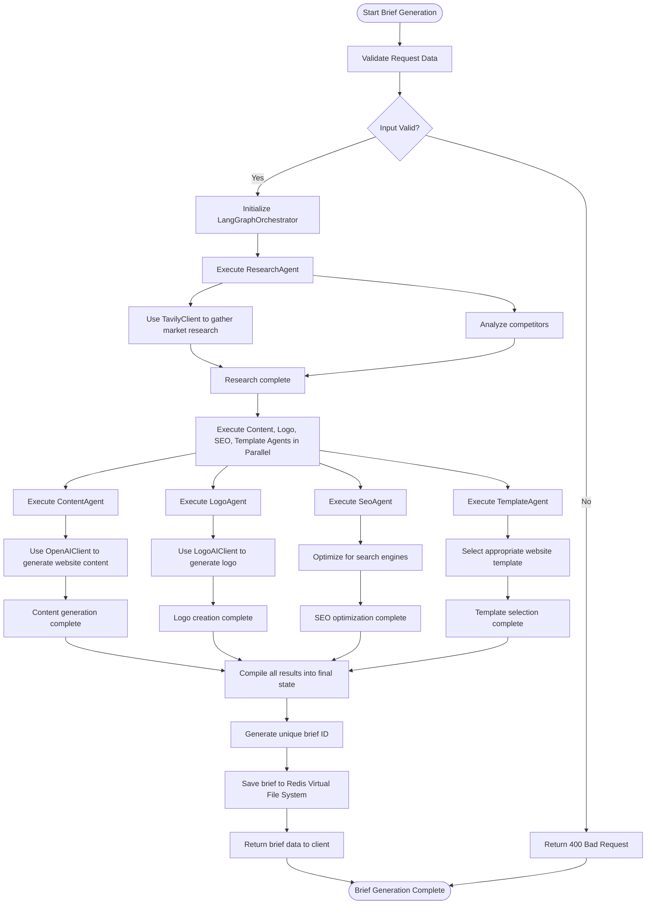
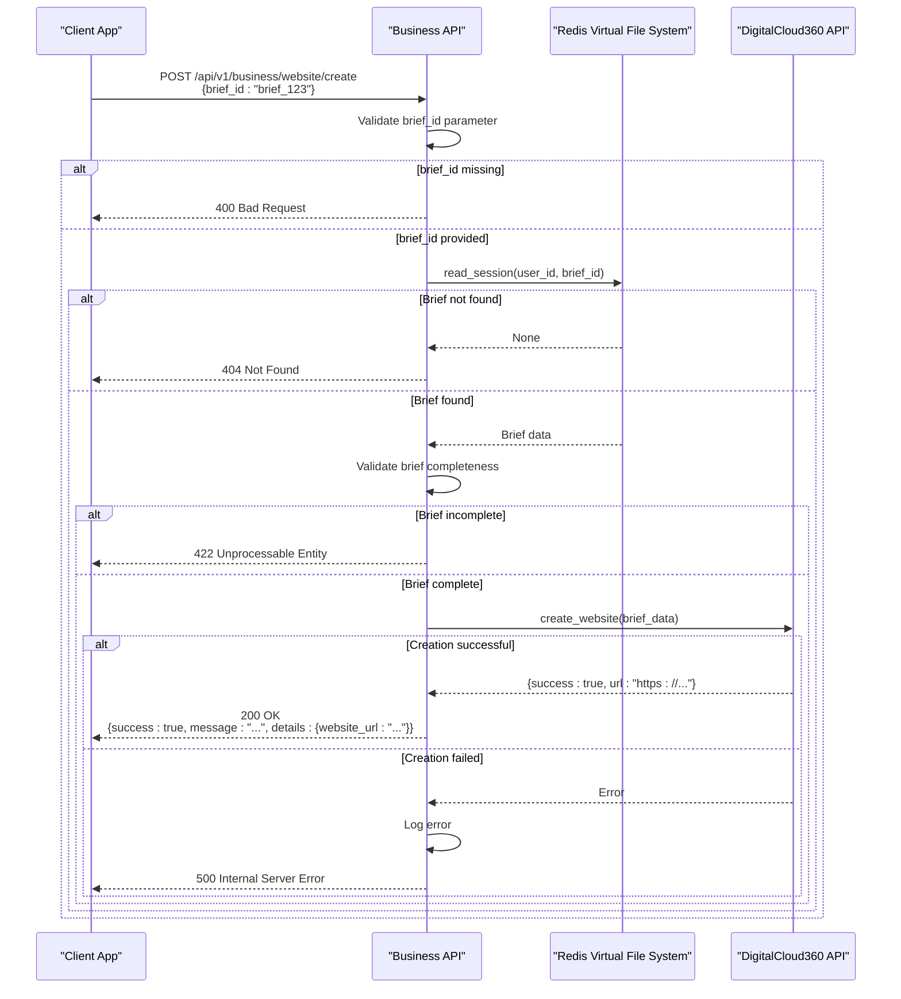
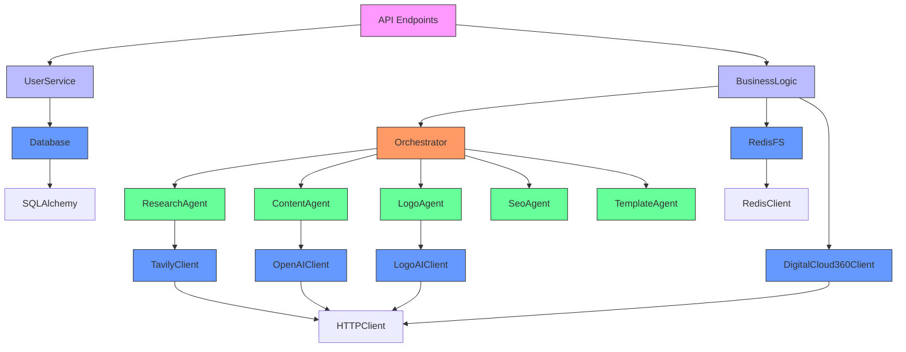

# Business Logic Layer

<cite>
**Referenced Files in This Document**   
- [user_service.py](file://app/services/user_service.py)
- [business.py](file://app/api/v1/business.py)
- [langgraph_orchestrator.py](file://app/core/orchestration/langgraph_orchestrator.py)
- [research.py](file://app/core/agents/research.py)
- [content.py](file://app/core/agents/content.py)
- [logo.py](file://app/core/agents/logo.py)
- [seo.py](file://app/core/agents/seo.py)
- [template.py](file://app/core/agents/template.py)
- [digitalcloud360.py](file://app/core/integrations/digitalcloud360.py)
- [coaching.py](file://app/api/v1/coaching.py)
- [user.py](file://app/models/user.py)
- [coaching.py](file://app/models/coaching.py)
</cite>

## Table of Contents
1. [Introduction](#introduction)
2. [Project Structure](#project-structure)
3. [Core Components](#core-components)
4. [Architecture Overview](#architecture-overview)
5. [Detailed Component Analysis](#detailed-component-analysis)
6. [Dependency Analysis](#dependency-analysis)
7. [Performance Considerations](#performance-considerations)
8. [Troubleshooting Guide](#troubleshooting-guide)
9. [Conclusion](#conclusion)

## Introduction
This document provides a comprehensive analysis of the business logic layer in the Genesis AI Service, a deep agent system designed to support African entrepreneurs through AI-powered coaching and business development. The system implements a multi-agent orchestration framework to generate comprehensive business briefs and create fully functional websites. The business logic is structured around three core workflows: the coaching workflow, business brief generation, and website creation pipeline. This documentation details the service layer patterns, method signatures, domain logic encapsulation, API endpoint delegation, business rule enforcement, transaction boundaries, error handling strategies, and state management across operations. The analysis is based on the actual codebase and provides concrete examples from the UserService and business/coaching workflows.

## Project Structure
The project follows a layered architecture with clear separation of concerns. The business logic is distributed across several key directories: `services` for service classes, `core` for domain-specific logic and agents, `api` for endpoints, and `models` for data structures. The `core/orchestration` directory contains the LangGraphOrchestrator that coordinates multiple specialized agents, while `core/agents` houses individual agents for research, content generation, logo creation, SEO, and template selection. The `core/integrations` directory manages external API connections to services like Tavily, OpenAI, LogoAI, and DigitalCloud360. This structure enables a modular design where business logic is encapsulated in specific components that can be independently developed and tested.

**Diagram sources**
- [user_service.py](file://app/services/user_service.py)
- [business.py](file://app/api/v1/business.py)
- [langgraph_orchestrator.py](file://app/core/orchestration/langgraph_orchestrator.py)
- [research.py](file://app/core/agents/research.py)
- [content.py](file://app/core/agents/content.py)
- [logo.py](file://app/core/agents/logo.py)
- [seo.py](file://app/core/agents/seo.py)
- [template.py](file://app/core/agents/template.py)
- [digitalcloud360.py](file://app/core/integrations/digitalcloud360.py)

**Section sources**
- [user_service.py](file://app/services/user_service.py)
- [business.py](file://app/api/v1/business.py)

## Core Components
The core components of the business logic layer include the UserService for authentication and user management, the LangGraphOrchestrator for coordinating sub-agents, and specialized agents for research, content generation, logo creation, SEO, and template selection. The UserService implements the `get_current_user` function which authenticates users via OAuth2 and retrieves user data from the database with profile information. The LangGraphOrchestrator uses LangGraph to define a state machine that executes agents in a specific order, starting with market research and then running content, logo, SEO, and template agents in parallel. Each agent is responsible for a specific domain task and integrates with external APIs to perform its function. The business logic also includes integration with DigitalCloud360 for website creation and Redis Virtual File System for persistent storage of business briefs.

**Section sources**
- [user_service.py](file://app/services/user_service.py#L0-L31)
- [langgraph_orchestrator.py](file://app/core/orchestration/langgraph_orchestrator.py#L0-L107)
- [research.py](file://app/core/agents/research.py#L0-L57)
- [content.py](file://app/core/agents/content.py#L0-L83)
- [logo.py](file://app/core/agents/logo.py#L0-L43)
- [seo.py](file://app/core/agents/seo.py#L0-L42)
- [template.py](file://app/core/agents/template.py#L0-L41)

## Architecture Overview
The system architecture follows a microservices-inspired pattern with a clear separation between API endpoints, business services, orchestration logic, specialized agents, and external integrations. The architecture is designed to handle complex business processes through a combination of sequential and parallel execution. When a user requests a business brief, the API endpoint delegates to the LangGraphOrchestrator, which coordinates multiple specialized agents that work in parallel to gather market research, generate content, create a logo, optimize for SEO, and select an appropriate template. The results are then assembled into a comprehensive business brief and stored in Redis Virtual File System. The architecture also supports website creation by integrating with DigitalCloud360's API to deploy websites based on the generated brief. Error handling is implemented at multiple levels, with specific exception types for different failure modes and comprehensive logging for debugging and monitoring.

**Diagram sources**
- [business.py](file://app/api/v1/business.py#L0-L270)
- [langgraph_orchestrator.py](file://app/core/orchestration/langgraph_orchestrator.py#L0-L107)
- [digitalcloud360.py](file://app/core/integrations/digitalcloud360.py)

## Detailed Component Analysis

### UserService Analysis
The UserService is responsible for user authentication and retrieval. It implements the `get_current_user` function which serves as a dependency for protected API endpoints. This function uses OAuth2 password bearer authentication to validate user tokens. When a request is received, it extracts the token from the Authorization header and decodes it using the `decode_access_token` function from the security module. If the token is invalid or cannot be decoded, it raises an HTTP 401 Unauthorized exception. If the token is valid, it queries the database for the user with the corresponding user ID, including their profile information through a selectinload optimization. If the user is not found, it again raises an HTTP 401 Unauthorized exception. This implementation ensures that only authenticated users can access protected endpoints and that user data is efficiently retrieved with minimal database queries.

**Diagram sources**
- [user_service.py](file://app/services/user_service.py#L0-L31)

**Section sources**
- [user_service.py](file://app/services/user_service.py#L0-L31)

### Coaching Workflow Implementation
The coaching workflow is implemented through API endpoints in the coaching module and corresponding data models. The workflow begins when a user starts a coaching session, creating a CoachingSession record with status "initialized" and current step "vision". The session progresses through predefined steps (vision, mission, clientele, differentiation, offre, synthesis) as the user provides responses. Each step is recorded in CoachingStep entities linked to the session. The workflow state is managed through the session's current_step and step_completion fields, which track progress through the coaching process. Upon completion of all steps, the session status transitions to "coaching_complete", making it eligible for business brief generation. The coaching process also captures user context such as sector, experience level, and cultural context in the UserProfile model, which informs subsequent business development activities.

**Section sources**
- [coaching.py](file://app/api/v1/coaching.py)
- [user.py](file://app/models/user.py#L0-L43)
- [coaching.py](file://app/models/coaching.py#L0-L120)

### Business Brief Generation Process
The business brief generation process is orchestrated by the LangGraphOrchestrator, which coordinates multiple specialized agents to create a comprehensive business plan. The process begins when a client requests brief generation via the `/api/v1/business/brief/generate` endpoint. The API endpoint validates the request and passes the business brief data to the orchestrator. The orchestrator initializes a state graph with the business brief as input and executes agents in a specific sequence: first the ResearchAgent to gather market data, then in parallel the ContentAgent, LogoAgent, SeoAgent, and TemplateAgent to generate content, visual identity, SEO optimization, and template selection respectively. Each agent integrates with external APIs (Tavily, OpenAI, LogoAI) to perform its specialized task. The results from all agents are compiled into a final state object representing the complete business brief, which is then saved to the Redis Virtual File System with a unique brief ID.

**Diagram sources**
- [business.py](file://app/api/v1/business.py#L0-L270)
- [langgraph_orchestrator.py](file://app/core/orchestration/langgraph_orchestrator.py#L0-L107)
- [research.py](file://app/core/agents/research.py#L0-L57)
- [content.py](file://app/core/agents/content.py#L0-L83)
- [logo.py](file://app/core/agents/logo.py#L0-L43)
- [seo.py](file://app/core/agents/seo.py#L0-L42)
- [template.py](file://app/core/agents/template.py#L0-L41)

**Section sources**
- [business.py](file://app/api/v1/business.py#L0-L270)
- [langgraph_orchestrator.py](file://app/core/orchestration/langgraph_orchestrator.py#L0-L107)

### Website Creation Pipeline
The website creation pipeline enables users to transform their business brief into a fully functional website hosted on DigitalCloud360. The process begins when a client requests website creation via the `/api/v1/business/website/create` endpoint, providing the brief_id of an existing business brief. The API endpoint first validates that a brief_id is provided, then retrieves the complete brief data from the Redis Virtual File System. It performs validation to ensure the brief contains all necessary components (content, logo, SEO, template) before proceeding. If the brief is incomplete, it returns an HTTP 422 Unprocessable Entity error. If valid, it calls the DigitalCloud360APIClient's create_website method, passing the entire brief data. The client handles the API communication with DigitalCloud360, which provisions and configures the website according to the specifications in the brief. Upon successful creation, the API returns a success response with the website URL. The pipeline includes comprehensive error handling for cases where the brief is not found, is incomplete, or the website creation fails at the external service level.

**Diagram sources**
- [business.py](file://app/api/v1/business.py#L0-L270)
- [digitalcloud360.py](file://app/core/integrations/digitalcloud360.py)

**Section sources**
- [business.py](file://app/api/v1/business.py#L0-L270)

## Dependency Analysis
The business logic layer has a well-defined dependency structure that follows the dependency inversion principle. Higher-level components depend on abstractions rather than concrete implementations, allowing for easier testing and maintenance. The API endpoints depend on service functions and classes through dependency injection, which facilitates testing with mock objects. The LangGraphOrchestrator depends on the abstract interfaces of the sub-agents rather than their concrete implementations, enabling flexibility in agent implementation. Each agent depends on integration clients (TavilyClient, OpenAIClient, etc.) that abstract the external API interactions. The integration clients themselves depend on HTTP client libraries and configuration settings. There are no circular dependencies in the system, and the layered architecture ensures that dependencies flow in one direction from presentation to data layers. The use of Pydantic models for data transfer objects ensures type safety and validation across component boundaries.

**Diagram sources**
- [user_service.py](file://app/services/user_service.py)
- [business.py](file://app/api/v1/business.py)
- [langgraph_orchestrator.py](file://app/core/orchestration/langgraph_orchestrator.py)
- [research.py](file://app/core/agents/research.py)
- [content.py](file://app/core/agents/content.py)
- [logo.py](file://app/core/agents/logo.py)
- [seo.py](file://app/core/agents/seo.py)
- [template.py](file://app/core/agents/template.py)
- [digitalcloud360.py](file://app/core/integrations/digitalcloud360.py)

**Section sources**
- [user_service.py](file://app/services/user_service.py)
- [business.py](file://app/api/v1/business.py)

## Performance Considerations
The system incorporates several performance optimizations to handle the computationally intensive tasks involved in business brief generation and website creation. The use of asynchronous programming throughout the codebase allows for non-blocking I/O operations, enabling the system to handle multiple concurrent requests efficiently. The parallel execution of sub-agents in the LangGraphOrchestrator significantly reduces the overall processing time compared to sequential execution. Database queries are optimized using SQLAlchemy's selectinload to fetch related data in a single query, reducing the number of database round trips. The Redis Virtual File System provides low-latency storage for business briefs, enabling fast retrieval and updates. Caching strategies are implicitly supported through the Redis storage, allowing frequently accessed briefs to be served quickly. The system also implements proper error handling and logging to facilitate performance monitoring and issue diagnosis. For high-traffic scenarios, the architecture supports horizontal scaling of the API layer and independent scaling of agent processing.

## Troubleshooting Guide
Common issues in the business logic layer typically fall into several categories: authentication failures, brief generation errors, website creation failures, and data retrieval problems. Authentication failures (HTTP 401) usually indicate invalid or expired tokens and can be resolved by re-authenticating. Brief generation errors (HTTP 500) may stem from failures in external API integrations (Tavily, OpenAI, LogoAI) and should be investigated by checking the service logs for specific error messages from these providers. Website creation failures can occur due to incomplete briefs (HTTP 422) or issues with the DigitalCloud360 API (HTTP 500), with the latter requiring verification of API credentials and service availability. Data retrieval issues (HTTP 404) typically indicate that a requested brief or session does not exist in Redis, which may require verifying the brief_id and user_id. All errors are logged with structured logging using structlog, including error type, message, and relevant context, which facilitates debugging and monitoring.

**Section sources**
- [user_service.py](file://app/services/user_service.py#L0-L31)
- [business.py](file://app/api/v1/business.py#L0-L270)
- [langgraph_orchestrator.py](file://app/core/orchestration/langgraph_orchestrator.py#L0-L107)

## Conclusion
The business logic layer of the Genesis AI Service demonstrates a sophisticated architecture for AI-powered business development, combining multi-agent orchestration with external API integrations to deliver comprehensive business solutions. The system effectively separates concerns through a layered architecture, with clear boundaries between API endpoints, business services, orchestration logic, specialized agents, and external integrations. The use of LangGraph for orchestration enables complex workflows with both sequential and parallel execution patterns, optimizing performance for computationally intensive tasks. The dependency injection pattern and abstraction of external services enhance testability and maintainability. The comprehensive error handling and structured logging provide robustness and facilitate troubleshooting. Future enhancements could include more sophisticated state management for long-running processes, enhanced caching strategies, and additional agent specializations to cover more aspects of business development. The architecture provides a solid foundation for expanding the service's capabilities while maintaining code quality and system reliability.