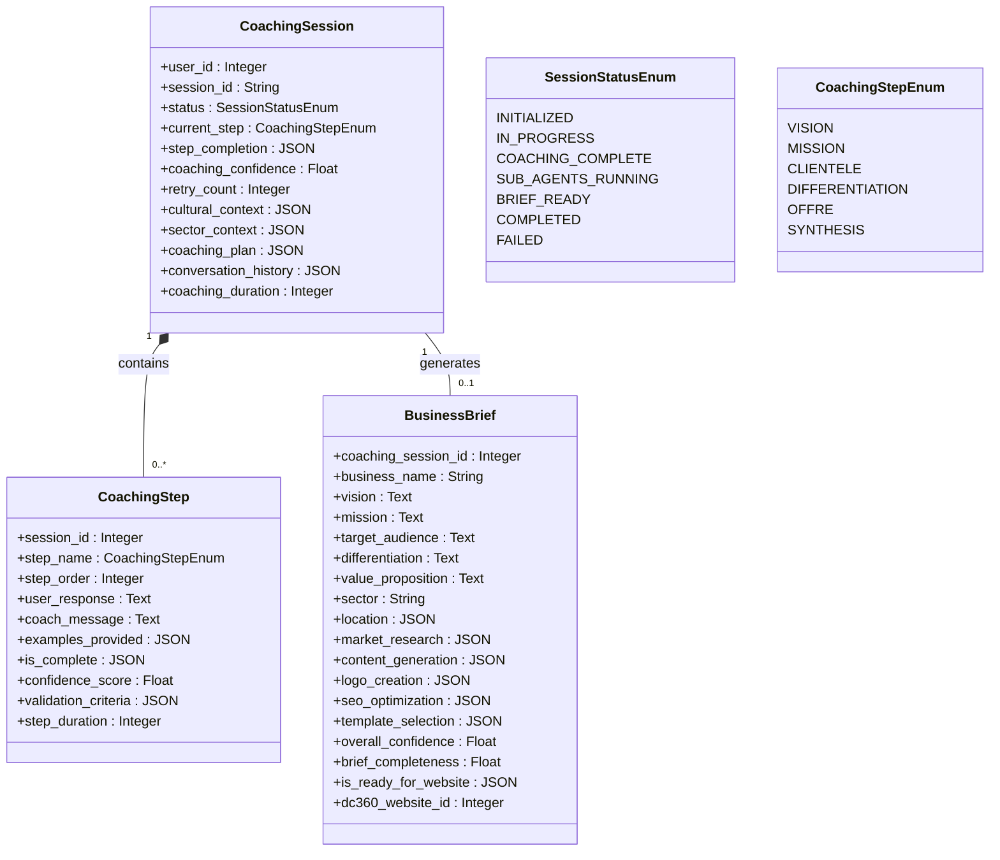
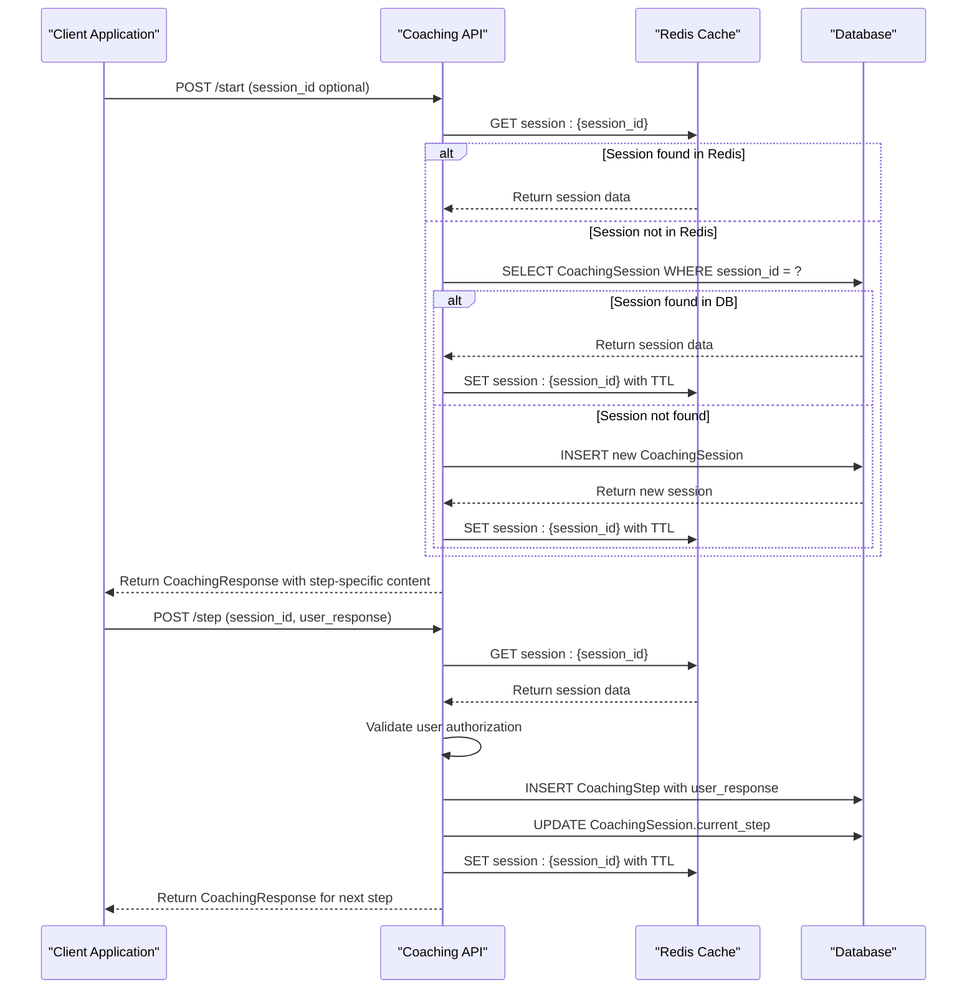

# Coaching Workflow

<cite>
**Referenced Files in This Document**   
- [coaching.py](file://app/api/v1/coaching.py#L1-L328)
- [coaching.py](file://app/models/coaching.py#L1-L122)
- [coaching.py](file://app/schemas/coaching.py#L1-L64)
- [business.py](file://app/api/v1/business.py#L1-L271)
- [langgraph_orchestrator.py](file://app/core/orchestration/langgraph_orchestrator.py#L1-L108)
- [redis_fs.py](file://app/core/integrations/redis_fs.py#L1-L60)
- [digitalcloud360.py](file://app/core/integrations/digitalcloud360.py#L1-L83)
</cite>

## Table of Contents
1. [Coaching Workflow Overview](#coaching-workflow-overview)
2. [Step-by-Step Coaching Process](#step-by-step-coaching-process)
3. [State Management and Persistence](#state-management-and-persistence)
4. [API Endpoint Interactions](#api-endpoint-interactions)
5. [Validation and Error Handling](#validation-and-error-handling)
6. [Post-Coaching Orchestration](#post-coaching-orchestration)
7. [Sequence Diagram: Coaching Flow](#sequence-diagram-coaching-flow)
8. [Edge Cases and Data Consistency](#edge-cases-and-data-consistency)

## Coaching Workflow Overview

The coaching workflow is a structured, multi-step process designed to guide users through defining key aspects of their business. It begins with vision and mission definition and progresses through target audience, differentiation, and offering stages. The system manages user progress through stateful sessions, ensuring continuity across interactions. Upon completion, the collected data triggers a sub-agent orchestration process to generate a comprehensive business brief and prepare for website creation.

**Section sources**
- [coaching.py](file://app/api/v1/coaching.py#L1-L328)
- [coaching.py](file://app/models/coaching.py#L1-L122)

## Step-by-Step Coaching Process

The coaching process follows a sequential flow of five core steps, each designed to extract specific business information from the user:

1. **Vision**: The initial step focuses on long-term ambition and impact. The system prompts the user with questions about their company's purpose and values, providing examples of visionary statements.

2. **Mission**: After establishing vision, the workflow transitions to mission definition. The system asks about the fundamental reason for the business's existence and its daily operations.

3. **Target Audience**: The third step identifies the primary customer base. The system prompts the user to define their ideal customers and understand their pain points.

4. **Differentiation**: This step focuses on competitive advantage. The system guides the user to articulate their unique value proposition and how they differ from competitors.

5. **Offering**: The final step details the specific products or services provided. The system collects information about the offerings, pricing, and sales channels.

Each step is implemented as a state transition in the coaching session, with the system providing tailored questions, examples, and feedback based on the current step.

**Section sources**
- [coaching.py](file://app/api/v1/coaching.py#L1-L328)
- [coaching.py](file://app/models/coaching.py#L1-L122)

## State Management and Persistence

The coaching session state is managed through a combination of database storage and Redis caching, ensuring both durability and performance.

### CoachingSession Model
The `CoachingSession` model in the database maintains the authoritative state of a coaching session:

```python
class CoachingSession(BaseModel):
    user_id = Column(Integer, ForeignKey("users.id"), nullable=False)
    session_id = Column(String, unique=True, nullable=False, index=True)
    status = Column(Enum(SessionStatusEnum), default=SessionStatusEnum.INITIALIZED)
    current_step = Column(Enum(CoachingStepEnum), default=CoachingStepEnum.VISION)
    step_completion = Column(JSON)
    coaching_confidence = Column(Float, default=0.0)
    retry_count = Column(Integer, default=0)
    cultural_context = Column(JSON)
    sector_context = Column(JSON)
    coaching_plan = Column(JSON)
    conversation_history = Column(JSON)
    coaching_duration = Column(Integer)
```

### Dual-Layer Persistence Strategy
The system employs a dual-layer persistence strategy:

1. **Redis Cache**: For high-performance access, session data is stored in Redis with a 2-hour TTL. This allows for fast retrieval and updates during active sessions.

2. **Database Storage**: For long-term persistence, session data is also stored in the PostgreSQL database. This serves as a fallback when Redis data expires and provides durability.

### Session Restoration
When a user resumes a coaching session, the system follows this restoration process:
1. First, it attempts to retrieve session data from Redis using the session ID.
2. If not found in Redis, it queries the database as a fallback.
3. If neither location contains the session, a new session is created.

This approach ensures user progress is preserved across sessions while maintaining system responsiveness.



**Diagram sources**
- [coaching.py](file://app/models/coaching.py#L1-L122)

**Section sources**
- [coaching.py](file://app/models/coaching.py#L1-L122)
- [coaching.py](file://app/api/v1/coaching.py#L1-L328)
- [redis_fs.py](file://app/core/integrations/redis_fs.py#L1-L60)

## API Endpoint Interactions

The coaching workflow is exposed through two primary API endpoints that handle session management and step progression.

### Start Coaching Session Endpoint
The `/start` endpoint initializes or resumes a coaching session:

```python
@router.post("/start", response_model=CoachingResponse)
async def start_coaching_session(request: CoachingRequest, db: AsyncSession = Depends(get_db), current_user: User = Depends(get_current_user), redis_client: redis.Redis = Depends(get_redis_client)):
```

This endpoint accepts an optional `session_id` parameter. If provided, it attempts to restore the existing session; otherwise, it creates a new one. The response includes the current step, coach message, examples, and next questions tailored to the step.

### Process Coaching Step Endpoint
The `/step` endpoint handles user responses and transitions between steps:

```python
@router.post("/step", response_model=CoachingResponse)
async def process_coaching_step(request: CoachingStepRequest, db: AsyncSession = Depends(get_db), current_user: User = Depends(get_current_user), redis_client: redis.Redis = Depends(get_redis_client)):
```

This endpoint validates the session ownership, processes the user's response for the current step, saves the response to the database, transitions to the next step, and returns a response appropriate for the new step.

### Request and Response Models
The API uses Pydantic models to define the structure of requests and responses:

- `CoachingRequest`: Contains an optional `session_id` for session continuation
- `CoachingStepRequest`: Contains the `session_id` and `user_response` for the current step
- `CoachingResponse`: Includes session ID, current step, coach message, examples, next questions, progress tracking, and completion status

These models ensure consistent data exchange between the client and server.

**Section sources**
- [coaching.py](file://app/api/v1/coaching.py#L1-L328)
- [coaching.py](file://app/schemas/coaching.py#L1-L64)

## Validation and Error Handling

The coaching workflow implements comprehensive validation and error handling to ensure data integrity and provide meaningful feedback to users.

### Input Validation
The system validates inputs at multiple levels:

1. **Pydantic Model Validation**: The `CoachingStepRequest` model ensures that `session_id` and `user_response` are provided and properly formatted.

2. **Session Existence Validation**: The system verifies that the requested session exists in either Redis or the database.

3. **Authorization Validation**: Before processing any step, the system checks that the current user owns the session by comparing user IDs.

4. **State Transition Validation**: The workflow enforces the correct sequence of steps, preventing invalid transitions.

### Error Handling Strategies
The system implements the following error handling strategies:

1. **HTTP 404 Not Found**: Returned when a session cannot be found in both Redis and the database.

2. **HTTP 403 Forbidden**: Returned when a user attempts to access a session they don't own.

3. **HTTP 500 Internal Server Error**: Returned for unexpected server-side errors, with appropriate logging.

4. **Graceful Degradation**: When Redis is unavailable, the system falls back to database storage, ensuring functionality is maintained.

The error handling is implemented using FastAPI's exception handling mechanisms, with detailed logging for debugging and monitoring purposes.

**Section sources**
- [coaching.py](file://app/api/v1/coaching.py#L1-L328)
- [coaching.py](file://app/schemas/coaching.py#L1-L64)

## Post-Coaching Orchestration

Upon completion of the coaching workflow, the system triggers a sophisticated orchestration process that leverages multiple specialized agents to generate a comprehensive business brief.

### Sub-Agent Architecture
The orchestration system consists of five specialized agents, each responsible for a specific aspect of business development:

1. **Research Agent**: Uses the Tavily API to conduct market research and competitor analysis.
2. **Content Agent**: Leverages the OpenAI API to generate website content based on the business brief.
3. **Logo Agent**: Integrates with LogoAI to create a custom logo for the business.
4. **SEO Agent**: Generates SEO keywords and meta-descriptions using market data.
5. **Template Agent**: Selects an appropriate website template based on the business type.

### Orchestration Workflow
The agents are coordinated by the `LangGraphOrchestrator`, which implements a directed acyclic graph (DAG) workflow:

1. The **Research Agent** executes first, gathering market intelligence.
2. The **Research Agent's** output is used by the **Content**, **Logo**, **SEO**, and **Template** agents, which execute in parallel.
3. All agents contribute to the final business brief, which is assembled and stored.

### Business Brief Generation
After the sub-agents complete their tasks, the system generates a comprehensive business brief that includes:

- Business name, vision, and mission
- Target audience and differentiation strategy
- Market research findings
- Generated website content
- Logo and branding assets
- SEO optimization data
- Selected website template

The completed brief is stored in a Redis Virtual File System and can be used to create a website on DigitalCloud360.

```mermaid
sequenceDiagram
participant User as "User"
participant API as "Coaching API"
participant DB as "Database"
participant Redis as "Redis Cache"
participant Orchestrator as "LangGraphOrchestrator"
participant Research as "Research Agent"
participant Content as "Content Agent"
participant Logo as "Logo Agent"
participant SEO as "Seo Agent"
participant Template as "Template Agent"
User->>API : POST /start
API->>Redis : Check session data
alt Session exists
Redis-->>API : Return session data
else New session
API->>DB : Create new CoachingSession
DB-->>API : Session created
API->>Redis : Store session data
end
API-->>User : Return step-specific response
loop For each coaching step
User->>API : POST /step with response
API->>Redis : Validate session
API->>DB : Save CoachingStep
API->>DB : Update CoachingSession.current_step
API->>Redis : Update session data
API-->>User : Return next step response
end
alt Final step completed
API->>Orchestrator : Trigger business brief generation
Orchestrator->>Research : Execute research
Research->>Tavily : Search market data
Tavily-->>Research : Return research data
Research-->>Orchestrator : Return results
Orchestrator->>Content : Generate content
Orchestrator->>Logo : Generate logo
Orchestrator->>SEO : Generate SEO data
Orchestrator->>Template : Select template
parallel Content, Logo, SEO, Template processing
Content->>OpenAI : Generate text
OpenAI-->>Content : Return content
Content-->>Orchestrator : Return results
Logo->>LogoAI : Generate logo
LogoAI-->>Logo : Return logo URL
Logo-->>Orchestrator : Return results
SEO->>Tavily : Search keywords
Tavily-->>SEO : Return keywords
SEO-->>Orchestrator : Return results
Template-->>Orchestrator : Return selected template
end
Orchestrator-->>API : Return assembled brief
API->>Redis : Store business brief
API-->>User : Confirm coaching completion
end
```

**Diagram sources**
- [coaching.py](file://app/api/v1/coaching.py#L1-L328)
- [langgraph_orchestrator.py](file://app/core/orchestration/langgraph_orchestrator.py#L1-L108)
- [business.py](file://app/api/v1/business.py#L1-L271)

**Section sources**
- [langgraph_orchestrator.py](file://app/core/orchestration/langgraph_orchestrator.py#L1-L108)
- [business.py](file://app/api/v1/business.py#L1-L271)
- [coaching.py](file://app/api/v1/coaching.py#L1-L328)

## Sequence Diagram: Coaching Flow

The following sequence diagram illustrates the complete flow from API request to model update and state transition in the coaching workflow.



This diagram shows the interaction between components during both session initialization and step processing. The system prioritizes Redis for performance but falls back to the database for durability, ensuring a seamless user experience while maintaining data integrity.

**Diagram sources**
- [coaching.py](file://app/api/v1/coaching.py#L1-L328)
- [redis_fs.py](file://app/core/integrations/redis_fs.py#L1-L60)

**Section sources**
- [coaching.py](file://app/api/v1/coaching.py#L1-L328)

## Edge Cases and Data Consistency

The coaching workflow addresses several edge cases to ensure robustness and data consistency.

### Incomplete Steps
If a user abandons a coaching session before completion, the system preserves their progress. When they return, the session resumes from the last completed step. The `current_step` field in the `CoachingSession` model tracks their position, and the `step_completion` JSON field records which steps have been completed.

### Session Timeouts
Sessions in Redis have a 2-hour TTL (time-to-live). If a session expires in Redis but the user returns after this period, the system retrieves the session data from the database as a fallback. This ensures that users don't lose their progress due to temporary inactivity.

### Data Consistency
The system maintains data consistency through several mechanisms:

1. **Database Transactions**: When updating the coaching session state, the system uses database transactions to ensure atomicity.

2. **Synchronized Cache Updates**: After updating the database, the system immediately updates the Redis cache to prevent stale data.

3. **Foreign Key Constraints**: The database schema enforces referential integrity between `CoachingSession` and `CoachingStep` records.

4. **UUID Session IDs**: Universally unique identifiers prevent session ID collisions.

### Error Recovery
In case of system failures, the dual persistence strategy (Redis + database) provides redundancy. If Redis becomes unavailable, the system continues to function using the database as the primary data store, albeit with reduced performance. When Redis is restored, the system can repopulate the cache from the database.

**Section sources**
- [coaching.py](file://app/api/v1/coaching.py#L1-L328)
- [coaching.py](file://app/models/coaching.py#L1-L122)
- [redis_fs.py](file://app/core/integrations/redis_fs.py#L1-L60)