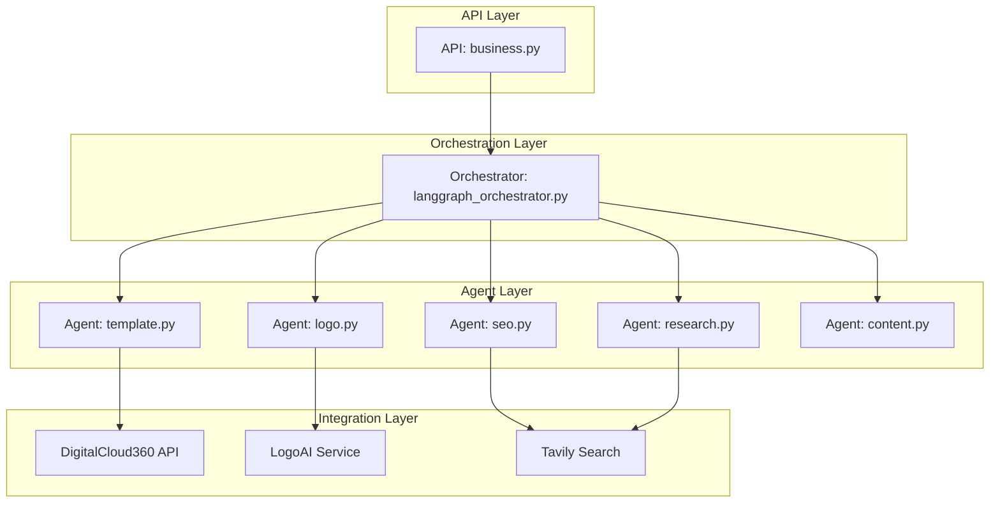
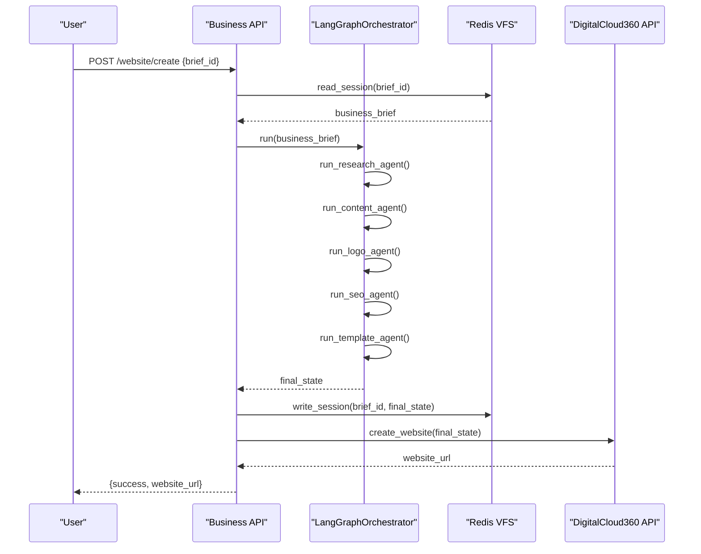
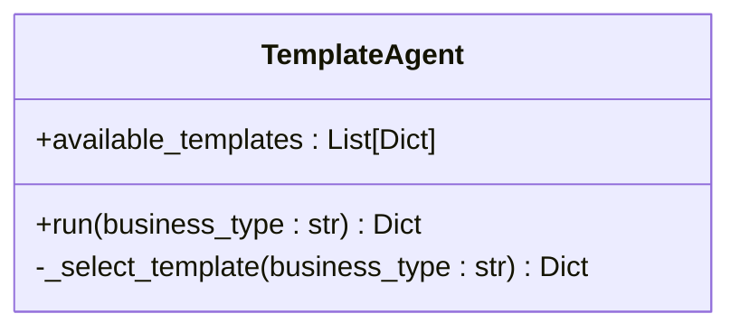
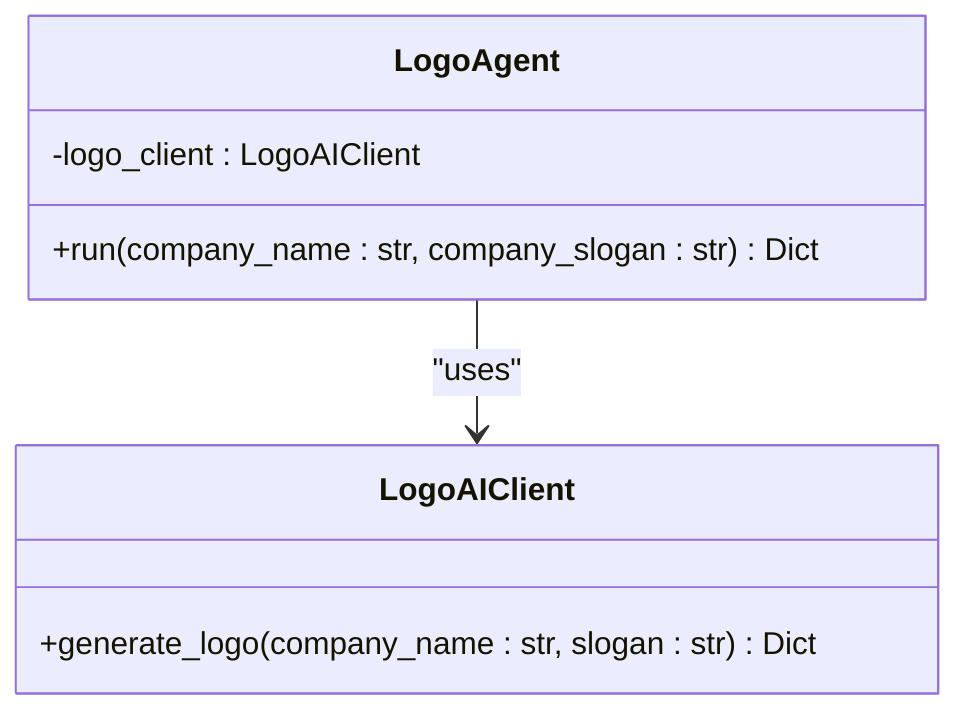
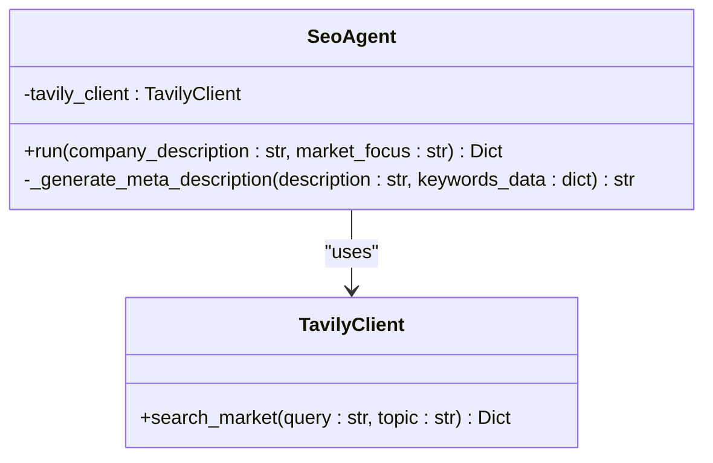
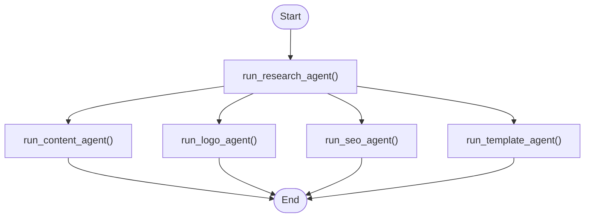
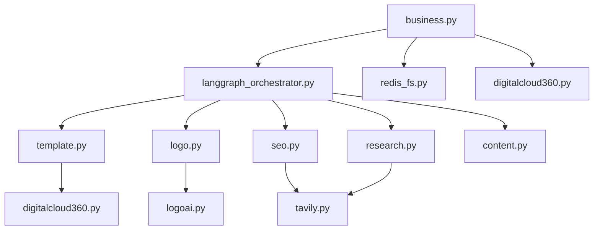

# Website Creation Pipeline

<cite>
**Referenced Files in This Document**   
- [business.py](file://app/api/v1/business.py)
- [digitalcloud360.py](file://app/core/integrations/digitalcloud360.py)
- [template.py](file://app/core/agents/template.py)
- [logo.py](file://app/core/agents/logo.py)
- [seo.py](file://app/core/agents/seo.py)
- [langgraph_orchestrator.py](file://app/core/orchestration/langgraph_orchestrator.py)
- [settings.py](file://app/config/settings.py)
- [coaching.py](file://app/models/coaching.py)
</cite>

## Table of Contents
1. [Introduction](#introduction)
2. [Project Structure](#project-structure)
3. [Core Components](#core-components)
4. [Architecture Overview](#architecture-overview)
5. [Detailed Component Analysis](#detailed-component-analysis)
6. [Dependency Analysis](#dependency-analysis)
7. [Performance Considerations](#performance-considerations)
8. [Troubleshooting Guide](#troubleshooting-guide)
9. [Conclusion](#conclusion)

## Introduction
This document provides a comprehensive overview of the website creation pipeline within the Genesis AI Service. The pipeline transforms a business brief into a fully functional website hosted on DigitalCloud360. It leverages an orchestrated multi-agent system to generate content, logo, SEO metadata, and select an appropriate template. The process is automated, scalable, and designed for reliability with robust error handling and retry mechanisms.

## Project Structure
The project follows a modular structure with clear separation of concerns. Key directories include:
- `app/api/v1`: REST API endpoints for business operations
- `app/core/agents`: Specialized agents for content, logo, SEO, and template generation
- `app/core/integrations`: External service clients (DigitalCloud360, LogoAI, Tavily)
- `app/core/orchestration`: Workflow coordination using LangGraph
- `app/models`: Database models for business data
- `app/config`: Application settings and environment variables

**Diagram sources**
- [business.py](file://app/api/v1/business.py#L1-L270)
- [langgraph_orchestrator.py](file://app/core/orchestration/langgraph_orchestrator.py#L1-L107)
- [template.py](file://app/core/agents/template.py#L1-L59)
- [logo.py](file://app/core/agents/logo.py#L1-L43)
- [seo.py](file://app/core/agents/seo.py#L1-L55)

**Section sources**
- [business.py](file://app/api/v1/business.py#L1-L270)
- [langgraph_orchestrator.py](file://app/core/orchestration/langgraph_orchestrator.py#L1-L107)

## Core Components
The website creation pipeline consists of several core components:
- **TemplateAgent**: Selects a website template based on business type
- **LogoAgent**: Generates a logo using an external LogoAI service
- **SeoAgent**: Optimizes SEO by generating keywords and meta descriptions
- **LangGraphOrchestrator**: Coordinates the execution of all agents
- **DigitalCloud360APIClient**: Deploys the final website to DigitalCloud360
- **RedisVirtualFileSystem**: Stores intermediate and final brief data

These components work together to transform a business brief into a deployable website.

**Section sources**
- [template.py](file://app/core/agents/template.py#L1-L59)
- [logo.py](file://app/core/agents/logo.py#L1-L43)
- [seo.py](file://app/core/agents/seo.py#L1-L55)
- [langgraph_orchestrator.py](file://app/core/orchestration/langgraph_orchestrator.py#L1-L107)
- [digitalcloud360.py](file://app/core/integrations/digitalcloud360.py#L1-L82)

## Architecture Overview
The website creation pipeline follows a sequential and parallel hybrid architecture. The process begins with a business brief, which is processed by the LangGraphOrchestrator. The orchestrator first runs the ResearchAgent, then executes the ContentAgent, LogoAgent, SeoAgent, and TemplateAgent in parallel. Once all agents complete, the results are validated and stored in Redis. Finally, the website is deployed to DigitalCloud360 via its API.

**Diagram sources**
- [business.py](file://app/api/v1/business.py#L1-L270)
- [langgraph_orchestrator.py](file://app/core/orchestration/langgraph_orchestrator.py#L1-L107)
- [digitalcloud360.py](file://app/core/integrations/digitalcloud360.py#L1-L82)

## Detailed Component Analysis

### TemplateAgent Analysis
The TemplateAgent selects a website template based on the business type provided in the brief. It uses a simple rule-based approach to match business types to templates.

**Diagram sources**
- [template.py](file://app/core/agents/template.py#L1-L59)

**Section sources**
- [template.py](file://app/core/agents/template.py#L1-L59)

### LogoAgent Analysis
The LogoAgent generates a logo by calling an external LogoAI service. It passes the company name and optional slogan to the service and returns the generated logo URL.

**Diagram sources**
- [logo.py](file://app/core/agents/logo.py#L1-L43)
- [logoai.py](file://app/core/integrations/logoai.py)

**Section sources**
- [logo.py](file://app/core/agents/logo.py#L1-L43)

### SeoAgent Analysis
The SeoAgent performs SEO optimization by searching for relevant keywords using the Tavily API and generating a meta description based on the company description and keywords.

**Diagram sources**
- [seo.py](file://app/core/agents/seo.py#L1-L55)
- [tavily.py](file://app/core/integrations/tavily.py)

**Section sources**
- [seo.py](file://app/core/agents/seo.py#L1-L55)

### LangGraphOrchestrator Analysis
The LangGraphOrchestrator coordinates the execution of all agents using a state graph. It initializes each agent and defines the workflow where research is the entry point, followed by parallel execution of content, logo, SEO, and template agents.

**Diagram sources**
- [langgraph_orchestrator.py](file://app/core/orchestration/langgraph_orchestrator.py#L1-L107)

**Section sources**
- [langgraph_orchestrator.py](file://app/core/orchestration/langgraph_orchestrator.py#L1-L107)

## Dependency Analysis
The website creation pipeline has a well-defined dependency structure. The Business API depends on the LangGraphOrchestrator, which in turn depends on all individual agents. Each agent may depend on external services. The DigitalCloud360APIClient is used for deployment, and Redis is used for state persistence.

**Diagram sources**
- [business.py](file://app/api/v1/business.py#L1-L270)
- [langgraph_orchestrator.py](file://app/core/orchestration/langgraph_orchestrator.py#L1-L107)
- [digitalcloud360.py](file://app/core/integrations/digitalcloud360.py#L1-L82)
- [redis_fs.py](file://app/core/integrations/redis_fs.py)

**Section sources**
- [business.py](file://app/api/v1/business.py#L1-L270)
- [langgraph_orchestrator.py](file://app/core/orchestration/langgraph_orchestrator.py#L1-L107)

## Performance Considerations
The pipeline is optimized for performance through parallel agent execution and retry mechanisms. The DigitalCloud360APIClient uses exponential backoff with a maximum of 3 retries and a 30-second timeout. Agent operations are asynchronous, allowing concurrent execution. The Redis Virtual File System provides low-latency storage for brief data.

Key performance parameters:
- **Timeout**: 30 seconds for external API calls
- **Max Retries**: 3 with exponential backoff
- **Parallel Execution**: Content, logo, SEO, and template agents run in parallel
- **Caching**: Redis stores intermediate and final brief states

**Section sources**
- [digitalcloud360.py](file://app/core/integrations/digitalcloud360.py#L1-L82)
- [settings.py](file://app/config/settings.py)

## Troubleshooting Guide
Common failure scenarios and their handling:

**Brief Not Found**
- **Cause**: Invalid brief_id or user does not own the brief
- **Error Code**: 404 NOT FOUND
- **Solution**: Verify brief_id and user authentication

**Incomplete Brief**
- **Cause**: Missing required agent results (content, logo, SEO, template)
- **Error Code**: 422 UNPROCESSABLE ENTITY
- **Solution**: Regenerate missing sections via /regenerate endpoint

**DigitalCloud360 API Failure**
- **Cause**: Network issues, service downtime, or invalid payload
- **Error Code**: 500 INTERNAL SERVER ERROR
- **Solution**: Retry with exponential backoff; check service health

**Agent Execution Failure**
- **Cause**: External service failure (LogoAI, Tavily)
- **Error Code**: 500 INTERNAL SERVER ERROR with specific agent error code
- **Solution**: Check external service status; retry operation

**Rollback Procedure**
In case of deployment failure, the system does not automatically rollback. The brief remains in Redis, and the user can:
1. Fix the issue (e.g., regenerate assets)
2. Re-attempt deployment
3. The dc360_website_id field in the BusinessBrief model tracks successful deployments

**Section sources**
- [business.py](file://app/api/v1/business.py#L1-L270)
- [digitalcloud360.py](file://app/core/integrations/digitalcloud360.py#L1-L82)
- [coaching.py](file://app/models/coaching.py#L85-L120)

## Conclusion
The website creation pipeline is a robust, agent-driven system that automates the transformation of a business brief into a fully functional website. By leveraging specialized agents coordinated through LangGraph, the system ensures high-quality outputs for template selection, logo generation, and SEO optimization. Integration with DigitalCloud360 enables seamless deployment, while Redis provides reliable state management. The architecture supports scalability, fault tolerance through retry mechanisms, and ease of maintenance through modular design.