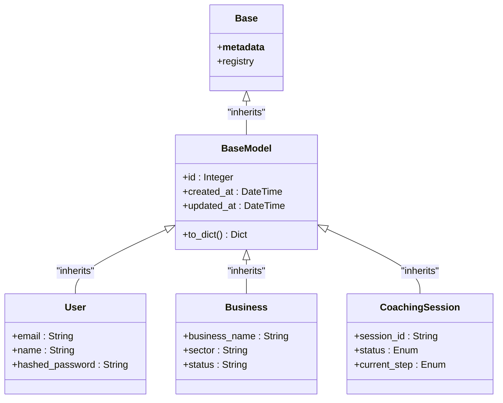

# Base Model & Mixins

<cite>
**Referenced Files in This Document**   
- [base.py](file://app/models/base.py)
- [database.py](file://app/config/database.py)
- [user.py](file://app/models/user.py)
- [business.py](file://app/models/business.py)
- [coaching.py](file://app/models/coaching.py)
</cite>

## Table of Contents
1. [Introduction](#introduction)
2. [Base Model Implementation](#base-model-implementation)
3. [Declarative Base Pattern](#declarative-base-pattern)
4. [Common Fields and Timestamps](#common-fields-and-timestamps)
5. [Primary Key Strategy](#primary-key-strategy)
6. [Table Naming Conventions](#table-naming-conventions)
7. [Model Inheritance Examples](#model-inheritance-examples)
8. [Custom Base Methods](#custom-base-methods)
9. [Metadata Configuration](#metadata-configuration)
10. [Benefits of Shared Foundation](#benefits-of-shared-foundation)

## Introduction
This document provides comprehensive documentation for the Base model and shared mixins used across all SQLAlchemy models in the Genesis AI Service. The architecture establishes a consistent foundation for all database entities, ensuring uniformity in structure, behavior, and functionality throughout the application. The implementation leverages SQLAlchemy's declarative base pattern to create a centralized model hierarchy that promotes maintainability, consistency, and efficient database operations.

## Base Model Implementation

The base model implementation is defined in `base.py` and serves as the foundation for all database models in the application. It establishes a common structure with shared fields and utility methods that are inherited by all concrete models.

```python
"""Base model class with common fields and utilities"""

from sqlalchemy import Column, Integer, DateTime, String
from sqlalchemy.orm import declarative_base
from sqlalchemy.sql import func
from datetime import datetime

Base = declarative_base()

class BaseModel(Base):
    """Base model with common fields"""
    __abstract__ = True
    
    id = Column(Integer, primary_key=True, index=True)
    created_at = Column(DateTime, default=func.now(), nullable=False)
    updated_at = Column(DateTime, default=func.now(), onupdate=func.now(), nullable=False)
    
    def to_dict(self):
        """Convert model to dictionary"""
        return {c.name: getattr(self, c.name) for c in self.__table__.columns}
```

The implementation follows a two-tier approach:
- `Base`: The declarative base created by `declarative_base()` that contains the metadata for all models
- `BaseModel`: An abstract base class that inherits from `Base` and defines common fields and methods

**Section sources**
- [base.py](file://app/models/base.py#L0-L19)

## Declarative Base Pattern

The application implements SQLAlchemy's declarative base pattern, which allows classes to be mapped to database tables using a declarative syntax. This pattern provides several advantages for ORM configuration and model management.



**Diagram sources**
- [base.py](file://app/models/base.py#L0-L19)
- [user.py](file://app/models/user.py#L0-L41)
- [business.py](file://app/models/business.py#L0-L71)
- [coaching.py](file://app/models/coaching.py#L0-L120)

The declarative base pattern is implemented through:
- `Base = declarative_base()`: Creates the base class with metadata for all models
- Centralized import: The `Base` is imported in `database.py` for table creation
- Model registration: All models inherit from `BaseModel`, which inherits from `Base`

This approach enables the ORM to automatically manage table creation, relationships, and queries based on the class definitions.

**Section sources**
- [base.py](file://app/models/base.py#L0-L19)
- [database.py](file://app/config/database.py#L0-L43)

## Common Fields and Timestamps

The `BaseModel` class provides common fields that are inherited by all models in the application. These fields ensure consistency across all database entities and provide essential metadata for tracking and auditing.

### Timestamp Fields
The model includes automatic timestamp management through two fields:
- `created_at`: Records when a record is first created
- `updated_at`: Automatically updates whenever a record is modified

These timestamps are configured with SQLAlchemy's `func.now()` function, which generates the current timestamp at the database level rather than the application level. This ensures consistency across distributed systems and prevents issues with clock synchronization.

```python
created_at = Column(DateTime, default=func.now(), nullable=False)
updated_at = Column(DateTime, default=func.now(), onupdate=func.now(), nullable=False)
```

The `onupdate=func.now()` parameter ensures that the `updated_at` field is automatically refreshed whenever the record is updated, without requiring manual intervention in the application code.

**Section sources**
- [base.py](file://app/models/base.py#L0-L19)

## Primary Key Strategy

The application uses integer auto-increment primary keys for all models, rather than UUIDs. This strategy provides several benefits for performance and simplicity.

```python
id = Column(Integer, primary_key=True, index=True)
```

### Integer vs UUID Analysis
While UUIDs are used for certain identifiers in the application (such as `session_id` in `CoachingSession`), the primary keys for database tables use integer auto-increment values. This hybrid approach balances the benefits of both strategies:

- **Integer Primary Keys**: Used for database relationships and foreign keys, providing optimal performance for joins and indexing
- **UUID Identifiers**: Used for external-facing identifiers (like session IDs) to prevent enumeration attacks and ensure global uniqueness

The codebase shows UUID usage in specific contexts:
```python
new_session_id = str(uuid.uuid4())  # Used for coaching sessions
brief_id = f"brief_{uuid.uuid4()}"  # Used for business briefs
```

This demonstrates that while UUIDs are available and used for specific purposes, they are not employed as primary keys for database tables.

**Section sources**
- [base.py](file://app/models/base.py#L0-L19)
- [coaching.py](file://app/models/coaching.py#L27-L120)
- [api/v1/coaching.py](file://app/api/v1/coaching.py#L0-L63)

## Table Naming Conventions

The application follows a consistent table naming convention across all models. Each concrete model specifies its table name using the `__tablename__` attribute.

### Naming Pattern
The naming convention uses plural snake_case format:
- `users` for the User model
- `businesses` for the Business model
- `coaching_sessions` for the CoachingSession model
- `business_contexts` for the BusinessContext model

This consistent approach makes it easy to understand the relationship between models and their corresponding database tables. The naming convention is applied uniformly across all models in the application.

```python
class User(BaseModel):
    __tablename__ = "users"
    # ...

class Business(BaseModel):
    __tablename__ = "businesses"
    # ...

class CoachingSession(BaseModel):
    __tablename__ = "coaching_sessions"
    # ...
```

**Section sources**
- [user.py](file://app/models/user.py#L0-L41)
- [business.py](file://app/models/business.py#L0-L71)
- [coaching.py](file://app/models/coaching.py#L0-L120)

## Model Inheritance Examples

Multiple models in the application inherit from the `BaseModel` class, demonstrating the practical application of the shared foundation.

### User Model
The `User` model extends `BaseModel` and adds user-specific fields:

```python
class User(BaseModel):
    """User model for authentication"""
    __tablename__ = "users"
    
    id = Column(Integer, primary_key=True, index=True)
    email = Column(String, unique=True, nullable=False, index=True)
    name = Column(String, nullable=False)
    hashed_password = Column(String, nullable=False)
    
    # Relationships
    profile = relationship("UserProfile", back_populates="user", uselist=False, cascade="all, delete-orphan")
    coaching_sessions = relationship("CoachingSession", back_populates="user", cascade="all, delete-orphan")
```

### Business Model
The `Business` model extends `BaseModel` with business-specific attributes:

```python
class Business(BaseModel):
    """Business entity created from coaching"""
    __tablename__ = "businesses"
    
    business_name = Column(String, nullable=False, index=True)
    sector = Column(String, nullable=False, index=True)
    user_id = Column(Integer, ForeignKey("users.id"), nullable=False)
    status = Column(String, default="draft")
    
    # Relationships
    user = relationship("User")
    business_context = relationship("BusinessContext", back_populates="business", uselist=False)
```

These examples show how all models inherit the common fields (`id`, `created_at`, `updated_at`) from `BaseModel` while adding their specific attributes and relationships.

**Section sources**
- [user.py](file://app/models/user.py#L0-L41)
- [business.py](file://app/models/business.py#L0-L71)

## Custom Base Methods

The `BaseModel` class includes a custom utility method that enhances its functionality:

### to_dict() Method
```python
def to_dict(self):
    """Convert model to dictionary"""
    return {c.name: getattr(self, c.name) for c in self.__table__.columns}
```

This method provides a convenient way to convert a model instance to a dictionary representation, which is particularly useful for:
- API responses
- Logging and debugging
- Data serialization
- Integration with external systems

The implementation uses SQLAlchemy's introspection capabilities to dynamically access all column values from the model instance, ensuring that the dictionary representation includes all fields without requiring manual specification.

**Section sources**
- [base.py](file://app/models/base.py#L0-L19)

## Metadata Configuration

The metadata configuration is managed through the declarative base system and the database initialization process.

### Metadata Registration
The `Base` object created by `declarative_base()` contains the `MetaData` object that stores information about all tables. This metadata is used for:
- Creating tables in the database
- Managing relationships between tables
- Generating SQL queries

### Table Creation Process
The database configuration in `database.py` handles the metadata usage:

```python
async def create_tables():
    """Create all tables in the database"""
    import app.models.user
    import app.models.business
    import app.models.coaching
    async with engine.begin() as conn:
        await conn.run_sync(Base.metadata.create_all)
    logger.info("Database tables created")
```

This function explicitly imports all models to ensure they are registered with the `Base` metadata before creating the tables. This approach guarantees that all models are known to the metadata system before table creation.

**Section sources**
- [base.py](file://app/models/base.py#L0-L19)
- [database.py](file://app/config/database.py#L0-L43)

## Benefits of Shared Foundation

The shared foundation provided by the `BaseModel` and declarative base pattern offers several significant benefits for the application:

### Consistency
All models have a uniform structure with standardized fields (`id`, `created_at`, `updated_at`), ensuring predictable behavior across the entire application.

### Maintainability
Changes to common functionality (like timestamp handling or the `to_dict` method) can be made in a single location and automatically propagate to all models.

### Database Operations
The consistent structure simplifies database operations such as:
- Auditing and tracking changes
- Querying by creation or update time
- Implementing soft delete patterns (though not currently implemented)
- Managing relationships between entities

### Development Efficiency
Developers can quickly create new models by extending `BaseModel`, inheriting all common functionality without duplication.

### ORM Integration
The declarative base pattern provides seamless integration with SQLAlchemy's ORM features, including automatic relationship management, query generation, and transaction handling.

This architectural approach establishes a robust foundation for the application's data layer, supporting current functionality while providing flexibility for future enhancements.

**Section sources**
- [base.py](file://app/models/base.py#L0-L19)
- [database.py](file://app/config/database.py#L0-L43)
- [user.py](file://app/models/user.py#L0-L41)
- [business.py](file://app/models/business.py#L0-L71)
- [coaching.py](file://app/models/coaching.py#L0-L120)