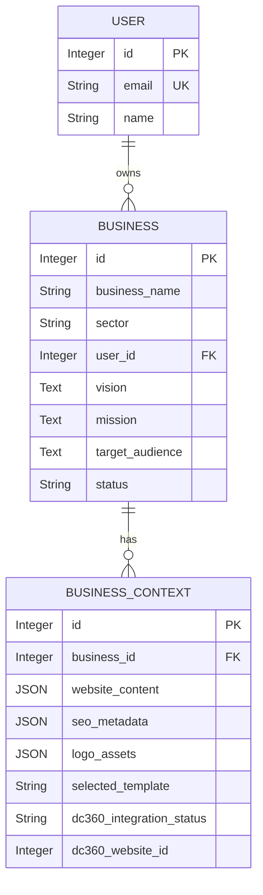
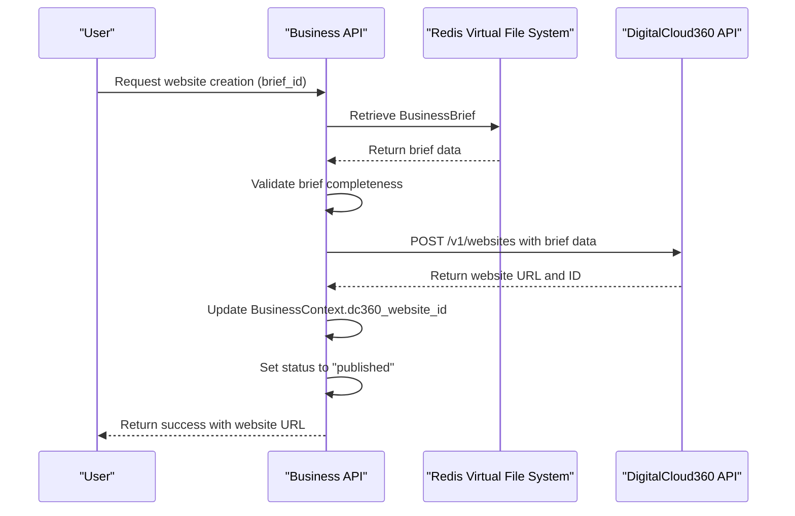
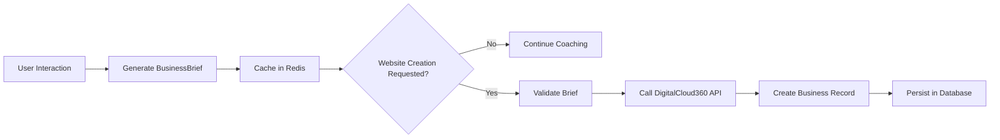

# Business Model

<cite>
**Referenced Files in This Document**   
- [business.py](file://app/models/business.py#L0-L72)
- [coaching.py](file://app/models/coaching.py#L85-L121)
- [business.py](file://app/api/v1/business.py#L71-L270)
- [digitalcloud360.py](file://app/core/integrations/digitalcloud360.py#L0-L82)
- [redis_fs.py](file://app/core/integrations/redis_fs.py#L0-L59)
- [user.py](file://app/models/user.py#L0-L42)
</cite>

## Table of Contents
1. [Business Model Overview](#business-model-overview)
2. [Field Specifications](#field-specifications)
3. [Relationships with Other Models](#relationships-with-other-models)
4. [Workflow Integration](#workflow-integration)
5. [Query Examples](#query-examples)
6. [DigitalCloud360 Publishing Workflow](#digitalcloud360-publishing-workflow)
7. [Data Validation Rules](#data-validation-rules)
8. [Security Considerations](#security-considerations)
9. [Caching Strategy](#caching-strategy)

## Business Model Overview

The **Business** model represents finalized entrepreneurial ventures ready for website publication. It is the culmination of the AI coaching and brief generation workflow, capturing essential business information derived from user interactions and agent processing. The model serves as a persistent record of a user's business concept, including its vision, mission, target audience, and market positioning.

This model is designed to store core business metadata and act as the foundation for generating a complete digital presence through integration with external publishing systems.

**Section sources**
- [business.py](file://app/models/business.py#L0-L33)

## Field Specifications

The **Business** model contains the following fields:

- **business_name**: `String`, required, indexed. The official name of the business.
- **sector**: `String`, required, indexed. The industry or market sector the business operates in.
- **user_id**: `Integer`, required, foreign key to `users.id`. Identifies the user who owns the business.
- **vision**: `Text`. The long-term vision of the business.
- **mission**: `Text`. The core mission statement of the business.
- **target_audience**: `Text`. Description of the intended customer base.
- **differentiation**: `Text`. How the business differentiates itself from competitors.
- **value_proposition**: `Text`. The unique value the business offers to customers.
- **location**: `JSON`. Geographic location data in the format `{"city": "Dakar", "country": "Sénégal"}`.
- **cultural_context**: `JSON`. Additional cultural or regional context relevant to the business.
- **status**: `String`, default `"draft"`. Current status of the business (e.g., draft, active, paused).

Additionally, the **BusinessContext** model extends the Business model with generated assets and metadata:

- **website_content**: `JSON`. Structured content for the business website.
- **seo_metadata**: `JSON`. Search engine optimization metadata including keywords and meta tags.
- **logo_assets**: `JSON`. URLs and metadata for generated logos.
- **selected_template**: `String`. The chosen website template.
- **dc360_integration_status**: `String`, default `"pending"`. Tracks integration status with DigitalCloud360.
- **dc360_website_id**: `Integer`. The ID of the published website on DigitalCloud360.

**Section sources**
- [business.py](file://app/models/business.py#L0-L72)

## Relationships with Other Models

The **Business** model has the following relationships:

- **User**: A many-to-one relationship where each business belongs to a single user via the `user_id` foreign key. The `User` model contains authentication and profile data.
- **BusinessContext**: A one-to-one relationship where each business has an associated `BusinessContext` that stores extended metadata, generated assets, and integration status.

The **BusinessBrief** model, which is part of the coaching workflow, shares many fields with the **Business** model (e.g., `business_name`, `vision`, `mission`, `target_audience`, `sector`, `location`). However, it is stored temporarily in Redis and serves as an intermediate output of the coaching process before being finalized into a persistent **Business** entity.



**Diagram sources**
- [business.py](file://app/models/business.py#L0-L72)
- [user.py](file://app/models/user.py#L0-L42)

**Section sources**
- [business.py](file://app/models/business.py#L0-L72)
- [user.py](file://app/models/user.py#L0-L42)
- [coaching.py](file://app/models/coaching.py#L85-L121)

## Workflow Integration

The **Business** model serves as the final output of the coaching and brief generation workflow. The process begins with a **CoachingSession**, where users interact with AI agents to define their business concept. Upon completion, a **BusinessBrief** is generated, containing all necessary components (content, logo, SEO, template) to create a website.

When the user requests website creation, the system validates the **BusinessBrief** and uses it to create a **Business** record. This model then acts as the authoritative source for the published venture.



**Diagram sources**
- [business.py](file://app/api/v1/business.py#L192-L258)
- [digitalcloud360.py](file://app/core/integrations/digitalcloud360.py#L0-L82)

**Section sources**
- [business.py](file://app/api/v1/business.py#L192-L258)
- [coaching.py](file://app/models/coaching.py#L85-L121)

## Query Examples

### Retrieve Published Businesses
To retrieve all published businesses for a specific user:
```sql
SELECT * FROM businesses 
WHERE user_id = :user_id 
AND status = 'active';
```

### Check Publication Status
To check the publication status of a specific business:
```sql
SELECT b.status, bc.dc360_integration_status, bc.dc360_website_id 
FROM businesses b
LEFT JOIN business_contexts bc ON b.id = bc.business_id
WHERE b.id = :business_id;
```

**Section sources**
- [business.py](file://app/models/business.py#L0-L72)

## DigitalCloud360 Publishing Workflow

The **Business** model integrates with the **DigitalCloud360** publishing workflow through the `DigitalCloud360APIClient`. When a user requests website creation, the system:

1. Retrieves the **BusinessBrief** from Redis.
2. Validates that all required components (`content`, `logo`, `seo`, `template`) are present.
3. Calls the `create_website` method of `DigitalCloud360APIClient` with the brief data.
4. Upon successful creation, stores the returned `website_url` and `dc360_website_id` in the **BusinessContext**.
5. Updates the `dc360_integration_status` to `"completed"`.

Data synchronization is handled through API calls, with no direct database synchronization. The system relies on the external service to maintain the published website state.

```mermaid
flowchart TD
A["User Requests Website Creation"] --> B{Brief Valid?}
B --> |No| C[Return Error: Incomplete Brief]
B --> |Yes| D[Call DigitalCloud360.create_website()]
D --> E{API Success?}
E --> |No| F[Log Error, Return Failure]
E --> |Yes| G[Store dc360_website_id]
G --> H[Update dc360_integration_status]
H --> I[Return Success with URL]
```

**Diagram sources**
- [business.py](file://app/api/v1/business.py#L192-L258)
- [digitalcloud360.py](file://app/core/integrations/digitalcloud360.py#L0-L82)

**Section sources**
- [business.py](file://app/api/v1/business.py#L192-L258)
- [digitalcloud360.py](file://app/core/integrations/digitalcloud360.py#L0-L82)

## Data Validation Rules

While domain name and URL validation rules are not explicitly defined in the provided code, the system enforces data completeness before publishing:

- The `create_website_from_brief` endpoint validates that the **BusinessBrief** contains all required components: `content`, `logo`, `seo`, and `template`.
- The **BusinessBrief** model requires non-null values for `business_name`, `vision`, `mission`, `target_audience`, `differentiation`, `value_proposition`, and `sector`.
- URL and domain validation is expected to be handled by the **DigitalCloud360** service during website creation.

Future enhancements should include explicit validation for:
- Domain name format (e.g., regex pattern)
- URL structure and protocol
- Logo URL accessibility
- SEO metadata completeness

**Section sources**
- [business.py](file://app/api/v1/business.py#L226-L258)
- [coaching.py](file://app/models/coaching.py#L85-L121)

## Security Considerations

User-generated website content is subject to the following security considerations:

- All content is generated by AI agents within a controlled environment, reducing direct injection risks.
- The **DigitalCloud360** service is responsible for sanitizing and securing the final website content.
- The system uses service-to-service authentication with a shared secret (`X-Service-Secret`) when communicating with **DigitalCloud360**.
- Business data is stored in a secure database with access controlled through user authentication and authorization.
- Content is transmitted over HTTPS, and API endpoints require authenticated sessions.

No client-side script injection or direct user content submission is currently implemented, minimizing XSS and code injection risks.

**Section sources**
- [digitalcloud360.py](file://app/core/integrations/digitalcloud360.py#L0-L82)
- [business.py](file://app/api/v1/business.py#L192-L258)

## Caching Strategy

The system employs a Redis-based caching strategy for business data during the coaching and brief generation workflow:

- The **RedisVirtualFileSystem** stores **BusinessBrief** data temporarily with a default TTL of 7200 seconds (2 hours).
- Sessions are stored under the key pattern `session:{session_id}`.
- The cache is used to persist intermediate state during the multi-step coaching process.
- Upon website creation, the final data is transferred to the persistent **Business** and **BusinessContext** models in the database.
- Published business data is not cached separately; it is served directly from the database.

This strategy ensures high performance during the interactive coaching phase while maintaining data durability for published ventures.



**Diagram sources**
- [redis_fs.py](file://app/core/integrations/redis_fs.py#L0-L59)
- [business.py](file://app/api/v1/business.py#L33-L72)

**Section sources**
- [redis_fs.py](file://app/core/integrations/redis_fs.py#L0-L59)
- [business.py](file://app/api/v1/business.py#L33-L72)