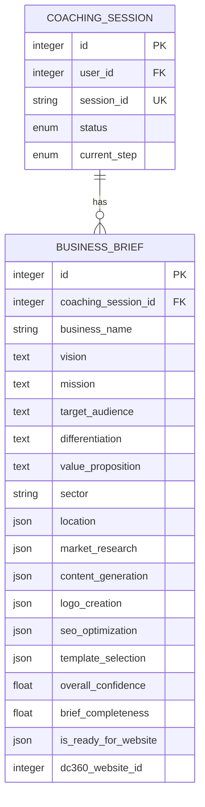
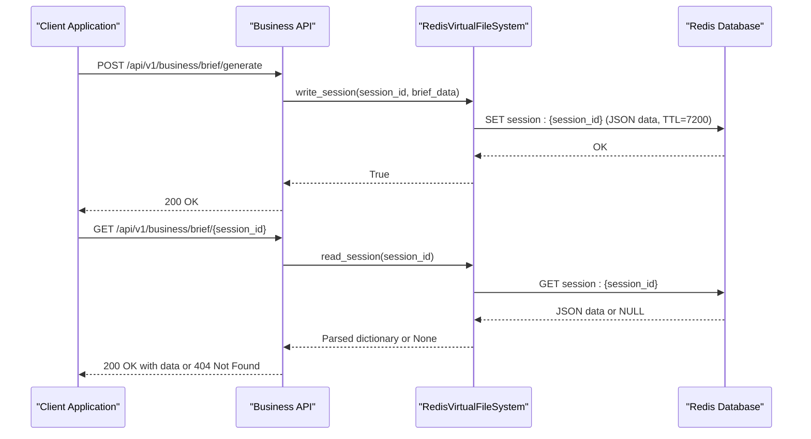
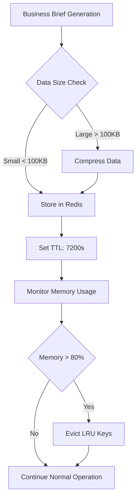

# BusinessBrief Model

<cite>
**Referenced Files in This Document**   
- [coaching.py](file://app/models/coaching.py#L85-L120)
- [business.py](file://app/schemas/business.py#L6-L15)
- [redis_fs.py](file://app/core/integrations/redis_fs.py#L8-L59)
- [test_business.py](file://tests/test_api/test_business.py#L36-L64)
</cite>

## Table of Contents
1. [BusinessBrief Model Overview](#businessbrief-model-overview)
2. [Field Specifications](#field-specifications)
3. [Relationships and Foreign Keys](#relationships-and-foreign-keys)
4. [Content Structure](#content-structure)
5. [Data Storage and Retrieval](#data-storage-and-retrieval)
6. [Query Examples](#query-examples)
7. [Regeneration Support](#regeneration-support)
8. [Performance and Data Size Considerations](#performance-and-data-size-considerations)
9. [Lifecycle Management](#lifecycle-management)

## BusinessBrief Model Overview

The BusinessBrief model serves as the central data structure for storing AI-generated business plans created through a multi-agent orchestration process. This model captures comprehensive business plan information generated during coaching sessions, including core business elements and results from specialized sub-agents. Unlike traditional database-stored models, the BusinessBrief is primarily stored in Redis, functioning as a virtual file system for session persistence.

The model is defined in the coaching.py file and represents the final output of a coaching session, containing both the foundational business elements and the results from various specialized AI sub-agents that contribute to different aspects of business planning.

**Section sources**
- [coaching.py](file://app/models/coaching.py#L85-L120)

## Field Specifications

The BusinessBrief model contains the following fields with their respective data types and constraints:

**Core Business Information**
- `coaching_session_id`: Integer, Foreign Key to coaching_sessions.id, Not Null
- `business_name`: String, Not Null
- `vision`: Text, Not Null
- `mission`: Text, Not Null
- `target_audience`: Text, Not Null
- `differentiation`: Text, Not Null
- `value_proposition`: Text, Not Null
- `sector`: String, Not Null
- `location`: JSON, stores geographical information as {"city": "Dakar", "country": "Sénégal"}

**Sub-Agent Results**
- `market_research`: JSON, stores results from ResearchSubAgent
- `content_generation`: JSON, stores results from ContentSubAgent
- `logo_creation`: JSON, stores results from LogoSubAgent
- `seo_optimization`: JSON, stores results from SEOSubAgent
- `template_selection`: JSON, stores results from TemplateSubAgent

**Quality Metrics**
- `overall_confidence`: Float, default 0.0
- `brief_completeness`: Float, default 0.0

**Website Creation Readiness**
- `is_ready_for_website`: JSON, default False (Boolean)
- `dc360_website_id`: Integer, stores ID of site created in DigitalCloud360

**Section sources**
- [coaching.py](file://app/models/coaching.py#L85-L120)

## Relationships and Foreign Keys

The BusinessBrief model establishes critical relationships with other models in the system:

**Foreign Key Relationships**
- `coaching_session_id` references the `id` field in the `coaching_sessions` table, establishing a one-to-one relationship between a business brief and its coaching session.

**Model Relationships**
- The model has a relationship with `CoachingSession` through the `coaching_session` attribute, with `back_populates="business_brief"` indicating the reciprocal relationship in the CoachingSession model.

This relationship structure ensures that each business brief is tied to a specific coaching session, maintaining the context and progression of the business planning process. The coaching session itself is linked to a user, creating an indirect relationship between the business brief and the user who created it.



**Diagram sources**
- [coaching.py](file://app/models/coaching.py#L85-L120)
- [coaching.py](file://app/models/coaching.py#L27-L56)

**Section sources**
- [coaching.py](file://app/models/coaching.py#L85-L120)

## Content Structure

The BusinessBrief model stores a comprehensive business plan structured into multiple sections, each representing a critical aspect of business development:

**Core Business Sections**
- `business_name`: The official name of the business
- `vision`: The long-term vision and aspirations of the entrepreneur
- `mission`: The purpose and primary objectives of the business
- `target_audience`: Detailed description of the intended customer base
- `differentiation`: Unique value propositions that distinguish the business from competitors
- `value_proposition`: Specific benefits the business offers to its customers
- `sector`: Industry or market sector the business operates in
- `location`: Geographical information including city and country

**Specialized Sub-Agent Outputs**
The model also stores results from specialized AI sub-agents, each focusing on a specific aspect of business development:
- `market_research`: Comprehensive market analysis including competitor assessment and growth opportunities
- `content_generation`: Marketing and website content tailored to the business
- `logo_creation`: Visual identity elements including logo designs and color palettes
- `seo_optimization`: Search engine optimization strategy and keyword research
- `template_selection`: Recommended website templates and design frameworks

This structure allows the BusinessBrief to serve as a complete repository of the AI-generated business plan, capturing both strategic elements and tactical implementation details.

**Section sources**
- [coaching.py](file://app/models/coaching.py#L85-L120)
- [business.py](file://app/schemas/business.py#L6-L15)

## Data Storage and Retrieval

The BusinessBrief model employs a unique storage strategy that differs from traditional database persistence:

**Redis-Based Virtual File System**
- Business briefs are stored in Redis rather than the primary PostgreSQL database
- The RedisVirtualFileSystem class handles all storage and retrieval operations
- Data is serialized as JSON and stored with a key pattern of "session:{session_id}"
- Default TTL (Time To Live) of 7200 seconds (2 hours) ensures session data doesn't persist indefinitely

**Storage Operations**
```python
async def write_session(self, session_id: str, data: Dict[str, Any], ttl: int = 7200) -> bool:
    """Write coaching session (2h TTL by default)"""
    try:
        await self.redis.set(f"session:{session_id}", json.dumps(data), ex=ttl)
        return True
    except Exception as e:
        return False
```

**Retrieval Operations**
```python
async def read_session(self, session_id: str) -> Optional[Dict[str, Any]]:
    """Read coaching session"""
    try:
        session_data = await self.redis.get(f"session:{session_id}")
        if session_data:
            return json.loads(session_data)
        return None
    except Exception as e:
        return None
```

This Redis-based approach provides high-performance access to business brief data, which is particularly important given the potentially large JSON payloads containing comprehensive business plans and sub-agent results.



**Diagram sources**
- [redis_fs.py](file://app/core/integrations/redis_fs.py#L8-L59)
- [test_business.py](file://tests/test_api/test_business.py#L36-L64)

**Section sources**
- [redis_fs.py](file://app/core/integrations/redis_fs.py#L8-L59)

## Query Examples

The BusinessBrief model can be accessed through various API endpoints that facilitate retrieval by user or session:

**Retrieve Business Brief by Session ID**
```python
# API Endpoint: GET /api/v1/business/brief/{brief_id}
async def test_get_business_brief_found(self, client: AsyncClient, auth_headers: dict, mock_brief_data: dict, test_user: User, mock_redis_vfs):
    """Test retrieving an existing business brief."""
    mock_brief_data["user_id"] = test_user.id
    mock_redis_vfs.read_session.return_value = mock_brief_data
    
    response = await client.get(f"/api/v1/business/brief/{mock_brief_id}", headers=auth_headers)
    
    assert response.status_code == 200
    assert response.json() == mock_brief_data
```

**Retrieve Sub-Agent Results Only**
```python
# API Endpoint: GET /api/v1/business/brief/{brief_id}/results
async def test_get_subagent_results(self, client: AsyncClient, auth_headers: dict, mock_brief_data: dict, test_user: User, mock_redis_vfs):
    """Test retrieving sub-agent results for a brief."""
    mock_brief_data["user_id"] = test_user.id
    mock_redis_vfs.read_session.return_value = mock_brief_data

    response = await client.get(f"/api/v1/business/brief/{mock_brief_id}/results", headers=auth_headers)

    assert response.status_code == 200
    assert response.json() == mock_final_state
```

**Generate New Business Brief**
```python
# API Endpoint: POST /api/v1/business/brief/generate
async def test_generate_business_brief(self, client: AsyncClient, auth_headers: dict, test_user: User, mock_redis_vfs):
    """Test successful business brief generation."""
    response = await client.post("/api/v1/business/brief/generate", json=mock_request_data, headers=auth_headers)
    
    assert response.status_code == 200
    response_json = response.json()
    assert response_json["user_id"] == test_user.id
    assert response_json["session_id"] == mock_session_id
    assert "results" in response_json
```

These examples demonstrate how the BusinessBrief data can be accessed through the API, with the underlying implementation relying on the RedisVirtualFileSystem for data persistence.

**Section sources**
- [test_business.py](file://tests/test_api/test_business.py#L36-L64)
- [test_business.py](file://tests/test_api/test_business.py#L62-L87)

## Regeneration Support

The BusinessBrief model supports regeneration of specific sections, allowing users to update portions of their business plan without recreating the entire document:

**Targeted Regeneration**
- Users can regenerate specific sections of their business brief (e.g., content_generation, market_research)
- The regeneration process preserves existing content in sections not being regenerated
- This selective approach conserves computational resources and maintains consistency across the business plan

**Regeneration Implementation**
```python
# API Endpoint: POST /api/v1/business/brief/{brief_id}/regenerate
async def test_regenerate_business_brief(self, client: AsyncClient, auth_headers: dict, mock_brief_data: dict, test_user: User, mock_redis_vfs, mock_orchestrator):
    """Test successful regeneration of specific brief sections."""
    mock_brief_data["user_id"] = test_user.id
    mock_redis_vfs.read_session.return_value = mock_brief_data
    mock_orchestrator.run.return_value = {"content_generation": {"homepage_text": "Nouveau texte de bienvenue..."}}

    response = await client.post(
        f"/api/v1/business/brief/{mock_brief_id}/regenerate",
        json={"sections": ["content_generation"]},
        headers=auth_headers
    )

    assert response.status_code == 200
    response_json = response.json()
    assert response_json["results"]["content_generation"]["homepage_text"] == "Nouveau texte de bienvenue..."
    assert response_json["results"]["market_research"] == mock_final_state["market_research"] # Ensure other sections are preserved
```

The regeneration process works by:
1. Retrieving the existing business brief from Redis
2. Identifying the sections to be regenerated based on the request
3. Executing the appropriate sub-agent orchestrator for the specified sections
4. Merging the new results with the existing brief data
5. Persisting the updated brief back to Redis

This approach enables iterative refinement of business plans, allowing entrepreneurs to improve specific aspects of their business strategy over time.

**Section sources**
- [test_business.py](file://tests/test_api/test_business.py#L87-L111)

## Performance and Data Size Considerations

The BusinessBrief model presents specific performance and data size considerations due to its structure and storage mechanism:

**Data Size Implications**
- Business briefs can contain large JSON payloads due to comprehensive sub-agent results
- Market research, content generation, and SEO optimization data can be particularly voluminous
- The Redis storage approach helps mitigate database bloat in the primary PostgreSQL database

**Indexing Strategy**
- The model does not rely on traditional database indexing since it's stored in Redis
- Redis keys are structured as "session:{session_id}" for efficient retrieval
- The coaching_session_id field in the model serves as a logical reference point

**Retrieval Performance**
- Redis provides sub-millisecond retrieval times for business brief data
- The virtual file system abstraction maintains high performance even with large JSON payloads
- TTL (Time To Live) settings prevent unbounded growth of session data in Redis

**Memory Management**
- Redis is configured with a maximum memory limit of 512MB
- Memory eviction policy set to "allkeys-lru" (Least Recently Used)
- This ensures that the system remains responsive even under heavy load
- Briefs that haven't been accessed recently are automatically evicted to make room for active sessions

**Optimization Recommendations**
- Consider compressing large JSON payloads before storage if size becomes problematic
- Implement client-side caching for frequently accessed briefs
- Monitor Redis memory usage and adjust TTL values based on usage patterns
- Consider archiving completed business briefs to long-term storage to free up Redis memory



**Diagram sources**
- [redis_fs.py](file://app/core/integrations/redis_fs.py#L8-L59)
- [docker-compose.yml](file://docker-compose.yml#L37-L80)

**Section sources**
- [redis_fs.py](file://app/core/integrations/redis_fs.py#L8-L59)

## Lifecycle Management

The BusinessBrief model follows a specific lifecycle that aligns with the coaching and business planning process:

**Lifecycle Stages**
1. **Initialization**: Brief is created at the end of a coaching session
2. **Active**: Brief is stored in Redis with a 2-hour TTL for active editing
3. **Regeneration**: Specific sections can be regenerated based on user requests
4. **Website Creation**: Brief can be used to initiate website creation in DigitalCloud360
5. **Expiration**: Brief is automatically removed from Redis after TTL expires

**Archival Strategies**
- **Automatic Expiration**: The primary archival mechanism is Redis TTL, which automatically removes briefs after 2 hours of inactivity
- **Manual Archival**: Users can initiate website creation, which effectively archives the brief by converting it into a live website
- **Potential Enhancements**: Future versions could include explicit archival endpoints to move briefs to long-term storage

**Data Retention Policy**
- Active briefs are retained in Redis for 2 hours from last access
- Once a website is created from a brief, the brief may be retained for a longer period for reference
- No explicit backup or export functionality is currently implemented

**Lifecycle Events**
- **Generation**: Triggered when a coaching session is completed
- **Access**: Each retrieval extends the brief's TTL
- **Regeneration**: Updates specific sections while preserving the rest of the brief
- **Website Creation**: Consumes the brief to create a website, potentially marking it as "used"

This lifecycle ensures that business briefs remain available during the active planning phase while preventing indefinite storage of potentially outdated business plans.

**Section sources**
- [redis_fs.py](file://app/core/integrations/redis_fs.py#L8-L59)
- [test_business.py](file://tests/test_api/test_business.py#L110-L138)