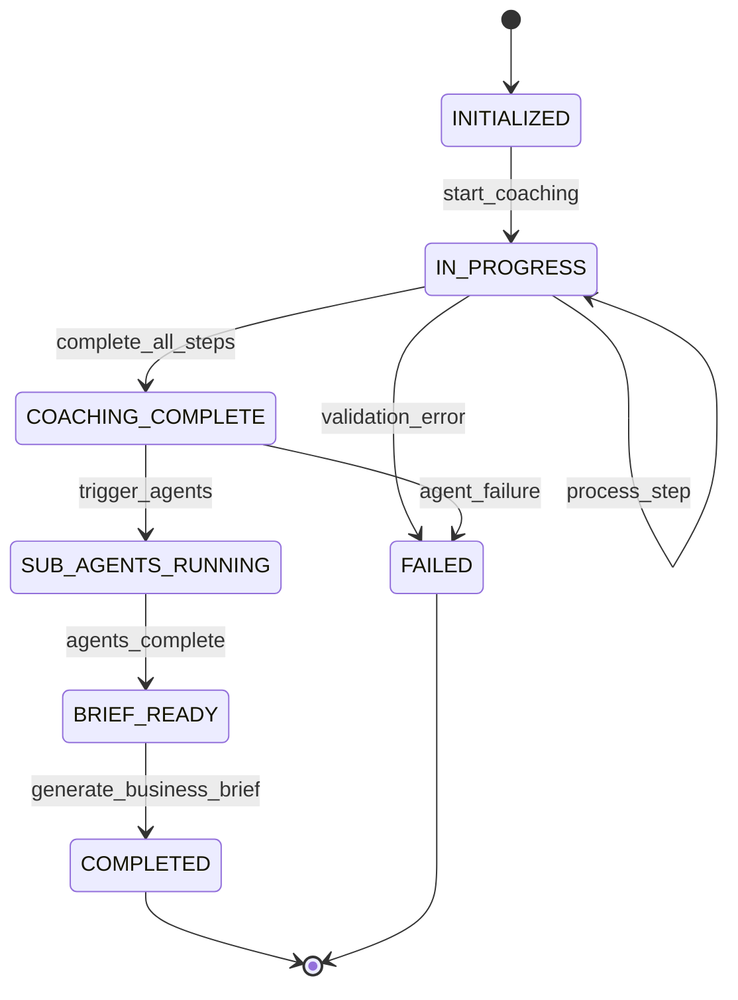
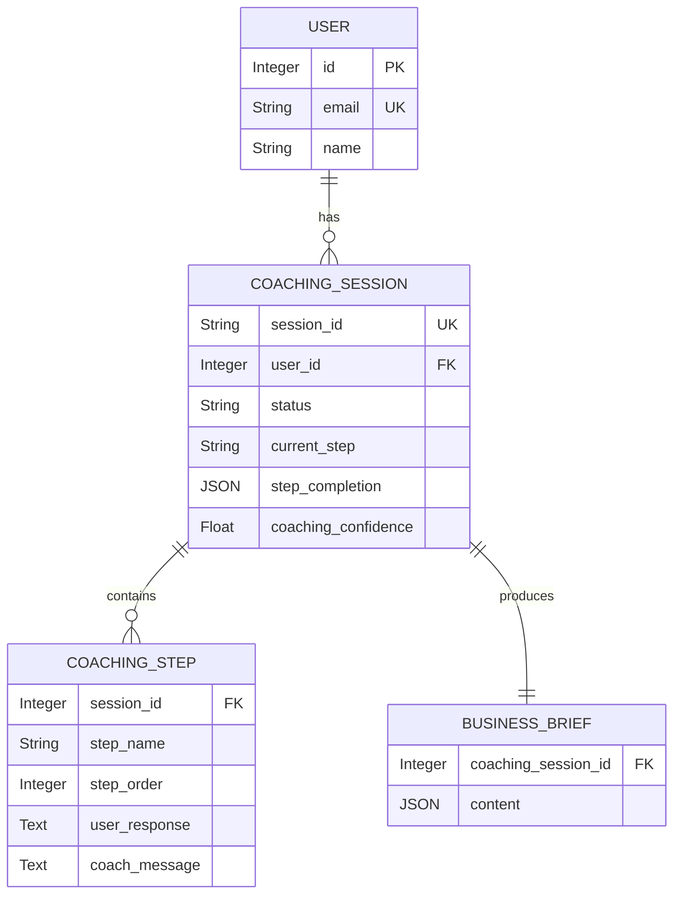
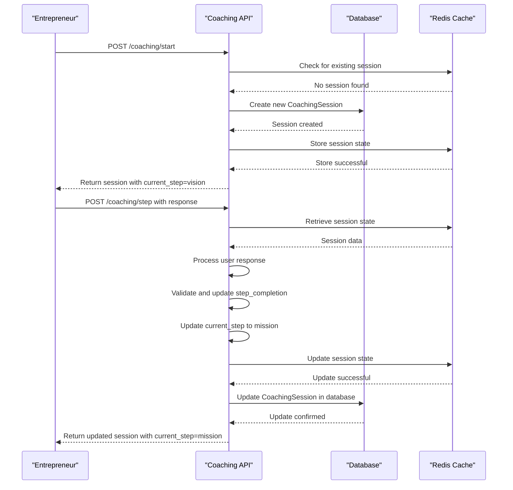

# CoachingSession Model

<cite>
**Referenced Files in This Document**   
- [coaching.py](file://app/models/coaching.py#L27-L56)
- [coaching.py](file://app/models/coaching.py#L58-L83)
- [coaching.py](file://app/models/coaching.py#L0-L25)
- [user.py](file://app/models/user.py#L0-L41)
- [coaching.py](file://app/api/v1/coaching.py#L13)
- [coaching.py](file://app/api/v1/coaching.py#L33)
- [coaching.py](file://app/api/v1/coaching.py#L54)
- [coaching.py](file://app/api/v1/coaching.py#L125)
- [coaching.py](file://app/models/__init__.py#L4)
- [redis.py](file://app/config/redis.py#L0-L15)
- [test_coaching.py](file://tests/test_api/test_coaching.py#L0-L42)
- [test_coaching.py](file://tests/test_api/test_coaching.py#L41-L66)
</cite>

## Table of Contents
1. [Introduction](#introduction)
2. [Model Overview](#model-overview)
3. [Field Specifications](#field-specifications)
4. [Relationships and Constraints](#relationships-and-constraints)
5. [JSON Data Storage and Access](#json-data-storage-and-access)
6. [Query Patterns and Retrieval](#query-patterns-and-retrieval)
7. [API Integration and State Management](#api-integration-and-state-management)
8. [Data Integrity and Performance](#data-integrity-and-performance)

## Introduction
The CoachingSession model serves as the central data structure for tracking business coaching workflows tailored for African entrepreneurs within the Genesis AI platform. It captures the complete state of a coaching session, including user progress, responses, contextual data, and system-generated metadata. This model enables a structured, step-by-step coaching process that guides users through defining their business vision, mission, target audience, differentiation strategy, and value proposition. The model is designed to support both database persistence and real-time session state management via Redis, ensuring a seamless user experience across multiple interaction points.

**Section sources**
- [coaching.py](file://app/models/coaching.py#L27-L56)
- [test_coaching.py](file://tests/test_api/test_coaching.py#L0-L42)

## Model Overview
The CoachingSession model represents a complete coaching journey for an entrepreneur, tracking their progression through a structured sequence of business development steps. Each session is uniquely identified and associated with a specific user, maintaining the state of the coaching process from initialization to completion. The model supports a multi-step workflow where users provide responses to guided questions, and the system tracks completion status, confidence levels, and contextual information.

The coaching process follows a predefined sequence of steps defined by the CoachingStepEnum: VISION, MISSION, CLIENTELE, DIFFERENTIATION, OFFRE (Offer), and SYNTHESIS. Sessions progress through various status states defined by SessionStatusEnum: INITIALIZED, IN_PROGRESS, COACHING_COMPLETE, SUB_AGENTS_RUNNING, BRIEF_READY, COMPLETED, and FAILED. This state machine approach ensures consistent tracking of session progress and enables appropriate system responses at each stage.



**Diagram sources**
- [coaching.py](file://app/models/coaching.py#L0-L25)
- [coaching.py](file://app/models/coaching.py#L27-L56)

**Section sources**
- [coaching.py](file://app/models/coaching.py#L27-L56)
- [coaching.py](file://app/models/coaching.py#L0-L25)

## Field Specifications
The CoachingSession model contains a comprehensive set of fields designed to capture all aspects of the coaching process. Each field serves a specific purpose in tracking session state, user progress, and contextual information.

### Core Identification Fields
- **user_id**: Integer field with foreign key constraint to users.id, establishing the relationship between a coaching session and its owner. This field is mandatory and indexed for efficient querying.
- **session_id**: String field with unique constraint and database index, providing a stable identifier for the session that can be used across system components, including API endpoints and Redis storage.

### Session State Fields
- **status**: Enum field using SessionStatusEnum with default value INITIALIZED. Tracks the overall state of the coaching session through its lifecycle.
- **current_step**: Enum field using CoachingStepEnum with default value VISION. Indicates the current stage of the coaching process the user is engaged with.

### Progress Tracking Fields
- **step_completion**: JSON field storing a dictionary of step completion status (e.g., {"vision": True, "mission": False}). This allows for flexible tracking of progress across the coaching steps.
- **coaching_confidence**: Float field with default value 0.0, representing the system's confidence in the quality and completeness of the coaching session.
- **retry_count**: Integer field with default value 0, tracking the number of times a user has attempted to complete the session, which can inform coaching strategies.

### Context Data Fields
- **cultural_context**: JSON field storing information about the user's cultural background, location, and relevant contextual factors that influence business development in their region.
- **sector_context**: JSON field containing information about the specific business sector the user is operating in, including market conditions and competitive landscape.
- **coaching_plan**: JSON field storing a customized sequence of coaching steps, allowing for personalized coaching journeys based on user needs and context.

### Session Metadata Fields
- **conversation_history**: JSON field maintaining a record of the interaction between the user and the AI coach throughout the session.
- **coaching_duration**: Integer field tracking the total duration of the coaching session in seconds, providing insights into user engagement.

**Section sources**
- [coaching.py](file://app/models/coaching.py#L27-L56)

## Relationships and Constraints
The CoachingSession model establishes several critical relationships with other entities in the system, creating a connected data model that supports the coaching workflow.

### User Relationship
The model maintains a many-to-one relationship with the User model through the user_id foreign key. This relationship is bidirectional, with the User model containing a coaching_sessions relationship that allows access to all sessions for a given user. The cascade="all, delete-orphan" parameter ensures that when a user is deleted, all their coaching sessions are automatically removed, maintaining data integrity.



**Diagram sources**
- [coaching.py](file://app/models/coaching.py#L27-L56)
- [user.py](file://app/models/user.py#L0-L41)

### Coaching Steps Relationship
The model has a one-to-many relationship with the CoachingStep model, representing individual steps within the coaching process. Each CoachingStep record contains detailed information about a specific step, including user responses, coach messages, examples provided, and validation criteria. This design allows for granular tracking of user input at each stage while maintaining the overall session context.

### Business Brief Relationship
The model has a one-to-one relationship with the BusinessBrief model (uselist=False), representing the final output of the coaching process. When a coaching session is completed, the accumulated information is synthesized into a comprehensive business brief that can be used for further business development activities.

**Section sources**
- [coaching.py](file://app/models/coaching.py#L27-L56)
- [user.py](file://app/models/user.py#L0-L41)

## JSON Data Storage and Access
The CoachingSession model extensively uses JSON fields to store flexible, schema-less data that can evolve with the application's needs. This approach provides significant advantages in handling the unstructured nature of coaching conversations and contextual information.

### JSON Field Usage
- **step_completion**: Stores a dictionary mapping step names to boolean completion status. Example: {"vision": true, "mission": false, "clientele": false}.
- **cultural_context**: Contains information about the user's cultural and regional context. Example: {"country": "Senegal", "region": "Dakar", "cultural_factors": ["collectivism", "oral_tradition"]}.
- **sector_context**: Stores details about the business sector. Example: {"sector": "restaurant", "market_size": "medium", "competition_level": "high"}.
- **coaching_plan**: Maintains a customized sequence of steps. Example: ["vision", "mission", "differentiation", "offre", "clientele", "synthesis"].
- **conversation_history**: Records the dialogue between user and coach. Example: [{"role": "coach", "message": "What is your business vision?"}, {"role": "user", "message": "I want to create the best restaurant in Dakar"}].

The use of JSON fields allows the system to adapt to changing coaching methodologies without requiring database schema migrations. It also enables efficient storage of hierarchical data that would be cumbersome to represent in normalized relational tables.

**Section sources**
- [coaching.py](file://app/models/coaching.py#L27-L56)

## Query Patterns and Retrieval
The CoachingSession model supports several key query patterns that enable efficient retrieval of session data for various use cases.

### Active Session Retrieval
To retrieve a user's active coaching session, the system uses a query that filters by user_id and session_id, ensuring that users can only access their own sessions:

```python
result = await db.execute(
    select(CoachingSession).filter(
        CoachingSession.session_id == session_id, 
        CoachingSession.user_id == current_user.id
    )
)
```

This pattern is used in the coaching API to validate session ownership and retrieve current session state.

### Progress Tracking Queries
To track user progress through the coaching steps, the system accesses the step_completion JSON field. This allows for efficient determination of which steps have been completed and which remain:

```python
# Example of accessing step completion status
session = await get_session_by_id(session_id)
if session.step_completion.get('vision'):
    # User has completed the vision step
    proceed_to_next_step()
```

### Status-Based Queries
The system can query sessions based on their status to identify sessions that require specific processing:

```python
# Find all sessions that are ready for sub-agent processing
completed_sessions = await db.execute(
    select(CoachingSession).filter(
        CoachingSession.status == SessionStatusEnum.COACHING_COMPLETE
    )
)
```

These query patterns are optimized through database indexing on key fields like session_id (unique index) and user_id (regular index), ensuring fast retrieval even as the number of sessions grows.

**Section sources**
- [coaching.py](file://app/api/v1/coaching.py#L33)
- [coaching.py](file://app/models/coaching.py#L27-L56)

## API Integration and State Management
The CoachingSession model is tightly integrated with the coaching API endpoints, enabling a stateful coaching experience across multiple user interactions.

### API Endpoint Integration
The coaching API provides several endpoints that interact with the CoachingSession model:
- **POST /api/v1/coaching/start**: Creates a new coaching session or resumes an existing one
- **POST /api/v1/coaching/step**: Processes user input for the current step and advances the session
- **GET /api/v1/coaching/session/{session_id}**: Retrieves the current state of a coaching session
- **POST /api/v1/coaching/complete**: Marks a coaching session as complete and triggers downstream processes



**Diagram sources**
- [coaching.py](file://app/api/v1/coaching.py#L54)
- [coaching.py](file://app/api/v1/coaching.py#L125)
- [redis.py](file://app/config/redis.py#L0-L15)

### State Management Across Steps
The system employs a hybrid state management approach using both database persistence and Redis caching:
1. **Redis for Real-Time State**: Active session state is stored in Redis for low-latency access during user interactions
2. **Database for Persistence**: The CoachingSession model in the database serves as the source of truth, with periodic synchronization from Redis
3. **State Synchronization**: After each step processing, the updated session state is written to both Redis (for immediate use) and the database (for persistence)

This architecture ensures that users can seamlessly continue their coaching sessions even if they disconnect and reconnect later, while maintaining data consistency and reliability.

**Section sources**
- [coaching.py](file://app/api/v1/coaching.py#L33)
- [coaching.py](file://app/api/v1/coaching.py#L54)
- [redis.py](file://app/config/redis.py#L0-L15)
- [test_coaching.py](file://tests/test_api/test_coaching.py#L41-L66)

## Data Integrity and Performance
The CoachingSession model incorporates several design considerations to ensure data integrity and optimal performance.

### Data Integrity Measures
- **Foreign Key Constraints**: The user_id field has a foreign key constraint to ensure every coaching session is associated with a valid user.
- **Unique Constraints**: The session_id field has a unique constraint to prevent duplicate session identifiers.
- **Cascading Deletes**: The relationship with the User model uses cascade="all, delete-orphan" to automatically clean up sessions when a user account is deleted.
- **Enum Validation**: The status and current_step fields use SQLAlchemy Enum types to ensure only valid values are stored.

### Performance Considerations
- **Indexing Strategy**: Critical fields like session_id (unique index) and user_id (regular index) are indexed to optimize query performance for the most common access patterns.
- **JSON Field Optimization**: While JSON fields provide flexibility, they are used judiciously for data that doesn't require complex querying. Fields that are frequently filtered or sorted (like status and current_step) use native database types.
- **Selective Loading**: The ORM relationships are configured to allow selective loading of related data, preventing unnecessary data retrieval when only session metadata is needed.
- **Redis Caching**: The integration with Redis reduces database load by serving active session state from memory, with the database serving as a persistent backup.

These design choices balance the need for flexible data storage with the requirements for data consistency, query performance, and system scalability.

**Section sources**
- [coaching.py](file://app/models/coaching.py#L27-L56)
- [user.py](file://app/models/user.py#L0-L41)
- [redis.py](file://app/config/redis.py#L0-L15)