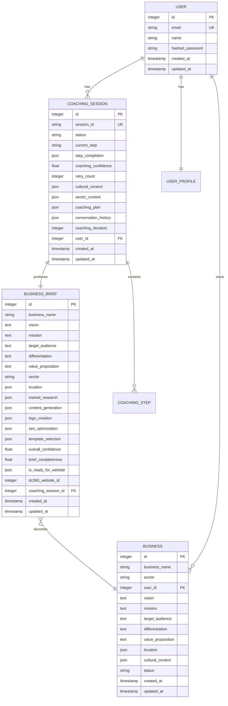
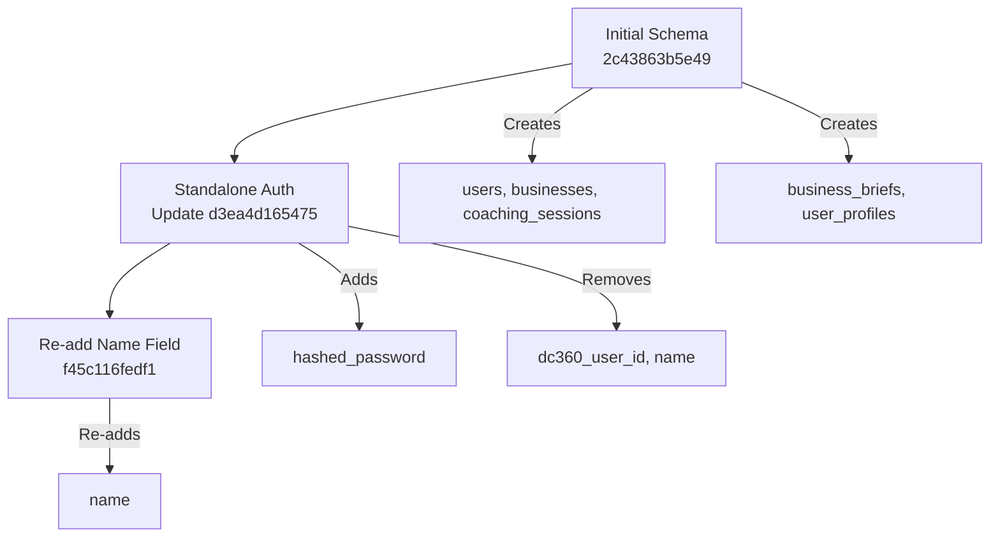

# Data Models & ORM Mapping

<cite>
**Referenced Files in This Document**   
- [base.py](file://app/models/base.py#L1-L21)
- [user.py](file://app/models/user.py#L1-L45)
- [coaching.py](file://app/models/coaching.py#L1-L122)
- [business.py](file://app/models/business.py#L1-L73)
- [2c43863b5e49_initial_migration.py](file://alembic/versions/2c43863b5e49_initial_migration.py#L1-L193)
- [d3ea4d165475_update_user_model_for_standalone_auth.py](file://alembic/versions/d3ea4d165475_update_user_model_for_standalone_auth.py#L1-L39)
- [f45c116fedf1_add_name_to_user_model.py](file://alembic/versions/f45c116fedf1_add_name_to_user_model.py#L1-L29)
</cite>

## Table of Contents
1. [Introduction](#introduction)
2. [Core Data Models](#core-data-models)
3. [Entity Relationships](#entity-relationships)
4. [Field Definitions and Constraints](#field-definitions-and-constraints)
5. [Inheritance and Base Model](#inheritance-and-base-model)
6. [Database Schema Evolution](#database-schema-evolution)
7. [Data Validation and Business Logic](#data-validation-and-business-logic)
8. [Lifecycle Hooks and ORM Behavior](#lifecycle-hooks-and-orm-behavior)
9. [Query Optimization and Access Patterns](#query-optimization-and-access-patterns)
10. [Data Retention and Privacy](#data-retention-and-privacy)

## Introduction
This document provides comprehensive documentation for the SQLAlchemy ORM models in the Genesis AI Service. It details the data model architecture, entity relationships, field definitions, constraints, and schema evolution strategy. The system supports AI-powered business coaching, where users engage in structured sessions to develop business briefs that can be transformed into digital assets. The models are designed to support a multi-step coaching workflow with rich contextual data storage and integration with external services.

## Core Data Models

The application's data model centers around four primary entities: User, CoachingSession, BusinessBrief, and Business. These models represent the core workflow from user authentication through coaching progression to business creation.

### User Model
Represents authenticated users of the system. Stores authentication credentials and personalization preferences.

### CoachingSession Model
Tracks the state and progress of an AI coaching session. Each session guides a user through structured business development steps.

### BusinessBrief Model
Captures the output of a completed coaching session, including business vision, mission, target audience, and differentiation strategy.

### Business Model
Represents a formalized business entity derived from a BusinessBrief, with additional context and integration metadata.

**Section sources**
- [user.py](file://app/models/user.py#L6-L17)
- [coaching.py](file://app/models/coaching.py#L27-L120)
- [business.py](file://app/models/business.py#L6-L73)

## Entity Relationships



**Diagram sources**
- [user.py](file://app/models/user.py#L6-L45)
- [coaching.py](file://app/models/coaching.py#L27-L120)
- [business.py](file://app/models/business.py#L6-L73)

## Field Definitions and Constraints

### User Entity
- **id**: Integer, Primary Key, Indexed
- **email**: String, Unique, Not Null, Indexed
- **name**: String, Not Null
- **hashed_password**: String, Not Null
- **created_at**: DateTime, Default=func.now(), Not Null
- **updated_at**: DateTime, Default=func.now(), OnUpdate=func.now(), Not Null

### CoachingSession Entity
- **id**: Integer, Primary Key, Indexed
- **session_id**: String, Unique, Not Null, Indexed
- **status**: Enum(SessionStatusEnum), Default=INITIALIZED
- **current_step**: Enum(CoachingStepEnum), Default=VISION
- **step_completion**: JSON, Tracks completion of coaching steps
- **coaching_confidence**: Float, Default=0.0
- **retry_count**: Integer, Default=0
- **cultural_context**: JSON, Stores cultural context data
- **sector_context**: JSON, Stores industry-specific context
- **coaching_plan**: JSON, Customized coaching step sequence
- **conversation_history**: JSON, Stores dialogue history
- **coaching_duration**: Integer, Duration in seconds
- **user_id**: Integer, Foreign Key to users.id, Not Null

### BusinessBrief Entity
- **id**: Integer, Primary Key, Indexed
- **coaching_session_id**: Integer, Foreign Key to coaching_sessions.id, Not Null
- **business_name**: String, Not Null
- **vision**: Text, Not Null
- **mission**: Text, Not Null
- **target_audience**: Text, Not Null
- **differentiation**: Text, Not Null
- **value_proposition**: Text, Not Null
- **sector**: String, Not Null
- **location**: JSON, Geographic data
- **market_research**: JSON, ResearchSubAgent output
- **content_generation**: JSON, ContentSubAgent output
- **logo_creation**: JSON, LogoSubAgent output
- **seo_optimization**: JSON, SEOSubAgent output
- **template_selection**: JSON, TemplateSubAgent output
- **overall_confidence**: Float, Default=0.0
- **brief_completeness**: Float, Default=0.0
- **is_ready_for_website**: JSON, Boolean flag, Default=False
- **dc360_website_id**: Integer, DigitalCloud360 integration ID

### Business Entity
- **id**: Integer, Primary Key, Indexed
- **business_name**: String, Not Null, Indexed
- **sector**: String, Not Null, Indexed
- **user_id**: Integer, Foreign Key to users.id, Not Null
- **vision**: Text
- **mission**: Text
- **target_audience**: Text
- **differentiation**: Text
- **value_proposition**: Text
- **location**: JSON, Geographic data
- **cultural_context**: JSON
- **status**: String, Default="draft" (draft, active, paused)
- **created_at**: DateTime, Default=func.now(), Not Null
- **updated_at**: DateTime, Default=func.now(), OnUpdate=func.now(), Not Null

**Section sources**
- [user.py](file://app/models/user.py#L6-L45)
- [coaching.py](file://app/models/coaching.py#L27-L120)
- [business.py](file://app/models/business.py#L6-L73)

## Inheritance and Base Model

All models inherit from `BaseModel`, which provides common fields and utility methods:

```python
class BaseModel(Base):
    __abstract__ = True
    id = Column(Integer, primary_key=True, index=True)
    created_at = Column(DateTime, default=func.now(), nullable=False)
    updated_at = Column(DateTime, default=func.now(), onupdate=func.now(), nullable=False)
    
    def to_dict(self):
        return {c.name: getattr(self, c.name) for c in self.__table__.columns}
```

The `BaseModel` class:
- Inherits from SQLAlchemy's declarative base
- Is marked as abstract (`__abstract__ = True`) so it doesn't create a database table
- Provides standardized primary key (`id`) with indexing
- Includes automatic timestamp fields (`created_at`, `updated_at`) with server-side defaults
- Implements `to_dict()` method for easy serialization to JSON

This inheritance pattern ensures consistency across all entities and reduces code duplication for common fields and behaviors.

**Section sources**
- [base.py](file://app/models/base.py#L1-L21)

## Database Schema Evolution

The system uses Alembic for database migrations with a clear version history:

### Migration History
1. **2c43863b5e49_initial_migration.py**: Initial schema with all tables
2. **d3ea4d165475_update_user_model_for_standalone_auth.py**: Added authentication fields
3. **f45c116fedf1_add_name_to_user_model.py**: Re-added name field to User

### Schema Evolution Analysis
The initial migration created all core tables with their basic structure. The second migration modified the User model to support standalone authentication by:
- Adding `hashed_password` column (Not Null)
- Removing `dc360_user_id` and its unique index
- Temporarily removing `name` field

The third migration re-added the `name` field, indicating a design decision to retain user names despite the shift to standalone authentication. This suggests the system evolved from an integrated DigitalCloud360 authentication model to a standalone system while preserving user identity information.



**Diagram sources**
- [2c43863b5e49_initial_migration.py](file://alembic/versions/2c43863b5e49_initial_migration.py#L1-L193)
- [d3ea4d165475_update_user_model_for_standalone_auth.py](file://alembic/versions/d3ea4d165475_update_user_model_for_standalone_auth.py#L1-L39)
- [f45c116fedf1_add_name_to_user_model.py](file://alembic/versions/f45c116fedf1_add_name_to_user_model.py#L1-L29)

**Section sources**
- [2c43863b5e49_initial_migration.py](file://alembic/versions/2c43863b5e49_initial_migration.py#L1-L193)
- [d3ea4d165475_update_user_model_for_standalone_auth.py](file://alembic/versions/d3ea4d165475_update_user_model_for_standalone_auth.py#L1-L39)
- [f45c116fedf1_add_name_to_user_model.py](file://alembic/versions/f45c116fedf1_add_name_to_user_model.py#L1-L29)

## Data Validation and Business Logic

### Enumerated Types
The system uses SQLAlchemy Enum types to enforce data integrity:

```python
class CoachingStepEnum(str, enum.Enum):
    VISION = "vision"
    MISSION = "mission"
    CLIENTELE = "clientele"
    DIFFERENTIATION = "differentiation"
    OFFRE = "offre"
    SYNTHESIS = "synthesis"

class SessionStatusEnum(str, enum.Enum):
    INITIALIZED = "initialized"
    IN_PROGRESS = "in_progress"
    COACHING_COMPLETE = "coaching_complete"
    SUB_AGENTS_RUNNING = "sub_agents_running"
    BRIEF_READY = "brief_ready"
    COMPLETED = "completed"
    FAILED = "failed"
```

These enums ensure that only valid values can be stored in the corresponding fields, preventing data corruption.

### Business Rules
- **Coaching Progression**: Sessions progress through predefined steps (VISION → MISSION → CLIENTELE → DIFFERENTIATION → OFFRE → SYNTHESIS)
- **Session Uniqueness**: Each coaching session has a unique session_id for external reference
- **Brief Completeness**: BusinessBrief requires all core components (vision, mission, etc.) to be present
- **User Ownership**: All coaching sessions and businesses are tied to a specific user

### Data Integrity Constraints
- Foreign key constraints ensure referential integrity
- Unique constraints on user email and session_id prevent duplicates
- Not Null constraints on critical fields ensure data completeness
- Indexes on frequently queried fields (id, email, session_id) optimize performance

**Section sources**
- [coaching.py](file://app/models/coaching.py#L10-L25)

## Lifecycle Hooks and ORM Behavior

### Relationship Configuration
The models use SQLAlchemy relationships with specific cascade behaviors:

```python
# User to CoachingSession
coaching_sessions = relationship("CoachingSession", back_populates="user", cascade="all, delete-orphan")

# User to Profile
profile = relationship("UserProfile", back_populates="user", uselist=False, cascade="all, delete-orphan")
```

Key relationship settings:
- **cascade="all, delete-orphan"**: When a parent is deleted, all children are deleted. Orphaned children are automatically removed.
- **uselist=False**: For one-to-one relationships (User ↔ UserProfile)
- **back_populates**: Enables bidirectional access between related objects

### Automatic Timestamps
The BaseModel provides automatic timestamp management:
- `created_at`: Set once when record is created using `func.now()`
- `updated_at`: Updated on every modification using `onupdate=func.now()`

This server-side timestamping ensures consistency and prevents client manipulation.

### JSON Field Usage
Multiple models use JSON columns to store flexible, schema-less data:
- `step_completion`: Tracks progress through coaching steps
- `cultural_context`: Stores user's cultural background
- `coaching_plan`: Custom sequence of coaching steps
- `conversation_history`: Complete dialogue history
- Sub-agent results (market_research, logo_creation, etc.)

This design allows for flexible data storage while maintaining relational integrity for core business entities.

**Section sources**
- [user.py](file://app/models/user.py#L15-L17)
- [coaching.py](file://app/models/coaching.py#L45-L56)
- [base.py](file://app/models/base.py#L15-L16)

## Query Optimization and Access Patterns

### Indexing Strategy
The schema includes strategic indexes for performance:

```sql
-- User indexes
ix_users_email (email) -- Unique
ix_users_id (id) -- Primary key index

-- Coaching session indexes
ix_coaching_sessions_id (id) -- Primary key index
ix_coaching_sessions_session_id (session_id) -- Unique

-- Business indexes
ix_businesses_id (id) -- Primary key index
ix_businesses_business_name (business_name) -- For name searches
ix_businesses_sector (sector) -- For sector filtering
```

### Common Query Patterns
1. **User-centric queries**: Retrieve user with all coaching sessions
   ```python
   db.query(User).options(joinedload(User.coaching_sessions)).filter(User.id == user_id)
   ```

2. **Session retrieval**: Find session by unique session_id
   ```python
   db.query(CoachingSession).filter(CoachingSession.session_id == session_id)
   ```

3. **Business discovery**: Search businesses by name or sector
   ```python
   db.query(Business).filter(Business.sector == sector).order_by(Business.created_at.desc())
   ```

4. **Progress tracking**: Get latest coaching session for a user
   ```python
   db.query(CoachingSession).filter(CoachingSession.user_id == user_id).order_by(CoachingSession.created_at.desc()).first()
   ```

### Performance Considerations
- Use lazy loading for relationships when not immediately needed
- Use joined loading when related data is always required
- Leverage indexes on frequently filtered fields
- Consider database-level constraints over application-level validation when possible
- Monitor query performance for JSON field operations, which can be expensive

**Section sources**
- [2c43863b5e49_initial_migration.py](file://alembic/versions/2c43863b5e49_initial_migration.py#L20-L190)

## Data Retention and Privacy

### Data Classification
- **Personal Data**: email, name, location (country, city, region)
- **Behavioral Data**: coaching preferences, conversation history
- **Business Data**: vision, mission, target audience, differentiation
- **Technical Data**: session_id, timestamps, system status

### Retention Policies
While specific retention policies are not defined in the models, the structure suggests:
- **User data**: Retained indefinitely while account is active
- **Coaching sessions**: Retained as long as associated business exists
- **Business entities**: Retained as long as business status is not "deleted"
- **Temporary data**: conversation_history may be subject to periodic cleanup

### Privacy Implications
- **Email**: Unique identifier, requires protection
- **Name**: Personal identifier, stored in clear text
- **Location data**: Country, city, and region stored at user and business levels
- **Cultural context**: Sensitive personal data stored in JSON format
- **Conversation history**: Potentially sensitive coaching dialogue stored in JSON

The system should implement appropriate security measures including:
- Encryption at rest for the database
- Secure password hashing (already implemented with hashed_password)
- Access controls to prevent unauthorized data access
- Data anonymization options for users who wish to delete their accounts

**Section sources**
- [user.py](file://app/models/user.py#L6-L45)
- [coaching.py](file://app/models/coaching.py#L27-L120)
- [business.py](file://app/models/business.py#L6-L73)