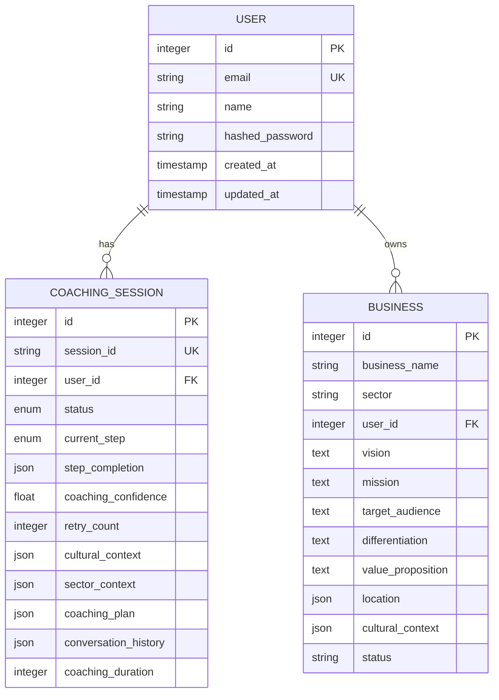

# User Model

<cite>
**Referenced Files in This Document**   
- [user.py](file://app/models/user.py)
- [base.py](file://app/models/base.py)
- [coaching.py](file://app/models/coaching.py)
- [business.py](file://app/models/business.py)
- [security.py](file://app/core/security.py)
- [test_auth.py](file://tests/test_api/test_auth.py)
- [conftest.py](file://tests/conftest.py)
</cite>

## Table of Contents
1. [User Model](#user-model)
2. [Field Specifications](#field-specifications)
3. [Constraints and Business Rules](#constraints-and-business-rules)
4. [Relationships with Other Models](#relationships-with-other-models)
5. [Common Queries and Usage Examples](#common-queries-and-usage-examples)
6. [Authentication and Session Management](#authentication-and-session-management)
7. [Embedded Business Logic and Lifecycle Hooks](#embedded-business-logic-and-lifecycle-hooks)
8. [Privacy and GDPR Compliance](#privacy-and-gdpr-compliance)

## Field Specifications

The **User** model represents the core entity for user authentication and profile management within the Genesis AI Service. It is defined in the `app/models/user.py` file and inherits from the `BaseModel`, which provides common fields such as `created_at` and `updated_at`.

The model's fields are as follows:

- **id**: An `Integer` field serving as the primary key. It is auto-incremented and indexed for fast lookups.
- **email**: A `String` field that is unique, non-nullable, and indexed. This field is the primary identifier for user accounts and is used for login and communication.
- **name**: A `String` field that is non-nullable, storing the user's full name.
- **hashed_password**: A `String` field that is non-nullable, storing the securely hashed version of the user's password.

The `BaseModel` class, defined in `app/models/base.py`, provides the following timestamp fields:
- **created_at**: A `DateTime` field that records when the user record was first created. It defaults to the current time using `func.now()`.
- **updated_at**: A `DateTime` field that records the last time the user record was modified. It is automatically updated on any change using `onupdate=func.now()`.

**Section sources**
- [user.py](file://app/models/user.py#L1-L42)
- [base.py](file://app/models/base.py#L1-L20)

## Constraints and Business Rules

The User model enforces several critical constraints to ensure data integrity and security.

### Unique Email Constraint
The `email` field has a unique constraint (`unique=True`), which prevents the creation of multiple user accounts with the same email address. This is a fundamental business rule for user identity management.

```python
email = Column(String, unique=True, nullable=False, index=True)
```

### Password Hashing Mechanism
Plain text passwords are never stored in the database. Instead, the `hashed_password` field stores a secure hash generated using the `bcrypt` algorithm. This is managed by the `passlib` library's `CryptContext` in the `app/core/security.py` module.

The `get_password_hash` function is used to hash a plain text password before storing it:

```python
def get_password_hash(password: str) -> str:
    return pwd_context.hash(password)
```

The `verify_password` function is used during login to compare a provided plain text password with the stored hash:

```python
def verify_password(plain_password: str, hashed_password: str) -> bool:
    return pwd_context.verify(plain_password, hashed_password)
```

This mechanism ensures that even if the database is compromised, user passwords remain protected.

### Timestamp Tracking
The `created_at` and `updated_at` fields are automatically managed by the database. The `created_at` field is set once upon record creation, while the `updated_at` field is updated every time the record is modified. This provides a complete audit trail for user account changes.

**Section sources**
- [user.py](file://app/models/user.py#L1-L42)
- [base.py](file://app/models/base.py#L1-L20)
- [security.py](file://app/core/security.py#L20-L25)

## Relationships with Other Models

The User model is central to the application's data model and has relationships with several other entities.

### Relationship with CoachingSession
A user can have multiple coaching sessions. This is a one-to-many relationship defined by the `coaching_sessions` field in the User model and the `user_id` foreign key in the `CoachingSession` model.

```python
# In User model
coaching_sessions = relationship("CoachingSession", back_populates="user", cascade="all, delete-orphan")

# In CoachingSession model
user_id = Column(Integer, ForeignKey("users.id"), nullable=False)
user = relationship("User", back_populates="coaching_sessions")
```

The `cascade="all, delete-orphan"` setting ensures that when a user is deleted, all of their associated coaching sessions are also deleted, maintaining referential integrity.

### Relationship with Business
A user can be the owner of multiple business entities. This relationship is established through the `user_id` foreign key in the `Business` model.

```python
# In Business model
user_id = Column(Integer, ForeignKey("users.id"), nullable=False)
user = relationship("User")
```

This allows the system to track which user created a particular business and to retrieve all businesses associated with a specific user.



**Diagram sources**
- [user.py](file://app/models/user.py#L1-L42)
- [coaching.py](file://app/models/coaching.py#L27-L56)
- [business.py](file://app/models/business.py#L1-L33)

## Common Queries and Usage Examples

The following are examples of common database queries involving the User model.

### User Lookup by Email
To retrieve a user by their email address, a query filters the User model on the `email` field. This is a common operation during the login process.

```python
from sqlalchemy.future import select
from app.models.user import User

# Example query to find a user by email
stmt = select(User).filter(User.email == "test@example.com")
result = await db_session.execute(stmt)
user = result.scalar_one_or_none()
```

### Authentication Check
The authentication process involves two steps: finding the user by email and then verifying the password.

```python
# 1. Find user by email
user = await get_user_by_email(db_session, "test@example.com")

# 2. Verify password
if user and verify_password(plain_password, user.hashed_password):
    # Authentication successful
    pass
```

This logic is tested in `tests/test_api/test_auth.py`, where the `test_login_for_access_token` function verifies that a correct email and password return a valid access token.

**Section sources**
- [user.py](file://app/models/user.py#L1-L42)
- [test_auth.py](file://tests/test_api/test_auth.py#L34-L66)
- [security.py](file://app/core/security.py#L25-L30)

## Authentication and Session Management

The User model plays a crucial role in the standalone authentication system of the application.

### Role in Authentication
The User model is the foundation of the authentication system. The `/api/v1/auth/token` endpoint (tested in `test_login_for_access_token`) uses the User model to verify credentials. Upon successful authentication, a JWT (JSON Web Token) is generated using the `create_access_token` function from `app/core/security.py`.

The token contains the user's ID as the subject (`sub`), which is used to identify the user in subsequent requests.

### Session Management
While the User model itself does not manage sessions, it is tightly integrated with the session management system. The JWT token acts as the session token, which is sent in the `Authorization` header of API requests. The `decode_access_token` function is used to validate the token and extract the user ID, which is then used to fetch the user's data from the database.

The `test_get_current_user` function in `test_auth.py` demonstrates this flow, where a valid token is used to retrieve the current user's information from the `/api/v1/auth/me` endpoint.

**Section sources**
- [security.py](file://app/core/security.py#L32-L50)
- [test_auth.py](file://tests/test_api/test_auth.py#L64-L78)
- [conftest.py](file://tests/conftest.py#L77-L126)

## Embedded Business Logic and Lifecycle Hooks

The User model itself does not contain explicit lifecycle hooks (such as `@event.listens_for` in SQLAlchemy), but its behavior is governed by business logic in related components.

### Validation Rules
Validation rules are enforced at the API and service layer. For example, when registering a new user, the system checks that the email is not already in use (tested in `test_register_existing_user`). This prevents duplicate accounts.

### Lifecycle Operations
The primary lifecycle operations are user creation (registration) and deletion. During registration, the plain text password is hashed using `get_password_hash` before being stored. The `test_register_user` function verifies that a new user can be successfully created and stored in the database.

User deletion is handled by the database's cascade rules. When a user is deleted, all related `CoachingSession` and `UserProfile` records are automatically removed due to the `cascade="all, delete-orphan"` setting.

**Section sources**
- [user.py](file://app/models/user.py#L1-L42)
- [test_auth.py](file://tests/test_api/test_auth.py#L0-L37)
- [conftest.py](file://tests/conftest.py#L77-L126)

## Privacy and GDPR Compliance

The storage and handling of user data in the User model have significant implications for privacy and GDPR compliance.

### Data Storage Privacy
The model stores personal data including the user's name and email address. The password is stored only in a hashed form, which is a best practice for security. The `created_at` and `updated_at` timestamps provide an audit trail, which can be useful for compliance.

### GDPR Implications
Under GDPR, users have the right to access, correct, and request the deletion of their personal data. The application's design supports these rights:
- **Right to Access**: The `/api/v1/auth/me` endpoint allows a user to retrieve their own data.
- **Right to Deletion**: The cascade delete functionality ensures that when a user account is deleted, all personal data associated with coaching sessions and business profiles is also removed, fulfilling the "right to be forgotten."

The system should implement additional features such as data export and explicit consent management to be fully GDPR-compliant, but the current data model provides a solid foundation for these requirements.

**Section sources**
- [user.py](file://app/models/user.py#L1-L42)
- [test_auth.py](file://tests/test_api/test_auth.py#L64-L78)