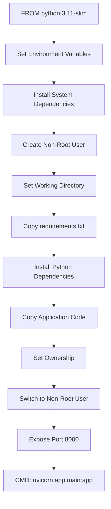
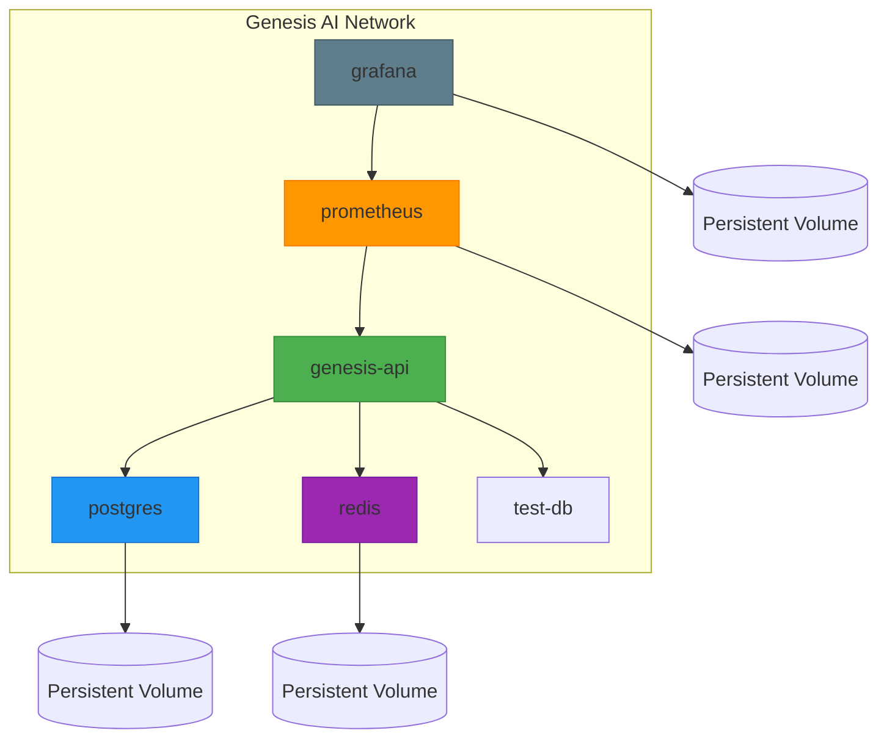
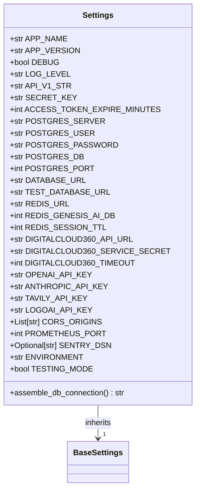
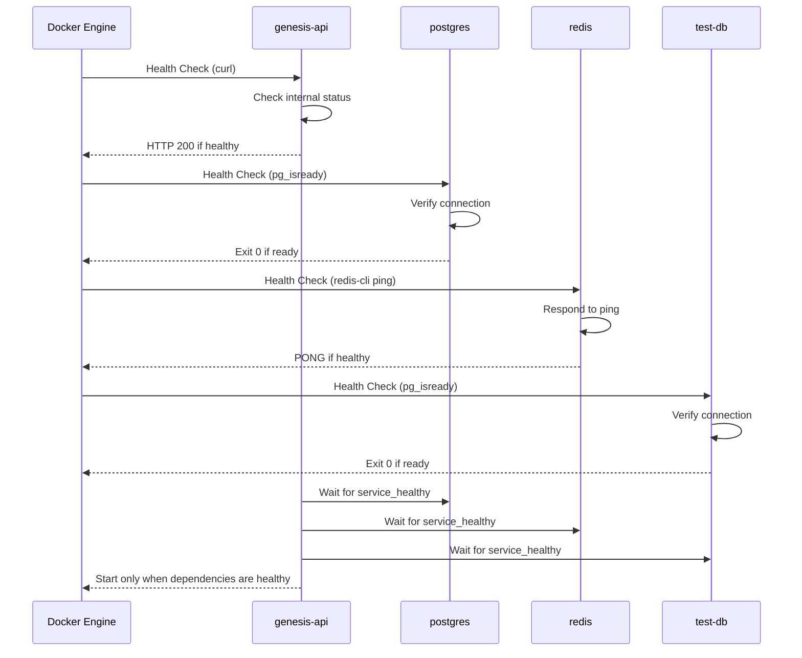

# Deployment Configuration

<cite>
**Referenced Files in This Document**   
- [Dockerfile](file://Dockerfile)
- [docker-compose.yml](file://docker-compose.yml)
- [app/main.py](file://app/main.py)
- [app/config/settings.py](file://app/config/settings.py)
</cite>

## Table of Contents
1. [Introduction](#introduction)
2. [Docker Image Build Process](#docker-image-build-process)
3. [Multi-Container Deployment Architecture](#multi-container-deployment-architecture)
4. [Environment Configuration and Secret Management](#environment-configuration-and-secret-management)
5. [Service Health Checks and Monitoring](#service-health-checks-and-monitoring)
6. [Production Deployment Considerations](#production-deployment-considerations)
7. [Scaling and Zero-Downtime Strategies](#scaling-and-zero-downtime-strategies)
8. [Logging and Observability](#logging-and-observability)
9. [Conclusion](#conclusion)

## Introduction
This document provides comprehensive architectural documentation for the deployment configuration of the Genesis AI Deep Agents Service. It details the containerization strategy, multi-service orchestration, environment management, and production readiness features. The system is designed as a FastAPI-based microservice with PostgreSQL for persistent data storage, Redis for caching and virtual file system operations, and optional Prometheus and Grafana for monitoring. The deployment leverages Docker and Docker Compose for consistent environment provisioning across development, testing, and production environments.

## Docker Image Build Process

The Docker image build process is defined in the `Dockerfile` located at the project root. It follows container optimization best practices including minimal base image usage, non-root user execution, and dependency layering for efficient caching.



**Diagram sources**
- [Dockerfile](file://Dockerfile#L1-L32)

**Section sources**
- [Dockerfile](file://Dockerfile#L1-L32)

### Build Stages and Optimization
The Docker build process implements several optimization strategies:

- **Minimal Base Image**: Uses `python:3.11-slim` to reduce image size and attack surface
- **Layer Caching**: Dependencies are installed before copying application code to leverage Docker layer caching
- **Security Hardening**: Creates a dedicated non-root user (`genesisai`) to run the application
- **Environment Optimization**: Disables Python bytecode writing and enables unbuffered output
- **Clean Package Installation**: Removes package lists after installation to reduce image size

### Multi-Stage Considerations
Although not implemented as a formal multi-stage build, the current Dockerfile follows a logical progression:
1. **Base Setup**: Install system-level dependencies needed for Python package compilation
2. **Dependency Installation**: Install Python packages from `requirements.txt`
3. **Application Packaging**: Copy application code and set appropriate permissions
4. **Runtime Configuration**: Switch to non-root user and define entrypoint

The build process ensures that only necessary components are included in the final image, resulting in a secure and efficient container.

## Multi-Container Deployment Architecture

The multi-container deployment is orchestrated using Docker Compose, defined in `docker-compose.yml`. This configuration manages the complete service ecosystem including the main API, database services, and monitoring tools.



**Diagram sources**
- [docker-compose.yml](file://docker-compose.yml#L1-L167)

**Section sources**
- [docker-compose.yml](file://docker-compose.yml#L1-L167)

### Service Definitions
The `docker-compose.yml` file defines six services organized into core and optional monitoring components:

#### Core Services
- **genesis-api**: Main FastAPI application container
- **postgres**: PostgreSQL 15 database instance
- **redis**: Redis 7 key-value store
- **test-db**: Isolated PostgreSQL instance for testing

#### Monitoring Services (Optional)
- **prometheus**: Metrics collection and storage
- **grafana**: Visualization and dashboarding

### Network Configuration
All services are connected to a dedicated bridge network named `genesis-ai-network` with a predefined subnet (`172.20.0.0/16`). This isolated network ensures secure inter-service communication while preventing external access unless explicitly exposed.

### Volume Mounting Strategy
The deployment implements a comprehensive volume strategy:

- **Persistent Data Volumes**: Named volumes (`genesis_ai_db_data`, `genesis_ai_redis_data`) ensure data persistence across container restarts
- **Configuration Volumes**: The `init-scripts` directory is mounted to PostgreSQL for database initialization scripts
- **Application Volumes**: The application directory is mounted to enable development mode hot-reloading
- **Monitoring Volumes**: Dedicated volumes for Prometheus and Grafana data persistence

### Port Mapping
Service ports are mapped to the host with non-conflicting assignments:
- **API**: 8002 (host) → 8000 (container)
- **PostgreSQL**: 5435 (host) → 5432 (container)
- **Redis**: 6382 (host) → 6379 (container)
- **Prometheus**: 9090 (host) → 9090 (container)
- **Grafana**: 3000 (host) → 3000 (container)

## Environment Configuration and Secret Management

Environment configuration is managed through a combination of Pydantic settings, environment files, and Docker Compose environment variables, providing flexibility across different deployment environments.



**Diagram sources**
- [app/config/settings.py](file://app/config/settings.py#L1-L84)

**Section sources**
- [app/config/settings.py](file://app/config/settings.py#L1-L84)

### Settings Management
The application uses Pydantic's `BaseSettings` class to manage configuration with the following features:

- **Environment File Support**: Loads values from `.env` file when present
- **Type Validation**: Enforces correct data types for all configuration values
- **Computed Fields**: The `DATABASE_URL` is automatically assembled from component parts
- **Default Values**: Provides sensible defaults for development environments
- **Case Sensitivity**: Environment variable matching is case-sensitive

### Secret Management
The configuration system implements several security practices for secret management:

- **Environment-Based Secrets**: Database passwords and API keys are loaded from environment variables
- **Default Placeholders**: Development defaults are provided but clearly marked for replacement
- **Secure Generation**: The `SECRET_KEY` is generated using `secrets.token_urlsafe(32)` when not provided
- **Production Warnings**: Default API keys contain explicit instructions to change them in production

### Environment-Specific Configuration
The system supports multiple environments through the `ENVIRONMENT` setting with different behaviors:

- **Development**: Enables debug mode and documentation endpoints
- **Testing**: Uses isolated test database and skips external API validation
- **Production**: Disables debug features and enforces strict security settings

The `TESTING_MODE` flag allows for conditional behavior during test execution, such as skipping external service validation.

## Service Health Checks and Monitoring

Health checks are implemented at both the container and application levels to ensure service reliability and enable automated recovery.



**Diagram sources**
- [docker-compose.yml](file://docker-compose.yml#L10-L80)
- [app/main.py](file://app/main.py#L1-L184)

**Section sources**
- [docker-compose.yml](file://docker-compose.yml#L10-L80)
- [app/main.py](file://app/main.py#L1-L184)

### Container Health Checks
Each service defines a health check to determine container readiness:

- **genesis-api**: Uses `curl -f http://localhost:8000/health` to verify the health endpoint returns success
- **postgres**: Uses `pg_isready` command to verify PostgreSQL is accepting connections
- **redis**: Uses `redis-cli ping` command to verify Redis responsiveness
- **test-db**: Same health check as primary PostgreSQL

Health check parameters are tuned for reliability:
- **Interval**: 10-30 seconds between checks
- **Timeout**: 3-10 seconds per check
- **Retries**: 3-5 failed attempts before marking unhealthy
- **Start Period**: 40 seconds grace period for API startup

### Application-Level Health Monitoring
The FastAPI application provides a `/health` endpoint that returns comprehensive service status:

```json
{
  "status": "healthy",
  "service": "genesis-ai-service",
  "version": "1.0.0",
  "environment": "development",
  "timestamp": 1700000000
}
```

During startup, the application performs additional validation through the lifespan manager:
- Database table creation (in non-testing environments)
- Redis connection verification
- External API connectivity checks (DigitalCloud360, Tavily)

### Monitoring Stack
The optional monitoring stack includes:

- **Prometheus**: Configured to scrape metrics from the application and services
- **Grafana**: Pre-configured with dashboards and data sources
- **Profiles**: Monitoring services are tagged with `monitoring` profile, allowing selective activation

The monitoring configuration supports environment variables for Grafana admin password with a fallback default (`admin123`), though production deployments should override this value.

## Production Deployment Considerations

Deploying the Genesis AI service to production requires several configuration adjustments and operational considerations to ensure security, performance, and reliability.

### Security Hardening
Production deployments must implement the following security measures:

- **Secret Management**: Replace all placeholder API keys and secrets with production values
- **Environment Variables**: Ensure `.env` file is present and properly configured
- **Network Security**: Restrict external access to database and Redis ports
- **HTTPS Termination**: Implement SSL/TLS termination at the load balancer or reverse proxy level

### Configuration Requirements
Critical production configuration changes include:

- **DEBUG**: Set to `false` to disable development features
- **ENVIRONMENT**: Set to `production` to enable production-specific behavior
- **DATABASE_URL**: Configure with production database credentials
- **SECRET_KEY**: Provide a strong, randomly generated secret key
- **CORS_ORIGINS**: Update to include only trusted domains

### Resource Management
The Redis configuration includes memory limits to prevent resource exhaustion:
```yaml
command: redis-server --appendonly yes --maxmemory 512mb --maxmemory-policy allkeys-lru
```
This limits Redis to 512MB of memory with LRU (Least Recently Used) eviction policy for cache entries.

### Persistent Storage
Production deployments should ensure proper management of persistent volumes:
- Regular backups of `genesis_ai_db_data` volume
- Monitoring disk usage for all persistent volumes
- Implementing volume encryption at rest

## Scaling and Zero-Downtime Strategies

While the current configuration is designed for single-instance deployment, it provides a foundation for scaling and zero-downtime deployments.

### Horizontal Scaling Considerations
To support horizontal scaling, the following modifications would be required:

- **API Service**: Could be scaled horizontally behind a load balancer
- **Database**: Would require connection pooling and potentially read replicas
- **Redis**: Already supports shared state across instances

### Zero-Downtime Deployment
The current architecture supports zero-downtime deployment through:

- **Health Checks**: Docker waits for new containers to become healthy before routing traffic
- **Depends On**: API service waits for database and Redis to be ready before starting
- **Persistent Volumes**: Data survives container replacement

A blue-green deployment strategy could be implemented by:
1. Deploying new version alongside existing version
2. Testing new version with production traffic (shadowing)
3. Switching traffic routing once validated
4. Decommissioning old version

### Rollback Procedures
Rollback can be achieved by:
1. Reverting to previous Docker image tag
2. Recreating containers with `docker-compose up`
3. Verifying health checks pass
4. Monitoring application logs for errors

The use of versioned Docker images and persistent configuration makes rollback predictable and reliable.

## Logging and Observability

The application implements structured logging and monitoring to support observability in production environments.

### Structured Logging
The application uses `structlog` for structured logging with the following features:
- JSON-formatted log output
- Contextual information (request path, method, error details)
- Different log levels based on environment
- Integration with FastAPI middleware

### Monitoring Integration
The system includes several monitoring capabilities:
- **Prometheus Metrics**: Exposed through custom middleware
- **Sentry Integration**: Optional error tracking via SENTRY_DSN setting
- **Health Endpoints**: Standardized health check for all services

### Log Management
Production logging considerations include:
- Volume mounting for log persistence (`./logs:/app/logs`)
- Log rotation strategy (not currently configured)
- Centralized log collection (requires additional infrastructure)

The current configuration writes logs to the container filesystem, which should be forwarded to a centralized logging system in production.

## Conclusion
The deployment configuration for the Genesis AI Deep Agents Service provides a robust foundation for development, testing, and production environments. The Docker-based architecture ensures consistency across environments while allowing for environment-specific customization. Key strengths include comprehensive health checking, secure configuration management, and a modular service design. For production deployment, organizations should focus on secret management, security hardening, and implementing additional monitoring and logging infrastructure. The architecture supports future scaling and zero-downtime deployment strategies, making it suitable for mission-critical applications.