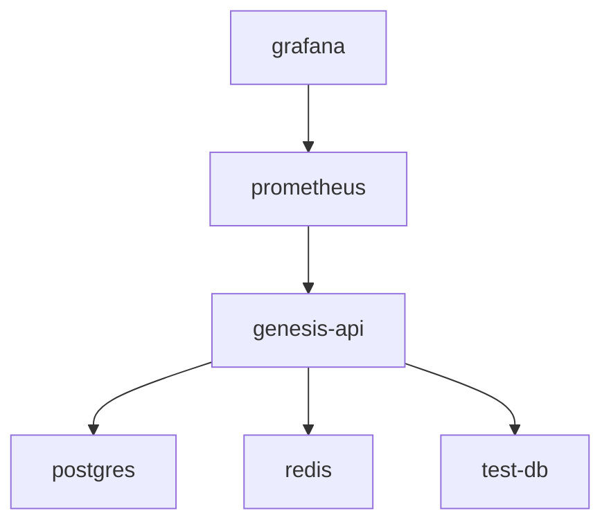
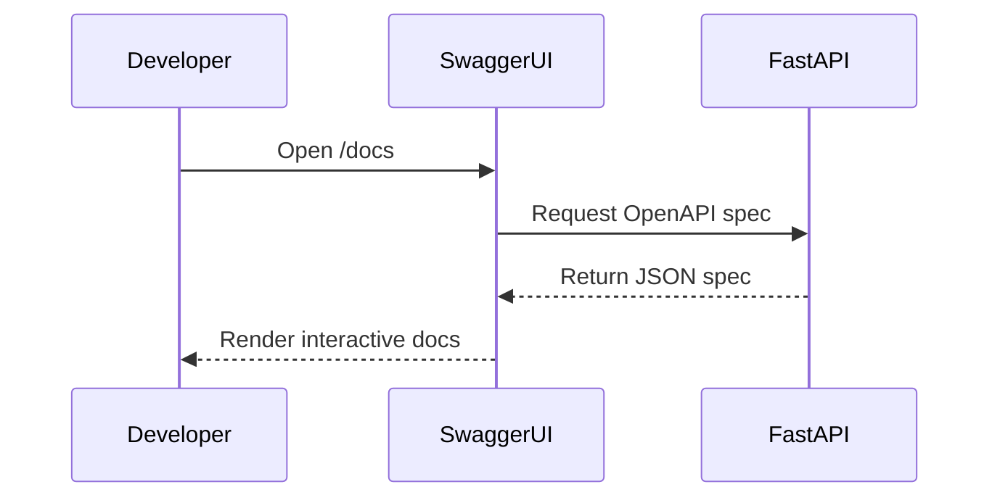

# Developer Setup Guide

<cite>
**Referenced Files in This Document**   
- [setup_dev_environment.py](file://scripts/setup_dev_environment.py)
- [test_db_connection.py](file://scripts/test_db_connection.py)
- [docker-compose.yml](file://docker-compose.yml)
- [requirements.txt](file://requirements.txt)
- [main.py](file://app/main.py)
- [settings.py](file://app/config/settings.py)
- [.env.example](file://.env.example)
- [auth.py](file://app/api/v1/auth.py)
- [security.py](file://app/core/security.py)
- [user_service.py](file://app/services/user_service.py)
- [user.py](file://app/models/user.py)
- [user.py](file://app/schemas/user.py)
- [database.py](file://app/config/database.py)
</cite>

## Table of Contents
1. [Prerequisites](#prerequisites)
2. [Cloning the Repository](#cloning-the-repository)
3. [Setting Up the Development Environment](#setting-up-the-development-environment)
4. [Configuring Environment Variables](#configuring-environment-variables)
5. [Running Services with Docker Compose](#running-services-with-docker-compose)
6. [Verifying Database Connectivity](#verifying-database-connectivity)
7. [Running the Application Locally](#running-the-application-locally)
8. [Accessing API Documentation](#accessing-api-documentation)
9. [Executing Tests](#executing-tests)
10. [Common Setup Issues and Solutions](#common-setup-issues-and-solutions)
11. [Development Workflow Tips](#development-workflow-tips)
12. [Code Formatting and Linting Standards](#code-formatting-and-linting-standards)

## Prerequisites

Before setting up the development environment, ensure the following prerequisites are met:

- **Python 3.11 or higher**: The project requires Python 3.11+ for compatibility with async features and dependencies.
- **Docker and Docker Compose**: Required for containerized services (PostgreSQL, Redis, Prometheus, Grafana).
- **Git**: To clone the repository.
- **Text Editor or IDE**: Recommended: VS Code, PyCharm, or any Python-capable editor.

**Section sources**
- [setup_dev_environment.py](file://scripts/setup_dev_environment.py#L25-L35)

## Cloning the Repository

To begin, clone the repository to your local machine:

```bash
git clone https://github.com/your-org/genesis.git
cd genesis
```

Ensure the repository is cloned into the desired workspace directory (e.g., ``).

## Setting Up the Development Environment

The project includes a script to automate the setup process. Run the following command to initialize the environment:

```bash
python scripts/setup_dev_environment.py
```

This script performs the following steps:

1. **Python Version Check**: Validates that Python 3.11+ is installed.
2. **Virtual Environment Creation**: Creates a `venv` directory if it doesn't exist.
3. **Dependency Installation**: Installs all packages listed in `requirements.txt`.
4. **Environment File Setup**: Copies `.env.example` to `.env` if not already present.
5. **Import Validation**: Tests critical imports to ensure dependencies are correctly installed.
6. **Application Health Check**: Attempts to import the main FastAPI app to verify setup integrity.

Upon successful execution, the script displays next steps for configuration and development.

**Section sources**
- [setup_dev_environment.py](file://scripts/setup_dev_environment.py#L50-L267)

## Configuring Environment Variables

After running the setup script, a `.env` file is created from `.env.example`. Edit this file to configure the following key variables:

```env
# Database
POSTGRES_PASSWORD=your_secure_password

# AI Services API Keys
OPENAI_API_KEY=your_openai_key
ANTHROPIC_API_KEY=your_anthropic_key
TAVILY_API_KEY=your_tavily_key
LOGOAI_API_KEY=your_logoai_key

# Security
SECRET_KEY=your_secure_random_string

# Environment
ENVIRONMENT=development
DEBUG=true
```

Ensure all API keys are obtained from their respective providers and securely stored.

**Section sources**
- [.env.example](file://.env.example#L1-L51)
- [settings.py](file://app/config/settings.py#L1-L84)

## Running Services with Docker Compose

The project uses Docker Compose to manage services. Start all containers with:

```bash
docker-compose up -d
```

This command launches the following services:

- **genesis-api**: Main FastAPI application (port 8002)
- **postgres**: PostgreSQL database (port 5435)
- **redis**: Redis for virtual file system (port 6382)
- **test-db**: Isolated test database
- **prometheus**: Monitoring (port 9090, optional)
- **grafana**: Dashboard (port 3000, optional)

The API service waits for PostgreSQL and Redis to be healthy before starting.



**Diagram sources**
- [docker-compose.yml](file://docker-compose.yml#L1-L168)

**Section sources**
- [docker-compose.yml](file://docker-compose.yml#L1-L168)

## Verifying Database Connectivity

Use the provided script to test database connectivity:

```bash
python scripts/test_db_connection.py
```

This script:
- Loads environment variables from `.env`
- Attempts to connect to the database using `DATABASE_URL`
- Reports success or failure with error details

Ensure the PostgreSQL container is running and credentials in `.env` match those in `docker-compose.yml`.

**Section sources**
- [test_db_connection.py](file://scripts/test_db_connection.py#L1-L26)
- [database.py](file://app/config/database.py#L1-L44)

## Running the Application Locally

Once the environment is set up, start the application using:

```bash
uvicorn app.main:app --reload --host 0.0.0.0 --port 8000
```

Or activate the virtual environment first:

```bash
# Windows
venv\Scripts\activate
# Unix/Linux
source venv/bin/activate

uvicorn app.main:app --reload --host 0.0.0.0 --port 8000
```

The `--reload` flag enables hot-reloading during development.

**Section sources**
- [main.py](file://app/main.py#L1-L185)
- [setup_dev_environment.py](file://scripts/setup_dev_environment.py#L230-L260)

## Accessing API Documentation

The application provides interactive API documentation via Swagger UI. After starting the server, navigate to:

```
http://localhost:8000/docs
```

This endpoint displays all available endpoints, request/response models, and allows interactive testing. Documentation is disabled in production when `DEBUG=false`.



**Diagram sources**
- [main.py](file://app/main.py#L150-L155)

**Section sources**
- [main.py](file://app/main.py#L1-L185)

## Executing Tests

Run tests using pytest:

```bash
pytest tests/ -v
```

The test suite includes:
- `test_auth.py`: Authentication flow (registration, login, JWT)
- `test_business.py`: Business logic endpoints
- `test_coaching.py`: Coaching session orchestration

Test dependencies include `pytest-asyncio` and `asgi-lifespan` for async testing.

**Section sources**
- [pytest.ini](file://pytest.ini)
- [requirements.txt](file://requirements.txt#L50-L53)

## Common Setup Issues and Solutions

### 1. Python Version Mismatch
**Issue**: Script fails with "Python X.X non compatible. Requis: Python 3.11+"
**Solution**: Install Python 3.11+ from [python.org](https://python.org) and ensure it's in PATH.

### 2. Dependency Installation Failure
**Issue**: pip fails to install packages
**Solution**: Upgrade pip first:
```bash
python -m pip install --upgrade pip
```

### 3. Database Connection Refused
**Issue**: `psycopg2` connection error
**Solution**: Ensure Docker containers are running:
```bash
docker-compose ps
docker-compose up -d postgres
```

### 4. Missing .env File
**Issue**: Environment variables not loaded
**Solution**: Run setup script or manually copy `.env.example` to `.env`.

### 5. Import Errors
**Issue**: Module not found despite installation
**Solution**: Verify virtual environment activation and site-packages path.

**Section sources**
- [setup_dev_environment.py](file://scripts/setup_dev_environment.py#L25-L267)
- [test_db_connection.py](file://scripts/test_db_connection.py#L1-L26)

## Development Workflow Tips

- **Use the setup script**: Always run `setup_dev_environment.py` when setting up a new environment.
- **Keep .env secure**: Never commit `.env` to version control.
- **Leverage Docker**: Use containers for consistent database and Redis states.
- **Enable debug mode**: Set `DEBUG=true` during development for detailed logs.
- **Monitor logs**: Check `logs/` directory for structured logging output.

## Code Formatting and Linting Standards

The project enforces code quality using:

- **Black**: For code formatting
- **isort**: For import sorting
- **flake8**: For linting
- **pre-commit**: Hooks to enforce standards

Install pre-commit hooks:

```bash
pre-commit install
```

These tools run automatically on commit to ensure consistent code style.

**Section sources**
- [requirements.txt](file://requirements.txt#L54-L58)