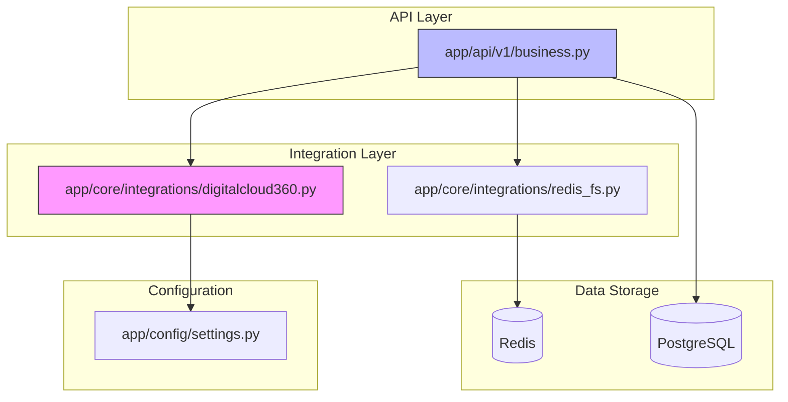
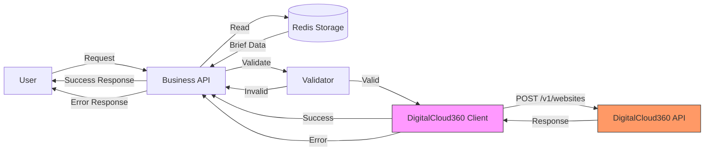
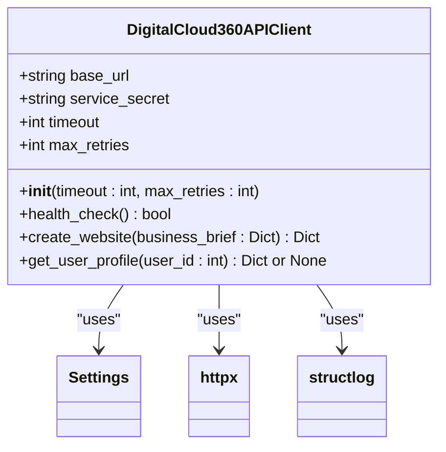
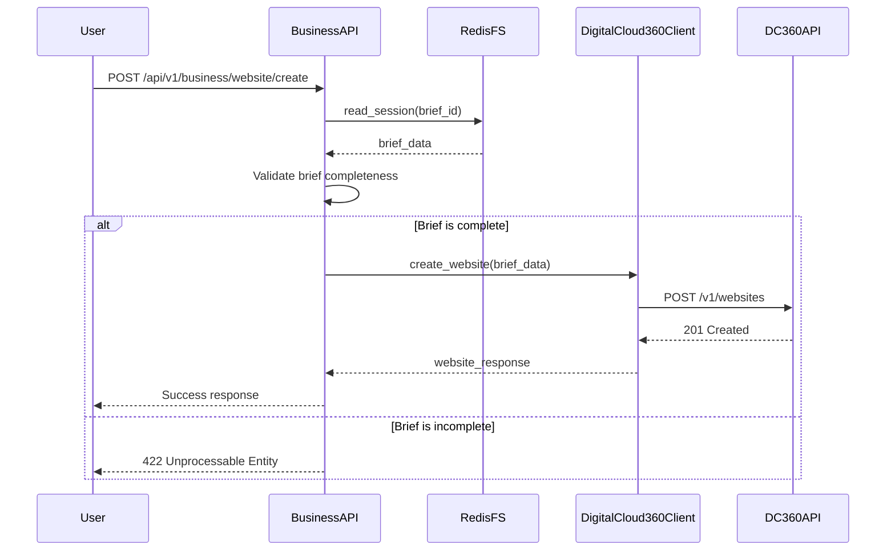
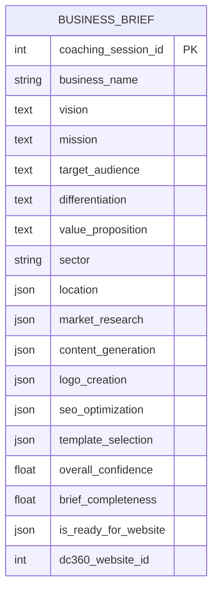
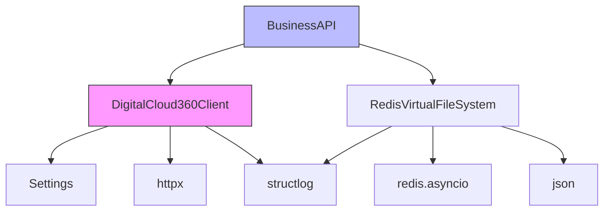

# DigitalCloud360 Integration

<cite>
**Referenced Files in This Document**   
- [digitalcloud360.py](file://app/core/integrations/digitalcloud360.py#L8-L82)
- [settings.py](file://app/config/settings.py#L48-L50)
- [business.py](file://app/api/v1/business.py#L211-L269)
- [redis_fs.py](file://app/core/integrations/redis_fs.py#L8-L59)
- [coaching.py](file://app/models/coaching.py#L85-L120)
- [business.py](file://app/schemas/business.py#L6-L15)
</cite>

## Table of Contents
1. [Introduction](#introduction)
2. [Project Structure](#project-structure)
3. [Core Components](#core-components)
4. [Architecture Overview](#architecture-overview)
5. [Detailed Component Analysis](#detailed-component-analysis)
6. [Dependency Analysis](#dependency-analysis)
7. [Performance Considerations](#performance-considerations)
8. [Troubleshooting Guide](#troubleshooting-guide)
9. [Conclusion](#conclusion)

## Introduction
This document provides a comprehensive analysis of the DigitalCloud360 integration within the Genesis AI Service, focusing on website publishing functionality. The integration enables automated website creation based on business briefs generated through AI coaching sessions. The system orchestrates multiple sub-agents to generate content, logos, SEO metadata, and templates, then deploys the complete website to the DigitalCloud360 hosting platform. This documentation covers the implementation of the DigitalCloud360 client, authentication mechanism, site creation workflow, file deployment process, error handling, configuration parameters, and security considerations.

## Project Structure
The DigitalCloud360 integration is implemented as part of a larger AI-powered business coaching platform. The project follows a modular structure with clear separation of concerns. The integration logic resides in the `app/core/integrations/` directory, while the API endpoints that trigger website creation are located in `app/api/v1/business.py`. Configuration settings are centralized in `app/config/settings.py`, and data persistence is handled through Redis and PostgreSQL.

**Diagram sources**
- [digitalcloud360.py](file://app/core/integrations/digitalcloud360.py#L8-L82)
- [business.py](file://app/api/v1/business.py#L211-L269)
- [settings.py](file://app/config/settings.py#L48-L50)
- [redis_fs.py](file://app/core/integrations/redis_fs.py#L8-L59)

**Section sources**
- [digitalcloud360.py](file://app/core/integrations/digitalcloud360.py#L8-L82)
- [business.py](file://app/api/v1/business.py#L211-L269)

## Core Components
The DigitalCloud360 integration consists of several key components that work together to enable automated website publishing. The core component is the `DigitalCloud360APIClient` class, which handles communication with the DigitalCloud360 API. This client is used by the business API endpoints to create websites based on completed business briefs. Business briefs are stored and retrieved using the `RedisVirtualFileSystem`, which provides a persistent storage layer for session data. Configuration parameters are managed through the centralized settings system, allowing for environment-specific configuration of the integration.

**Section sources**
- [digitalcloud360.py](file://app/core/integrations/digitalcloud360.py#L8-L82)
- [redis_fs.py](file://app/core/integrations/redis_fs.py#L8-L59)
- [settings.py](file://app/config/settings.py#L48-L50)

## Architecture Overview
The DigitalCloud360 integration follows a service-oriented architecture where the Genesis AI Service acts as a client to the DigitalCloud360 hosting platform. When a user requests website creation, the business API endpoint retrieves the completed business brief from Redis storage, validates its completeness, and forwards it to the DigitalCloud360 API via the client integration. The integration uses asynchronous HTTP requests to ensure non-blocking operation and includes retry logic for resilience.

**Diagram sources**
- [digitalcloud360.py](file://app/core/integrations/digitalcloud360.py#L8-L82)
- [business.py](file://app/api/v1/business.py#L211-L269)
- [redis_fs.py](file://app/core/integrations/redis_fs.py#L8-L59)

## Detailed Component Analysis

### DigitalCloud360APIClient Analysis
The `DigitalCloud360APIClient` class implements the integration with the DigitalCloud360 hosting platform. It provides methods for health checking, website creation, and user profile retrieval. The client uses service-to-service authentication with a shared secret key and includes built-in retry logic for improved reliability.

#### Class Diagram

**Diagram sources**
- [digitalcloud360.py](file://app/core/integrations/digitalcloud360.py#L8-L82)

**Section sources**
- [digitalcloud360.py](file://app/core/integrations/digitalcloud360.py#L8-L82)

### Website Creation Workflow Analysis
The website creation workflow is triggered by an API endpoint that orchestrates the retrieval of the business brief, validation of its completeness, and submission to the DigitalCloud360 API. The workflow ensures that all necessary components (content, logo, SEO, template) are present before attempting deployment.

#### Sequence Diagram

**Diagram sources**
- [business.py](file://app/api/v1/business.py#L211-L269)
- [digitalcloud360.py](file://app/core/integrations/digitalcloud360.py#L41-L62)

**Section sources**
- [business.py](file://app/api/v1/business.py#L211-L269)

### Business Brief Structure Analysis
The business brief serves as the input data structure for website creation. It contains comprehensive information about the business, including name, vision, mission, target audience, and results from various AI sub-agents. The brief structure ensures that all necessary components for website generation are present and organized.

#### Data Model Diagram

**Diagram sources**
- [coaching.py](file://app/models/coaching.py#L85-L120)
- [business.py](file://app/schemas/business.py#L6-L15)

**Section sources**
- [coaching.py](file://app/models/coaching.py#L85-L120)
- [business.py](file://app/schemas/business.py#L6-L15)

## Dependency Analysis
The DigitalCloud360 integration depends on several internal and external components. The primary dependencies include the settings module for configuration, httpx for HTTP communication, and Redis for brief storage. The integration is accessed through FastAPI dependency injection, allowing for easy testing and mocking.

**Diagram sources**
- [digitalcloud360.py](file://app/core/integrations/digitalcloud360.py#L8-L82)
- [redis_fs.py](file://app/core/integrations/redis_fs.py#L8-L59)
- [settings.py](file://app/config/settings.py#L48-L50)

**Section sources**
- [digitalcloud360.py](file://app/core/integrations/digitalcloud360.py#L8-L82)
- [redis_fs.py](file://app/core/integrations/redis_fs.py#L8-L59)

## Performance Considerations
The DigitalCloud360 integration is designed with performance and reliability in mind. The client implements exponential backoff retry logic for health checks and uses configurable timeout settings to prevent hanging requests. The use of asynchronous HTTP clients ensures that the integration does not block the main application thread. Brief data is stored in Redis for fast retrieval, and the validation step prevents unnecessary API calls to the external service.

The default timeout of 30 seconds and maximum of 3 retries provide a balance between responsiveness and resilience. For high-traffic scenarios, consider adjusting these values based on the expected response times of the DigitalCloud360 API. The Redis storage layer provides sub-millisecond read/write operations, ensuring that brief retrieval does not become a bottleneck in the website creation process.

## Troubleshooting Guide
This section addresses common issues that may occur during website publishing and provides guidance for resolution.

### Failed Website Creation
**Symptoms**: API returns 422 Unprocessable Entity with message "The business brief is incomplete and cannot be used to create a website."

**Causes**: The business brief is missing one or more required components (content, logo, SEO, template).

**Solution**: Verify that all sub-agents have completed their tasks and that the brief contains results from all required components. Check the Redis storage to confirm the brief structure.

### DigitalCloud360 API Connection Issues
**Symptoms**: Repeated health check failures or HTTP request errors when creating websites.

**Causes**: Network connectivity issues, incorrect API URL, or invalid service secret.

**Solution**: Verify the configuration settings (`DIGITALCLOUD360_API_URL` and `DIGITALCLOUD360_SERVICE_SECRET`). Check network connectivity to the DigitalCloud360 API endpoint. Ensure the service secret is correctly configured in the production environment.

### Brief Not Found
**Symptoms**: API returns 404 Not Found with message "Business brief not found."

**Causes**: The specified brief ID does not exist in Redis storage.

**Solution**: Verify that the brief was successfully generated and stored. Check the user ID and brief ID for correctness. Ensure the Redis connection is healthy.

### Authentication Failures
**Symptoms**: HTTP 401 Unauthorized responses from the DigitalCloud360 API.

**Causes**: Invalid or expired service secret.

**Solution**: Verify that the `DIGITALCLOUD360_SERVICE_SECRET` setting matches the expected value on the DigitalCloud360 platform. Rotate the secret if compromised.

**Section sources**
- [digitalcloud360.py](file://app/core/integrations/digitalcloud360.py#L17-L39)
- [business.py](file://app/api/v1/business.py#L211-L269)
- [redis_fs.py](file://app/core/integrations/redis_fs.py#L8-L59)

## Conclusion
The DigitalCloud360 integration provides a robust and automated solution for publishing websites based on AI-generated business briefs. The implementation follows best practices for API integration, including proper error handling, retry logic, and configuration management. The separation of concerns between the client implementation, API endpoints, and storage layer ensures maintainability and testability. By leveraging asynchronous operations and efficient data storage, the integration delivers reliable performance even under high load. The comprehensive error handling and troubleshooting guidance enable quick resolution of common issues, ensuring a smooth user experience for website publishing.