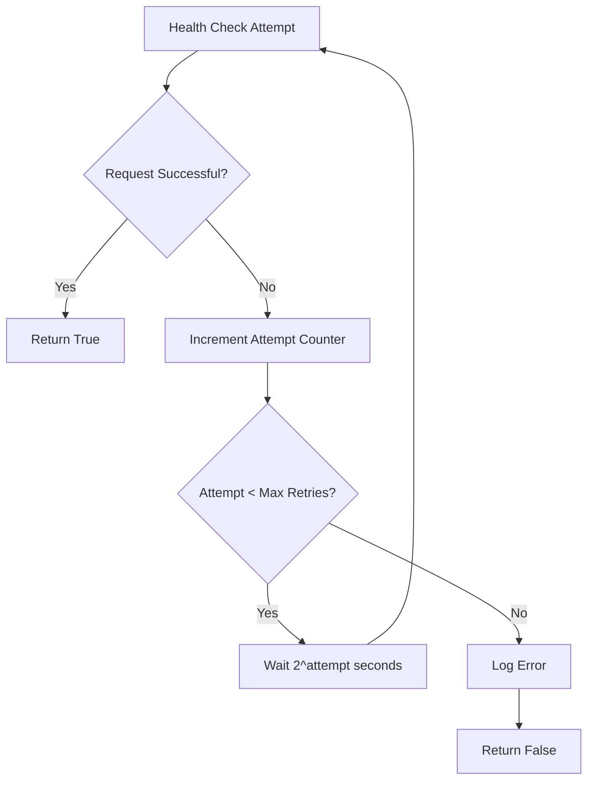
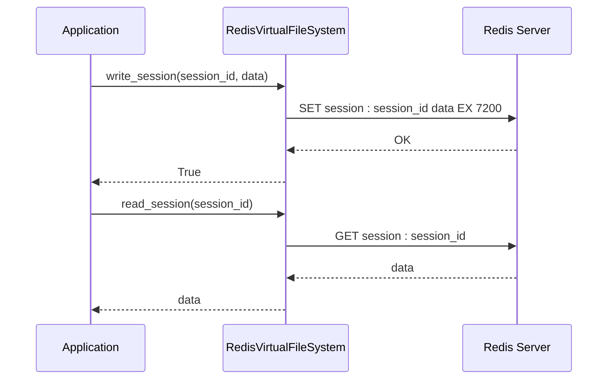

# External Integrations

<cite>
**Referenced Files in This Document**   
- [tavily.py](file://app/core/integrations/tavily.py)
- [openai.py](file://app/core/integrations/openai.py)
- [logoai.py](file://app/core/integrations/logoai.py)
- [digitalcloud360.py](file://app/core/integrations/digitalcloud360.py)
- [redis_fs.py](file://app/core/integrations/redis_fs.py)
- [settings.py](file://app/config/settings.py)
- [main.py](file://app/main.py)
</cite>

## Table of Contents
1. [Tavily Integration](#tavily-integration)
2. [OpenAI Integration](#openai-integration)
3. [LogoAI Integration](#logoai-integration)
4. [DigitalCloud360 Integration](#digitalcloud360-integration)
5. [Redis File Storage Integration](#redis-file-storage-integration)
6. [Troubleshooting Guide](#troubleshooting-guide)

## Tavily Integration

The Tavily integration provides market research capabilities, enabling the system to gather competitive intelligence and analyze African markets. The `TavilyClient` class serves as a wrapper around the Tavily SDK, abstracting API interactions for internal use.

### Authentication Mechanism
Authentication is managed through the `TAVILY_API_KEY` environment variable, which is loaded via the application settings. During initialization, the client validates the presence of this key and raises a `ValueError` if missing.

```python
def __init__(self):
    if not settings.TAVILY_API_KEY:
        raise ValueError("TAVILY_API_KEY is not set in the environment variables.")
    self.client = TavilySDK(api_key=settings.TAVILY_API_KEY)
```

### API Clients and Request Handling
The integration exposes two primary methods:
- `search_market(query: str, location: str = "Africa")`: Performs market research with an Africa-focused query.
- `analyze_competitors(business_sector: str, location: str)`: Analyzes local competitors for a given business sector.

Both methods use the `search` function from the Tavily SDK with `search_depth="advanced"` for comprehensive results.

### Error Handling and Fallbacks
The integration implements graceful error handling:
- On failure, `search_market` returns an empty list as a fallback.
- `analyze_competitors` returns a structured error dictionary.
- All errors are logged with context using structured logging.

```python
except Exception as e:
    logger.error("Tavily market search failed", query=query, location=location, error=str(e))
    return []
```

### Usage Example
```python
client = TavilyClient()
results = await client.search_market("fashion e-commerce", "West Africa")
competitors = await client.analyze_competitors("restaurant", "Dakar")
```

### Data Privacy
Queries are constructed using only business context data (sector, location) without including personally identifiable information. The integration does not store any data received from Tavily.

**Section sources**
- [tavily.py](file://app/core/integrations/tavily.py#L7-L43)

## OpenAI Integration

The OpenAI integration enables AI-powered content generation using GPT models. The `OpenAIClient` class provides a clean interface for text generation tasks.

### Authentication Mechanism
Authentication uses the `OPENAI_API_KEY` environment variable. The integration checks for this key during initialization and raises an `IntegrationException` if not found.

```python
def __init__(self):
    self.api_key = os.getenv("OPENAI_API_KEY")
    if not self.api_key:
        logger.error("OPENAI_API_KEY not found in environment variables.")
        raise IntegrationException("OpenAI API key is not configured.")
```

### API Clients and Request Handling
The integration uses the official `AsyncOpenAI` client for asynchronous operations. The primary method `generate_text` supports configurable parameters:

- `prompt`: Input text for generation
- `max_tokens`: Maximum output length (default: 1500)
- `temperature`: Creativity control (default: 0.7)

The client targets the `gpt-4o` model for optimal performance.

```python
response = await self.client.chat.completions.create(
    model="gpt-4o",
    messages=[{"role": "user", "content": prompt}],
    max_tokens=max_tokens,
    temperature=temperature,
)
```

### Error Translation
Errors are caught and re-raised as `IntegrationException` with detailed context, ensuring consistent error handling across the application.

```python
except Exception as e:
    logger.error("Error during OpenAI text generation", error=str(e))
    raise IntegrationException("Failed to generate text with OpenAI.", details=str(e))
```

### Rate Limiting and Timeouts
While the integration itself doesn't implement rate limiting, it relies on OpenAI's built-in rate limiting and quota management. Timeouts are handled by the underlying HTTP client.

### Usage Example
```python
client = OpenAIClient()
content = await client.generate_text(
    "Create a welcome message for an African fashion e-commerce site",
    max_tokens=500,
    temperature=0.8
)
```

### Data Privacy
Prompts may contain business context but are designed to exclude personal user data. All communications with OpenAI are encrypted in transit.

**Section sources**
- [openai.py](file://app/core/integrations/openai.py#L7-L44)

## LogoAI Integration

The LogoAI integration simulates logo creation functionality. Currently implemented as a mock service, it provides a foundation for future integration with a real logo generation API.

### Authentication Mechanism
The current implementation is a mock and does not require authentication. The settings file includes a placeholder `LOGOAI_API_KEY` for future implementation.

### API Clients and Request Handling
The `LogoAIClient` class provides a single method `generate_logo` that takes:
- `company_name`: Name of the business
- `style_guide`: Dictionary containing style preferences

The method generates a deterministic URL based on the company name.

```python
logo_url = f"https://cdn.example.com/logos/{company_name.lower().replace(' ', '-')}.png"
```

### Error Handling
Errors are caught and re-raised as `IntegrationException`, maintaining consistency with other integrations.

```python
except Exception as e:
    logger.error("Error during LogoAI logo generation", error=str(e))
    raise IntegrationException("Failed to generate logo with LogoAI.", details=str(e))
```

### Future Implementation
When connected to a real service, this integration will:
- Use the `LOGOAI_API_KEY` for authentication
- Send style preferences to the logo generation API
- Handle image uploads and storage
- Implement proper rate limiting

### Usage Example
```python
client = LogoAIClient()
logo_url = await client.generate_logo("AfroChic", {"colors": ["red", "green"], "style": "modern"})
```

**Section sources**
- [logoai.py](file://app/core/integrations/logoai.py#L5-L31)

## DigitalCloud360 Integration

The DigitalCloud360 integration enables website publishing capabilities, allowing the system to create websites based on business briefs.

### Authentication Mechanism
Authentication uses a service secret (`DIGITALCLOUD360_SERVICE_SECRET`) passed in the `X-Service-Secret` header for all requests.

### API Clients and Request Handling
The `DigitalCloud360APIClient` class uses `httpx.AsyncClient` for HTTP communications. Key methods include:

- `health_check()`: Verifies API connectivity with retry logic
- `create_website(business_brief)`: Creates a website from a business brief
- `get_user_profile(user_id)`: Retrieves user profile information

```python
headers = {"X-Service-Secret": self.service_secret, "Content-Type": "application/json"}
response = await client.post(
    f"{self.base_url}/v1/websites", 
    json=business_brief, 
    headers=headers, 
    timeout=self.timeout
)
```

### Retry Policies and Timeout Configurations
The integration implements robust retry logic:
- Configurable `max_retries` (default: 3)
- Exponential backoff (`await asyncio.sleep(2 ** attempt)`)
- Configurable timeout (default: 30 seconds)



**Diagram sources**
- [digitalcloud360.py](file://app/core/integrations/digitalcloud360.py#L23-L49)

### Error Handling
The integration distinguishes between different error types:
- `HTTPStatusError`: Raised for non-2xx responses
- `RequestError`: Handled with retry logic
- 404 responses for `get_user_profile` return `None` rather than raising an exception

### Data Privacy
Business briefs containing company information are transmitted securely. The integration uses HTTPS for all communications and does not store any data from DigitalCloud360.

### Usage Example
```python
client = DigitalCloud360APIClient()
success = await client.health_check()
if success:
    website_data = await client.create_website(brief_data)
    profile = await client.get_user_profile(123)
```

**Section sources**
- [digitalcloud360.py](file://app/core/integrations/digitalcloud360.py#L8-L82)

## Redis File Storage Integration

The Redis integration provides a virtual file system for persistent storage of coaching sessions.

### Authentication Mechanism
Authentication is handled automatically through the Redis URL configuration (`REDIS_URL`), which includes connection credentials.

### API Clients and Request Handling
The `RedisVirtualFileSystem` class uses `redis.asyncio` for asynchronous operations. Key methods include:

- `write_session(session_id, data, ttl=7200)`: Stores session data with 2-hour default TTL
- `read_session(session_id)`: Retrieves session data
- `list_user_sessions(user_id)`: Lists all sessions for a user
- `health_check()`: Verifies Redis connectivity

```python
await self.redis.set(f"session:{session_id}", json.dumps(data), ex=ttl)
```

### Data Structure
Sessions are stored as JSON strings with keys following the pattern `session:{session_id}`. The current implementation uses `scan_iter` for listing user sessions, which should be optimized in production.

### Error Handling
All Redis operations are wrapped in try-catch blocks:
- Write operations return `False` on failure
- Read operations return `None` on failure or if the key doesn't exist
- All errors are logged with context

```python
except Exception as e:
    logger.error("Failed to write session to Redis", session_id=session_id, error=str(e))
    return False
```

### Performance Characteristics
- In-memory storage ensures low-latency access
- Automatic expiration (TTL) prevents storage bloat
- JSON serialization provides human-readable storage format

### Usage Example
```python
fs = RedisVirtualFileSystem()
await fs.health_check()
success = await fs.write_session("session_123", {"step": "vision", "data": "user input"})
data = await fs.read_session("session_123")
```

### Data Privacy
Session data may contain user inputs but is stored securely within the Redis instance. The integration does not transmit data externally.



**Diagram sources**
- [redis_fs.py](file://app/core/integrations/redis_fs.py#L8-L59)

**Section sources**
- [redis_fs.py](file://app/core/integrations/redis_fs.py#L8-L59)

## Troubleshooting Guide

### Common Integration Issues

#### Authentication Failures
**Symptoms**: `ValueError` or `IntegrationException` related to missing API keys.

**Solutions**:
1. Verify environment variables are set:
   - `TAVILY_API_KEY`
   - `OPENAI_API_KEY`
   - `DIGITALCLOUD360_SERVICE_SECRET`
2. Check `.env` file or deployment configuration
3. Restart the application after setting variables

#### API Changes
**Symptoms**: Unexpected response formats or 404 errors.

**Solutions**:
1. Check service provider documentation for breaking changes
2. Update client code to match new API specifications
3. Implement response validation and fallback mechanisms

#### Connection Timeouts
**Symptoms**: `RequestError` or timeout exceptions.

**Solutions**:
1. Verify network connectivity to external services
2. Check firewall rules and security groups
3. Adjust timeout settings in configuration
4. Monitor service health status

#### Rate Limiting
**Symptoms**: 429 status codes or throttling errors.

**Solutions**:
1. Implement exponential backoff in retry logic
2. Cache responses to reduce API calls
3. Monitor usage against service quotas
4. Consider upgrading service tier

### Diagnostic Commands
```bash
# Check application environment
python -c "from app.config.settings import settings; print(settings.model_dump())"

# Test Redis connectivity
redis-cli -h redis -p 6379 ping

# Test DigitalCloud360 health check
curl -H "X-Service-Secret: your-secret" https://api.digitalcloud360.com/health
```

### Monitoring and Logging
All integrations use structured logging with `structlog`. Key log fields include:
- `action`: Operation being performed
- `service`: External service name
- `status`: Success/failure
- Context-specific fields (e.g., `query`, `user_id`)

**Section sources**
- [main.py](file://app/main.py#L35-L73)
- [settings.py](file://app/config/settings.py#L50-L83)