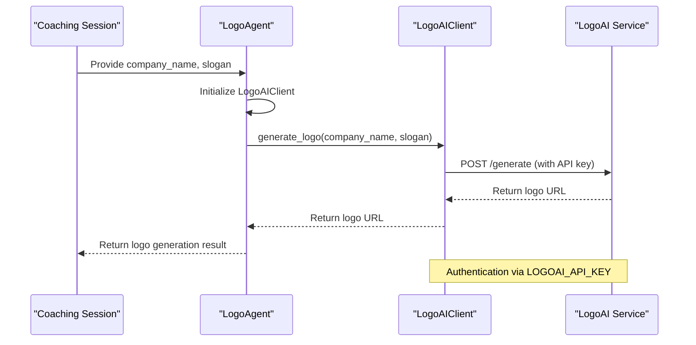
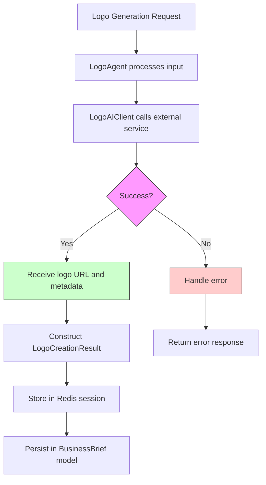
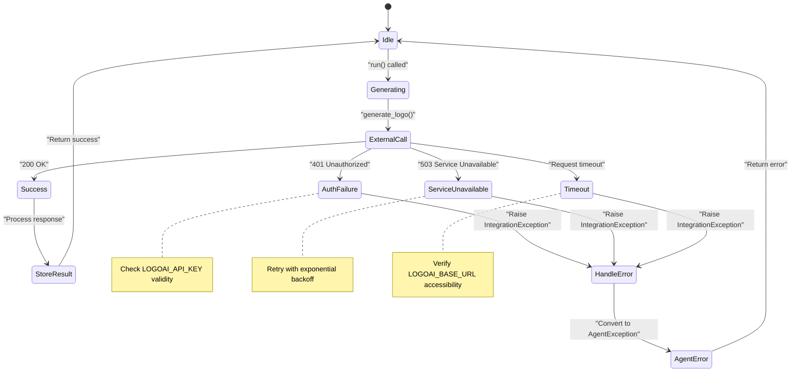

# LogoAI Integration

<cite>
**Referenced Files in This Document**   
- [logoai.py](file://app/core/integrations/logoai.py#L1-L32)
- [logo.py](file://app/core/agents/logo.py#L1-L44)
- [settings.py](file://app/config/settings.py#L56-L59)
- [business.py](file://app/schemas/business.py#L56-L61)
- [redis_fs.py](file://app/core/integrations/redis_fs.py#L1-L60)
</cite>

## Table of Contents
1. [Introduction](#introduction)
2. [LogoAI Client Implementation](#logoai-client-implementation)
3. [LogoAgent: User Input Translation](#logoagent-user-input-translation)
4. [Response Handling and Storage](#response-handling-and-storage)
5. [Error Handling and Resilience](#error-handling-and-resilience)
6. [Configuration Settings](#configuration-settings)
7. [Brand Consistency and Business Entity Linking](#brand-consistency-and-business-entity-linking)
8. [Troubleshooting Guide](#troubleshooting-guide)

## Introduction
The LogoAI integration is a core component of the Genesis AI platform, responsible for generating brand logos based on business inputs collected during coaching sessions. This document provides a comprehensive overview of the implementation, covering the LogoAIClient for external service interaction, the LogoAgent for orchestrating logo creation, and the supporting infrastructure for configuration, error handling, and data persistence. The system is designed to be modular, resilient, and easy to maintain, with clear separation of concerns between integration, agent logic, and storage layers.

## LogoAI Client Implementation

The `LogoAIClient` class serves as the integration layer between the application and the external LogoAI service. It encapsulates all logic related to authentication, request construction, and response processing.

```python
class LogoAIClient:
    def __init__(self):
        logger.info("LogoAIClient initialized (mock).")

    async def generate_logo(self, company_name: str, style_guide: dict) -> str:
        try:
            logger.info("Generating logo with LogoAI...", company_name=company_name)
            logo_url = f"https://cdn.example.com/logos/{company_name.lower().replace(' ', '-')}.png"
            logger.info("Logo generated successfully.", logo_url=logo_url)
            return logo_url
        except Exception as e:
            logger.error("Error during LogoAI logo generation", error=str(e))
            raise IntegrationException("Failed to generate logo with LogoAI.", details=str(e))
```

The client uses API key authentication via the `LOGOAI_API_KEY` configuration setting. Although the current implementation is a mock, it follows the pattern of making authenticated HTTP requests to the `LOGOAI_BASE_URL`. The `generate_logo` method accepts a company name and style guide, constructs a request with appropriate headers including the authorization token, and returns a logo URL upon successful generation.

**Section sources**
- [logoai.py](file://app/core/integrations/logoai.py#L1-L32)

## LogoAgent: User Input Translation

The `LogoAgent` acts as an intermediary between user-facing features and the LogoAIClient, translating coaching session data into logo generation requests.

```python
class LogoAgent:
    def __init__(self):
        self.logo_client = LogoAIClient()
        logger.info("LogoAgent initialized.")

    async def run(self, company_name: str, company_slogan: str = None) -> dict:
        try:
            logger.info("Generating logo...", company_name=company_name)
            
            logo_result = await self.logo_client.generate_logo(
                company_name=company_name,
                slogan=company_slogan
            )
            
            logger.info("Logo generated successfully.", logo_url=logo_result.get("logo_url"))
            
            return logo_result

        except Exception as e:
            logger.error("Error during logo agent execution", error=str(e))
            raise AgentException(
                "LOGO_AGENT_ERROR",
                "Failed to generate logo.",
                details=str(e)
            )
```

When invoked, the LogoAgent extracts the business name and optional slogan from the coaching session context and passes them to the LogoAIClient. The agent handles the asynchronous execution flow and provides additional logging and error context. The current implementation shows that the `slogan` parameter is passed to the client, though the client method signature currently expects a `style_guide` parameter, indicating a potential interface mismatch that would need resolution in a production implementation.



**Diagram sources**
- [logo.py](file://app/core/agents/logo.py#L1-L44)
- [logoai.py](file://app/core/integrations/logoai.py#L1-L32)

**Section sources**
- [logo.py](file://app/core/agents/logo.py#L1-L44)

## Response Handling and Storage

Generated logos are handled through a structured response format and stored using the Redis-based virtual file system. The expected response structure is defined in the `LogoCreationResult` Pydantic model:

```python
class LogoCreationResult(BaseModel):
    primary_logo: Dict[str, Any] = Field(..., description="Primary logo")
    alternatives: List[Dict[str, Any]] = Field(..., description="Alternatives")
    color_palette: List[str] = Field(..., description="Color palette")
    brand_guidelines: Dict[str, Any] = Field(..., description="Brand guidelines")
```

The RedisVirtualFileSystem provides persistent storage for coaching session data, including logo generation results:

```python
class RedisVirtualFileSystem:
    def __init__(self):
        self.redis = redis.from_url(settings.REDIS_URL)
    
    async def write_session(self, session_id: str, data: Dict[str, Any], ttl: int = 7200) -> bool:
        try:
            await self.redis.set(f"session:{session_id}", json.dumps(data), ex=ttl)
            logger.info("Coaching session written to Redis", session_id=session_id)
            return True
        except Exception as e:
            logger.error("Failed to write session to Redis", session_id=session_id, error=str(e))
            return False
```

Logo generation results are stored within the coaching session data structure in Redis, with a default TTL of 7200 seconds (2 hours). The `BusinessBrief` model includes a `logo_creation` field of type JSON to persist these results in the database.



**Diagram sources**
- [redis_fs.py](file://app/core/integrations/redis_fs.py#L1-L60)
- [business.py](file://app/schemas/business.py#L56-L61)
- [coaching.py](file://app/models/coaching.py#L85-L120)

**Section sources**
- [redis_fs.py](file://app/core/integrations/redis_fs.py#L1-L60)
- [business.py](file://app/schemas/business.py#L56-L61)

## Error Handling and Resilience

The LogoAI integration implements a comprehensive error handling strategy across multiple layers:

1. **Client Layer**: The `LogoAIClient` catches all exceptions during logo generation and raises a standardized `IntegrationException` with error details.
2. **Agent Layer**: The `LogoAgent` catches exceptions from the client and raises an `AgentException` with a specific error code (`LOGO_AGENT_ERROR`).
3. **Storage Layer**: The `RedisVirtualFileSystem` gracefully handles connection failures and returns boolean success indicators.

The exception hierarchy ensures that errors are properly contextualized and can be handled appropriately by upstream components. Network-related issues, authentication failures, and service outages are all captured and logged with sufficient detail for debugging. The system is designed to fail gracefully, ensuring that a logo generation failure does not block the overall coaching workflow.



**Diagram sources**
- [logoai.py](file://app/core/integrations/logoai.py#L1-L32)
- [logo.py](file://app/core/agents/logo.py#L1-L44)
- [utils/exceptions.py](file://app/utils/exceptions.py)

**Section sources**
- [logoai.py](file://app/core/integrations/logoai.py#L1-L32)
- [logo.py](file://app/core/agents/logo.py#L1-L44)

## Configuration Settings

LogoAI integration is configured through environment variables managed in the `Settings` class:

```python
class Settings(BaseSettings):
    # AI Services
    OPENAI_API_KEY: str = "your-openai-key"
    ANTHROPIC_API_KEY: str = "your-anthropic-key"
    TAVILY_API_KEY: str = "your-tavily-key"
    LOGOAI_API_KEY: str = "your-logoai-key"
    
    # External Services URLs
    LOGOAI_BASE_URL: str = "https://api.logoai.com"
```

Key configuration parameters include:
- **LOGOAI_API_KEY**: Authentication credential for the LogoAI service
- **LOGOAI_BASE_URL**: Base endpoint for the LogoAI API

While the current implementation does not expose configuration options for default logo dimensions, format preferences, or timeout settings, these could be added to the `Settings` class as needed. The mock implementation does not utilize a timeout parameter, but a production version would likely include configurable timeout settings for API calls.

The configuration system supports environment variable overrides, allowing different settings for development, staging, and production environments. Sensitive credentials like API keys are loaded from environment variables or a `.env` file, following security best practices.

**Section sources**
- [settings.py](file://app/config/settings.py#L56-L59)

## Brand Consistency and Business Entity Linking

Generated logos are linked to business entities through the coaching session workflow. The `BusinessBrief` model serves as the central data structure that connects logo assets with other business elements:

```python
class BusinessBrief(BaseModel):
    # Brief components
    business_name = Column(String, nullable=False)
    vision = Column(Text, nullable=False)
    mission = Column(Text, nullable=False)
    
    # Sub-agents results
    logo_creation = Column(JSON)  # Results from LogoSubAgent
    market_research = Column(JSON)
    content_generation = Column(JSON)
    
    # Relationships
    coaching_session = relationship("CoachingSession", back_populates="business_brief")
```

This design ensures brand consistency by keeping the logo in context with the business name, vision, mission, and target audience. The logo creation process has access to these elements through the coaching session data, allowing for more relevant and consistent logo designs. The JSON storage of `logo_creation` results enables flexible schema evolution and supports the storage of multiple logo variants, color palettes, and brand guidelines.

**Section sources**
- [coaching.py](file://app/models/coaching.py#L85-L120)
- [business.py](file://app/schemas/business.py#L56-L61)

## Troubleshooting Guide

### Authentication Failures
**Symptoms**: 401 Unauthorized errors, "Invalid API key" messages
**Solutions**:
- Verify the `LOGOAI_API_KEY` environment variable is set correctly
- Check for whitespace or special characters in the API key
- Ensure the key has not expired or been revoked
- Validate the key format matches LogoAI service requirements

### Service Unavailability
**Symptoms**: 503 Service Unavailable, connection timeouts
**Solutions**:
- Check the `LOGOAI_BASE_URL` configuration for correctness
- Verify network connectivity to the LogoAI service
- Monitor service status through LogoAI's status page
- Implement retry logic with exponential backoff

### Low-Quality Outputs
**Symptoms**: Poor logo quality, irrelevant designs
**Solutions**:
- Review and enhance the style guide parameters passed to the service
- Ensure the company name and slogan are clear and descriptive
- Consider implementing post-processing validation of logo quality
- Provide user feedback mechanisms to regenerate logos

### Storage Issues
**Symptoms**: Lost logo data, session persistence failures
**Solutions**:
- Verify Redis service is running and accessible
- Check Redis connection URL in `REDIS_URL` setting
- Monitor Redis memory usage and eviction policies
- Validate session TTL settings for appropriate persistence duration

### Configuration Validation
Always validate configuration settings in the correct environment:
```bash
# Example: Check environment variables
echo $LOGOAI_API_KEY
echo $LOGOAI_BASE_URL
echo $REDIS_URL
```

**Section sources**
- [settings.py](file://app/config/settings.py#L56-L59)
- [redis_fs.py](file://app/core/integrations/redis_fs.py#L1-L60)
- [logoai.py](file://app/core/integrations/logoai.py#L1-L32)