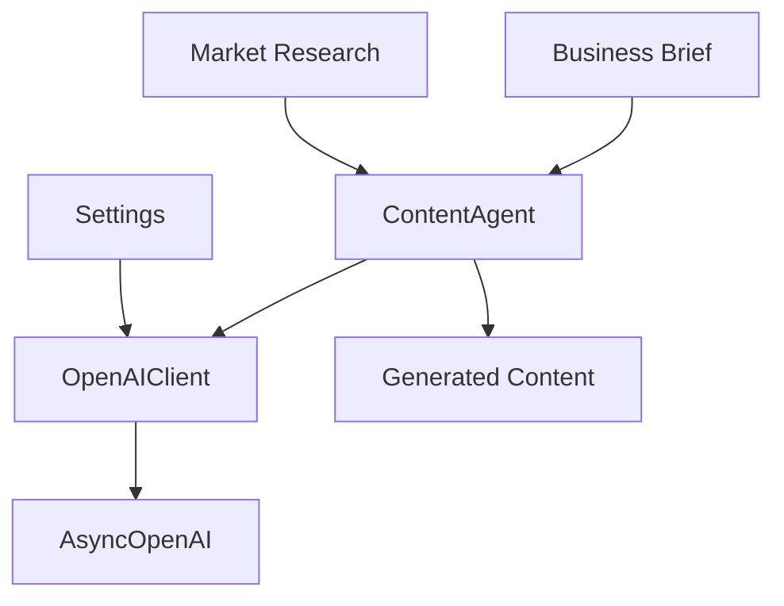
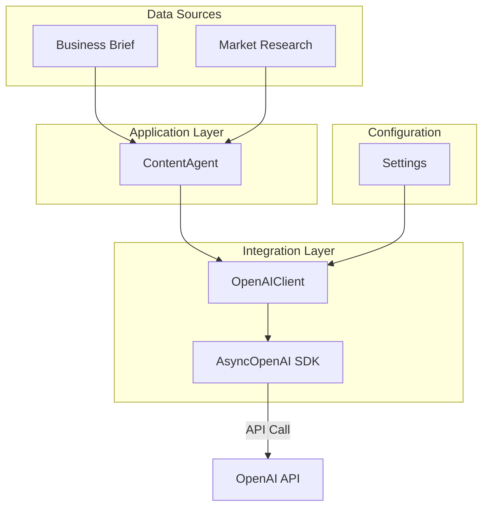
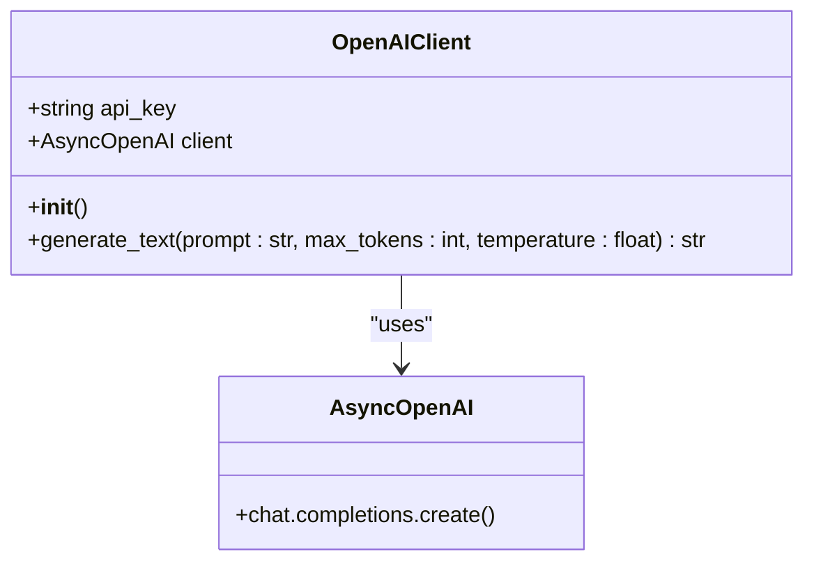
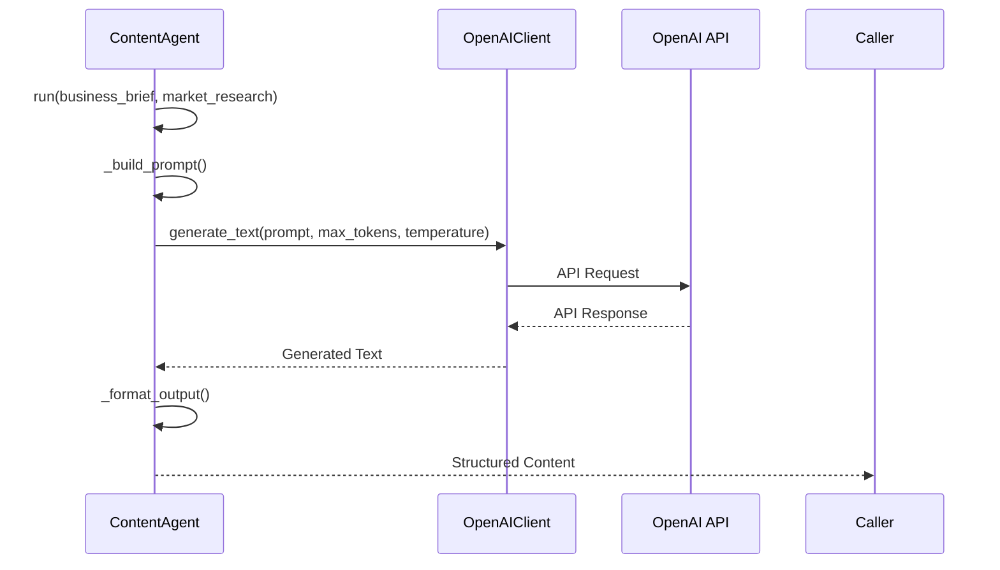
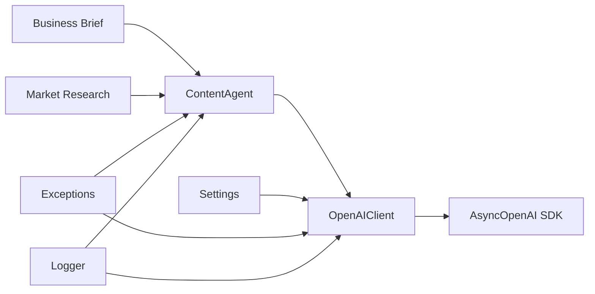

# OpenAI Integration

<cite>
**Referenced Files in This Document**   
- [openai.py](file://app/core/integrations/openai.py#L1-L44)
- [content.py](file://app/core/agents/content.py#L1-L83)
- [settings.py](file://app/config/settings.py#L1-L83)
- [exceptions.py](file://app/utils/exceptions.py#L1-L10)
</cite>

## Table of Contents
1. [Introduction](#introduction)
2. [Project Structure](#project-structure)
3. [Core Components](#core-components)
4. [Architecture Overview](#architecture-overview)
5. [Detailed Component Analysis](#detailed-component-analysis)
6. [Dependency Analysis](#dependency-analysis)
7. [Performance Considerations](#performance-considerations)
8. [Troubleshooting Guide](#troubleshooting-guide)
9. [Conclusion](#conclusion)

## Introduction
This document provides a comprehensive overview of the OpenAI integration within the Genesis AI Deep Agents Service. It details the implementation of the `OpenAIClient` class for content generation, its interaction with the `ContentAgent`, configuration via environment variables, and error handling strategies. The integration enables automated generation of business descriptions, value propositions, and website copy tailored for African entrepreneurs.

## Project Structure
The OpenAI integration is located within the `app/core/integrations/` directory, following a modular architecture that separates concerns between agents, integrations, and configuration. The `ContentAgent` resides in `app/core/agents/`, demonstrating a clean separation between business logic and external service integration.



**Diagram sources**
- [content.py](file://app/core/agents/content.py#L1-L83)
- [openai.py](file://app/core/integrations/openai.py#L1-L44)

**Section sources**
- [content.py](file://app/core/agents/content.py#L1-L83)
- [openai.py](file://app/core/integrations/openai.py#L1-L44)
- [settings.py](file://app/config/settings.py#L1-L83)

## Core Components
The core components of the OpenAI integration are the `OpenAIClient` class, responsible for API communication, and the `ContentAgent`, which orchestrates content generation using structured business data. These components work together to transform input briefs into professional website copy.

**Section sources**
- [openai.py](file://app/core/integrations/openai.py#L1-L44)
- [content.py](file://app/core/agents/content.py#L1-L83)

## Architecture Overview
The content generation system follows a layered architecture where the `ContentAgent` prepares prompts using business and market data, then delegates to the `OpenAIClient` for actual text generation via the OpenAI API. Configuration is managed through centralized settings, and errors are handled through a custom exception hierarchy.



**Diagram sources**
- [content.py](file://app/core/agents/content.py#L1-L83)
- [openai.py](file://app/core/integrations/openai.py#L1-L44)
- [settings.py](file://app/config/settings.py#L1-L83)

## Detailed Component Analysis

### OpenAIClient Implementation
The `OpenAIClient` class encapsulates all interactions with the OpenAI API, providing a clean interface for text generation.

#### Class Diagram


**Diagram sources**
- [openai.py](file://app/core/integrations/openai.py#L1-L44)

#### Initialization and Configuration
The `OpenAIClient` is initialized by retrieving the API key from environment variables. If the `OPENAI_API_KEY` is not set, an `IntegrationException` is raised.

```python
def __init__(self):
    self.api_key = os.getenv("OPENAI_API_KEY")
    if not self.api_key:
        logger.error("OPENAI_API_KEY not found in environment variables.")
        raise IntegrationException("OpenAI API key is not configured.")
    
    self.client = AsyncOpenAI(api_key=self.api_key)
```

**Section sources**
- [openai.py](file://app/core/integrations/openai.py#L1-L44)

#### Content Generation Method
The `generate_text` method sends prompts to the OpenAI API using the `gpt-4o` model with configurable parameters.

```python
async def generate_text(self, prompt: str, max_tokens: int = 1500, temperature: float = 0.7) -> str:
    try:
        response = await self.client.chat.completions.create(
            model="gpt-4o",
            messages=[{"role": "user", "content": prompt}],
            max_tokens=max_tokens,
            temperature=temperature,
        )
        return response.choices[0].message.content
    except Exception as e:
        logger.error("Error during OpenAI text generation", error=str(e))
        raise IntegrationException("Failed to generate text with OpenAI.", details=str(e))
```

**Key Parameters:**
- **prompt**: Input text to guide content generation
- **max_tokens**: Maximum length of generated response (default: 1500)
- **temperature**: Controls randomness (default: 0.7)

**Section sources**
- [openai.py](file://app/core/integrations/openai.py#L20-L44)

### ContentAgent Workflow
The `ContentAgent` transforms structured business data into effective prompts for the `OpenAIClient`.

#### Sequence Diagram


**Diagram sources**
- [content.py](file://app/core/agents/content.py#L1-L83)
- [openai.py](file://app/core/integrations/openai.py#L1-L44)

#### Prompt Engineering
The `_build_prompt` method constructs a detailed prompt incorporating business context, target audience, and specific content requirements.

```python
def _build_prompt(self, business_brief: dict, market_research: dict) -> str:
    return f"""
    Vous êtes un expert en copywriting pour les startups africaines.
    Rédigez le contenu pour le site web d'une entreprise avec la description suivante:
    
    **Entreprise:** {business_brief.get('company_name', 'N/A')}
    **Description:** {business_brief.get('company_description', 'N/A')}
    **Services/Produits:** {business_brief.get('services', 'N/A')}
    **Public Cible:** {business_brief.get('target_audience', 'N/A')}
    **Ton de Voix:** {business_brief.get('tone_of_voice', 'professionnel et accessible')}
    
    **Analyse de Marché:**
    {market_research.get('market_research', 'N/A')}
    
    **Analyse des Concurrents:**
    {market_research.get('competitor_analysis', 'N/A')}
    
    **Instructions:**
    1.  **Page d'Accueil:** Rédigez un titre accrocheur, un sous-titre, et une brève section "À propos de nous".
    2.  **Page Services:** Décrivez les principaux services/produits offerts.
    3.  **Page Contact:** Rédigez un appel à l'action pour prendre contact.
    
    Structurez votre réponse en JSON.
    """
```

**Section sources**
- [content.py](file://app/core/agents/content.py#L50-L75)

#### Output Formatting
The `_format_output` method attempts to parse the generated text as JSON, falling back to raw text if parsing fails.

```python
def _format_output(self, generated_text: str) -> dict:
    import json
    try:
        return json.loads(generated_text)
    except json.JSONDecodeError:
        logger.warning("Failed to parse LLM output as JSON. Returning raw text.")
        return {"raw_text": generated_text}
```

**Section sources**
- [content.py](file://app/core/agents/content.py#L77-L83)

## Dependency Analysis
The OpenAI integration depends on several key components and external services, forming a cohesive system for content generation.



**Diagram sources**
- [content.py](file://app/core/agents/content.py#L1-L83)
- [openai.py](file://app/core/integrations/openai.py#L1-L44)
- [settings.py](file://app/config/settings.py#L1-L83)
- [exceptions.py](file://app/utils/exceptions.py#L1-L10)

**Section sources**
- [content.py](file://app/core/agents/content.py#L1-L83)
- [openai.py](file://app/core/integrations/openai.py#L1-L44)

## Performance Considerations
The current implementation does not include explicit token usage tracking or cost optimization features. However, it leverages several performance-oriented practices:

- **Asynchronous API calls**: Uses `AsyncOpenAI` for non-blocking requests
- **Configurable token limits**: Allows control over response length via `max_tokens`
- **Caching strategy**: Not implemented in current code, but could be added
- **Prompt optimization**: Structured prompts reduce the need for multiple API calls

Future enhancements could include:
- Token usage monitoring and reporting
- Adaptive temperature based on content type
- Response caching to reduce API calls
- Batch processing for multiple content items

## Troubleshooting Guide

### Common Issues and Solutions

#### API Key Configuration
**Issue**: `IntegrationException` with message "OpenAI API key is not configured"
**Solution**: Ensure `OPENAI_API_KEY` is set in environment variables or `.env` file

```bash
export OPENAI_API_KEY="your-api-key-here"
```

#### Poor Content Quality
**Symptoms**: Generic, irrelevant, or poorly structured output
**Solutions**:
- Refine the prompt template with more specific instructions
- Adjust temperature (lower for more focused, higher for creative)
- Provide more detailed business brief and market research data
- Ensure the model returns properly formatted JSON

#### API Connectivity Issues
**Issue**: Network errors or timeouts when calling OpenAI API
**Solutions**:
- Verify internet connectivity
- Check OpenAI service status
- Implement retry logic (currently not present in code)
- Validate API key permissions

#### JSON Parsing Errors
**Issue**: Warning "Failed to parse LLM output as JSON"
**Solutions**:
- Strengthen prompt instructions for JSON formatting
- Implement more robust JSON parsing with error recovery
- Add output validation and cleaning steps

**Section sources**
- [openai.py](file://app/core/integrations/openai.py#L1-L44)
- [content.py](file://app/core/agents/content.py#L1-L83)
- [exceptions.py](file://app/utils/exceptions.py#L1-L10)

## Conclusion
The OpenAI integration in the Genesis AI Deep Agents Service provides a robust foundation for automated content generation. The `OpenAIClient` offers a clean interface to the OpenAI API, while the `ContentAgent` effectively transforms business data into compelling website copy through sophisticated prompt engineering. The system is configured through environment variables and includes basic error handling. While the current implementation lacks advanced features like streaming responses, token usage tracking, and retry policies, it provides a solid base that can be extended to meet evolving requirements. Future improvements should focus on enhancing reliability, performance monitoring, and user experience.