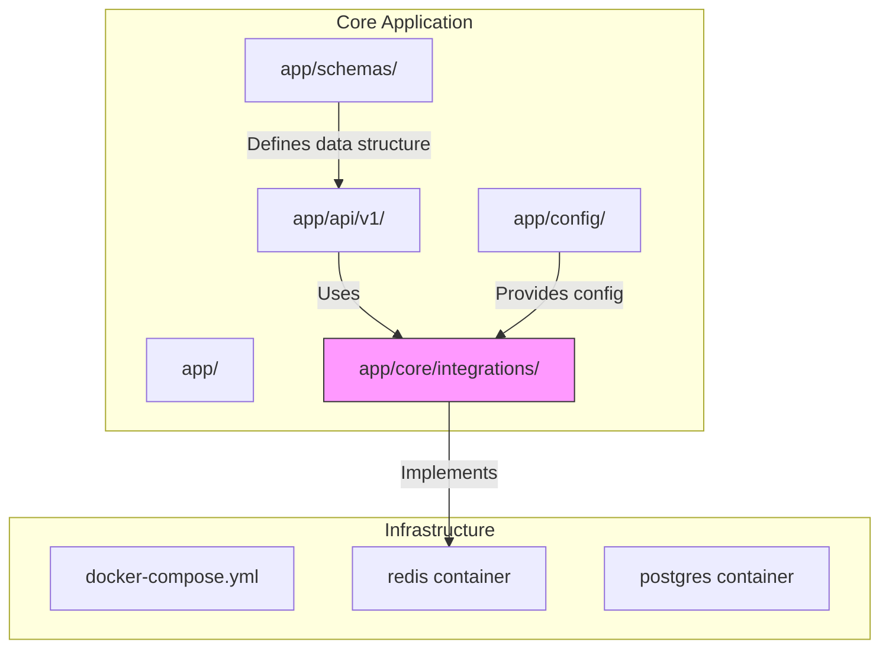
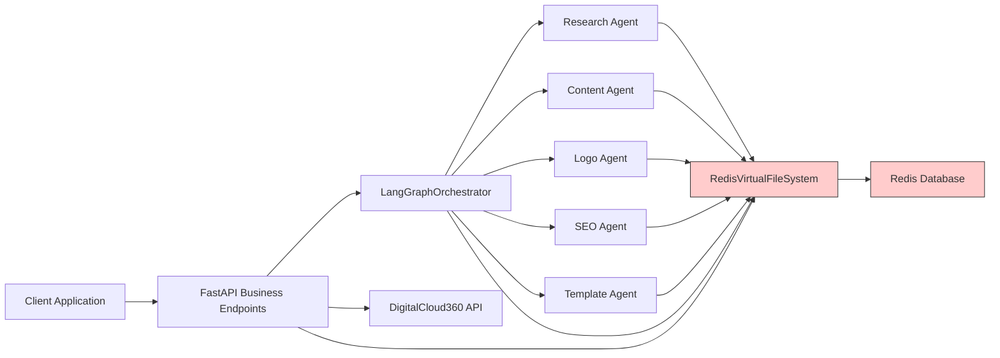
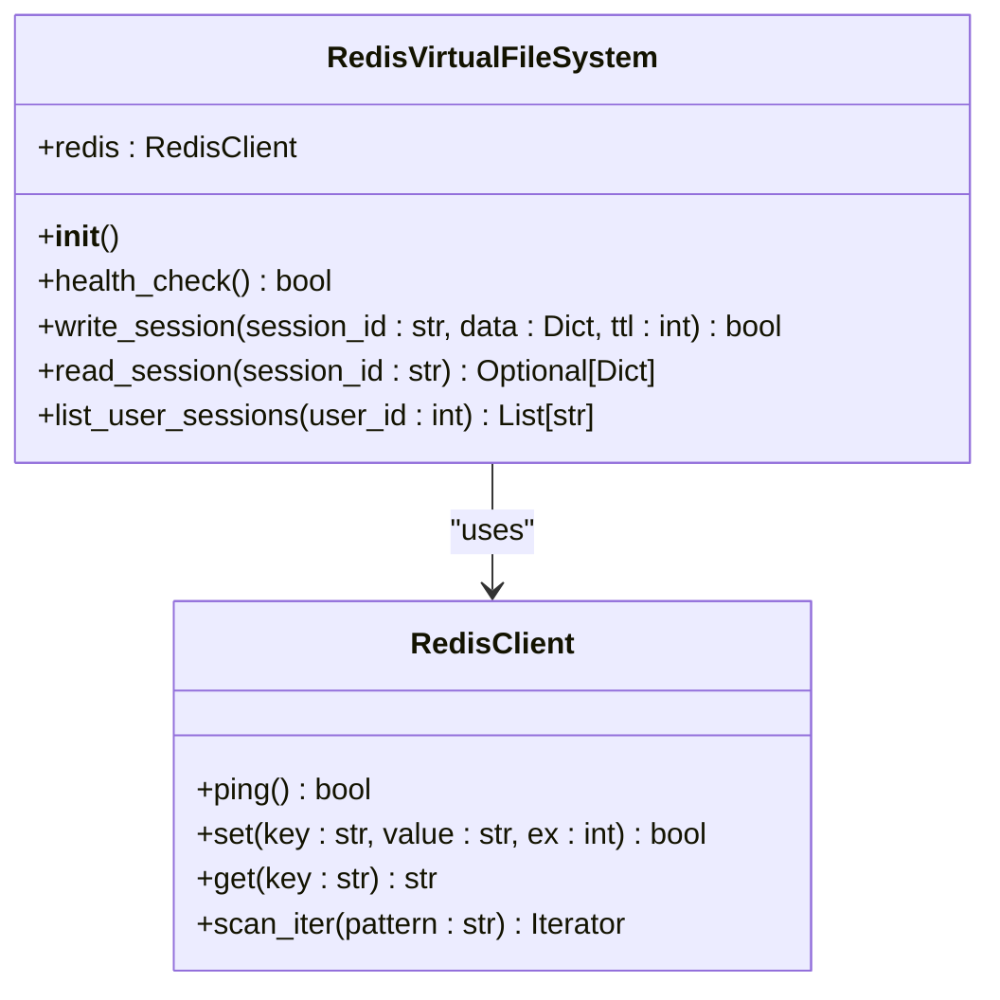
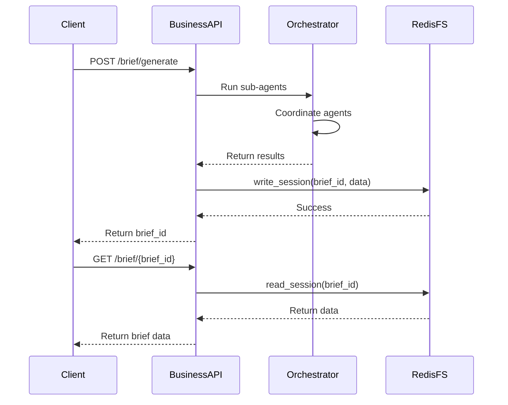
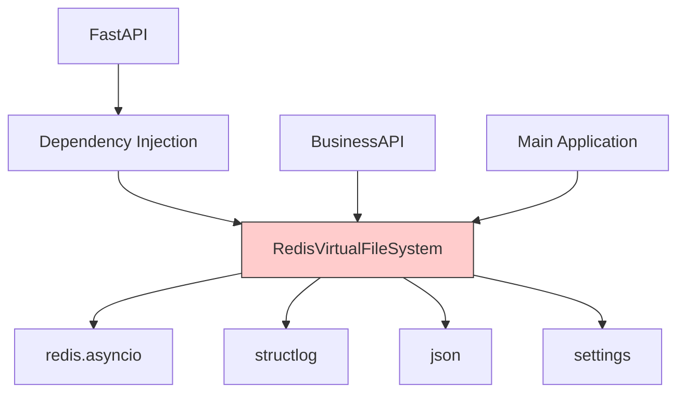

# Redis File Storage Abstraction

<cite>
**Referenced Files in This Document**   
- [redis_fs.py](file://app/core/integrations/redis_fs.py#L1-L60)
- [settings.py](file://app/config/settings.py#L1-L84)
- [business.py](file://app/api/v1/business.py#L1-L258)
- [dependencies.py](file://app/api/v1/dependencies.py#L1-L51)
- [main.py](file://app/main.py#L1-L73)
- [docker-compose.yml](file://docker-compose.yml#L37-L80)
- [business.py](file://app/schemas/business.py#L1-L84)
</cite>

## Table of Contents
1. [Introduction](#introduction)
2. [Project Structure](#project-structure)
3. [Core Components](#core-components)
4. [Architecture Overview](#architecture-overview)
5. [Detailed Component Analysis](#detailed-component-analysis)
6. [Dependency Analysis](#dependency-analysis)
7. [Performance Considerations](#performance-considerations)
8. [Troubleshooting Guide](#troubleshooting-guide)
9. [Conclusion](#conclusion)

## Introduction
This document provides a comprehensive analysis of the Redis-based file storage abstraction layer used in the Genesis AI service. The system implements a virtual file system over Redis to store and manage business briefs, which contain results from various AI sub-agents including logo generation, market research, content creation, SEO optimization, and template selection. The implementation provides TTL-based expiration, health checking, and a simple key-value interface for persistent session data. This document details the implementation, usage patterns, configuration, and limitations of this storage layer.

## Project Structure
The Redis file storage abstraction is implemented as part of a larger AI orchestration system. The core storage functionality resides in the `app/core/integrations/` directory, while the application structure follows a modular pattern with API endpoints, models, schemas, and services separated into distinct directories.



**Diagram sources**
- [redis_fs.py](file://app/core/integrations/redis_fs.py#L1-L60)
- [docker-compose.yml](file://docker-compose.yml#L37-L80)

**Section sources**
- [redis_fs.py](file://app/core/integrations/redis_fs.py#L1-L60)
- [docker-compose.yml](file://docker-compose.yml#L37-L80)

## Core Components
The Redis file storage system consists of the `RedisVirtualFileSystem` class that provides a simple interface for storing and retrieving JSON-serialized data with TTL-based expiration. The system is used to persist business briefs that contain results from multiple AI sub-agents. The implementation is minimal, focusing on write, read, and health check operations, with a simplified method for listing user sessions. The storage layer is integrated with the application through FastAPI dependency injection, allowing controllers to access the storage system without direct instantiation.

**Section sources**
- [redis_fs.py](file://app/core/integrations/redis_fs.py#L1-L60)
- [dependencies.py](file://app/api/v1/dependencies.py#L40-L42)

## Architecture Overview
The Redis file storage abstraction serves as a persistence layer for business briefs generated by AI sub-agents. When a user requests a business brief, the system orchestrates multiple AI agents to generate market research, content, logos, SEO optimization, and template recommendations. The final results are stored in Redis with a unique brief ID. Subsequent operations like brief regeneration, retrieval of sub-agent results, and website creation all interact with this storage layer. The architecture follows a service-oriented pattern where the Redis storage is one of several external integrations alongside database, authentication, and third-party AI services.



**Diagram sources**
- [redis_fs.py](file://app/core/integrations/redis_fs.py#L1-L60)
- [business.py](file://app/api/v1/business.py#L1-L258)
- [docker-compose.yml](file://docker-compose.yml#L37-L80)

## Detailed Component Analysis

### RedisVirtualFileSystem Class Analysis
The `RedisVirtualFileSystem` class provides a minimal but effective abstraction over Redis for storing business briefs. It uses async Redis operations to maintain non-blocking performance in the FastAPI application. The class implements three primary methods: `write_session`, `read_session`, and `list_user_sessions`, along with a `health_check` method for monitoring connectivity.



**Diagram sources**
- [redis_fs.py](file://app/core/integrations/redis_fs.py#L8-L60)

**Section sources**
- [redis_fs.py](file://app/core/integrations/redis_fs.py#L8-L60)

### Business Brief Storage Workflow
The workflow for storing and retrieving business briefs involves several API endpoints that interact with the Redis virtual file system. When a new business brief is generated, the results from multiple AI sub-agents are assembled and stored with a unique ID. Subsequent operations can retrieve, regenerate specific sections, or use the brief for website creation.



**Diagram sources**
- [business.py](file://app/api/v1/business.py#L33-L72)
- [redis_fs.py](file://app/core/integrations/redis_fs.py#L20-L30)

**Section sources**
- [business.py](file://app/api/v1/business.py#L33-L72)
- [redis_fs.py](file://app/core/integrations/redis_fs.py#L20-L30)

### Data Structure and Key Naming Convention
The system uses a simple key naming convention for storing business briefs. All session data is prefixed with "session:" followed by the session identifier. The data structure stored in Redis is a JSON-serialized dictionary containing the brief ID, user ID, session ID, and results from various sub-agents. The results include market research, content generation, logo creation, SEO optimization, and template selection.

```mermaid
flowchart TD
A[Data Structure] --> B[brief_id: string]
A --> C[user_id: int]
A --> D[session_id: string]
A --> E[results: object]
E --> F[market_research: object]
E --> G[content_generation: object]
E --> H[logo_creation: object]
E --> I[seo_optimization: object]
E --> J[template_selection: object]
K[Key Format] --> L["session:{session_id}"]
M[TTL] --> N[7200 seconds (2 hours)]
```

**Diagram sources**
- [business.py](file://app/schemas/business.py#L1-L84)
- [redis_fs.py](file://app/core/integrations/redis_fs.py#L20-L30)

**Section sources**
- [business.py](file://app/schemas/business.py#L1-L84)
- [redis_fs.py](file://app/core/integrations/redis_fs.py#L20-L30)

## Dependency Analysis
The Redis file storage system has dependencies on several core components of the application. It relies on Redis for data persistence, Pydantic for data validation (indirectly through the application's use of schemas), structlog for structured logging, and FastAPI for dependency injection. The system is integrated into the application through the dependency injection system, allowing it to be easily mocked for testing.



**Diagram sources**
- [redis_fs.py](file://app/core/integrations/redis_fs.py#L1-L60)
- [dependencies.py](file://app/api/v1/dependencies.py#L40-L42)
- [main.py](file://app/main.py#L35-L38)

**Section sources**
- [redis_fs.py](file://app/core/integrations/redis_fs.py#L1-L60)
- [dependencies.py](file://app/api/v1/dependencies.py#L40-L42)

## Performance Considerations
The Redis file storage implementation has several performance characteristics and limitations. The system uses Redis as a key-value store with JSON serialization, which is efficient for small to medium-sized documents but may become problematic with very large briefs. The default TTL of 7200 seconds (2 hours) helps manage storage usage but may be too short for some use cases. The `list_user_sessions` method uses `scan_iter` which can be slow on large datasets and is not recommended for production use at scale.

The docker-compose configuration shows Redis is limited to 512MB of memory with an LRU (Least Recently Used) eviction policy, which prevents unbounded growth but may lead to unexpected data loss under heavy load. The append-only file persistence provides some durability, but Redis remains primarily an in-memory store, making it less suitable for critical data that requires high durability.

**Section sources**
- [redis_fs.py](file://app/core/integrations/redis_fs.py#L1-L60)
- [settings.py](file://app/config/settings.py#L1-L84)
- [docker-compose.yml](file://docker-compose.yml#L37-L80)

## Troubleshooting Guide
Common issues with the Redis file storage system include connection failures, data not found, and storage exhaustion. Connection issues can be diagnosed using the `health_check` method, which pings the Redis server. Data not found errors may occur due to expired TTLs or incorrect session IDs. Storage exhaustion can occur if the 512MB memory limit is reached, causing Redis to evict older keys according to the LRU policy.

When troubleshooting, first verify the Redis container is running and accessible. Check application logs for connection error messages. Verify that the REDIS_URL in settings.py matches the Redis container configuration. For data retrieval issues, confirm that the session ID being used is correct and that the data was successfully written. Monitor Redis memory usage through container metrics to anticipate storage issues.

**Section sources**
- [redis_fs.py](file://app/core/integrations/redis_fs.py#L15-L19)
- [settings.py](file://app/config/settings.py#L1-L84)
- [docker-compose.yml](file://docker-compose.yml#L37-L80)
- [main.py](file://app/main.py#L35-L38)

## Conclusion
The Redis file storage abstraction provides a simple and effective solution for storing business briefs in the Genesis AI service. Its implementation as a virtual file system offers a clean interface for storing JSON-serialized data with TTL-based expiration. While the current implementation meets the immediate needs of the application, it has limitations in scalability and durability compared to traditional filesystems or object storage solutions. The system works well for its intended purpose of temporary storage of AI-generated business briefs, but for long-term storage or larger files, a more robust solution would be recommended.