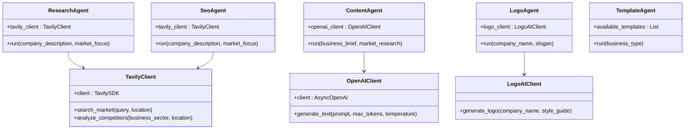

# Orchestration System

<cite>
**Referenced Files in This Document**   
- [langgraph_orchestrator.py](file://app/core/orchestration/langgraph_orchestrator.py#L1-L107)
- [research.py](file://app/core/agents/research.py#L1-L57)
- [content.py](file://app/core/agents/content.py#L1-L83)
- [logo.py](file://app/core/agents/logo.py#L1-L43)
- [seo.py](file://app/core/agents/seo.py#L1-L55)
- [template.py](file://app/core/agents/template.py#L1-L59)
- [tavily.py](file://app/core/integrations/tavily.py#L1-L43)
- [openai.py](file://app/core/integrations/openai.py#L1-L44)
- [logoai.py](file://app/core/integrations/logoai.py#L1-L31)
- [settings.py](file://app/core/config/settings.py#L1-L83)
</cite>

## Table of Contents
1. [Introduction](#introduction)
2. [Project Structure](#project-structure)
3. [Core Components](#core-components)
4. [Architecture Overview](#architecture-overview)
5. [Detailed Component Analysis](#detailed-component-analysis)
6. [State Management and Checkpointing](#state-management-and-checkpointing)
7. [Workflow Graph Structure](#workflow-graph-structure)
8. [Agent Integration and Error Recovery](#agent-integration-and-error-recovery)
9. [User Context and Session Data Preservation](#user-context-and-session-data-preservation)
10. [Scalability, Monitoring, and Debugging](#scalability-monitoring-and-debugging)

## Introduction
The LangGraphOrchestrator is a central component in the Genesis AI platform, responsible for coordinating multiple specialized AI agents to deliver a complete digital presence solution for African startups. It leverages the LangGraph framework to define a stateful, resumable workflow that processes a business brief and orchestrates parallel agent executions for research, content generation, logo creation, SEO optimization, and template selection. This document provides a comprehensive architectural analysis of the system, detailing its design patterns, execution model, and integration points.

## Project Structure
The project follows a modular, feature-based organization with clear separation of concerns. The orchestration logic resides in the `app/core/orchestration` directory, while individual agents are located in `app/core/agents`. Integration clients for external services are encapsulated in `app/core/integrations`. The orchestrator acts as the central coordinator, importing and managing instances of each agent to execute a predefined workflow.

```mermaid
graph TB
subgraph "Core Modules"
Orchestration[orchestration/]
Agents[agents/]
Integrations[integrations/]
end
Orchestration --> Agents : "Uses"
Agents --> Integrations : "Depends on"
Orchestration --> Integrations : "Direct access for logging/config"
style Orchestration fill:#4ECDC4,stroke:#333
style Agents fill:#45B7D1,stroke:#333
style Integrations fill:#96CEB4,stroke:#333
```

**Diagram sources**
- [langgraph_orchestrator.py](file://app/core/orchestration/langgraph_orchestrator.py#L1-L107)
- [research.py](file://app/core/agents/research.py#L1-L57)
- [tavily.py](file://app/core/integrations/tavily.py#L1-L43)

**Section sources**
- [langgraph_orchestrator.py](file://app/core/orchestration/langgraph_orchestrator.py#L1-L107)
- [research.py](file://app/core/agents/research.py#L1-L57)
- [tavily.py](file://app/core/integrations/tavily.py#L1-L43)

## Core Components
The core components of the orchestration system include the `LangGraphOrchestrator` class, the `AgentState` state container, and five specialized agent classes (`ResearchAgent`, `ContentAgent`, `LogoAgent`, `SeoAgent`, `TemplateAgent`). The orchestrator initializes all agents during construction and defines a directed graph of execution using LangGraph. Each agent is responsible for a specific domain task and interacts with external AI services through dedicated integration clients.

**Section sources**
- [langgraph_orchestrator.py](file://app/core/orchestration/langgraph_orchestrator.py#L24-L107)
- [research.py](file://app/core/agents/research.py#L1-L57)
- [content.py](file://app/core/agents/content.py#L1-L83)

## Architecture Overview
The system implements a state machine architecture using LangGraph, where the orchestrator defines nodes as agent execution steps and edges as transitions between them. The workflow begins with a research phase that feeds into four parallel tracks: content generation, logo design, SEO optimization, and template selection. All tracks converge at the end state, producing a comprehensive output. This design enables efficient parallel processing while maintaining a coherent execution context.


**Diagram sources**
- [langgraph_orchestrator.py](file://app/core/orchestration/langgraph_orchestrator.py#L40-L60)

## Detailed Component Analysis

### LangGraphOrchestrator Analysis
The `LangGraphOrchestrator` class serves as the central workflow manager, defining the execution graph and handling error propagation. It uses LangGraph's `StateGraph` to model the workflow as a finite state machine with typed state.


**Diagram sources**
- [langgraph_orchestrator.py](file://app/core/orchestration/langgraph_orchestrator.py#L24-L107)

**Section sources**
- [langgraph_orchestrator.py](file://app/core/orchestration/langgraph_orchestrator.py#L24-L107)

### Agent Execution Flow
The orchestrator's execution flow follows a clear sequence where the research agent runs first, providing market intelligence that informs subsequent parallel tasks. Each agent execution is an asynchronous function that processes the current state and returns updated state data.


**Diagram sources**
- [langgraph_orchestrator.py](file://app/core/orchestration/langgraph_orchestrator.py#L62-L107)

**Section sources**
- [langgraph_orchestrator.py](file://app/core/orchestration/langgraph_orchestrator.py#L62-L107)

## State Management and Checkpointing
The system uses LangGraph's built-in state management through the `AgentState` TypedDict, which defines the complete data schema for the workflow. The state is passed through each node and updated incrementally. While the current implementation does not explicitly show persistent checkpointing, LangGraph supports resumable execution by design, allowing workflows to be paused and resumed from any node. The state includes all intermediate outputs (research_data, content, logo, etc.) and can be serialized for persistence.


**Diagram sources**
- [langgraph_orchestrator.py](file://app/core/orchestration/langgraph_orchestrator.py#L15-L22)

**Section sources**
- [langgraph_orchestrator.py](file://app/core/orchestration/langgraph_orchestrator.py#L15-L22)

## Workflow Graph Structure
The workflow graph is structured as a fan-out pattern from the research node to four parallel processing nodes. This design maximizes efficiency by allowing independent tasks to execute concurrently after the initial research phase. The graph is defined using LangGraph's declarative API, with explicit node definitions and edge transitions.


**Diagram sources**
- [langgraph_orchestrator.py](file://app/core/orchestration/langgraph_orchestrator.py#L40-L60)

**Section sources**
- [langgraph_orchestrator.py](file://app/core/orchestration/langgraph_orchestrator.py#L40-L60)

## Agent Integration and Error Recovery
Each agent integrates with external AI services through dedicated client classes that handle API communication, authentication, and error handling. The orchestrator implements centralized error recovery through try-catch blocks in the `run` method, converting agent-specific exceptions into a unified `OrchestratorException`. This ensures consistent error reporting and prevents partial workflow failures from propagating to the client.



**Diagram sources**
- [research.py](file://app/core/agents/research.py#L1-L57)
- [content.py](file://app/core/agents/content.py#L1-L83)
- [logo.py](file://app/core/agents/logo.py#L1-L43)
- [seo.py](file://app/core/agents/seo.py#L1-L55)
- [template.py](file://app/core/agents/template.py#L1-L59)
- [tavily.py](file://app/core/integrations/tavily.py#L1-L43)
- [openai.py](file://app/core/integrations/openai.py#L1-L44)
- [logoai.py](file://app/core/integrations/logoai.py#L1-L31)

**Section sources**
- [research.py](file://app/core/agents/research.py#L1-L57)
- [content.py](file://app/core/agents/content.py#L1-L83)
- [logo.py](file://app/core/agents/logo.py#L1-L43)
- [seo.py](file://app/core/agents/seo.py#L1-L55)
- [template.py](file://app/core/agents/template.py#L1-L59)

## User Context and Session Data Preservation
User context is preserved throughout the workflow via the `AgentState` object, which carries the original `business_brief` and accumulates results from each agent. The state is passed through every node, ensuring all agents have access to the complete context. The `business_brief` contains key information such as company name, description, market focus, and business type, which are selectively used by different agents according to their specific needs.

**Section sources**
- [langgraph_orchestrator.py](file://app/core/orchestration/langgraph_orchestrator.py#L15-L22)
- [research.py](file://app/core/agents/research.py#L25-L30)
- [content.py](file://app/core/agents/content.py#L25-L30)

## Scalability, Monitoring, and Debugging
The system is designed for scalability through its asynchronous architecture and parallel execution model. Each agent runs independently after the initial research phase, allowing for horizontal scaling of agent processing. The system includes comprehensive logging using structlog, with structured log entries that capture execution context and performance metrics. Error handling is centralized in the orchestrator, providing a single point for monitoring and debugging workflow failures. The use of LangGraph enables built-in support for execution monitoring, with potential for integration with observability tools through its event system.

**Section sources**
- [langgraph_orchestrator.py](file://app/core/orchestration/langgraph_orchestrator.py#L1-L107)
- [settings.py](file://app/core/config/settings.py#L1-L83)
- [utils/logger.py](file://app/core/utils/logger.py#L1-L10)