# Project Overview

<cite>
**Referenced Files in This Document**   
- [main.py](file://app/main.py)
- [settings.py](file://app/config/settings.py)
- [langgraph_orchestrator.py](file://app/core/orchestration/langgraph_orchestrator.py)
- [research.py](file://app/core/agents/research.py)
- [content.py](file://app/core/agents/content.py)
- [logo.py](file://app/core/agents/logo.py)
- [seo.py](file://app/core/agents/seo.py)
- [template.py](file://app/core/agents/template.py)
- [tavily.py](file://app/core/integrations/tavily.py)
- [logoai.py](file://app/core/integrations/logoai.py)
- [digitalcloud360.py](file://app/core/integrations/digitalcloud360.py)
</cite>

## Table of Contents
1. [Project Overview](#project-overview)
2. [System Purpose and User Journey](#system-purpose-and-user-journey)
3. [High-Level Architecture](#high-level-architecture)
4. [Core Components](#core-components)
5. [Agent-Based Workflow and Orchestration](#agent-based-workflow-and-orchestration)
6. [External Integrations](#external-integrations)
7. [System Context Diagram](#system-context-diagram)
8. [Design Principles](#design-principles)

## System Purpose and User Journey

The Genesis platform is an AI-powered coaching service designed specifically for African entrepreneurs. It provides end-to-end support in launching and scaling digital businesses by combining business coaching, market research, content creation, branding, SEO optimization, and website publishing into a seamless workflow.

The user journey begins with registration and submission of a business brief, including company name, description, market focus, and business type. The system then activates a multi-agent AI workflow that processes this information in parallel to generate comprehensive outputs. After receiving AI-generated insights and assets, users can publish their fully functional website directly to DigitalCloud360 hosting with one click.

Key capabilities include:
- **Business Coaching**: Guided onboarding and strategic recommendations
- **Market Research**: Analysis of target markets and competitor landscapes
- **Content Generation**: AI-written website copy tailored to African markets
- **Logo Creation**: Automated brand identity generation
- **SEO Optimization**: Keyword research and metadata generation
- **Website Publishing**: One-click deployment to cloud hosting

This integrated approach lowers barriers to entry for entrepreneurs who may lack technical skills or resources, enabling them to establish a professional online presence quickly and affordably.

## High-Level Architecture

The Genesis platform follows a modular, service-oriented architecture built on Python with FastAPI as the web framework. The system is structured into distinct layers that separate concerns and enable independent development and scaling.


**Diagram sources**
- [main.py](file://app/main.py#L1-L184)
- [settings.py](file://app/config/settings.py#L1-L84)

**Section sources**
- [main.py](file://app/main.py#L1-L184)
- [settings.py](file://app/config/settings.py#L1-L84)

## Core Components

The application is organized into a clean directory structure that separates concerns and promotes maintainability:

- **app/api/v1**: REST API endpoints for authentication, coaching, and business operations
- **app/config**: Configuration management and environment variable handling
- **app/core**: Core business logic including agents and integrations
- **app/models**: SQLAlchemy ORM models for data persistence
- **app/schemas**: Pydantic models for request/response validation
- **app/services**: Business service implementations
- **app/utils**: Shared utilities and exception handling

The entry point `app/main.py` initializes the FastAPI application, configures middleware (including CORS, logging, and Prometheus monitoring), sets up database connections, and registers API routers. It also implements a lifespan handler that performs health checks on startup and graceful shutdown procedures.

Key architectural decisions include:
- Use of asynchronous programming throughout for improved I/O performance
- Structured logging with structlog for consistent log formatting
- Environment-aware configuration via Pydantic settings
- Comprehensive error handling with custom exception types

**Section sources**
- [main.py](file://app/main.py#L1-L184)
- [settings.py](file://app/config/settings.py#L1-L84)

## Agent-Based Workflow and Orchestration

The heart of the Genesis platform is its agent-based architecture, orchestrated by LangGraph. This design enables complex, stateful workflows where multiple AI agents work in parallel to generate different components of a business website.

```mermaid
graph TD
Start([Business Brief Submitted]) --> Orchestrator[LangGraphOrchestrator]
Orchestrator --> Research[Research Agent]
Orchestrator --> Content[Content Agent]
Orchestrator --> Logo[Logo Agent]
Orchestrator --> SEO[SEO Agent]
Orchestrator --> Template[Template Agent]
Research --> |Market Research Data| Content
Research --> |Competitor Analysis| SEO
Content --> |Website Copy| FinalState[Final State]
Logo --> |Logo URL| FinalState
SEO --> |Keywords & Meta| FinalState
Template --> |Template ID| FinalState
FinalState --> |Complete Website Data| Publish[Publish to Hosting]
style Orchestrator fill:#4B9CD3,stroke:#333
style Research fill:#F9F,stroke:#333
style Content fill:#F9F,stroke:#333
style Logo fill:#F9F,stroke:#333
style SEO fill:#F9F,stroke:#333
style Template fill:#F9F,stroke:#333
```



**Diagram sources**
- [langgraph_orchestrator.py](file://app/core/orchestration/langgraph_orchestrator.py#L1-L108)
- [research.py](file://app/core/agents/research.py#L1-L58)
- [content.py](file://app/core/agents/content.py#L1-L84)

**Section sources**
- [langgraph_orchestrator.py](file://app/core/orchestration/langgraph_orchestrator.py#L1-L108)

### Research Agent

The Research Agent conducts market analysis and competitor research using the Tavily API. It takes a company description and market focus as input and returns comprehensive research data.

```python
async def run(self, company_description: str, market_focus: str) -> dict:
    market_research = await self.tavily_client.search_market(
        query=f"Analyse du marché pour {market_focus} en Afrique"
    )
    competitor_analysis = await self.tavily_client.analyze_competitors(
        query=f"Concurrents principaux pour {market_focus}",
        company_description=company_description
    )
    return {"market_research": market_research, "competitor_analysis": competitor_analysis}
```

**Section sources**
- [research.py](file://app/core/agents/research.py#L1-L58)

### Content Agent

The Content Agent generates website copy using OpenAI's language models. It creates structured content for home, services, and contact pages based on the business brief and market research.

```python
async def run(self, business_brief: dict, market_research: dict) -> dict:
    prompt = self._build_prompt(business_brief, market_research)
    generated_text = await self.openai_client.generate_text(prompt=prompt)
    return self._format_output(generated_text)
```

**Section sources**
- [content.py](file://app/core/agents/content.py#L1-L84)

### Logo Agent

The Logo Agent interfaces with LogoAI to generate brand logos. It takes a company name and optional slogan as input and returns a logo URL.

```python
async def run(self, company_name: str, company_slogan: str = None) -> dict:
    logo_result = await self.logo_client.generate_logo(
        company_name=company_name,
        slogan=company_slogan
    )
    return logo_result
```

**Section sources**
- [logo.py](file://app/core/agents/logo.py#L1-L44)

### SEO Agent

The SEO Agent generates keywords and meta descriptions for search engine optimization using Tavily for keyword research.

```python
async def run(self, company_description: str, market_focus: str) -> dict:
    keywords_research = await self.tavily_client.search_market(
        query=f"SEO keywords for {market_focus}"
    )
    meta_description = self._generate_meta_description(company_description, keywords_research)
    return {"keywords": keywords_research.get("keywords", []), "meta_description": meta_description}
```

**Section sources**
- [seo.py](file://app/core/agents/seo.py#L1-L56)

### Template Agent

The Template Agent selects an appropriate website template based on business type, enabling tailored designs for different business models.

```python
async def run(self, business_type: str) -> dict:
    selected_template = self._select_template(business_type)
    return selected_template
```

**Section sources**
- [template.py](file://app/core/agents/template.py#L1-L60)

## External Integrations

The platform integrates with several external services to deliver its AI-powered capabilities:


**Diagram sources**
- [tavily.py](file://app/core/integrations/tavily.py#L1-L44)
- [logoai.py](file://app/core/integrations/logoai.py#L1-L32)
- [digitalcloud360.py](file://app/core/integrations/digitalcloud360.py#L1-L40)

### Tavily Integration

The TavilyClient provides market research and competitor analysis capabilities with a focus on African markets.

```python
class TavilyClient:
    async def search_market(self, query: str, location: str = "Africa") -> List[Dict[str, Any]]:
        search_query = f"{query} in {location}"
        response = await self.client.search(query=search_query, search_depth="advanced")
        return response['results']
```

**Section sources**
- [tavily.py](file://app/core/integrations/tavily.py#L1-L44)

### LogoAI Integration

The LogoAIClient provides logo generation capabilities, returning URLs to generated logo images.

```python
class LogoAIClient:
    async def generate_logo(self, company_name: str, style_guide: dict) -> str:
        logo_url = f"https://cdn.example.com/logos/{company_name.lower().replace(' ', '-')}.png"
        return logo_url
```

**Section sources**
- [logoai.py](file://app/core/integrations/logoai.py#L1-L32)

## System Context Diagram


**Diagram sources**
- [main.py](file://app/main.py#L1-L184)
- [langgraph_orchestrator.py](file://app/core/orchestration/langgraph_orchestrator.py#L1-L108)
- [tavily.py](file://app/core/integrations/tavily.py#L1-L44)
- [digitalcloud360.py](file://app/core/integrations/digitalcloud360.py#L1-L40)

## Design Principles

The Genesis platform adheres to several key software engineering principles:

### Separation of Concerns
The application is cleanly divided into layers:
- **API Layer**: Handles HTTP requests and responses
- **Service Layer**: Contains business logic
- **Integration Layer**: Manages external service connections
- **Data Layer**: Handles persistence and state management

### Dependency Injection
Components are loosely coupled through dependency injection. For example, agents receive their integration clients through initialization rather than creating them internally, making testing and replacement easier.

### Stateful AI Workflows
The LangGraph-based orchestration enables complex, stateful workflows where agents can access and modify shared state, allowing for coordinated multi-step processes.

### Resilience and Error Handling
Comprehensive error handling is implemented at multiple levels:
- Global exception handlers in FastAPI
- Agent-specific error handling with retry logic
- Fallback mechanisms for external API failures
- Structured logging for debugging and monitoring

### Configuration Management
Environment-specific configuration is managed through Pydantic settings with support for environment variables, enabling smooth transitions between development, testing, and production environments.

**Section sources**
- [main.py](file://app/main.py#L1-L184)
- [settings.py](file://app/config/settings.py#L1-L84)
- [langgraph_orchestrator.py](file://app/core/orchestration/langgraph_orchestrator.py#L1-L108)