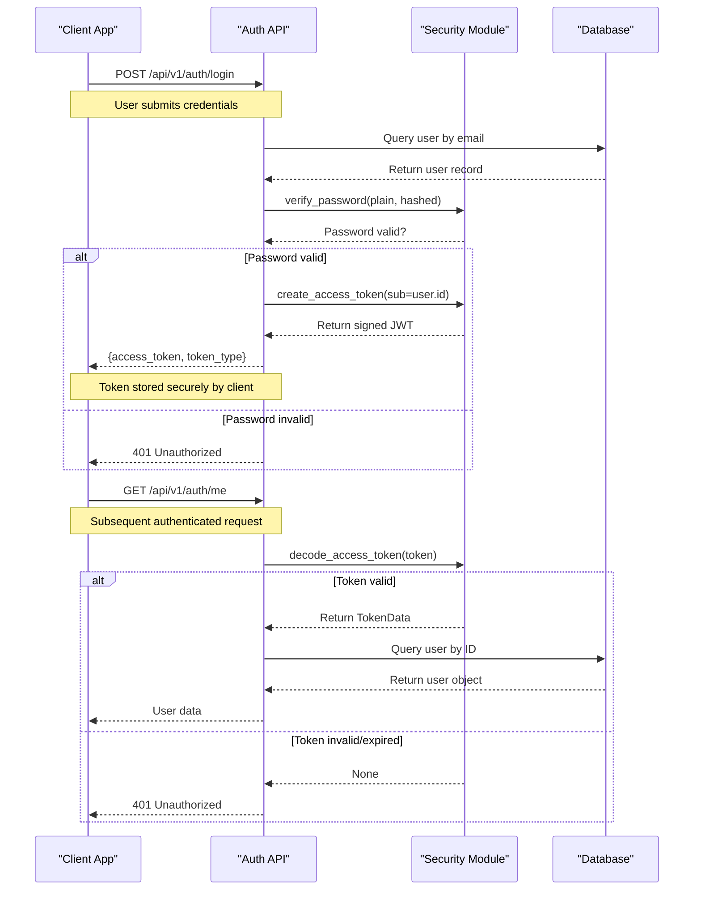
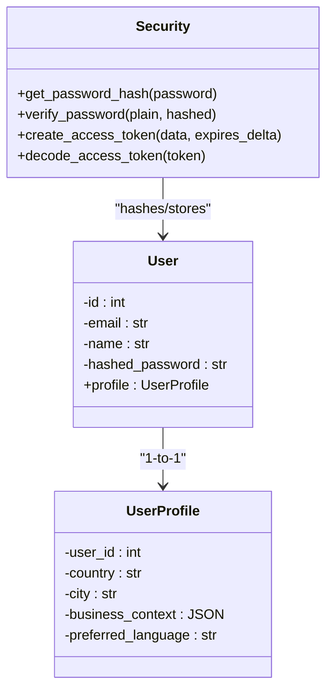
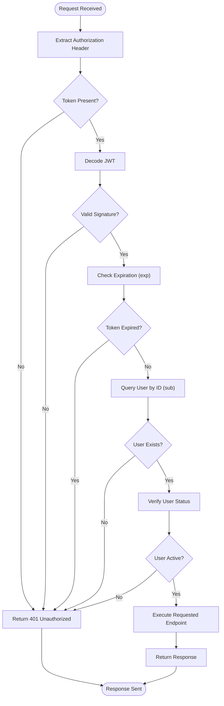

# Security Considerations

<cite>
**Referenced Files in This Document**   
- [app/core/security.py](file://app/core/security.py#L1-L46)
- [app/config/settings.py](file://app/config/settings.py#L1-L83)
- [app/api/v1/auth.py](file://app/api/v1/auth.py#L1-L62)
- [app/models/user.py](file://app/models/user.py#L1-L42)
- [app/schemas/user.py](file://app/schemas/user.py#L1-L55)
- [app/services/user_service.py](file://app/services/user_service.py#L1-L31)
- [app/api/v1/dependencies.py](file://app/api/v1/dependencies.py#L1-L50)
- [app/main.py](file://app/main.py#L1-L184)
</cite>

## Table of Contents
1. [Security Considerations](#security-considerations)
2. [JWT-Based Authentication Flow](#jwt-based-authentication-flow)
3. [Password Hashing and Secure Storage](#password-hashing-and-secure-storage)
4. [Role-Based Access Control and Endpoint Protection](#role-based-access-control-and-endpoint-protection)
5. [Common Vulnerabilities and Mitigation Strategies](#common-vulnerabilities-and-mitigation-strategies)
6. [Secure Configuration of External Service Credentials](#secure-configuration-of-external-service-credentials)
7. [Secure Deployment Practices](#secure-deployment-practices)
8. [Audit Logging and Session Management](#audit-logging-and-session-management)

## JWT-Based Authentication Flow

The application implements a secure JWT-based authentication system using the `jose` and `passlib` libraries. The authentication flow begins with user registration via the `/api/v1/auth/register` endpoint, where passwords are immediately hashed before storage. Upon successful login to `/api/v1/auth/token`, the system verifies credentials and generates a signed JWT token containing the user ID as the subject claim.

The token generation process uses the HS256 algorithm with a secret key configured in the application settings. Access tokens have a long expiration period of 30 days (43,200 minutes), which is suitable for a personal AI coaching service but should be reconsidered in high-security environments. The token payload includes an expiration timestamp (`exp`) claim to enforce time-limited validity.

For protected endpoints, the application uses FastAPI's `OAuth2PasswordBearer` dependency to extract and validate the JWT token from the `Authorization: Bearer <token>` header. The `get_current_user` dependency function decodes the token, validates its signature using the application's secret key, and retrieves the corresponding user from the database to ensure the user still exists and is active.

**Diagram sources**
- [app/core/security.py](file://app/core/security.py#L1-L46)
- [app/api/v1/auth.py](file://app/api/v1/auth.py#L1-L62)
- [app/services/user_service.py](file://app/services/user_service.py#L1-L31)

**Section sources**
- [app/core/security.py](file://app/core/security.py#L1-L46)
- [app/api/v1/auth.py](file://app/api/v1/auth.py#L1-L62)

## Password Hashing and Secure Storage

The application implements robust password hashing using the `passlib` library with the bcrypt algorithm, which is currently considered a secure choice for password storage. The hashing configuration is centralized in the `security.py` module with a `CryptContext` instance that specifies bcrypt as the preferred scheme.

When a user registers or changes their password, the `get_password_hash()` function is called to convert the plaintext password into a one-way hash. This function uses bcrypt with adaptive hashing that automatically handles salt generation and iteration count management. The resulting hash is stored in the database in the `hashed_password` field of the `User` model, while the original plaintext password is immediately discarded.

Password verification is performed using the `verify_password()` function, which takes the submitted plaintext password and the stored hash, then uses bcrypt's built-in comparison mechanism to check if they match. This approach protects against timing attacks and ensures that passwords are never stored or compared in plaintext.

The user data model is designed with security in mind, storing only essential information and avoiding sensitive data like password hints or security questions. The `User` model includes proper indexing on the email field for performance while maintaining uniqueness constraints to prevent duplicate accounts.

**Diagram sources**
- [app/core/security.py](file://app/core/security.py#L1-L46)
- [app/models/user.py](file://app/models/user.py#L1-L42)

**Section sources**
- [app/core/security.py](file://app/core/security.py#L1-L46)
- [app/models/user.py](file://app/models/user.py#L1-L42)
- [app/schemas/user.py](file://app/schemas/user.py#L1-L55)

## Role-Based Access Control and Endpoint Protection

The application implements a token-based access control system that protects all sensitive endpoints. While the current implementation does not include explicit role-based permissions, it establishes a solid foundation for authentication and user context management that can be extended to support roles in the future.

The core of the access control system is the `get_current_user` dependency, which is used across multiple endpoints to enforce authentication. This dependency function handles the complete JWT validation process, including token decoding, signature verification, expiration checking, and user lookup in the database. By using FastAPI's dependency injection system, the application ensures that authentication logic is centralized and consistently applied.

Protected endpoints such as `/api/v1/auth/me` require a valid access token and automatically retrieve the authenticated user's information. The dependency system ensures that any endpoint requiring user authentication will fail with a 401 Unauthorized response if the token is missing, malformed, expired, or invalid.

The application structure supports future extension to role-based access control by allowing the addition of role information to the JWT payload or user model. Additional dependency functions could be created to check specific permissions or roles before granting access to sensitive operations.

**Diagram sources**
- [app/services/user_service.py](file://app/services/user_service.py#L1-L31)
- [app/api/v1/dependencies.py](file://app/api/v1/dependencies.py#L1-L50)

**Section sources**
- [app/services/user_service.py](file://app/services/user_service.py#L1-L31)
- [app/api/v1/dependencies.py](file://app/api/v1/dependencies.py#L1-L50)
- [app/api/v1/auth.py](file://app/api/v1/auth.py#L1-L62)

## Common Vulnerabilities and Mitigation Strategies

The application addresses several common security vulnerabilities through various mitigation strategies. For input validation, the application uses Pydantic models that automatically validate and sanitize input data. The `UserCreate` schema enforces a minimum password length of 8 characters, helping to prevent weak passwords, while the `EmailStr` type ensures proper email format validation.

Cross-Origin Resource Sharing (CORS) is properly configured to restrict which domains can access the API. The application reads allowed origins from the settings configuration, currently permitting only localhost development environments. The CORS middleware is configured to allow credentials, which is necessary for authentication, while restricting allowed methods to standard HTTP operations and allowing all headers.

The application implements proper error handling that avoids information leakage. Authentication failures return generic "Incorrect email or password" messages rather than revealing whether a username exists, preventing user enumeration attacks. The global exception handler catches unanticipated errors and returns a generic error message in French ("Une erreur inattendue s'est produite") to avoid exposing stack traces or system details.

However, the codebase lacks explicit rate limiting mechanisms to protect against brute force attacks on authentication endpoints. This represents a significant security gap, as attackers could potentially attempt unlimited login attempts to guess user credentials. Implementing rate limiting on the `/api/v1/auth/token` endpoint would be a critical security enhancement.

The application also lacks security headers such as Content Security Policy (CSP), X-Content-Type-Options, or X-Frame-Options, which would help protect against XSS and other client-side attacks. While these are less critical for a JSON API, they would still provide additional defense-in-depth.

## Secure Configuration of External Service Credentials

The application manages external service credentials through environment-based configuration, with API keys for various services defined in the settings module. The configuration includes placeholders for DigitalCloud360, OpenAI, Anthropic, Tavily, and LogoAI services, with default values that must be replaced in production.

The settings are managed using Pydantic's `BaseSettings` class, which automatically loads values from environment variables, providing a secure way to manage secrets without hardcoding them in the source code. The `SECRET_KEY` for JWT signing is generated using `secrets.token_urlsafe(32)` when not provided, ensuring a cryptographically secure random value.

However, the current configuration has several security concerns. Default API keys are present in the codebase (e.g., "your-openai-key"), which could lead to accidental exposure if deployed without proper configuration. The DigitalCloud360 service secret has a default value of "change-me-in-production", which is a security anti-pattern as it may be overlooked in production deployments.

The application does validate external API connections during startup through the `validate_external_apis()` function, which helps ensure that required services are available and properly configured. This proactive validation prevents the application from starting with invalid or missing credentials, reducing the risk of runtime failures that could expose configuration issues.

## Secure Deployment Practices

The application supports secure deployment practices through configurable settings that differentiate between development and production environments. The `ENVIRONMENT` setting allows for environment-specific configurations, while the `DEBUG` flag controls the availability of documentation endpoints (`/docs` and `/redoc`), which are disabled in production to reduce the attack surface.

HTTPS enforcement is not explicitly configured in the current codebase, which means the application would serve content over HTTP by default. In production, this should be addressed by deploying the application behind a reverse proxy or load balancer that terminates SSL/TLS connections, or by configuring the Uvicorn server to use HTTPS directly.

Data encryption at rest is dependent on the underlying database and Redis configurations. The application does not implement additional encryption for stored data, relying instead on infrastructure-level security. For enhanced security, sensitive fields in the database could be encrypted at the application level before storage.

The application uses PostgreSQL for persistent storage and Redis for session management and caching. Both services should be configured with encryption for data in transit (using SSL/TLS) and at rest. The Redis connection uses a URL-based configuration that could include authentication credentials, though the current settings do not specify a password.

The Docker and Docker Compose configurations (not analyzed in detail) likely provide containerization for consistent deployment across environments. Proper container security practices should be followed, including using minimal base images, running containers as non-root users, and limiting container privileges.

## Audit Logging and Session Management

The application implements comprehensive audit logging through structured logging with the `structlog` library. A custom `LoggingMiddleware` captures detailed information about each request, including the HTTP method, URL, client IP address, response status code, and request duration. This provides a complete audit trail of API usage that can be used for security monitoring, troubleshooting, and compliance purposes.

The logging system is designed to be production-ready, with structured JSON output that can be easily ingested by log management systems. Each log entry includes contextual information that helps trace user activity and identify potential security incidents. The logs capture both the start and completion of each request, enabling analysis of request processing times and potential denial-of-service attacks.

For session management, the application relies on stateless JWT tokens rather than server-side sessions. This approach has several security implications: it eliminates server-side session storage vulnerabilities but requires careful management of token expiration and revocation. The current implementation does not include a token revocation mechanism, meaning that once a token is issued, it remains valid until expiration, even if the user changes their password or is deactivated.

The application uses Redis for other purposes (via `RedisVirtualFileSystem`), suggesting that Redis could be leveraged for implementing a token blacklist or session revocation system in the future. This would allow for immediate invalidation of tokens when necessary, enhancing security at the cost of some statelessness.

Prometheus metrics are collected through middleware, tracking request counts and durations by method, endpoint, and status code. These metrics can help identify unusual patterns of activity that might indicate security incidents, such as a sudden increase in 401 responses that could signal a brute force attack.

**Section sources**
- [app/main.py](file://app/main.py#L1-L184)
- [app/api/middleware.py](file://app/api/middleware.py#L1-L72)
- [app/core/integrations/redis_fs.py](file://app/core/integrations/redis_fs.py#L1-L15)