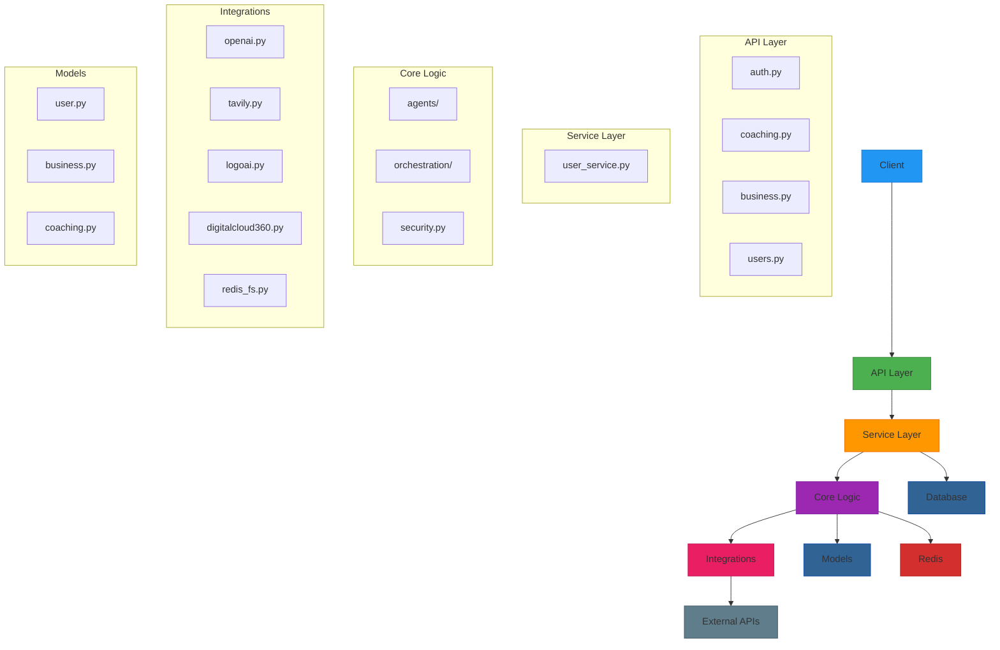
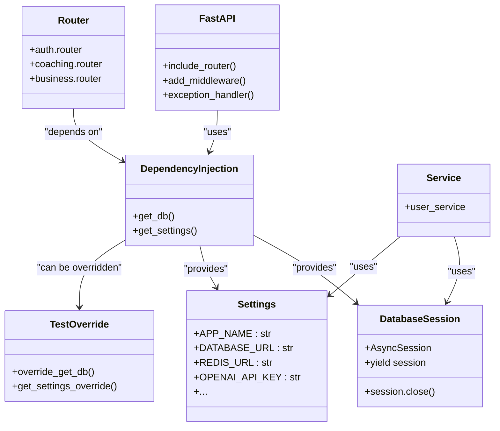
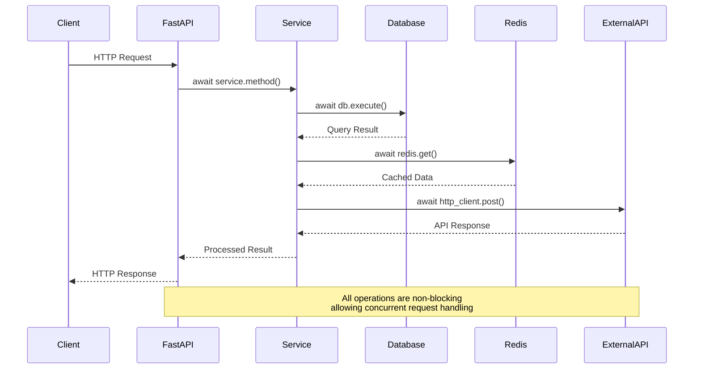
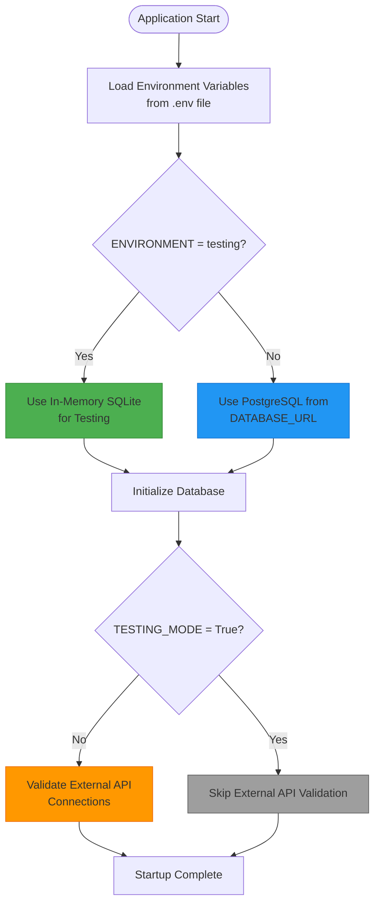
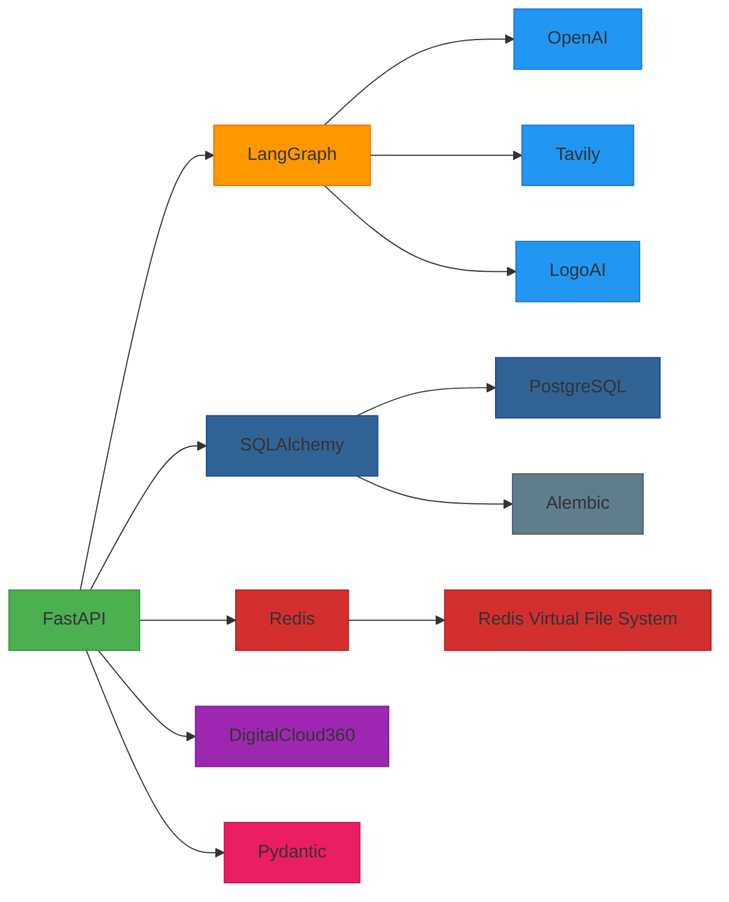

# Technology Stack & Dependencies

<cite>
**Referenced Files in This Document**   
- [requirements.txt](file://requirements.txt)
- [docker-compose.yml](file://docker-compose.yml)
- [Dockerfile](file://Dockerfile)
- [app/main.py](file://app/main.py)
- [app/config/settings.py](file://app/config/settings.py)
- [app/config/database.py](file://app/config/database.py)
- [app/config/redis.py](file://app/config/redis.py)
- [app/core/orchestration/langgraph_orchestrator.py](file://app/core/orchestration/langgraph_orchestrator.py)
</cite>

## Table of Contents
1. [Introduction](#introduction)
2. [Core Dependencies](#core-dependencies)
3. [Containerization Strategy](#containerization-strategy)
4. [Application Architecture](#application-architecture)
5. [Dependency Injection Patterns](#dependency-injection-patterns)
6. [Async I/O Implementation](#async-io-implementation)
7. [Environment Isolation](#environment-isolation)
8. [Component Integration](#component-integration)
9. [Infrastructure Requirements](#infrastructure-requirements)
10. [Conclusion](#conclusion)

## Introduction
The Genesis AI Deep Agents Service is a sophisticated application designed to provide personalized AI coaching for African entrepreneurs. This document details the technology stack, architectural decisions, and integration patterns that enable the system's scalability, maintainability, and developer experience. The application leverages modern Python frameworks and tools to create a robust, asynchronous, and containerized service capable of orchestrating multiple AI agents through complex business workflows.

## Core Dependencies

The application relies on a carefully selected set of dependencies that work together to provide a comprehensive technology stack. The following table outlines the core dependencies, their versions, and purposes:

| **Component** | **Dependency** | **Version** | **Purpose** |
|---------------|----------------|-----------|-----------|
| Web Framework | fastapi | latest | Modern, fast (high-performance) web framework for building APIs with Python 3.7+ based on standard Python type hints |
| ASGI Server | uvicorn[standard] | latest | Lightning-fast ASGI server implementation using uvloop and httptools |
| Agent Orchestration | langgraph | latest | Framework for building stateful, multi-agent applications with LangChain |
| ORM | sqlalchemy | latest | SQL toolkit and Object-Relational Mapping (ORM) system for Python |
| Database Migrations | alembic | latest | Lightweight database migration tool for usage with SQLAlchemy |
| Session/Cache | redis[hiredis] | latest | In-memory data structure store used as a distributed, in-memory key–value database, cache, and message broker |
| Data Validation | pydantic[email] | latest | Data validation and settings management using Python type annotations |
| External APIs | openai | latest | Official Python client for OpenAI's API to access language models |
| External APIs | tavily-python | latest | Python client for Tavily's research API for real-time information retrieval |
| External APIs | logoai | latest | Integration with LogoAI service for automated logo generation |
| External APIs | digitalcloud360 | latest | Integration with DigitalCloud360 platform for website creation and deployment |

**Section sources**
- [requirements.txt](file://requirements.txt)

## Containerization Strategy

The application employs Docker for containerization and docker-compose for multi-container orchestration, enabling consistent deployment across different environments. The containerization strategy isolates services and their dependencies while facilitating easy scaling and maintenance.

```mermaid
graph TB
subgraph "Genesis AI System"
API[genesis-api<br>FastAPI Application]
Postgres[postgres<br>PostgreSQL Database]
Redis[redis<br>Redis Cache]
TestDB[test-db<br>Test Database]
Prometheus[prometheus<br>Monitoring]
Grafana[grafana<br>Dashboards]
end
API --> Postgres
API --> Redis
API --> TestDB
API --> Prometheus
Prometheus --> Grafana
API -.-> "External APIs"
"External APIs" --> "OpenAI"
"External APIs" --> "Tavily"
"External APIs" --> "LogoAI"
"External APIs" --> "DigitalCloud360"
style API fill:#4CAF50,stroke:#388E3C
style Postgres fill:#316395,stroke:#0D47A1
style Redis fill:#D32F2F,stroke:#B71C1C
style TestDB fill:#FF9800,stroke:#EF6C00
style Prometheus fill:#E91E63,stroke:#C2185B
style Grafana fill:#9C27B0,stroke:#7B1FA2
```

**Diagram sources**
- [docker-compose.yml](file://docker-compose.yml)
- [Dockerfile](file://Dockerfile)

The Dockerfile defines a minimal Python 3.11-slim base image, installs system dependencies for database connectivity, and sets up a non-root user for security. The application is built with a multi-stage approach that optimizes image size and security.

The docker-compose.yml file orchestrates multiple services:
- **genesis-api**: The main FastAPI application exposed on port 8002
- **postgres**: PostgreSQL 15 database with persistent volume storage
- **redis**: Redis 7 instance configured with append-only persistence and LRU eviction policy
- **test-db**: Dedicated PostgreSQL instance for testing environments
- **prometheus** and **grafana**: Optional monitoring stack for performance metrics and visualization

Each service is connected through a dedicated Docker network (genesis-ai-network) with a predefined subnet (172.20.0.0/16), ensuring isolated communication between components.

**Section sources**
- [docker-compose.yml](file://docker-compose.yml)
- [Dockerfile](file://Dockerfile)

## Application Architecture

The application follows a layered architecture with clear separation of concerns, organized into distinct modules that handle specific responsibilities.



**Diagram sources**
- [app/main.py](file://app/main.py)
- [app/api/v1/](file://app/api/v1/)
- [app/services/](file://app/services/)
- [app/core/](file://app/core/)
- [app/models/](file://app/models/)

The entry point of the application is `app/main.py`, which initializes the FastAPI application with a lifespan context manager that handles startup and shutdown events. During startup, the application:
1. Creates database tables if they don't exist
2. Initializes the Redis Virtual File System connection
3. Validates connections to external APIs (DigitalCloud360 and Tavily)

The architecture implements several key patterns:
- **Lifespan Management**: Using FastAPI's lifespan context manager for proper resource initialization and cleanup
- **Middleware Pipeline**: Incorporating CORS, Prometheus monitoring, and structured logging middleware
- **Global Exception Handling**: Custom exception handlers for both application-specific and general exceptions
- **Health Checking**: A dedicated `/health` endpoint that returns service status and metadata

**Section sources**
- [app/main.py](file://app/main.py)

## Dependency Injection Patterns

The application implements dependency injection primarily through FastAPI's built-in dependency system, allowing for clean separation of concerns and improved testability. The pattern is used extensively for database session management and configuration access.



**Diagram sources**
- [app/main.py](file://app/main.py)
- [app/config/database.py](file://app/config/database.py)
- [app/config/settings.py](file://app/config/settings.py)
- [tests/conftest.py](file://tests/conftest.py)

The primary dependency injection patterns include:

**Database Session Injection**: The `get_db()` function in `app/config/database.py` provides a database session to route handlers. This async generator function creates a new session for each request and ensures proper cleanup.

```python
async def get_db():
    async with AsyncSessionLocal() as session:
        try:
            yield session
        finally:
            await session.close()
```

**Settings Injection**: The application uses Pydantic Settings to manage configuration, loading values from environment variables and .env files. The global `settings` instance is available throughout the application.

**Test Overrides**: During testing, the application uses FastAPI's `dependency_overrides` mechanism to replace real dependencies with test doubles, allowing for isolated unit testing without external dependencies.

```python
app.dependency_overrides[get_db] = override_get_db
app.dependency_overrides[Settings] = get_settings_override
```

This pattern enables complete isolation of tests from the database and external services, significantly improving test speed and reliability.

**Section sources**
- [app/config/database.py](file://app/config/database.py)
- [app/config/settings.py](file://app/config/settings.py)
- [tests/conftest.py](file://tests/conftest.py)

## Async I/O Implementation

The application is built on an asynchronous architecture using Python's asyncio framework, enabling high concurrency and efficient resource utilization. The async I/O implementation spans multiple layers of the application stack.



**Diagram sources**
- [app/main.py](file://app/main.py)
- [app/config/database.py](file://app/config/database.py)
- [app/config/redis.py](file://app/config/redis.py)
- [tests/test_api/test_coaching.py](file://tests/test_api/test_coaching.py)

Key aspects of the async I/O implementation:

**Database Operations**: The application uses SQLAlchemy's async extension with asyncpg as the PostgreSQL driver, enabling non-blocking database operations. The `create_async_engine` function creates an async engine that integrates with Python's event loop.

```python
engine = create_async_engine(
    settings.DATABASE_URL,
    echo=settings.DEBUG,
    pool_pre_ping=True,
    pool_recycle=300
)
```

**Redis Operations**: Redis operations are performed asynchronously using redis-py's async interface, preventing blocking operations during cache reads and writes.

```python
async def get_redis_client():
    redis_client = redis.from_url(settings.REDIS_URL, encoding="utf-8", decode_responses=True)
    if await redis_client.ping():
        return redis_client
```

**External API Calls**: HTTP requests to external services (OpenAI, Tavily, etc.) are made asynchronously using httpx, which supports both sync and async interfaces. This allows the application to make multiple external API calls concurrently without blocking the event loop.

**Route Handlers**: All API route handlers are defined as async functions, enabling them to await database operations, external API calls, and other async operations without blocking the server.

```python
@app.get("/health", tags=["Health"])
async def health_check():
    return {"status": "healthy", ...}
```

The async architecture allows the application to handle many concurrent connections efficiently, making it well-suited for AI workloads that may involve long-running external API calls.

**Section sources**
- [app/config/database.py](file://app/config/database.py)
- [app/config/redis.py](file://app/config/redis.py)
- [app/main.py](file://app/main.py)

## Environment Isolation

The application implements environment isolation through configuration management, containerization, and conditional logic, allowing seamless operation across development, testing, and production environments.



**Diagram sources**
- [app/main.py](file://app/main.py)
- [app/config/settings.py](file://app/config/settings.py)
- [docker-compose.yml](file://docker-compose.yml)

The environment isolation strategy includes:

**Configuration Management**: The application uses Pydantic Settings with a `.env` file to manage environment-specific configuration. The `Settings` class in `app/config/settings.py` defines default values that can be overridden by environment variables.

```python
class Settings(BaseSettings):
    ENVIRONMENT: str = "development"
    TESTING_MODE: bool = False
    DEBUG: bool = False
    # ... other settings
    class Config:
        env_file = ".env"
        case_sensitive = True
```

**Conditional Startup Logic**: The application's lifespan manager includes conditional logic that changes behavior based on the environment. In testing mode, external API validation is skipped to avoid dependencies on external services.

```python
if not settings.TESTING_MODE:
    await validate_external_apis()
```

**Docker Environment Separation**: The docker-compose.yml file defines separate database instances for production (`postgres`) and testing (`test-db`), allowing complete isolation between environments.

**Test Database Configuration**: Tests use an in-memory SQLite database, completely isolated from the main PostgreSQL database, ensuring test purity and speed.

```python
engine = create_async_engine("sqlite+aiosqlite:///:memory:", echo=False)
```

This comprehensive environment isolation strategy enables reliable testing, safe development, and stable production deployments.

**Section sources**
- [app/config/settings.py](file://app/config/settings.py)
- [app/main.py](file://app/main.py)
- [docker-compose.yml](file://docker-compose.yml)

## Component Integration

The application integrates various components through a well-defined architecture that connects the web framework, database, caching layer, and external AI services.



**Diagram sources**
- [app/main.py](file://app/main.py)
- [app/core/orchestration/langgraph_orchestrator.py](file://app/core/orchestration/langgraph_orchestrator.py)
- [app/core/integrations/](file://app/core/integrations/)

Key integration points:

**LangGraph Orchestration**: The application uses LangGraph to coordinate multiple AI agents that work together to generate business briefs. The orchestrator manages the workflow between research, content generation, logo creation, SEO optimization, and template selection agents.

**Database Integration**: SQLAlchemy provides the ORM layer that maps Python objects to database tables. Alembic manages database migrations, with migration scripts stored in the `alembic/versions/` directory.

**Redis Virtual File System**: Redis is used not just for caching but as a virtual file system to store session data and intermediate results from the AI agents. This enables state persistence across the multi-step business brief generation process.

**External API Integration**: The application integrates with several external services:
- **OpenAI**: For language model capabilities
- **Tavily**: For research and information retrieval
- **LogoAI**: For automated logo generation
- **DigitalCloud360**: For website creation and deployment

Each integration is encapsulated in its own module within `app/core/integrations/`, providing a clean abstraction layer between the application logic and external services.

**Section sources**
- [app/core/orchestration/langgraph_orchestrator.py](file://app/core/orchestration/langgraph_orchestrator.py)
- [app/core/integrations/](file://app/core/integrations/)

## Infrastructure Requirements

The application has specific infrastructure requirements that support its functionality, performance, and scalability goals.

**Hardware Requirements**:
- **CPU**: Minimum 2 cores, recommended 4+ cores for handling concurrent AI agent operations
- **Memory**: Minimum 4GB RAM, recommended 8GB+ (512MB allocated to Redis with LRU eviction policy)
- **Storage**: SSD storage recommended for database performance, with persistent volumes for database and Redis data

**Network Requirements**:
- **Ports**: 
  - 8002: Application API
  - 5435: PostgreSQL database
  - 6382: Redis cache
  - 9090: Prometheus monitoring
  - 3000: Grafana dashboard
- **Connectivity**: Outbound internet access required for external API integrations (OpenAI, Tavily, LogoAI, DigitalCloud360)

**Deployment Constraints**:
- **Container Orchestration**: Designed for Docker and docker-compose deployment
- **Environment Variables**: Critical configuration via .env file (database credentials, API keys)
- **Persistent Storage**: Requires Docker volumes for database and Redis data persistence
- **Health Checks**: Built-in health checks for all services to support orchestration platforms

**Scalability Considerations**:
- The stateless application layer (FastAPI) can be scaled horizontally
- The stateful components (PostgreSQL, Redis) require careful scaling strategies
- Database connection pooling configured with `pool_recycle=300` to handle connection churn
- Redis configured with `--maxmemory 512mb --maxmemory-policy allkeys-lru` to prevent memory exhaustion

**Section sources**
- [docker-compose.yml](file://docker-compose.yml)
- [Dockerfile](file://Dockerfile)

## Conclusion
The Genesis AI Deep Agents Service demonstrates a modern, well-architected Python application that effectively combines several powerful technologies to create a sophisticated AI coaching platform. The technology stack centered around FastAPI, LangGraph, SQLAlchemy, and Redis provides a solid foundation for building scalable, maintainable, and developer-friendly applications.

Key strengths of the architecture include:
- **Asynchronous Design**: Enables efficient handling of I/O-bound operations, particularly important for AI applications with external API calls
- **Containerization**: Docker and docker-compose enable consistent deployment across environments
- **Modular Architecture**: Clear separation of concerns improves code maintainability and testability
- **Comprehensive Testing**: Built-in support for test isolation and dependency overriding
- **Production-Ready Features**: Includes monitoring, health checks, and proper error handling

The application successfully integrates multiple AI services through LangGraph orchestration, demonstrating a practical approach to building complex AI workflows. The use of Redis as both a cache and virtual file system is particularly innovative, enabling state management across the multi-step business brief generation process.

For future improvements, considerations might include:
- Implementing more granular monitoring and tracing
- Adding rate limiting and circuit breakers for external API calls
- Enhancing security with more robust authentication and authorization
- Implementing more sophisticated caching strategies
- Adding comprehensive documentation for the API endpoints

Overall, the technology stack and architectural decisions provide a strong foundation for a scalable, maintainable, and high-performing AI application.