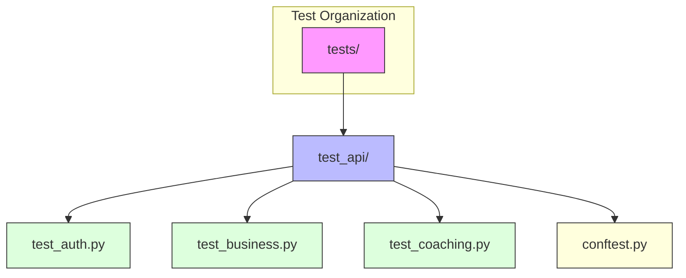
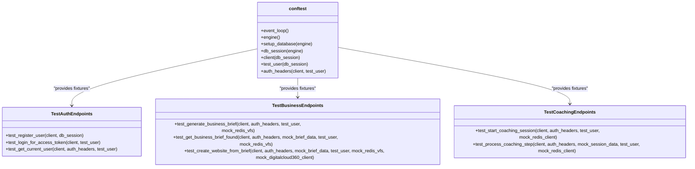
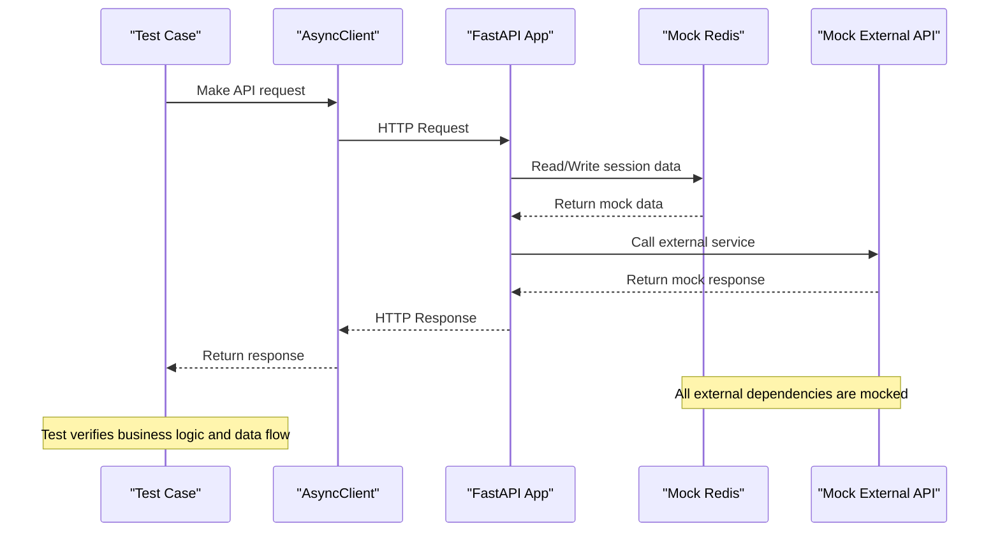
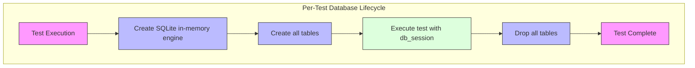
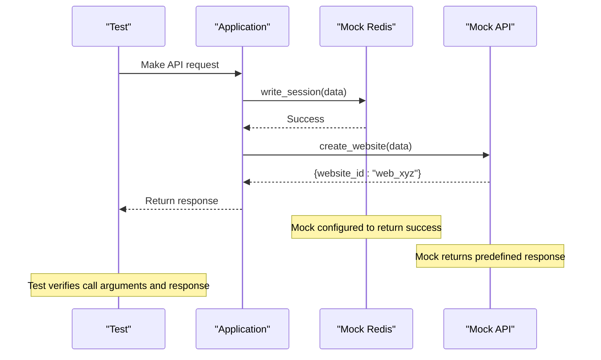
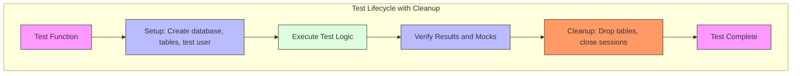

# Testing Strategy

<cite>
**Referenced Files in This Document**   
- [conftest.py](file://tests/conftest.py#L1-L127)
- [test_auth.py](file://tests/test_api/test_auth.py#L1-L79)
- [test_business.py](file://tests/test_api/test_business.py#L1-L169)
- [test_coaching.py](file://tests/test_api/test_coaching.py#L1-L79)
- [pytest.ini](file://pytest.ini#L1-L15)
- [main.py](file://app/main.py#L1-L184)
- [database.py](file://app/config/database.py#L1-L43)
- [redis_fs.py](file://app/core/integrations/redis_fs.py)
- [digitalcloud360.py](file://app/core/integrations/digitalcloud360.py)
</cite>

## Table of Contents
1. [Test Pyramid Implementation](#test-pyramid-implementation)
2. [Test Organization and Structure](#test-organization-and-structure)
3. [Fixture Usage in conftest.py](#fixture-usage-in-conftestpy)
4. [Mocking Strategies for External Services](#mocking-strategies-for-external-services)
5. [Test Coverage Goals and Metrics](#test-coverage-goals-and-metrics)
6. [API-Level Testing Examples](#api-level-testing-examples)
7. [Test Database Management](#test-database-management)
8. [Redis Mocking and API Client Testing](#redis-mocking-and-api-client-testing)
9. [Running Tests Locally and in CI/CD](#running-tests-locally-and-in-cicd)
10. [Test Data Management and Cleanup](#test-data-management-and-cleanup)
11. [Performance Testing Considerations](#performance-testing-considerations)

## Test Pyramid Implementation

The testing strategy follows a test pyramid approach with a strong emphasis on API-level integration tests. The pyramid consists of:
- **Unit tests**: Limited in current implementation, primarily focused on business logic components (marked with `unit` marker)
- **Integration tests**: The dominant layer, focusing on API endpoints and service interactions (marked with `integration` marker)
- **End-to-end tests**: Implicitly covered through comprehensive API testing using the actual FastAPI application

API-level testing is prioritized to ensure the correctness of business workflows, authentication flows, and external service integrations. This approach validates the system as a whole while maintaining reasonable execution speed compared to full E2E browser tests.

**Section sources**
- [pytest.ini](file://pytest.ini#L1-L15)
- [test_auth.py](file://tests/test_api/test_auth.py#L1-L79)

## Test Organization and Structure

The test suite is organized in a feature-based structure under the `tests/` directory:
- `tests/test_api/`: Contains all API integration tests
  - `test_auth.py`: Authentication endpoint tests
  - `test_business.py`: Business brief and website creation workflow tests
  - `test_coaching.py`: Coaching session workflow tests

Tests are organized into classes following the pattern `Test{Feature}Endpoints`, with each test method prefixed with `test_`. The pytest configuration in `pytest.ini` enforces this structure with the following settings:
```ini
python_files = test_*.py
python_classes = Test*
python_functions = test_*
```

The test suite uses pytest markers to categorize tests by type and feature:
- `unit`: Unit tests
- `integration`: Integration tests
- `coaching`: Tests related to coaching functionality
- `agents`: Tests related to sub-agents
- `api`: Tests related to API endpoints

This organization enables selective test execution based on markers, facilitating faster feedback during development.



**Diagram sources**
- [test_auth.py](file://tests/test_api/test_auth.py#L1-L79)
- [test_business.py](file://tests/test_api/test_business.py#L1-L169)
- [test_coaching.py](file://tests/test_api/test_coaching.py#L1-L79)

**Section sources**
- [pytest.ini](file://pytest.ini#L1-L15)
- [test_auth.py](file://tests/test_api/test_auth.py#L1-L79)

## Fixture Usage in conftest.py

The `conftest.py` file provides a comprehensive set of fixtures that enable isolated and repeatable testing. These fixtures follow the dependency injection pattern to provide test dependencies.

### Core Fixtures

**event_loop**: Ensures a fresh event loop for each test session, critical for async test isolation.
```python
@pytest.fixture(scope="session")
def event_loop():
    loop = asyncio.get_event_loop_policy().new_event_loop()
    yield loop
    loop.close()
```

**engine**: Creates a SQLAlchemy async engine using an in-memory SQLite database for complete test isolation.
```python
@pytest.fixture(scope="session")
async def engine():
    engine = create_async_engine("sqlite+aiosqlite:///:memory:", echo=False)
    yield engine
    await engine.dispose()
```

**setup_database**: Automatically creates and drops all database tables before and after each test function.
```python
@pytest.fixture(scope="function", autouse=True)
async def setup_database(engine):
    async with engine.begin() as conn:
        await conn.run_sync(Base.metadata.create_all)
    yield
    async with engine.begin() as conn:
        await conn.run_sync(Base.metadata.drop_all)
```

**db_session**: Provides a transactional database session for each test.
```python
@pytest.fixture(scope="function")
async def db_session(engine) -> AsyncGenerator[AsyncSession, None]:
    TestingSessionLocal = async_sessionmaker(
        autocommit=False,
        autoflush=False,
        bind=engine,
        expire_on_commit=False
    )
    async with TestingSessionLocal() as session:
        try:
            yield session
        finally:
            await session.close()
```

**client**: The most important fixture, providing an `AsyncClient` for testing the FastAPI application with proper dependency overrides.
```python
@pytest.fixture(scope="function")
async def client(db_session: AsyncSession) -> AsyncGenerator[AsyncClient, None]:
    def get_settings_override() -> Settings:
        return Settings(
            TESTING_MODE=True,
            DATABASE_URL="sqlite+aiosqlite:///:memory:",
            ENVIRONMENT="testing"
        )

    async def override_get_db() -> AsyncGenerator[AsyncSession, None]:
        try:
            yield db_session
        finally:
            await db_session.close()

    app.dependency_overrides[get_db] = override_get_db
    app.dependency_overrides[Settings] = get_settings_override

    async with LifespanManager(app):
        async with AsyncClient(
            transport=ASGITransport(app=app),
            base_url="http://test"
        ) as async_client:
            try:
                yield async_client
            finally:
                await async_client.aclose()

    app.dependency_overrides.clear()
```

**test_user**: Creates a pre-configured test user in the database for authentication tests.
```python
@pytest.fixture(scope="function")
async def test_user(db_session: AsyncSession) -> AsyncGenerator[User, None]:
    user = User(
        email="test@example.com",
        hashed_password=get_password_hash("testpassword"),
        name="Test User",
    )
    db_session.add(user)
    await db_session.commit()
    await db_session.refresh(user)
    try:
        yield user
    finally:
        await db_session.delete(user)
        await db_session.commit()
```

**auth_headers**: Provides authentication headers by automatically logging in the test user.
```python
@pytest.fixture(scope="function")
async def auth_headers(client: AsyncClient, test_user: User) -> AsyncGenerator[dict, None]:
    login_data = {
        "username": test_user.email,
        "password": "testpassword"
    }
    response = await client.post("/api/v1/auth/token", data=login_data)
    token = response.json()["access_token"]
    headers = {"Authorization": f"Bearer {token}"}
    try:
        yield headers
    finally:
        pass
```

These fixtures create a robust testing environment where each test runs in isolation with a fresh database and authenticated client.



**Diagram sources**
- [conftest.py](file://tests/conftest.py#L1-L127)

**Section sources**
- [conftest.py](file://tests/conftest.py#L1-L127)

## Mocking Strategies for External Services

The test suite employs mocking to isolate external service dependencies, ensuring test reliability and speed.

### Redis Mocking

Redis services are mocked using pytest's dependency injection. In `test_coaching.py`, the `mock_redis_client` fixture is injected to test coaching session management:

```python
async def test_start_coaching_session(self, client: AsyncClient, auth_headers: dict, test_user: User, mock_redis_client):
    mock_redis_client.get.return_value = None  # No existing session in Redis
    # ... test logic
    mock_redis_client.set.assert_called_once()
```

Similarly, in `test_business.py`, the `mock_redis_vfs` fixture is used to test business brief storage:

```python
async def test_generate_business_brief(self, client: AsyncClient, auth_headers: dict, test_user: User, mock_redis_vfs):
    # ... test logic
    mock_redis_vfs.write_session.assert_called_once()
```

These mocks verify that the application correctly interacts with Redis for session storage and retrieval without requiring a real Redis instance.

### External API Mocking

Third-party APIs are mocked to prevent external dependencies from affecting test stability. In `test_business.py`, the `mock_digitalcloud360_client` fixture is used to test website creation:

```python
async def test_create_website_from_brief(self, client: AsyncClient, auth_headers: dict, mock_brief_data: dict, test_user: User, mock_redis_vfs, mock_digitalcloud360_client):
    # ... test logic
    mock_digitalcloud360_client.create_website.assert_called_once_with(mock_brief_data)
```

The orchestrator service is also mocked to test business brief regeneration:

```python
async def test_regenerate_business_brief(self, client: AsyncClient, auth_headers: dict, mock_brief_data: dict, test_user: User, mock_redis_vfs, mock_orchestrator):
    mock_orchestrator.run.return_value = {"content_generation": {"homepage_text": "Nouveau texte de bienvenue..."}}
    # ... test logic
```

### Mock Data Patterns

The test suite uses fixture-based mock data to ensure consistency:

```python
@pytest.fixture
def mock_brief_data():
    return {
        "brief_id": "brief_mock_123",
        "user_id": None,
        "session_id": "session_mock_123",
        "results": {
            "market_research": {"analysis": "Le marché est en pleine croissance..."},
            "content_generation": {"homepage_text": "Bienvenue chez AfroChic..."},
            "logo_creation": {"logo_url": "https://cdn.example.com/afrochic_logo.png"},
            "seo_optimization": {"keywords": ["mode africaine", "e-commerce", "durable"]},
            "template_selection": {"template_name": "DynamicFashion"}
        }
    }
```

This approach allows tests to focus on the application logic rather than external service behavior.



**Diagram sources**
- [test_business.py](file://tests/test_api/test_business.py#L1-L169)
- [test_coaching.py](file://tests/test_api/test_coaching.py#L1-L79)

**Section sources**
- [test_business.py](file://tests/test_api/test_business.py#L1-L169)
- [test_coaching.py](file://tests/test_api/test_coaching.py#L1-L79)

## Test Coverage Goals and Metrics

The test suite aims for comprehensive coverage of critical business workflows and API endpoints. While specific coverage metrics are not explicitly defined in the configuration files, the test organization and markers indicate the following coverage goals:

- **Authentication workflow**: Complete coverage of registration, login, token generation, and user retrieval
- **Business brief generation**: Coverage of brief creation, retrieval, regeneration, and website creation
- **Coaching workflow**: Coverage of session initialization, step processing, and error handling
- **External service integration**: Coverage of Redis storage and third-party API calls (via mocking)

The test suite uses pytest markers to categorize tests, enabling targeted coverage analysis:
- `api`: All API endpoint tests
- `coaching`: Coaching-specific functionality
- `agents`: Sub-agent orchestration (currently pending implementation)
- `integration`: Integration tests (implied by API tests)

The presence of skipped tests marked with `@pytest.mark.skip(reason="To be implemented with actual sub-agents logic")` indicates that coverage is incomplete for sub-agent orchestration workflows, which are planned for future implementation.

**Section sources**
- [pytest.ini](file://pytest.ini#L1-L15)
- [test_business.py](file://tests/test_api/test_business.py#L1-L169)

## API-Level Testing Examples

### Authentication Workflow Tests

The authentication tests in `test_auth.py` validate the complete authentication workflow:

```python
async def test_register_user(self, client: AsyncClient, db_session: AsyncSession):
    user_data = {
        "email": "register_test@example.com",
        "name": "Test User",
        "password": "testpassword"
    }
    response = await client.post("/api/v1/auth/register", json=user_data)
    assert response.status_code == 201
    assert response.json()["email"] == user_data["email"]
    
    # Verify the user is in the database
    result = await db_session.execute(select(User).filter(User.email == "register_test@example.com"))
    user = result.scalar_one_or_none()
    assert user is not None
```

This test verifies user registration, response status, and database persistence.

```python
async def test_login_for_access_token(self, client: AsyncClient, test_user: User):
    login_data = {
        "username": "test@example.com",
        "password": "testpassword"
    }
    response = await client.post("/api/v1/auth/token", data=login_data)
    assert response.status_code == 200
    token = response.json()
    assert "access_token" in token
    assert token["token_type"] == "bearer"
```

This test validates successful login and JWT token generation.

```python
async def test_get_current_user(self, client: AsyncClient, auth_headers: dict, test_user: User):
    response = await client.get("/api/v1/auth/me", headers=auth_headers)
    assert response.status_code == 200
    user = response.json()
    assert user["email"] == test_user.email
```

This test confirms that authenticated users can retrieve their profile information.

### Coaching Workflow Tests

The coaching tests validate the coaching session workflow:

```python
async def test_start_coaching_session(self, client: AsyncClient, auth_headers: dict, test_user: User, mock_redis_client):
    mock_redis_client.get.return_value = None  # No existing session in Redis
    request_data = {"message": "Je veux créer un restaurant"}
    response = await client.post("/api/v1/coaching/start", json=request_data, headers=auth_headers)
    
    assert response.status_code == 200
    response_json = response.json()
    assert response_json["current_step"] == "vision"
    assert "Bienvenue" in response_json["coach_message"]
    mock_redis_client.set.assert_called_once()
```

This test verifies that a new coaching session can be started and stored in Redis.

```python
async def test_process_coaching_step(self, client: AsyncClient, auth_headers: dict, mock_session_data: dict, test_user: User, mock_redis_client):
    mock_session_data["user_id"] = test_user.id
    mock_redis_client.get.return_value = json.dumps(mock_session_data)
    request_data = {
        "session_id": mock_session_id,
        "user_response": "Ma vision est de créer le meilleur restaurant de Dakar"
    }
    response = await client.post("/api/v1/coaching/step", json=request_data, headers=auth_headers)
    assert response.status_code == 200
    response_json = response.json()
    assert response_json["current_step"] == "mission"
    assert "MISSION" in response_json["coach_message"]
    assert response_json["progress"]["vision"] is True
    mock_redis_client.set.assert_called_once()
```

This test validates the progression through coaching steps and Redis state updates.

### Business Operations Tests

The business tests cover the business brief workflow:

```python
async def test_generate_business_brief(self, client: AsyncClient, auth_headers: dict, test_user: User, mock_redis_vfs):
    response = await client.post("/api/v1/business/brief/generate", json=mock_request_data, headers=auth_headers)
    assert response.status_code == 200
    response_json = response.json()
    assert response_json["user_id"] == test_user.id
    assert response_json["session_id"] == mock_session_id
    assert "results" in response_json
    mock_redis_vfs.write_session.assert_called_once()
```

This test verifies business brief generation and Redis storage.

```python
async def test_create_website_from_brief(self, client: AsyncClient, auth_headers: dict, mock_brief_data: dict, test_user: User, mock_redis_vfs, mock_digitalcloud360_client):
    mock_brief_data["user_id"] = test_user.id
    mock_redis_vfs.read_session.return_value = mock_brief_data
    response = await client.post(f"/api/v1/business/website/create?brief_id={mock_brief_id}", headers=auth_headers)
    assert response.status_code == 200
    assert response.json()["message"] == "Website creation initiated successfully."
    assert response.json()["website_id"] == "web_xyz"
    mock_digitalcloud360_client.create_website.assert_called_once_with(mock_brief_data)
```

This test validates website creation from a business brief and external API integration.

```mermaid
sequenceDiagram
participant User as "User"
participant Client as "Test Client"
participant Auth as "Auth API"
participant Business as "Business API"
participant Coaching as "Coaching API"
participant DB as "Test Database"
participant Redis as "Mock Redis"
participant External as "Mock External API"
User->>Client : Register account
Client->>Auth : POST /api/v1/auth/register
Auth->>DB : Store user
DB-->>Auth : Success
Auth-->>Client : 201 Created
User->>Client : Login
Client->>Auth : POST /api/v1/auth/token
Auth-->>Client : JWT Token
User->>Client : Start coaching
Client->>Coaching : POST /api/v1/coaching/start
Coaching->>Redis : Store session
Redis-->>Coaching : Success
Coaching-->>Client : Session initialized
User->>Client : Generate business brief
Client->>Business : POST /api/v1/business/brief/generate
Business->>Redis : Store brief
Redis-->>Business : Success
Business-->>Client : Brief generated
User->>Client : Create website
Client->>Business : POST /api/v1/business/website/create
Business->>External : Create website
External-->>Business : Website ID
Business-->>Client : Website creation initiated
Note over DB,Redis,External : All dependencies use test doubles
```

**Diagram sources**
- [test_auth.py](file://tests/test_api/test_auth.py#L1-L79)
- [test_business.py](file://tests/test_api/test_business.py#L1-L169)
- [test_coaching.py](file://tests/test_api/test_coaching.py#L1-L79)

**Section sources**
- [test_auth.py](file://tests/test_api/test_auth.py#L1-L79)
- [test_business.py](file://tests/test_api/test_business.py#L1-L169)
- [test_coaching.py](file://tests/test_api/test_coaching.py#L1-L79)

## Test Database Management

The test suite implements robust test database management to ensure isolation and consistency.

### In-Memory SQLite Database

The tests use an in-memory SQLite database for complete isolation:
```python
@pytest.fixture(scope="session")
async def engine():
    engine = create_async_engine("sqlite+aiosqlite:///:memory:", echo=False)
    yield engine
    await engine.dispose()
```

This approach provides several benefits:
- Complete isolation between test runs
- No persistent state between tests
- Fast database operations
- No need for database cleanup

### Automatic Schema Management

The `setup_database` fixture automatically creates and drops all tables before and after each test:
```python
@pytest.fixture(scope="function", autouse=True)
async def setup_database(engine):
    async with engine.begin() as conn:
        await conn.run_sync(Base.metadata.create_all)
    yield
    async with engine.begin() as conn:
        await conn.run_sync(Base.metadata.drop_all)
```

This ensures that each test starts with a clean database schema, preventing test contamination.

### Transactional Test Sessions

The `db_session` fixture provides a transactional database session for each test:
```python
@pytest.fixture(scope="function")
async def db_session(engine) -> AsyncGenerator[AsyncSession, None]:
    TestingSessionLocal = async_sessionmaker(
        autocommit=False,
        autoflush=False,
        bind=engine,
        expire_on_commit=False
    )
    async with TestingSessionLocal() as session:
        try:
            yield session
        finally:
            await session.close()
```

This pattern ensures that database changes are properly managed and cleaned up after each test.

### Dependency Injection

The test client overrides the application's database dependency to use the test session:
```python
async def override_get_db() -> AsyncGenerator[AsyncSession, None]:
    try:
        yield db_session
    finally:
        await db_session.close()

app.dependency_overrides[get_db] = override_get_db
```

This ensures that the application under test uses the test database rather than any external database.



**Diagram sources**
- [conftest.py](file://tests/conftest.py#L1-L127)

**Section sources**
- [conftest.py](file://tests/conftest.py#L1-L127)
- [database.py](file://app/config/database.py#L1-L43)

## Redis Mocking and API Client Testing

The test suite employs sophisticated mocking strategies for Redis and external API clients.

### Redis Virtual File System Mocking

The application uses a Redis Virtual File System for session storage, which is mocked in tests:

```python
async def test_generate_business_brief(self, client: AsyncClient, auth_headers: dict, test_user: User, mock_redis_vfs):
    # ... test logic
    mock_redis_vfs.write_session.assert_called_once()
```

The mock verifies that the application correctly writes session data to Redis. Similarly, read operations are tested:

```python
async def test_get_business_brief_found(self, client: AsyncClient, auth_headers: dict, mock_brief_data: dict, test_user: User, mock_redis_vfs):
    mock_brief_data["user_id"] = test_user.id
    mock_redis_vfs.read_session.return_value = mock_brief_data
    # ... test logic
    mock_redis_vfs.read_session.assert_called_once_with(test_user.id, mock_brief_id)
```

### Coaching Session Redis Mocking

For coaching sessions, a different Redis client mock is used:

```python
async def test_start_coaching_session(self, client: AsyncClient, auth_headers: dict, test_user: User, mock_redis_client):
    mock_redis_client.get.return_value = None
    # ... test logic
    mock_redis_client.set.assert_called_once()
```

This demonstrates that different Redis clients are used for different features and are independently mocked.

### External API Client Mocking

External API clients are mocked to test integration points:

```python
async def test_create_website_from_brief(self, client: AsyncClient, auth_headers: dict, mock_brief_data: dict, test_user: User, mock_redis_vfs, mock_digitalcloud360_client):
    # ... test logic
    mock_digitalcloud360_client.create_website.assert_called_once_with(mock_brief_data)
```

This verifies that the application correctly calls the external website creation API with the expected data.

### Mock Verification Patterns

The test suite uses several mock verification patterns:
- **Return value configuration**: Setting mock return values to simulate external behavior
- **Call assertion**: Verifying that external services are called with expected parameters
- **Call count verification**: Ensuring services are called the correct number of times

These patterns ensure that the application's interaction with external services is correct without actually calling those services.



**Diagram sources**
- [test_business.py](file://tests/test_api/test_business.py#L1-L169)
- [test_coaching.py](file://tests/test_api/test_coaching.py#L1-L79)

**Section sources**
- [test_business.py](file://tests/test_api/test_business.py#L1-L169)
- [test_coaching.py](file://tests/test_api/test_coaching.py#L1-L79)

## Running Tests Locally and in CI/CD

The test suite can be run both locally and in CI/CD environments with the same configuration.

### Local Test Execution

To run tests locally, use the standard pytest command:
```bash
pytest tests/
```

To run specific test files:
```bash
pytest tests/test_api/test_auth.py
```

To run tests with specific markers:
```bash
pytest -m "api and auth"
```

To run tests with verbose output:
```bash
pytest -v tests/
```

### CI/CD Integration

The pytest configuration in `pytest.ini` is optimized for CI/CD environments:
```ini
[pytest]
asyncio_mode = auto
minversion = 6.0
addopts = -ra -q --strict-markers --strict-config
testpaths = tests
```

The `addopts` flag includes:
- `-ra`: Show a summary of failed and skipped tests
- `-q`: Quiet mode for cleaner output in CI logs
- `--strict-markers`: Fail if undefined markers are used
- `--strict-config`: Fail if invalid configuration options are used

These settings ensure consistent test behavior across environments and fail fast on configuration errors.

### Test Environment Configuration

The test suite uses environment-specific settings through the `Settings` override in `conftest.py`:
```python
def get_settings_override() -> Settings:
    return Settings(
        TESTING_MODE=True,
        DATABASE_URL="sqlite+aiosqlite:///:memory:",
        ENVIRONMENT="testing"
    )
```

This ensures that tests run in a controlled environment regardless of the deployment environment.

### Parallel Test Execution

While not explicitly configured, the test suite's design supports parallel execution:
- Each test uses an isolated in-memory database
- External services are mocked
- No shared state between tests

This allows for potential speed improvements in CI/CD environments through parallel test execution.

**Section sources**
- [pytest.ini](file://pytest.ini#L1-L15)
- [conftest.py](file://tests/conftest.py#L1-L127)

## Test Data Management and Cleanup

The test suite implements comprehensive test data management and cleanup procedures.

### Automatic Database Cleanup

The `setup_database` fixture automatically drops all tables after each test:
```python
@pytest.fixture(scope="function", autouse=True)
async def setup_database(engine):
    # ... create tables
    yield
    async with engine.begin() as conn:
        await conn.run_sync(Base.metadata.drop_all)
```

This ensures complete database isolation between tests.

### Explicit Resource Cleanup

Fixtures use try/finally blocks to ensure cleanup even if tests fail:
```python
@pytest.fixture(scope="function")
async def db_session(engine) -> AsyncGenerator[AsyncSession, None]:
    async with TestingSessionLocal() as session:
        try:
            yield session
        finally:
            await session.close()
```

### Test User Cleanup

The `test_user` fixture explicitly deletes the test user after use:
```python
@pytest.fixture(scope="function")
async def test_user(db_session: AsyncSession) -> AsyncGenerator[User, None]:
    # ... create user
    try:
        yield user
    finally:
        await db_session.delete(user)
        await db_session.commit()
```

### Mock Verification

The test suite verifies that external services are called correctly, which serves as a form of cleanup verification:
```python
mock_redis_client.set.assert_called_once()
mock_digitalcloud360_client.create_website.assert_called_once_with(mock_brief_data)
```

These assertions ensure that the application properly manages external resources.

### Memory Management

The use of in-memory SQLite databases and proper session closing ensures efficient memory usage:
- No persistent database files to clean up
- Database connections are properly closed
- Memory is reclaimed after each test

This design prevents resource leaks and ensures stable test execution over long test runs.



**Diagram sources**
- [conftest.py](file://tests/conftest.py#L1-L127)

**Section sources**
- [conftest.py](file://tests/conftest.py#L1-L127)

## Performance Testing Considerations

While the current test suite focuses on functional testing, several performance considerations are evident in the design.

### Test Execution Speed

The test suite is optimized for fast execution:
- In-memory SQLite database eliminates disk I/O
- Mocked external services prevent network latency
- Isolated tests enable potential parallel execution

### Database Performance

The test database configuration mirrors production performance considerations:
```python
engine = create_async_engine(
    settings.DATABASE_URL,
    echo=settings.DEBUG,
    pool_pre_ping=True,
    pool_recycle=300
)
```

These settings (from `database.py`) include connection pooling and recycling, which are important for performance in production.

### Async Testing

The entire test suite is async-enabled:
```python
pytestmark = pytest.mark.asyncio
```

This allows for testing the application's asynchronous performance characteristics and ensures that async bottlenecks are identified.

### Scalability Testing Gaps

The current test suite lacks explicit performance and load testing:
- No tests for concurrent user scenarios
- No response time measurements
- No database performance under load
- No API rate limiting tests

These would be important additions for a production system expecting significant traffic.

### Future Performance Testing

The skipped tests for sub-agent orchestration suggest future performance testing needs:
```python
@pytest.mark.skip(reason="To be implemented with actual sub-agents logic")
class TestSubAgentsOrchestration:
    async def test_parallel_subagents_execution(self, mock_business_brief):
        """Test exécution parallèle des 5 sub-agents"""
        pass
```

This indicates plans to test parallel execution performance, which will be crucial for the application's scalability.

**Section sources**
- [test_business.py](file://tests/test_api/test_business.py#L1-L169)
- [database.py](file://app/config/database.py#L1-L43)