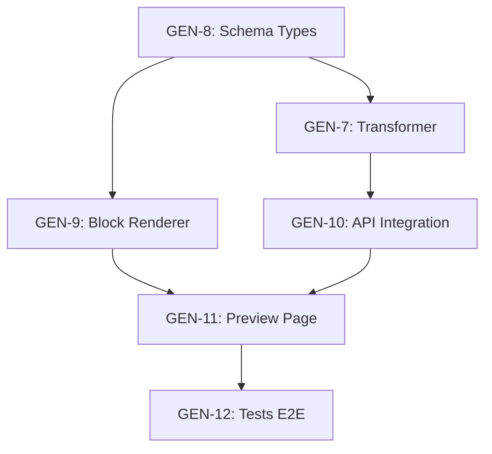

# 🔧 ANALYSE TECHNIQUE SPRINT 5 - SUB-TASKS

**De :** Tech Lead Genesis AI  
**À :** Cascade (Principal Architect & Ecosystem Scrum Master)  
**Date :** 01 décembre 2025  
**Sprint :** 5 (30/11 - 13/12/2025)  
**Epic :** GEN-3 (Transformer & Renderer)

---

## ✅ REVUE ARCHITECTURE (Scrum Master)

> **Date revue :** 01/12/2025  
> **Status :** ✅ Approuvé avec enrichissements

### Validation Points Clés
- ✅ Analyse état du code correcte
- ✅ Estimations réalistes (64h total)
- ✅ Dépendances bien identifiées
- ✅ Risques pertinents
- ✅ Approche Docker-First validée

### Enrichissements Apportés
1. **Clarification Architecture Transformer** : Backend Python (pas Frontend TS)
2. **Endpoints existants à réutiliser** : `business.py` déjà complet
3. **Types stricts** : BlockType union au lieu de `string`
4. **Testing MCP** : Ajout option chrome-devtools pour validation rapide

---

## 📊 ÉTAT ACTUEL DU CODE

### Frontend (Next.js)
| Composant | Status | Fichier |
|-----------|--------|---------|
| SiteDefinition Types | ⚠️ Basique | `src/types/site-definition.ts` (35 lignes) |
| BlockRenderer | ⚠️ 3 blocks | `src/components/BlockRenderer.tsx` |
| HeroBlock | ✅ OK | `src/components/blocks/HeroBlock.tsx` |
| FeaturesBlock | ✅ OK | `src/components/blocks/FeaturesBlock.tsx` |
| FooterBlock | ✅ OK | `src/components/blocks/FooterBlock.tsx` |
| ChatInterface | ✅ OK | `src/components/ChatInterface.tsx` |
| SitePreview | ⚠️ Placeholder | `src/app/chat/page.tsx` (inline) |
| Route /sites/[id] | ⚠️ À compléter | `src/app/sites/[id]/page.tsx` |

### Backend (FastAPI)
| Composant | Status | Fichier |
|-----------|--------|---------|
| Chat API | ✅ MOCK OK | `app/api/v1/chat.py` |
| Business Brief API | ✅ LangGraph OK | `app/api/v1/business.py` |
| Orchestrator | ✅ OK | `app/core/orchestration/langgraph_orchestrator.py` |
| Sub-Agents | ✅ 5/5 OK | `app/core/agents/*.py` |

### Ce qui manque (Sprint 5)
- ❌ **Transformer** : Algorithme Brief → SiteDefinition
- ❌ **Types complets** : SiteDefinition avec tous les block types
- ❌ **Blocks supplémentaires** : About, Services, Contact, Testimonials, Gallery, CTA
- ❌ **Page /preview** : Rendu complet d'un SiteDefinition
- ❌ **Tests E2E** : Flux complet Brief → Site visible

### 🔍 Endpoints Backend Existants (à réutiliser)
> **Enrichissement Scrum Master** : Le fichier `app/api/v1/business.py` contient déjà :

| Endpoint | Method | Status | Utilité Sprint 5 |
|----------|--------|--------|------------------|
| `/api/v1/business/brief/generate` | POST | ✅ Existant | Input pour Transformer |
| `/api/v1/business/brief/{brief_id}` | GET | ✅ Existant | Récupération Brief |
| `/api/v1/business/brief/{brief_id}/results` | GET | ✅ Existant | Détails sub-agents |
| `/api/v1/business/website/create` | POST | ✅ Existant | Placeholder DC360 |

**Recommandation :** Ne pas dupliquer. Créer uniquement `/api/v1/sites/` pour SiteDefinition.

---

## 📋 GEN-7 : Transformer - Algorithme Brief → SiteDefinition

**Points :** 8 | **Priorité :** 🔴 Highest | **Jira :** [GEN-7](https://digitalcloud360.atlassian.net/browse/GEN-7)

### Description
Créer l'algorithme de transformation qui convertit un Business Brief (output des sub-agents) en un `SiteDefinition` JSON structuré pour le renderer.

> ⚠️ **DÉCISION ARCHITECTURALE (Scrum Master)**  
> Le Transformer est implémenté **côté Backend (Python)** et non Frontend (TypeScript).  
> **Raisons :**
> 1. Les sub-agents qui génèrent le Brief sont en Python
> 2. Le SiteDefinition doit être persisté dans Redis côté serveur
> 3. Le Frontend ne fait que fetcher et rendre (séparation des responsabilités)
> 4. Permet d'ajouter l'IA créative en Phase 2 sans modifier le frontend

### Sub-tasks

| # | Sub-task | Estimation | Fichier(s) |
|---|----------|------------|------------|
| 1 | Créer le module `transformer.py` avec classe `BriefToSiteTransformer` | 3h | `app/core/transformer/transformer.py` |
| 2 | Implémenter `_map_hero_section()` - extraction titre/slogan/image | 1h | `app/core/transformer/transformer.py` |
| 3 | Implémenter `_map_about_section()` - extraction mission/histoire | 1h | `app/core/transformer/transformer.py` |
| 4 | Implémenter `_map_services_section()` - extraction offres/services | 1.5h | `app/core/transformer/transformer.py` |
| 5 | Implémenter `_map_features_section()` - points différenciants | 1h | `app/core/transformer/transformer.py` |
| 6 | Implémenter `_map_contact_section()` - coordonnées/formulaire | 1h | `app/core/transformer/transformer.py` |
| 7 | Implémenter `_map_footer_section()` - copyright/liens sociaux | 0.5h | `app/core/transformer/transformer.py` |
| 8 | Implémenter `_apply_theme()` - couleurs/fonts depuis logo sub-agent | 1h | `app/core/transformer/transformer.py` |
| 9 | Mapping sectoriel (templates par industrie) | 2h | `app/core/transformer/sector_mappings.py` |
| 10 | Tests unitaires Transformer | 2h | `tests/test_core/test_transformer.py` |

**Total estimé :** 14h (~1.75 jours)

### Structure de sortie attendue
```python
# Input: BusinessBrief (from sub-agents)
{
    "research": { "market_size": "...", "competitors": [...] },
    "content": { "homepage": {...}, "about": {...}, "services": {...} },
    "logo": { "url": "...", "colors": {"primary": "#...", "secondary": "#..."} },
    "seo": { "keywords": [...], "meta_description": "..." },
    "template": { "id": "tech-startup-v2", "sector": "technology" }
}

# Output: SiteDefinition
{
    "metadata": { "title": "...", "description": "...", "favicon": "..." },
    "theme": { "colors": {...}, "fonts": {...} },
    "pages": [{ "id": "home", "slug": "/", "sections": [...] }]
}
```

---

## 📋 GEN-8 : SiteDefinition JSON Schema

**Points :** 3 | **Priorité :** 🟠 High | **Jira :** [GEN-8](https://digitalcloud360.atlassian.net/browse/GEN-8)

### Description
Étendre et formaliser le schema TypeScript `SiteDefinition` pour supporter tous les types de blocks prévus.

### Sub-tasks

| # | Sub-task | Estimation | Fichier(s) |
|---|----------|------------|------------|
| 1 | Définir tous les block types (enum/union) | 1h | `src/types/site-definition.ts` |
| 2 | Typer `HeroSectionContent` | 0.5h | `src/types/blocks/hero.ts` |
| 3 | Typer `AboutSectionContent` | 0.5h | `src/types/blocks/about.ts` |
| 4 | Typer `ServicesSectionContent` | 0.5h | `src/types/blocks/services.ts` |
| 5 | Typer `FeaturesSectionContent` | 0.5h | `src/types/blocks/features.ts` |
| 6 | Typer `TestimonialsSectionContent` | 0.5h | `src/types/blocks/testimonials.ts` |
| 7 | Typer `ContactSectionContent` | 0.5h | `src/types/blocks/contact.ts` |
| 8 | Typer `GallerySectionContent` | 0.5h | `src/types/blocks/gallery.ts` |
| 9 | Typer `CTASectionContent` | 0.5h | `src/types/blocks/cta.ts` |
| 10 | Typer `FooterSectionContent` | 0.5h | `src/types/blocks/footer.ts` |
| 11 | Créer index barrel export | 0.5h | `src/types/blocks/index.ts` |
| 12 | Créer Pydantic schema miroir (backend) | 1h | `app/schemas/site_definition.py` |

**Total estimé :** 7h (~1 jour)

### Structure TypeScript cible
```typescript
// src/types/site-definition.ts
export type BlockType = 
  | 'hero' | 'about' | 'services' | 'features' 
  | 'testimonials' | 'contact' | 'gallery' | 'cta' | 'footer';

export interface SiteSection<T extends BlockType = BlockType> {
  id: string;
  type: T;
  content: BlockContentMap[T];
  styles?: SectionStyles;
}

export interface BlockContentMap {
  hero: HeroContent;
  about: AboutContent;
  services: ServicesContent;
  // ... etc
}
```

---

## 📋 GEN-9 : Block Renderer - Composants React Dynamiques

**Points :** 8 | **Priorité :** 🔴 Highest | **Jira :** [GEN-9](https://digitalcloud360.atlassian.net/browse/GEN-9)

### Description
Étendre le `BlockRenderer` pour supporter tous les types de sections et créer les composants React correspondants.

### Sub-tasks

| # | Sub-task | Estimation | Fichier(s) |
|---|----------|------------|------------|
| 1 | Refactorer `BlockRenderer.tsx` avec map dynamique | 1h | `src/components/BlockRenderer.tsx` |
| 2 | Créer `AboutBlock.tsx` | 1.5h | `src/components/blocks/AboutBlock.tsx` |
| 3 | Créer `ServicesBlock.tsx` (grille de cards) | 2h | `src/components/blocks/ServicesBlock.tsx` |
| 4 | Créer `TestimonialsBlock.tsx` (carousel/grid) | 2h | `src/components/blocks/TestimonialsBlock.tsx` |
| 5 | Créer `ContactBlock.tsx` (formulaire + map) | 2h | `src/components/blocks/ContactBlock.tsx` |
| 6 | Créer `GalleryBlock.tsx` (grille images) | 1.5h | `src/components/blocks/GalleryBlock.tsx` |
| 7 | Créer `CTABlock.tsx` (call-to-action banner) | 1h | `src/components/blocks/CTABlock.tsx` |
| 8 | Améliorer `HeroBlock.tsx` (variants: centered, split, video) | 1h | `src/components/blocks/HeroBlock.tsx` |
| 9 | Améliorer `FooterBlock.tsx` (colonnes, social icons) | 1h | `src/components/blocks/FooterBlock.tsx` |
| 10 | Créer `PageRenderer.tsx` (render full page) | 1h | `src/components/PageRenderer.tsx` |
| 11 | Créer `SiteRenderer.tsx` (render multi-pages) | 1h | `src/components/SiteRenderer.tsx` |
| 12 | Ajouter support thème dynamique (CSS variables) | 1h | `src/components/ThemeProvider.tsx` |

**Total estimé :** 16h (~2 jours)

### Architecture Renderer
```
SiteRenderer (full site)
└── PageRenderer (single page)
    └── BlockRenderer (single section)
        └── [HeroBlock | AboutBlock | ServicesBlock | ...]
```

---

## 📋 GEN-10 : Intégration Transformer ↔ Backend FastAPI

**Points :** 5 | **Priorité :** 🟡 Medium | **Jira :** [GEN-10](https://digitalcloud360.atlassian.net/browse/GEN-10)

### Description
Connecter le Transformer au flux existant : Chat → Orchestrator → Transformer → Response.

### Sub-tasks

| # | Sub-task | Estimation | Fichier(s) |
|---|----------|------------|------------|
| 1 | Créer endpoint `POST /api/v1/sites/generate` | 1.5h | `app/api/v1/sites.py` |
| 2 | Créer endpoint `GET /api/v1/sites/{site_id}` | 1h | `app/api/v1/sites.py` |
| 3 | Intégrer Transformer dans `chat.py` (post-brief) | 1.5h | `app/api/v1/chat.py` |
| 4 | Persister SiteDefinition dans Redis | 1h | `app/core/integrations/redis_fs.py` |
| 5 | Créer schema response `SiteDefinitionResponse` | 0.5h | `app/schemas/site_definition.py` |
| 6 | Ajouter route `/api/sites/generate` Next.js (proxy) | 1h | `src/app/api/sites/generate/route.ts` |
| 7 | Ajouter route `/api/sites/[id]` Next.js (proxy) | 0.5h | `src/app/api/sites/[id]/route.ts` |
| 8 | Tests intégration API | 1.5h | `tests/test_api/test_sites.py` |

**Total estimé :** 8.5h (~1 jour)

### Flux de données
```
[Chat UI] → POST /api/v1/chat 
         → [Orchestrator + Sub-agents] 
         → [Transformer] 
         → SiteDefinition JSON
         → [Redis persist]
         → Response { site_id, preview_url }
```

---

## 📋 GEN-11 : Page /preview pour affichage site généré

**Points :** 5 | **Priorité :** 🟡 Medium | **Jira :** [GEN-11](https://digitalcloud360.atlassian.net/browse/GEN-11)

### Description
Créer la page de prévisualisation qui affiche le site généré en temps réel.

### Sub-tasks

| # | Sub-task | Estimation | Fichier(s) |
|---|----------|------------|------------|
| 1 | Refactorer `/sites/[id]/page.tsx` avec fetch SiteDefinition | 1.5h | `src/app/sites/[id]/page.tsx` |
| 2 | Créer `/preview/page.tsx` (mode iframe/split) | 2h | `src/app/preview/page.tsx` |
| 3 | Intégrer `SiteRenderer` dans preview | 1h | `src/app/preview/page.tsx` |
| 4 | Ajouter toolbar preview (responsive toggle, zoom) | 1.5h | `src/components/PreviewToolbar.tsx` |
| 5 | Connecter `SitePreview` dans `/chat` au nouveau renderer | 1h | `src/app/chat/page.tsx` |
| 6 | Ajouter bouton "Ouvrir en plein écran" | 0.5h | `src/app/chat/page.tsx` |
| 7 | Gérer loading states + skeleton | 1h | `src/components/SiteRendererSkeleton.tsx` |
| 8 | Responsive design preview panel | 1h | `src/app/chat/page.tsx` |

**Total estimé :** 9.5h (~1.2 jours)

---

## 📋 GEN-12 : Tests E2E - Brief → Site visible

**Points :** 5 | **Priorité :** 🟡 Medium | **Jira :** [GEN-12](https://digitalcloud360.atlassian.net/browse/GEN-12)

### Description
Valider le flux complet de bout en bout : conversation chat → génération brief → affichage site.

### Sub-tasks

| # | Sub-task | Estimation | Fichier(s) |
|---|----------|------------|------------|
| 1 | Setup Playwright config pour Genesis | 1h | `genesis-frontend/playwright.config.ts` |
| 2 | Test E2E: Login SSO → Chat page | 1h | `e2e/auth.spec.ts` |
| 3 | Test E2E: Envoi message → Réponse IA | 1h | `e2e/chat.spec.ts` |
| 4 | Test E2E: Brief généré → Site preview visible | 2h | `e2e/site-generation.spec.ts` |
| 5 | Test E2E: Navigation preview → Full page | 1h | `e2e/preview.spec.ts` |
| 6 | Test E2E: Responsive (mobile, tablet, desktop) | 1h | `e2e/responsive.spec.ts` |
| 7 | Test backend: Transformer unit tests | 1.5h | `tests/test_core/test_transformer.py` |
| 8 | Documentation test scenarios | 0.5h | `docs/TESTING_GUIDE.md` |

**Total estimé :** 9h (~1.1 jours)

---

## 🔄 ORDRE D'EXÉCUTION RECOMMANDÉ

### Séquence Critique (Dépendances)


### Planning Recommandé

| Jour | Stories | Développeur | Parallélisable |
|------|---------|-------------|----------------|
| **J1** | GEN-8 (sub 1-6) | Tech Lead | Non (fondation) |
| **J2** | GEN-8 (sub 7-12) + GEN-7 (sub 1-3) | Tech Lead | Non |
| **J3** | GEN-7 (sub 4-8) | Tech Lead | Non |
| **J4** | GEN-7 (sub 9-10) + GEN-9 (sub 1-3) | Tech Lead | Oui (backend/frontend) |
| **J5** | GEN-9 (sub 4-7) | Tech Lead | Non |
| **J6** | GEN-9 (sub 8-12) | Tech Lead | Non |
| **J7** | GEN-10 (sub 1-5) | Tech Lead | Non |
| **J8** | GEN-10 (sub 6-8) + GEN-11 (sub 1-2) | Tech Lead | Oui |
| **J9** | GEN-11 (sub 3-8) | Tech Lead | Non |
| **J10** | GEN-12 (all) | Tech Lead | Non |

**Buffer inclus :** 2 jours pour imprévus

---

## 📦 DÉPENDANCES TECHNIQUES

### NPM Packages à Ajouter (Frontend - via Dockerfile)

Les packages suivants doivent être ajoutés au `package.json` du frontend :

```json
// genesis-frontend/package.json - dependencies
{
  "lucide-react": "^0.294.0",
  "@radix-ui/react-icons": "^1.3.0",
  "embla-carousel-react": "^8.0.0",
  "react-hook-form": "^7.48.0",
  "zod": "^3.22.4",
  "@hookform/resolvers": "^3.3.2"
}

// devDependencies (pour tests)
{
  "@playwright/test": "^1.40.0"
}
```

**Installation via Docker rebuild :**
```bash
# Rebuild le container frontend avec les nouvelles deps
docker-compose build --no-cache frontend
docker-compose up -d frontend
```

### Tests E2E - Approche Multi-Stratégie

> ⚠️ **IMPORTANT** : Deux approches complémentaires pour les tests.

#### Option C : MCP Chrome DevTools (Validation Rapide) ✅ RECOMMANDÉ pour Sprint 5
> **Enrichissement Scrum Master** : Le Scrum Master peut valider rapidement via MCP chrome-devtools.

```bash
# Le Scrum Master (Cascade) dispose de MCP chrome-devtools intégré
# Permet de :
# - Naviguer vers http://localhost:3002 (Genesis Frontend)
# - Prendre des snapshots de l'UI
# - Cliquer sur éléments, remplir formulaires
# - Vérifier le rendu des blocks
# - Valider le flux E2E sans setup Playwright

# Exemple de validation via MCP :
# 1. mcp2_navigate_page → http://localhost:3002/chat
# 2. mcp2_take_snapshot → vérifier présence ChatInterface
# 3. mcp2_fill → envoyer message test
# 4. mcp2_wait_for → attendre réponse IA
# 5. mcp2_click → bouton "Voir mon site"
# 6. mcp2_take_screenshot → capturer preview
```

**Avantages :** Pas de setup, validation immédiate, intégré au workflow Scrum Master.
**Inconvénients :** Non automatisé, pas de CI/CD.

---

#### Option A : Container Docker Playwright (CI/CD)

> Pour automatisation complète en CI/CD (après Sprint 5).

**Option A : Container de test dédié (Recommandé)**
```yaml
# docker-compose.test.yml - Ajouter ce service
services:
  e2e-tests:
    build:
      context: ./genesis-frontend
      dockerfile: Dockerfile.test
    environment:
      - PLAYWRIGHT_BASE_URL=http://frontend:3000
      - CI=true
    depends_on:
      - frontend
      - genesis-api
    networks:
      - genesis-ai-network
    command: npx playwright test
```

**Dockerfile.test pour Playwright :**
```dockerfile
FROM mcr.microsoft.com/playwright:v1.40.0-jammy

WORKDIR /app
COPY package*.json ./
RUN npm ci
COPY . .

CMD ["npx", "playwright", "test", "--reporter=html"]
```

**Exécution des tests :**
```bash
# Lancer l'environnement complet + tests
docker-compose -f docker-compose.yml -f docker-compose.test.yml up --abort-on-container-exit e2e-tests

# Ou via script
./scripts/run-e2e-tests.sh
```

**Option B : Tests dans le container frontend existant**
```bash
# Exécuter les tests dans le container frontend running
docker-compose exec frontend npx playwright test
```

### Python Packages (Backend)

```bash
# Déjà installés via requirements.txt
# Aucun nouveau package requis pour Sprint 5
```

### Commandes Docker de Référence

| Action | Commande |
|--------|----------|
| Rebuild frontend | `docker-compose build --no-cache frontend` |
| Rebuild API | `docker-compose build --no-cache genesis-api` |
| Logs frontend | `docker-compose logs -f frontend` |
| Shell frontend | `docker-compose exec frontend sh` |
| Tests unitaires backend | `docker-compose exec genesis-api pytest tests/` |
| Tests E2E | `docker-compose -f docker-compose.test.yml up e2e-tests` |

### APIs Backend Requises

| Endpoint | Method | Status | Story |
|----------|--------|--------|-------|
| `/api/v1/chat/` | POST | ✅ Existant (MOCK) | GEN-10 |
| `/api/v1/business/brief/generate` | POST | ✅ Existant | GEN-10 |
| `/api/v1/sites/generate` | POST | ❌ À créer | GEN-10 |
| `/api/v1/sites/{site_id}` | GET | ❌ À créer | GEN-10 |

### Schémas/Types Partagés

| Type | Frontend | Backend | Status |
|------|----------|---------|--------|
| `SiteDefinition` | `src/types/site-definition.ts` | `app/schemas/site_definition.py` | ⚠️ À synchroniser |
| `BusinessBrief` | N/A | `app/schemas/business.py` | ✅ Existant |
| `BlockContent` | `src/types/blocks/*.ts` | `app/schemas/blocks.py` | ❌ À créer |

---

## ⚠️ RISQUES IDENTIFIÉS

### R1: Complexité Mapping Sectoriel
**Probabilité:** Moyenne | **Impact:** Élevé

**Description:** Le mapping Brief → SiteDefinition dépend fortement du secteur d'activité. Un restaurant et une startup tech n'ont pas les mêmes sections.

**Mitigation:** 
- Commencer avec 3 secteurs pilotes (Tech, Restaurant, Services)
- Utiliser un template "générique" comme fallback
- Prévoir extensibilité pour Phase 2 (IA créative)

### R2: Performance Renderer avec Beaucoup de Sections
**Probabilité:** Faible | **Impact:** Moyen

**Description:** Un site avec 10+ sections pourrait ralentir le rendu.

**Mitigation:**
- Lazy loading des blocks (React.lazy)
- Virtualisation si nécessaire
- Monitoring performance

### R3: Synchronisation Types Frontend/Backend
**Probabilité:** Moyenne | **Impact:** Moyen

**Description:** Les types TypeScript et Pydantic doivent rester synchronisés.

**Mitigation:**
- Documenter le schema dans un fichier partagé (`docs/schemas/`)
- Générer les types via outil (ex: `openapi-typescript-codegen`)
- Code review croisé

### R4: Dépendance SSO pour Tests E2E
**Probabilité:** Faible | **Impact:** Élevé

**Description:** Les tests E2E nécessitent une session SSO valide.

**Mitigation:**
- Mock auth pour tests locaux
- Fixture user test dédié
- Bypass auth en mode test

---

## 📝 DÉCISIONS ARCHITECTURALES À PRENDRE

### DA1: Stockage SiteDefinition
**Options:**
1. Redis uniquement (TTL 7 jours) - Simple, rapide
2. PostgreSQL (persistance long terme) - Historique, analytics
3. Hybride (Redis cache + PostgreSQL backup) - Best of both

**Recommandation:** Option 1 pour Sprint 5, migrer vers Option 3 en Phase 2.

### DA2: Format Preview URL
**Options:**
1. `/preview?site_id=xxx` - Query param
2. `/preview/[site_id]` - Path param
3. `/sites/[site_id]/preview` - Nested route

**Recommandation:** Option 2 pour cohérence avec Next.js App Router.

### DA3: Stratégie Multi-Pages
**Options:**
1. Single Page (landing only) - Sprint 5
2. Multi-Pages (navigation tabs) - Sprint 6+

**Recommandation:** Option 1 pour Sprint 5, extensible en Phase 2.

---

## ✅ CHECKLIST PRÉ-DÉMARRAGE

- [ ] Scrum Master crée les sub-tasks dans Jira
- [ ] Tech Lead valide les estimations
- [ ] Environnement Docker up and running
- [ ] Branch `feature/sprint-5-transformer` créée
- [ ] Daily standup planifié (10min/jour)

---

## 📎 RÉFÉRENCES

- **Jira Epic:** [GEN-3](https://digitalcloud360.atlassian.net/browse/GEN-3)
- **Code existant:** `c:\genesis\genesis-frontend\src\components\`
- **Backend API:** `c:\genesis\app\api\v1\`
- **Types existants:** `c:\genesis\genesis-frontend\src\types\site-definition.ts`

---

*Tech Lead Genesis AI - 01/12/2025*

---

## 📊 RÉCAPITULATIF POUR IMPORT JIRA (Scrum Master)

### Totaux par Story

| Story | Sub-tasks | Heures | Jours (~8h/j) |
|-------|-----------|--------|---------------|
| **GEN-7** (Transformer) | 10 | 14h | 1.75j |
| **GEN-8** (Schema) | 12 | 7h | 0.9j |
| **GEN-9** (Renderer) | 12 | 16h | 2j |
| **GEN-10** (Integration) | 8 | 8.5h | 1j |
| **GEN-11** (Preview) | 8 | 9.5h | 1.2j |
| **GEN-12** (Tests E2E) | 8 | 9h | 1.1j |
| **TOTAL** | **58** | **64h** | **8 jours** |

### Sprint Capacity Check
- **Durée Sprint :** 10 jours ouvrés (30/11 - 13/12)
- **Charge estimée :** 8 jours
- **Buffer :** 2 jours (20%)
- **Status :** ✅ Réalisable

### Ordre Création Sub-tasks Jira

```
1. GEN-8 (Schema) - Fondation types
2. GEN-7 (Transformer) - Core algorithm  
3. GEN-9 (Renderer) - UI components
4. GEN-10 (Integration) - API connection
5. GEN-11 (Preview) - User interface
6. GEN-12 (Tests) - Validation finale
```

### Checklist Import Jira
- [ ] Créer 58 sub-tasks via MCP Atlassian
- [ ] Assigner priorités (Highest → High → Medium)
- [ ] Lier à parent story (GEN-7 à GEN-12)
- [ ] Ajouter estimations (Story Points ou heures)
- [ ] Mettre à jour le Sprint 5 board

---

*Document validé par : Cascade (Principal Architect & Ecosystem Scrum Master) - 01/12/2025*
